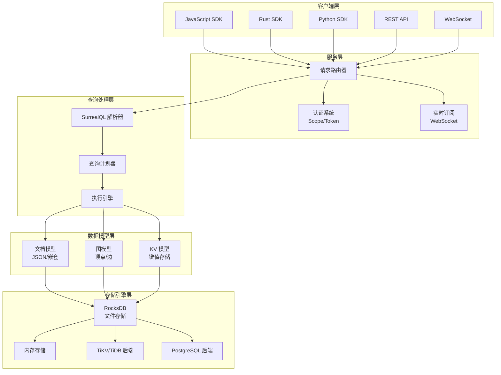
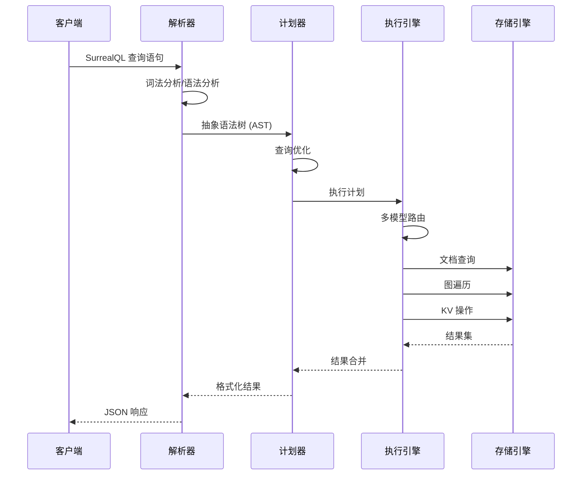
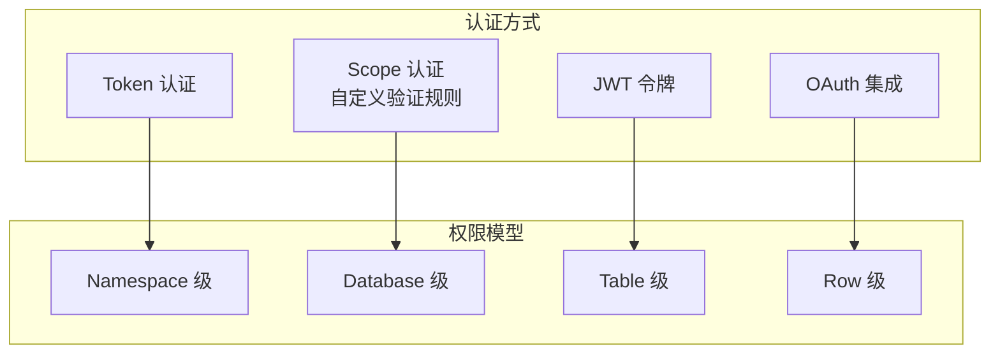

# SurrealDB 架构设计

## 学习目标

- 理解 SurrealDB 的整体架构分层
- 掌握多模态数据模型的设计思路
- 了解 SurrealQL 查询语言的处理流程

## 整体架构



## SurrealQL 查询处理流程



## 数据模型

### Record 记录

```sql
-- 文档模型：灵活的 JSON 结构
CREATE person SET
    name = '张三',
    age = 25,
    email = 'zhangsan@example.com',
    tags = ['developer', 'rust']
```

### Graph Edge 图边

```sql
-- 图模型：顶点和边的关系
CREATE friend:123456
    SET in = person:1,
    out = person:2,
    since = '2024-01-01';

-- 图遍历查询
SELECT ->friend->person.* FROM person:1
```

### KV 键值

```sql
-- KV 模型：简单的键值存储
CREATE config:app SET
    key = 'max_connections',
    value = '100'
```

## 认证系统



## 要点总结

- **三层架构**：SurrealQL 解析层、执行引擎层、存储引擎层
- **多模态数据**：文档、图、KV 三种模型统一管理
- **SurrealQL**：类 SQL 语法，支持图遍历
- **多种存储**：RocksDB 默认，支持 TiKV 和 PostgreSQL

## 思考题

1. SurrealDB 如何在同一个查询中混合使用文档、图和 KV 模型？
2. 图遍历查询在 RocksDB 中如何高效执行？
