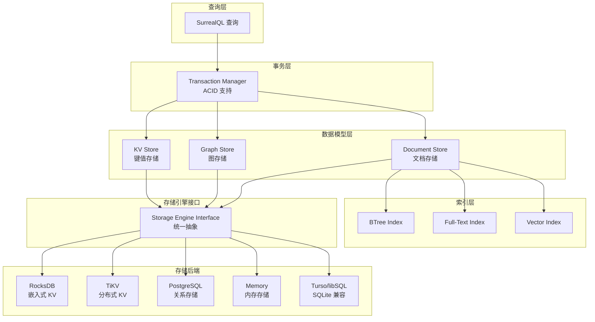
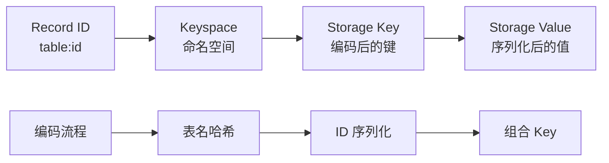
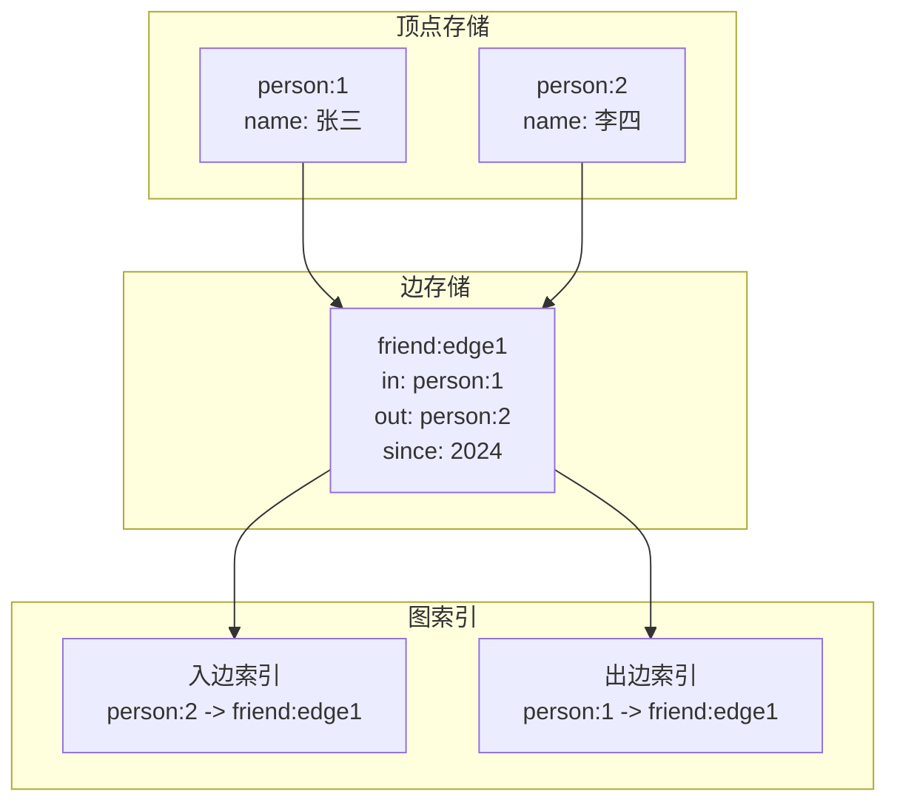
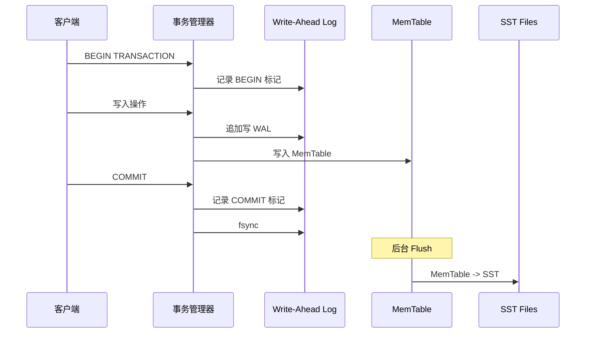
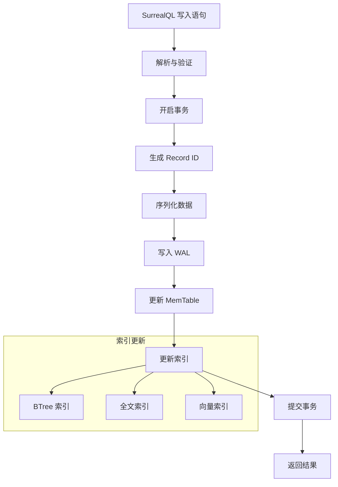
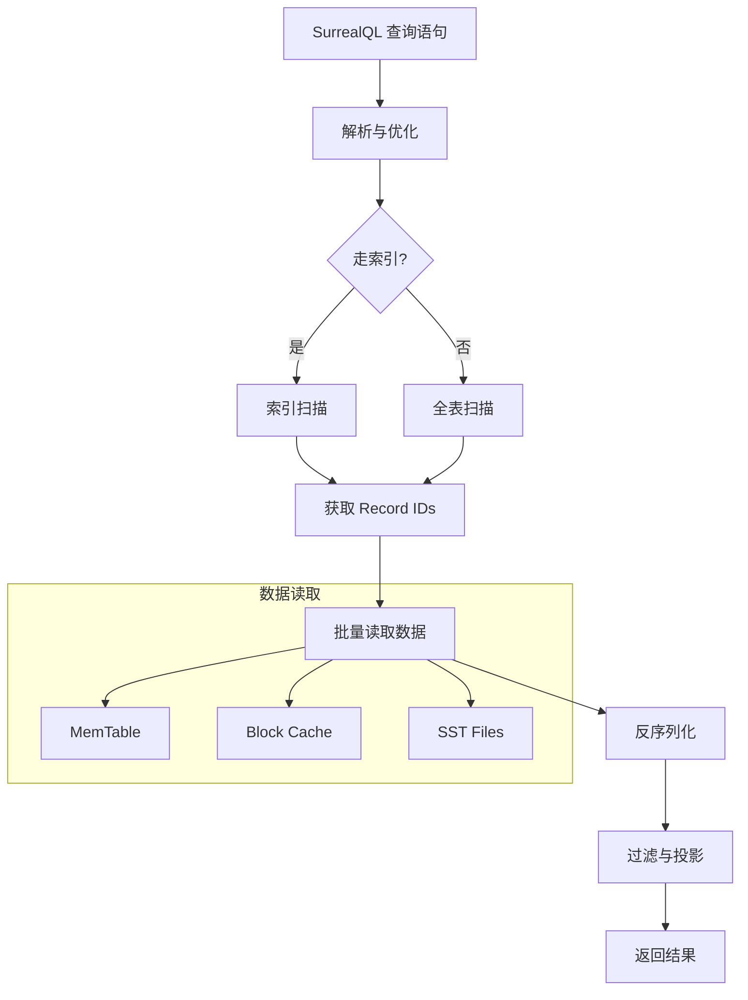
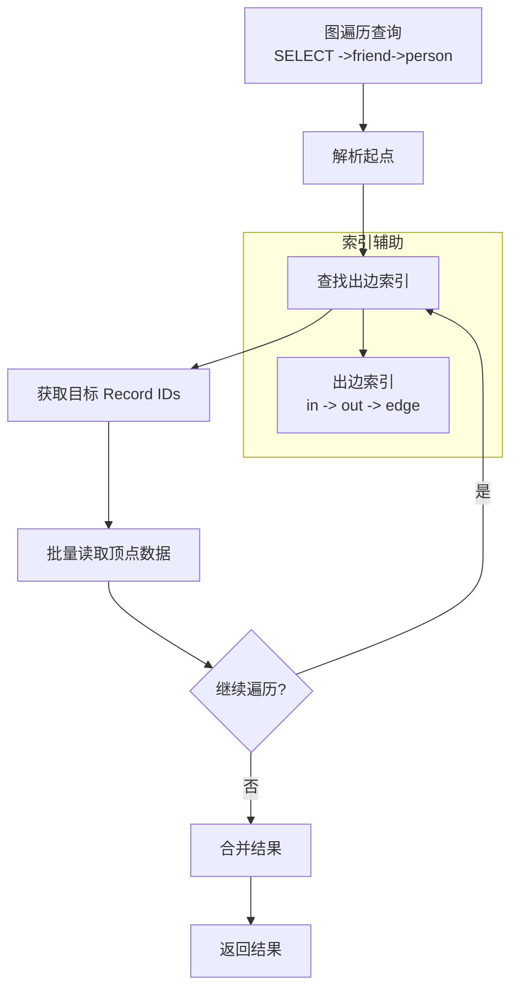
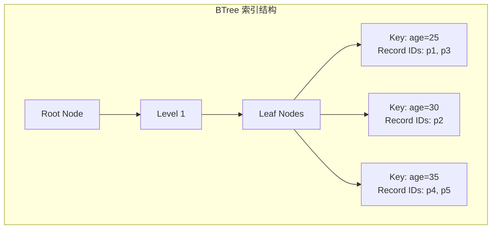
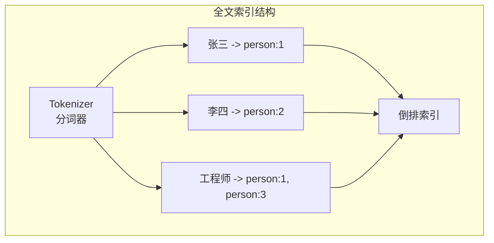

# 存储引擎

## 学习目标

- 理解 SurrealDB 的核心存储架构和多层抽象设计
- 掌握多存储后端的适配机制与数据持久化策略
- 了解读写路径的关键设计决策
- 对比项目 storage/ 模块的异同

## 核心概念

- **Storage Engine Interface**：统一的存储抽象接口，屏蔽底层差异
- **KV Backend**：底层键值存储层，支持 RocksDB、TiKV、PostgreSQL、内存等
- **Document Store**：文档存储层，Record ID 作为主键
- **Graph Store**：图存储层，顶点和边的独立存储与索引
- **Transaction Layer**：事务层，ACID 保证与隔离级别
- **Index Layer**：索引层，BTree、Full-Text、Vector 索引

## 存储架构

SurrealDB 采用分层存储架构，上层通过统一接口访问底层多种存储后端：



## 存储后端对比

| 后端 | 类型 | 适用场景 | 事务支持 | 分布式 |
|------|------|----------|----------|--------|
| RocksDB | 嵌入式 LSM-Tree | 单机高吞吐 | ACID | 否 |
| TiKV | 分布式 KV | 大规模分布式 | ACID | 是 |
| PostgreSQL | 关系数据库 | 熟悉的运维体系 | ACID | 是（流复制） |
| Memory | 内存存储 | 测试/开发 | 无持久化 | 否 |
| Turso/libSQL | SQLite 兼容 | 边缘计算 | ACID | 否 |

## 数据持久化机制

### Record 存储格式

SurrealDB 使用 Record ID 作为主键，格式为 `table:id`：



**存储 Key 编码示例**：

```
Namespace: test_ns
Database: test_db
Table: person
Record ID: person:john

最终存储 Key（伪代码）:
/test_ns/test_db/person/john
```

### 图数据存储

图的顶点和边分开存储，边通过特殊表 `__edge__` 管理：



### 事务与 WAL

RocksDB 后端使用 Write-Ahead Log 保证持久性：



## 读写路径

### 写入路径



### 读取路径



### 图遍历路径



## 索引结构

### BTree 索引

用于等值查询和范围查询：



### 全文索引

支持文本搜索：



### 向量索引

支持相似度搜索：

```mermaid
graph TB
    subgraph "向量索引结构"
        EMB[Embedding 提取]
        IVF[IVF/HNSW 索引]

        EMB --> V1[向量 [0.1, 0.2, ...]<br/>Record: article:1]
        EMB --> V2[向量 [0.3, 0.1, ...]<br/>Record: article:2]

        V1 --> IVF
        V2 --> IVF
    end
```

## 与项目 storage/ 模块对比

| 维度 | SurrealDB | 项目 storage/ |
|------|-----------|---------------|
| 存储后端 | RocksDB/TiKV/PG/Memory | 自研 Buffer Pool + WAL |
| 数据模型 | 文档+图+KV | KV+Vector+Timeseries+Document+Spatial+Graph |
| 事务支持 | ACID，支持隔离级别 | 2PC 分布式事务 |
| 索引类型 | BTree/全文/向量 | BTree/Hash/向量索引 |
| 嵌入式支持 | 是（Rust/JS SDK） | 否（服务端模式） |
| 分布式支持 | TiKV 后端 | Raft + 分片路由 |

### 可借鉴的设计点

| 借鉴点 | SurrealDB 实现 | 项目应用建议 |
|--------|---------------|--------------|
| 存储后端抽象 | Storage Engine Interface | 统一 storage_engine.h 接口 |
| 图存储分离 | 顶点/边独立表 + 入出边索引 | Graph 引擎添加边索引 |
| 多索引支持 | BTree/全文/向量统一管理 | 扩展 index/ 模块支持多类型 |
| 嵌入式模式 | Rust/JS SDK 嵌入 | 提供 C SDK 嵌入式 API |

## 要点总结

- **分层架构**：事务层 → 数据模型层 → 存储引擎接口 → 存储后端
- **多后端支持**：通过 Storage Engine Interface 抽象，支持 RocksDB、TiKV、PostgreSQL 等
- **图存储设计**：顶点和边分开存储，通过入边/出边索引加速遍历
- **索引体系**：BTree、全文、向量索引统一管理
- **与项目对比**：项目自研存储引擎，SurrealDB 采用成熟后端；图存储思路可借鉴

## 思考题

1. SurrealDB 如何保证跨存储后端的事务一致性？
2. 图遍历查询在 RocksDB 后端的性能瓶颈在哪里？如何优化？
3. 项目 storage/ 模块如果要支持多种存储后端，应该如何设计抽象接口？
4. SurrealDB 的嵌入式部署模式有哪些优势和劣势？
