# 查询或操作引擎

## 学习目标

- 理解 SurrealDB 查询/操作引擎的执行流程
- 掌握 SurrealQL 的解析、计划、执行三阶段架构
- 了解图遍历查询的核心算法
- 关联项目 algo/ 模块的设计思路

## 核心概念

- **SurrealQL**：类 SQL 的查询语言，支持文档操作、图遍历、KV 操作
- **Parser**：词法分析和语法分析，生成 AST
- **Planner**：查询优化器，生成执行计划
- **Executor**：火山模型执行器，支持多模型路由
- **Graph Traversal**：图遍历引擎，支持 BFS/DFS 遍历
- **Multimodal Routing**：根据查询类型路由到对应数据模型引擎

## 查询执行架构

SurrealDB 的查询引擎采用三阶段流水线架构：

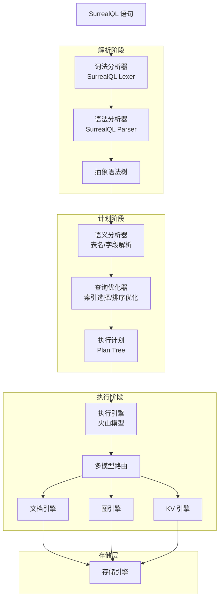

## 解析阶段

### 词法分析

SurrealQL 的词法分析器将输入字符串拆分为 Token 流：

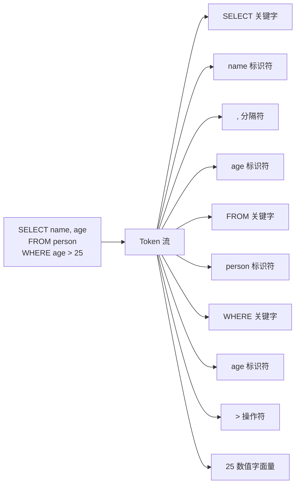

### 语法分析

语法分析器将 Token 流组装为 AST：

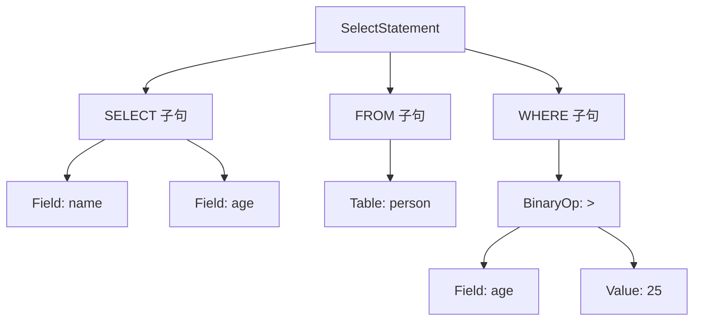

**AST 节点类型示例**：

```rust
enum Statement {
    Select(SelectStatement),
    Create(CreateStatement),
    Update(UpdateStatement),
    Delete(DeleteStatement),
    Relate(RelateStatement),  // 图关系操作
    Graph(GraphStatement),    // 图遍历查询
}

struct SelectStatement {
    fields: Vec<Field>,
    table: TableName,
    condition: Option<Expression>,
    order_by: Vec<OrderClause>,
    limit: Option<usize>,
}
```

## 计划阶段

### 查询优化器

优化器将 AST 转换为最优执行计划：

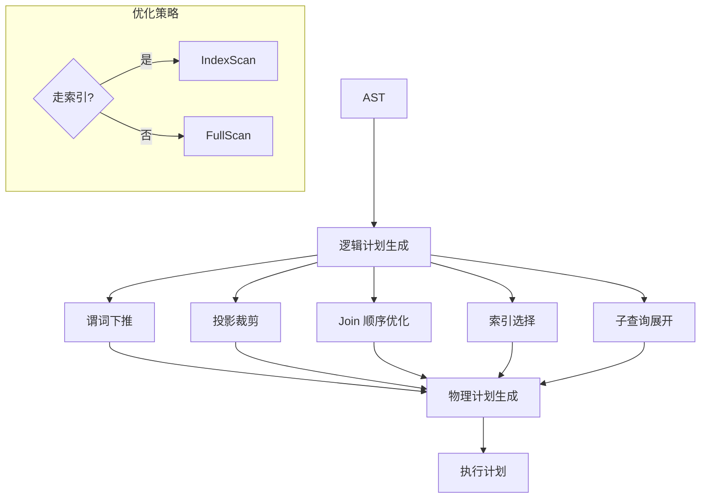

**优化规则示例**：

```rust
// 谓词下推：将过滤条件尽可能靠近数据源
// 原始：SELECT * FROM (SELECT * FROM person) WHERE age > 25
// 优化：SELECT * FROM person WHERE age > 25

// 索引选择：根据 WHERE 条件选择最优索引
// SELECT * FROM person WHERE age > 25 AND name = '张三'
// 若 age 和 name 都有索引，选择 selectivity 更高的

// Join 顺序优化：小表驱动大表
// 原始：big_table JOIN small_table
// 优化：small_table JOIN big_table
```

### 执行计划

执行计划是一棵 Plan Node 树，每个节点实现特定操作：

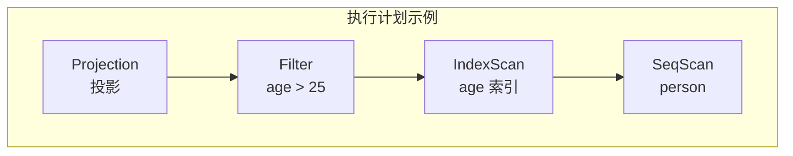

**计划节点类型**：

| 节点类型 | 功能 | 子节点 |
|----------|------|--------|
| SeqScan | 全表扫描 | 叶子节点 |
| IndexScan | 索引扫描 | 叶子节点 |
| Filter | 过滤条件 | 1 个子节点 |
| Projection | 列投影 | 1 个子节点 |
| Sort | 排序 | 1 个子节点 |
| Limit | 限制行数 | 1 个子节点 |
| GraphTraverse | 图遍历 | 1 个子节点 |
| Join | 连接 | 2 个子节点 |

## 执行阶段

### 执行器架构

SurrealDB 采用类似火山模型的执行器，但针对多模态数据做了扩展：

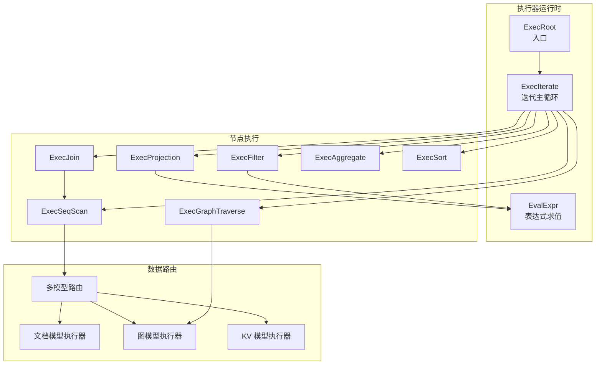

### 文档操作执行

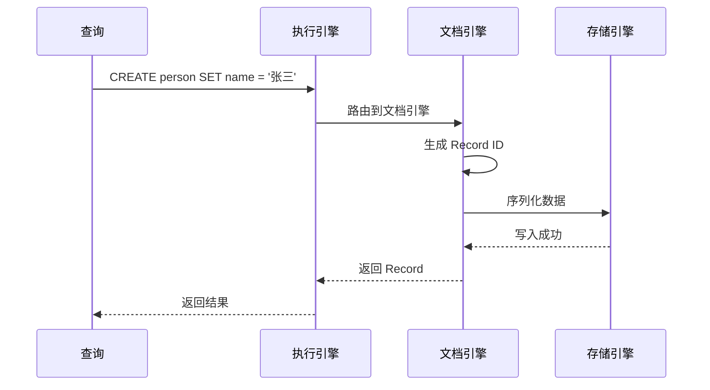

### 图遍历执行

图遍历是 SurrealDB 的核心特色，使用箭头语法：

```sql
-- 从 person:1 出发，沿 friend 边，最终到达 person 类型顶点
SELECT ->friend->person.* FROM person:1

-- 反向遍历
SELECT <-friend<-person.* FROM person:2

-- 变长路径
SELECT ->friend{1,3}->person.* FROM person:1
```

**图遍历算法**：

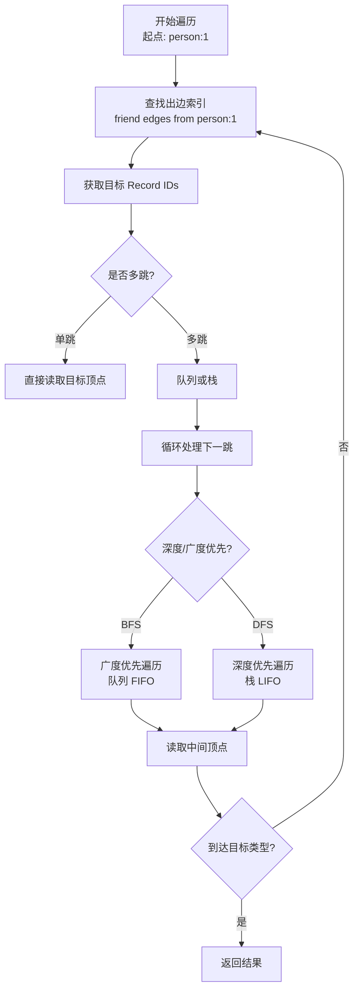

**BFS 与 DFS 选择策略**：

| 策略 | 适用场景 | 数据结构 | 路径特点 |
|------|----------|----------|----------|
| BFS | 最短路径 | 队列 | 最短距离 |
| DFS | 全路径探索 | 栈 | 第一个完整路径 |
| IDDFS | 深度受限遍历 | 迭代加深 | 综合 BFS 和 DFS 优点 |

### Join 执行

SurrealDB 支持 Hash Join 和 Nested Loop Join：

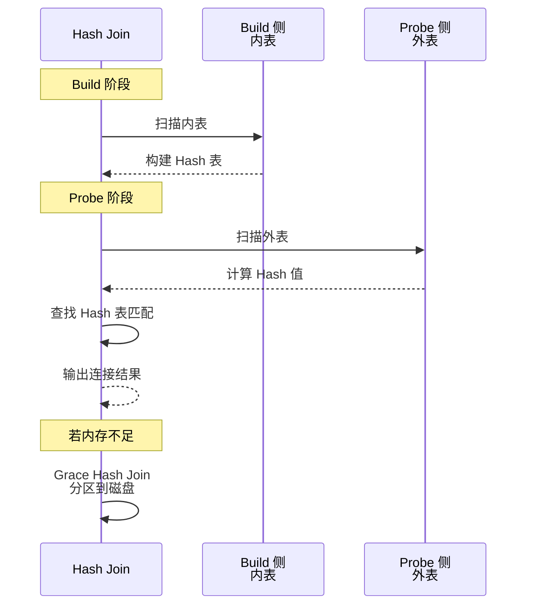

### 聚合与排序执行

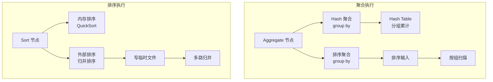

## 核心算法和数据结构

### 多模型路由算法

```rust
/// 根据查询类型路由到对应的模型引擎
fn route_query(statement: &Statement) -> ModelEngine {
    match statement {
        Statement::Create(_) |
        Statement::Update(_) |
        Statement::Delete(_) |
        Statement::Select(_) => ModelEngine::Document,

        Statement::Relate(_) |
        Statement::Graph(_) => ModelEngine::Graph,

        Statement::Set(_) |
        Statement::Kill(_) => ModelEngine::KV,
    }
}
```

### 图遍历算法

```rust
/// 广度优先图遍历
fn bfs_traverse(
    start: RecordId,
    edge_type: EdgeType,
    max_depth: usize,
) -> Vec<RecordId> {
    let mut visited = HashSet::new();
    let mut queue = VecDeque::new();
    let mut results = Vec::new();

    queue.push_back((start, 0));
    visited.insert(start);

    while let Some((current, depth)) = queue.pop_front() {
        if depth >= max_depth {
            continue;
        }

        // 查找出边
        let edges = get_outgoing_edges(&current, &edge_type);
        for edge in edges {
            let target = edge.out;
            if visited.insert(target) {
                results.push(target.clone());
                queue.push_back((target, depth + 1));
            }
        }
    }

    results
}
```

### 索引选择算法

```rust
/// 根据查询条件选择最优索引
fn select_best_index(
    conditions: &[Condition],
    indexes: &[Index],
) -> Option<&Index> {
    // 1. 收集可用索引
    // 2. 评估 selectivity（选择率）
    // 3. 选择 selectivity 最高的索引

    indexes
        .iter()
        .filter(|idx| idx.can_apply(conditions))
        .max_by_key(|idx| idx.estimate_selectivity(conditions))
}
```

## 与项目 algo/ 模块的关联

| SurrealDB 模块 | 项目 algo/ 模块 | 关联说明 |
|----------------|-----------------|----------|
| 词法/语法分析 | algo 分词器 | SurrealQL 解析可用项目分词器做 Tokenize |
| 图遍历 BFS/DFS | algo 图算法 | 项目 Graph 引擎的遍历算法可复用 |
| Hash Join | algo Hash Table | Join 构建 Hash 表可用项目 Hash 实现 |
| 排序执行 | algo Sort | 外部排序可用项目归并排序实现 |
| 索引选择 | algo 搜索/选择 | 索引选择策略可用项目选择算法 |
| 多模型路由 | algo 状态机 | 查询路由可用状态机模式实现 |

### 项目借鉴路径

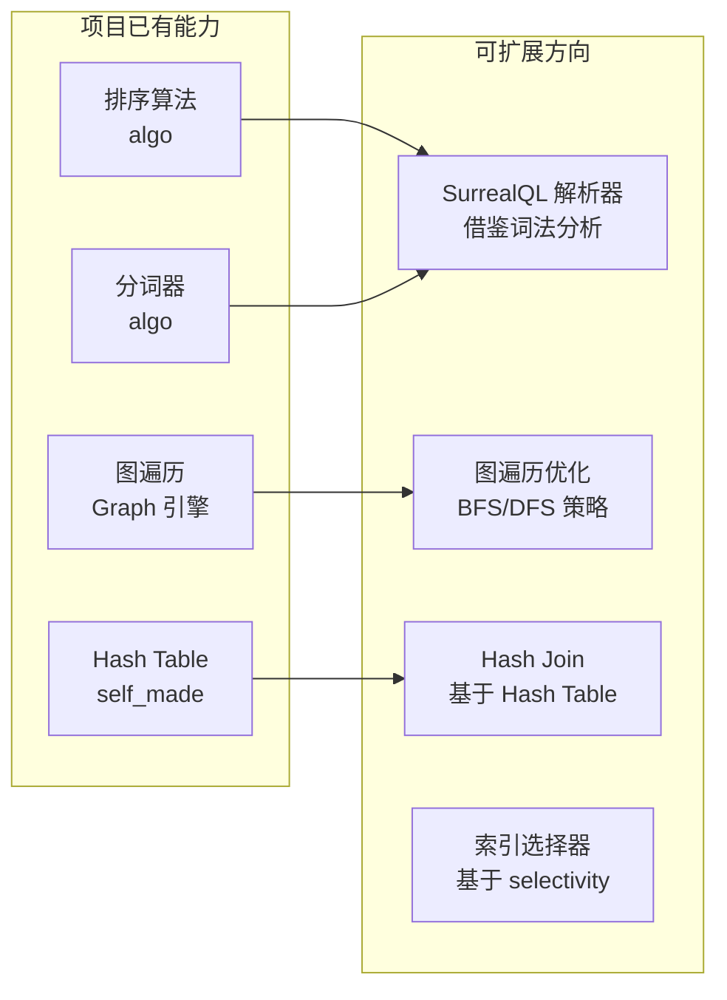

## 要点总结

- **三阶段架构**：解析（Lexer → Parser → AST）→ 计划（Analyzer → Optimizer → Plan）→ 执行（火山模型）
- **多模型路由**：根据查询类型路由到文档/图/KV 引擎，共享同一套解析和计划框架
- **图遍历核心**：BFS/DFS 双策略，基于入边/出边索引加速，支持变长路径
- **Join 策略**：Hash Join 为主，支持 Grace Hash Join 处理大表
- **索引选择**：基于 selectivity 评估，选择最优索引
- **项目关联**：项目 algo/ 模块的 Hash Table、排序、图遍历等能力可直接借鉴

## 思考题

1. SurrealDB 的查询引擎如何同时支持文档、图和 KV 三种模型？多模型路由的边界是什么？
2. 图遍历查询中，BFS 和 DFS 的选择策略对性能有何影响？如何自适应选择？
3. 项目 algo/ 模块的图遍历算法与 SurrealDB 的图遍历有何异同？如何改进？
4. 如果要在项目中实现类似 SurrealQL 的图遍历语法（`->friend->person.*`），解析器需要做哪些改动？
5. 多模型路由的核心挑战是什么？如何处理跨模型的查询（如文档 JOIN 图）？