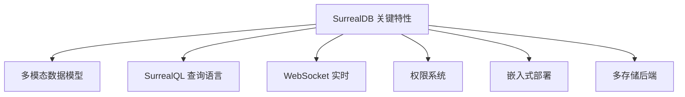

# SurrealDB 关键特性

## 学习目标

- 掌握 SurrealDB 的核心功能特性
- 理解多模态数据模型的使用方法

## 特性总览



## 多模态数据模型

### 文档模型

```sql
-- 灵活 Schema，无需预定义
CREATE article SET
    title = 'SurrealDB 入门',
    content = '...',
    tags = ['database', 'multi-model'],
    published = true,
    views = 0
```

### 图模型

```sql
-- 创建顶点
CREATE user:john SET name = 'John';
CREATE user:jane SET name = 'Jane';

-- 创建边
RELATE user:john->follow->user:jane SET since = '2024-01-01';

-- 图遍历查询
SELECT ->follow->user.* FROM user:john;
```

### KV 模型

```sql
-- 键值操作
CREATE config:theme SET value = 'dark';
CREATE counter:page_views SET count = 0;

-- 原子操作
UPDATE counter:page_views SET count += 1;
```

## SurrealQL 查询语言

| 特性 | SQL | SurrealQL |
|------|-----|-----------|
| 查询 | SELECT | SELECT |
| 创建 | INSERT | CREATE |
| 更新 | UPDATE | UPDATE |
| 删除 | DELETE | DELETE |
| 图遍历 | 不支持 | RELATE/-> |
| 嵌套 | 子查询 | 点号路径 |
| 变量 | 不支持 | $param |
| 函数 | 内置 | 丰富内置 |

## 实时订阅

```javascript
// JavaScript 实时订阅
const db = new Surreal();
await db.connect('ws://localhost:8000/rpc');

// 订阅数据变更
const unsubscribe = await db.subscribe('LIVE SELECT * FROM article', (result) => {
    console.log('数据变更:', result);
});
```

## 权限系统

```sql
-- 定义 Scope
DEFINE SCOPE user_scope
    SESSION 24h
    SIGNUP (CREATE user SET email = $email, pass = crypto::argon2::generate($pass))
    SIGNIN (SELECT * FROM user WHERE email = $email AND crypto::argon2::compare(pass, $pass))
;

-- 行级权限
DEFINE TABLE article
    PERMISSIONS
        FOR select WHERE published = true
        FOR create, update WHERE author = $auth.id
        FOR delete NONE
;
```

## 要点总结

- **三种模型**：文档、图、KV 统一管理
- **SurrealQL**：SQL-like + 图遍历，学习成本低
- **实时订阅**：WebSocket 推送数据变更
- **权限系统**：Scope 定义认证规则，行级安全

## 思考题

1. SurrealQL 的图遍历与 Cypher 查询语言有何异同？
2. 实时订阅的推送延迟如何优化？
