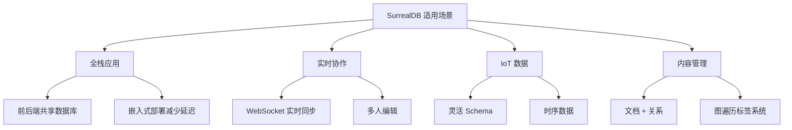
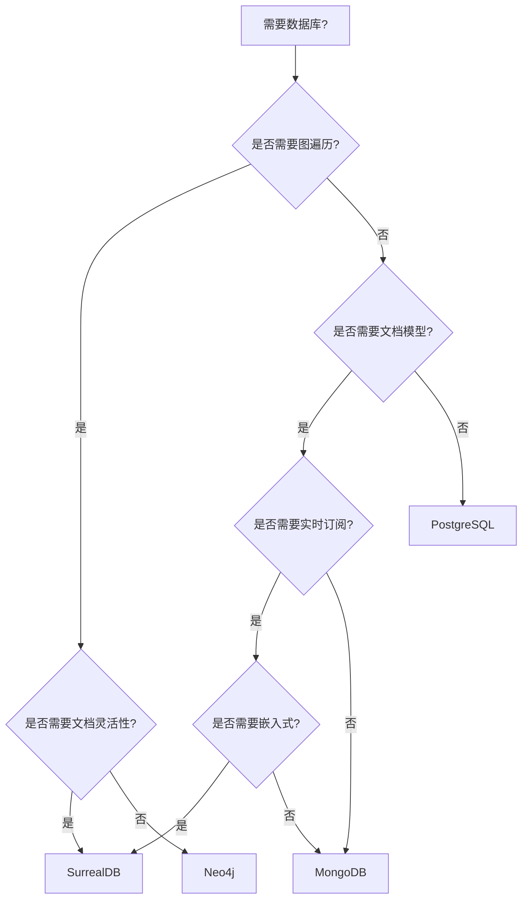

# SurrealDB 使用场景与选型对比

## 学习目标

- 理解 SurrealDB 的最佳适用场景
- 掌握与其他多模态数据库的选型对比

## 适用场景

## 选型对比

| 维度 | SurrealDB | Neo4j | MongoDB | PostgreSQL |
|------|-----------|-------|---------|------------|
| 数据模型 | 文档+图+KV | 图 | 文档 | 关系 |
| 查询语言 | SurrealQL | Cypher | MQL | SQL |
| 图遍历 | 支持 | 强 | 弱 | 无 |
| 实时订阅 | 原生支持 | 需扩展 | Change Stream | 需扩展 |
| 嵌入式 | 支持 | 不支持 | 不支持 | 不支持 |
| 开源协议 | Apache 2.0 | GPLv3 | SSPL | PostgreSQL |
| 社区 | 28k stars | 高 | 极高 | 极高 |

## 决策流程

## 要点总结

- **全栈应用**是 SurrealDB 的核心场景
- **嵌入式部署**和**多模态**是核心优势
- 与 Neo4j 相比增加了文档和 KV 能力

## 思考题

1. SurrealDB 与 FaunaDB 有何异同？
2. 嵌入式部署如何处理数据同步？
