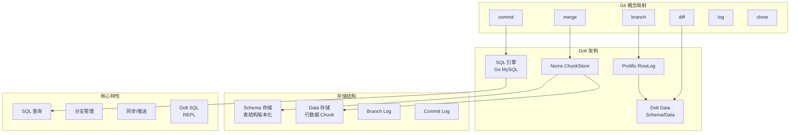

# Dolt 项目概览

## 学习目标

- 了解 Dolt 的定位和特点
- 掌握 Dolt 的版本控制与数据库结合的架构设计

## 项目定位

> Git for Database，将版本控制概念引入数据库，支持 SQL 查询与 Git 风格的分支、合并、diff 操作

**基本信息**：

- 开发方：DoltHub
- 开源协议：Apache 2.0
- GitHub Stars：~18k

## 核心设计

## 要点总结

- **数据库即 Git 仓库**：每个数据库都是完整的 Git 仓库，支持版本控制操作
- **分支管理**：支持创建、切换、合并分支，不同分支数据隔离
- **Commit History**：完整的提交历史，支持回滚和审计
- **Diff 能力**：表级和行级 diff，可视化数据变更
- **SQL 兼容**：实现 MySQL 协议，支持标准 SQL 查询
- **离线克隆**：可克隆完整数据库到本地，包括所有历史
- **DoltHub**：类似 GitHub 的数据共享平台
- **冲突解决**：支持合并冲突的手动解决机制

## 相关资源

- GitHub: https://github.com/dolthub/dolt
- 文档: https://docs.dolthub.com/
