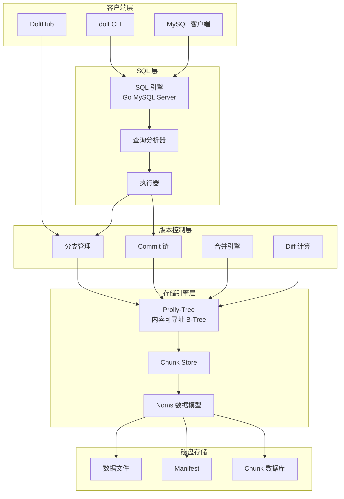
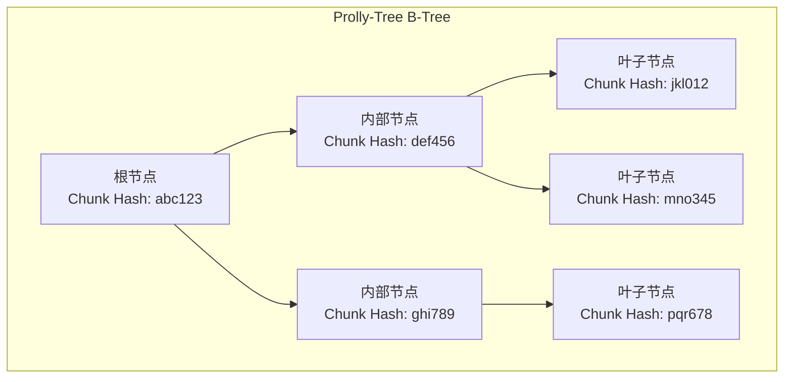
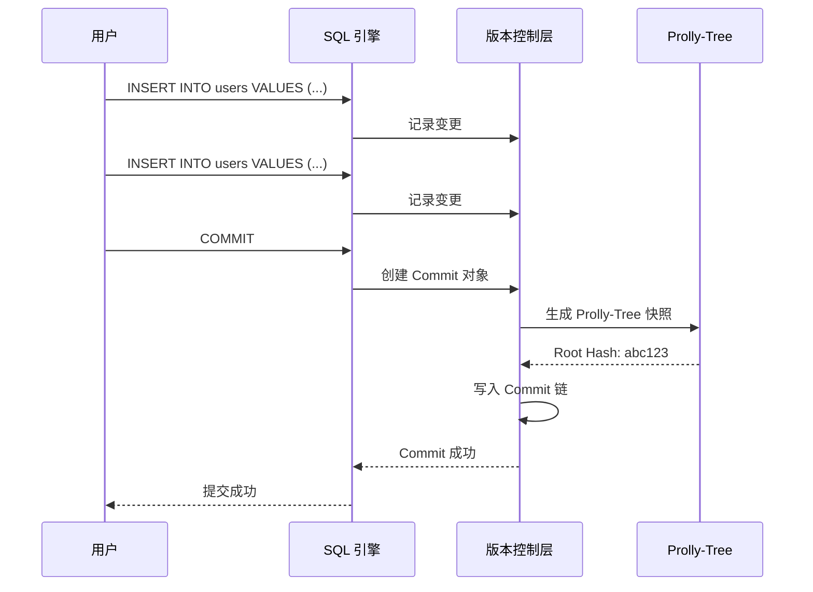

# Dolt 架构设计

## 学习目标

- 理解 Dolt 的版本控制与数据库结合架构
- 掌握 Prolly-Tree 的核心原理
- 了解 Git 概念在数据库中的映射

## 整体架构

## Prolly-Tree 结构

## Commit 链

## 要点总结

- **SQL + Git**：同时支持 SQL 查询和版本控制
- **Prolly-Tree**：内容可寻址的 B-Tree 变体
- **Commit 链**：类似 Git 的提交历史
- **分支管理**：支持创建、切换、合并分支

## 思考题

1. Prolly-Tree 与标准 B-Tree 相比有何优势？
2. Dolt 如何处理大文件的版本控制？
