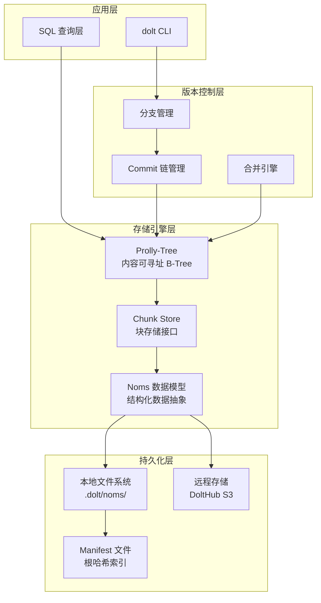
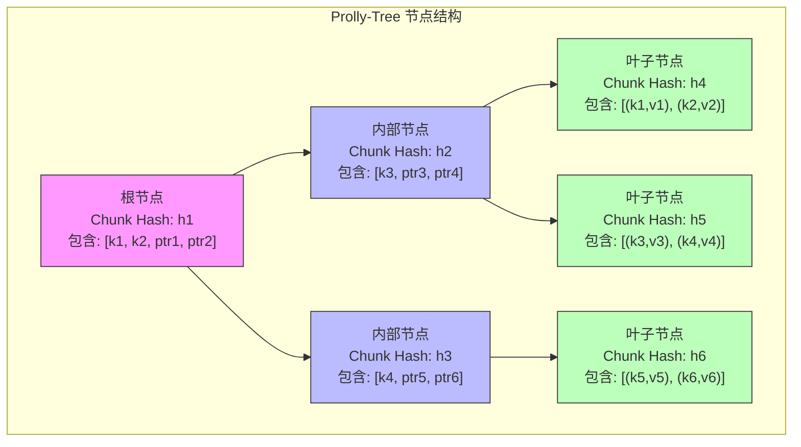
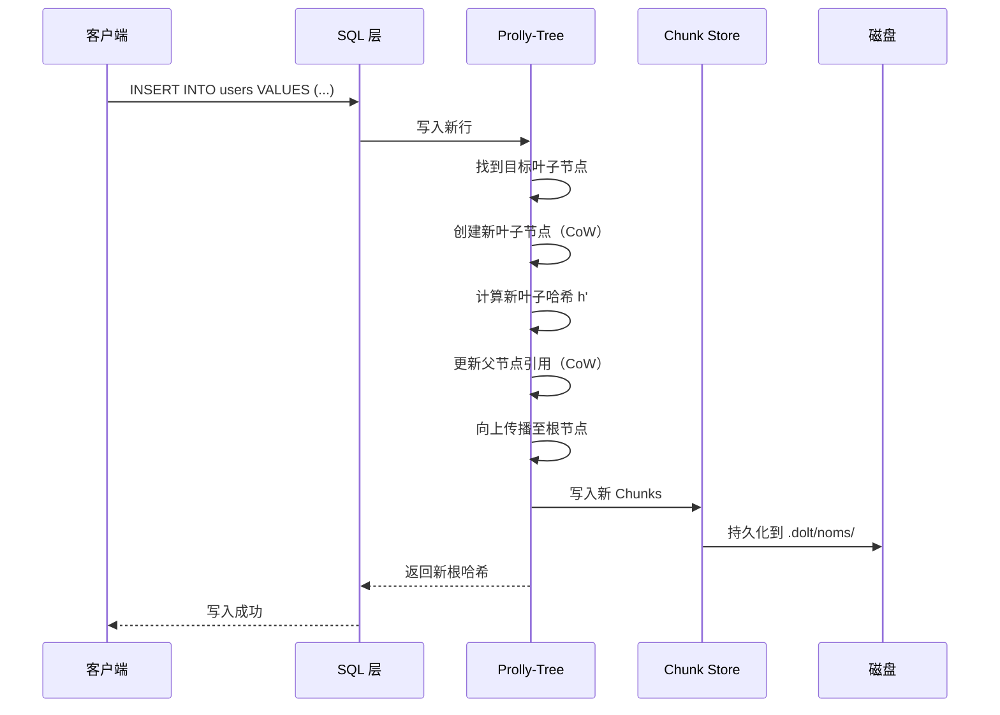
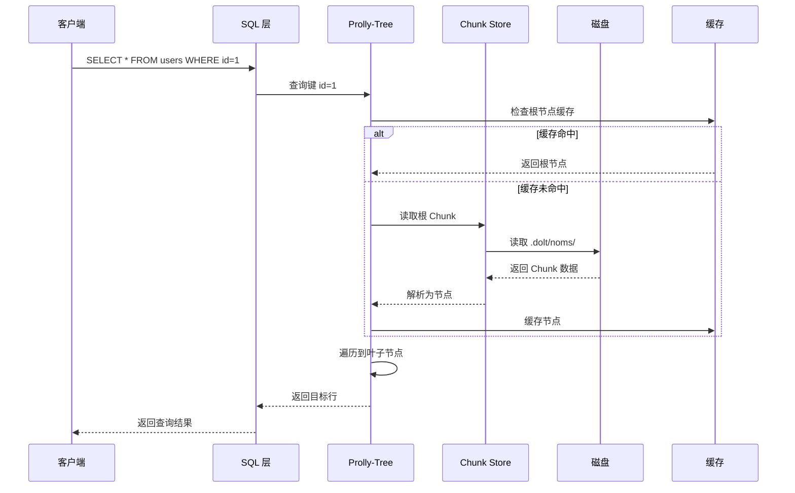
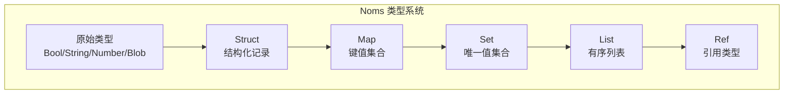
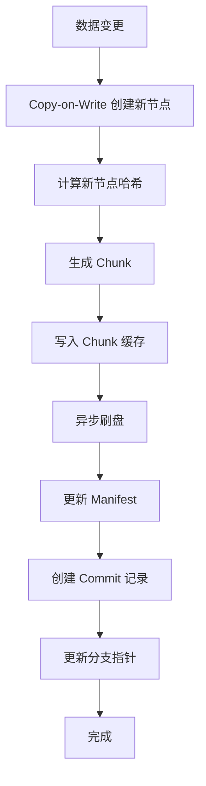
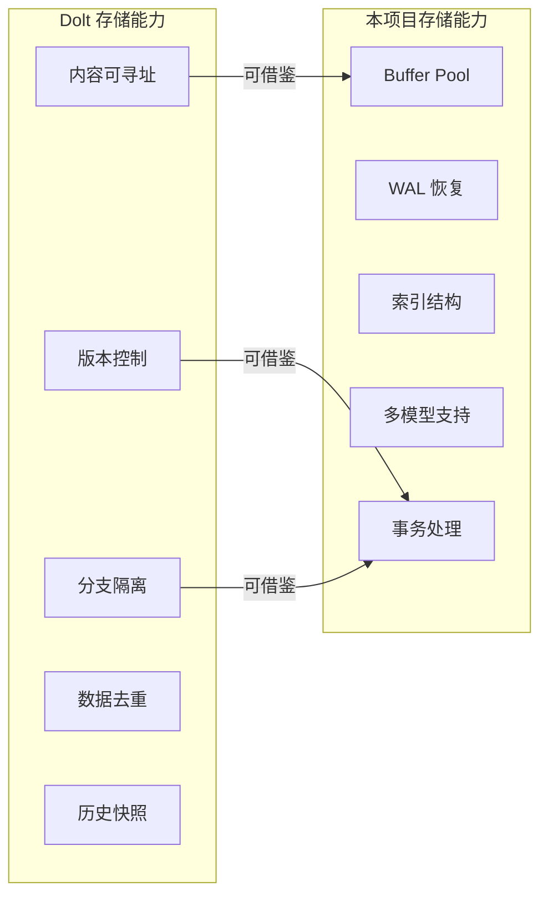

# Dolt 存储引擎

## 学习目标

- 理解 Prolly-Tree 的核心原理与实现细节
- 掌握内容可寻址存储（CAS）机制
- 了解 Noms 数据模型与 Chunk Store 架构
- 对比分析 Dolt 存储引擎与本项目 storage 模块的差异

## 核心存储架构



## Prolly-Tree 结构详解

### 核心概念

Prolly-Tree 是 Dolt 存储引擎的核心创新，全称 "Probabilistic B-Tree"，是一种内容可寻址的 B-Tree 变体。



### 关键特性

| 特性 | 标准B-Tree | Prolly-Tree |
|------|-----------|-------------|
| 节点标识 | 内存指针/页面号 | 内容哈希（Chunk Hash） |
| 更新方式 | 原地修改 | 写时复制（Copy-on-Write） |
| 一致性保证 | WAL + Checkpoint | 哈希校验天然保证 |
| 版本控制 | 需额外实现 | 天然支持快照 |
| 数据去重 | 无 | 相同内容共享存储 |

### Chunk 结构

```c
// 伪代码：Chunk 数据结构
struct Chunk {
    string hash;        // 内容哈希（SHA-256 或类似）
    bytes  data;        // 序列化后的数据
    int    height;      // 树高度（叶子为 0）
    int    num_entries; // 条目数量
    bytes  boundary;    // 边界键（内部节点）
};
```

### 写入路径



### 读取路径



## Noms 数据模型

### 核心类型



### Chunk 序列化

```go
// Go 伪代码：Noms Chunk 序列化
type Value interface {
    Kind() NomsKind
    WriteTo(w io.Writer) error
    Hash() hash.Hash
}

// Struct 示例
type User struct {
    ID    uint64 `noms:"id"`
    Name  string `noms:"name"`
    Email string `noms:"email"`
}

// 序列化为 Chunk
func (u *User) ToChunk() *Chunk {
    data := serialize(u)  // Noms 序列化格式
    hash := sha256(data)  // 计算哈希
    return &Chunk{Hash: hash, Data: data}
}
```

## 数据持久化机制

### 存储文件布局

```
.dolt/
├── noms/                    # Noms Chunk 存储
│   ├── chunks/              # Chunk 数据文件
│   │   ├── 00/              # 按哈希前缀分片
│   │   │   ├── 00abc123...  # Chunk 文件
│   │   │   └── 00def456...
│   │   ├── 01/
│   │   └── ...
│   └── manifest             # 根哈希索引
├── working/                 # 工作目录状态
├── heads/                   # 分支指针
└── commit-graph/            # Commit 图结构
```

### 持久化流程



## 与本项目 storage 模块对比

### 架构差异

| 维度 | Dolt | 本项目 storage 模块 |
|------|------|---------------------|
| 核心结构 | Prolly-Tree | 标准 B-Tree + 堆表 |
| 版本控制 | 原生支持（Commit 链） | 无（需 WAL 恢复） |
| 内容寻址 | 是（Chunk Hash） | 否（页面号） |
| 并发控制 | MVCC + 分支隔离 | 锁 + Buffer Pool |
| 数据模型 | Noms 多态类型 | 关系模型为主 |

### 功能对比



### 可借鉴的设计点

1. **内容可寻址存储**
   - 在本项目 BTree 中添加 Chunk Hash 校验
   - 实现数据完整性自动验证
   - 支持增量同步

2. **版本控制集成**
   - 在 Commit 记录中保存根哈希
   - 实现 `AS OF` 时间旅行查询
   - 支持数据审计追踪

3. **分支管理**
   - 实现沙箱隔离机制
   - 支持测试环境快速切换
   - 数据变更可回滚

## 要点总结

- **Prolly-Tree 核心**：内容可寻址 + 写时复制 + 天然版本控制
- **Chunk Store**：所有数据以 Chunk 形式存储，通过哈希索引
- **Noms 模型**：结构化数据抽象，支持多种数据类型
- **持久化**：Manifest 记录根哈希，Chunk 按哈希分片存储
- **对比本项目**：Dolt 侧重版本控制，本项目侧重事务处理

## 思考题

1. Prolly-Tree 的写时复制机制对写密集场景的性能影响如何？有哪些优化策略？
2. 如何在本项目 BTree 中引入内容可寻址机制？需要修改哪些接口？
3. Dolt 的 Chunk Store 与传统 Buffer Pool 各自的优缺点是什么？
4. 如果要为项目添加版本控制功能，应该选择在存储层还是 SQL 层实现？为什么？
5. Noms 数据模型的多态类型系统对查询优化有何挑战？Dolt 是如何解决的？

## 参考资源

- [Dolt Storage Architecture](https://docs.dolthub.com/architecture/storage)
- [Prolly-Tree 论文](https://www.dolthub.com/blog/2021-11-12-prolly-tree/)
- [Noms 数据模型](https://github.com/attic-labs/noms)
- 本项目: `engineering/include/db/storage_engine.h`