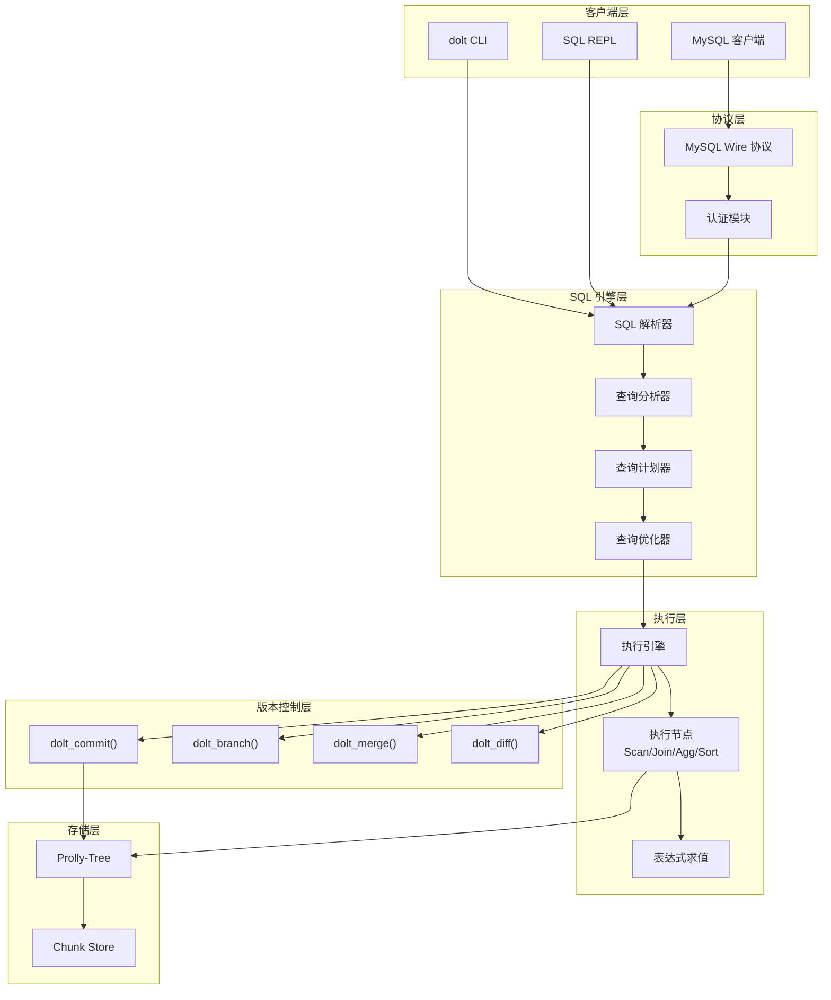
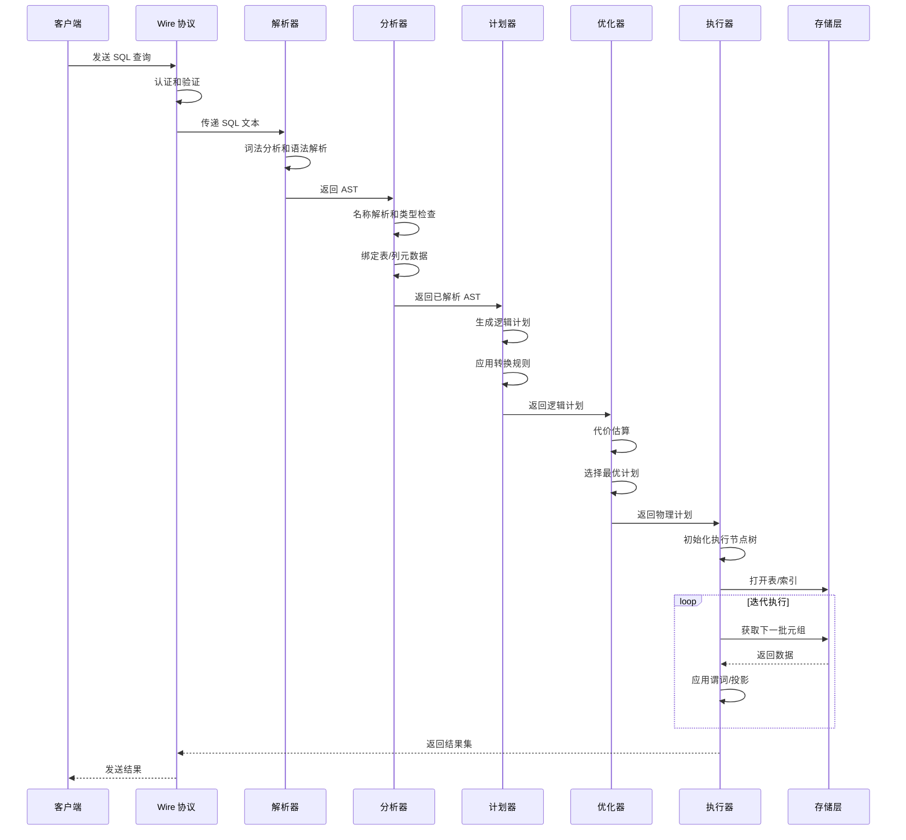
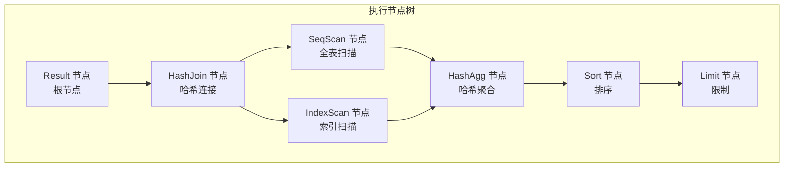
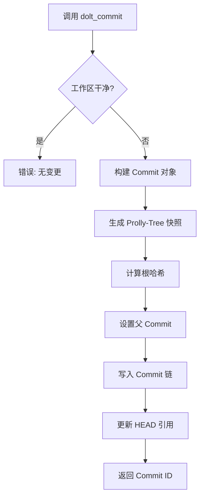
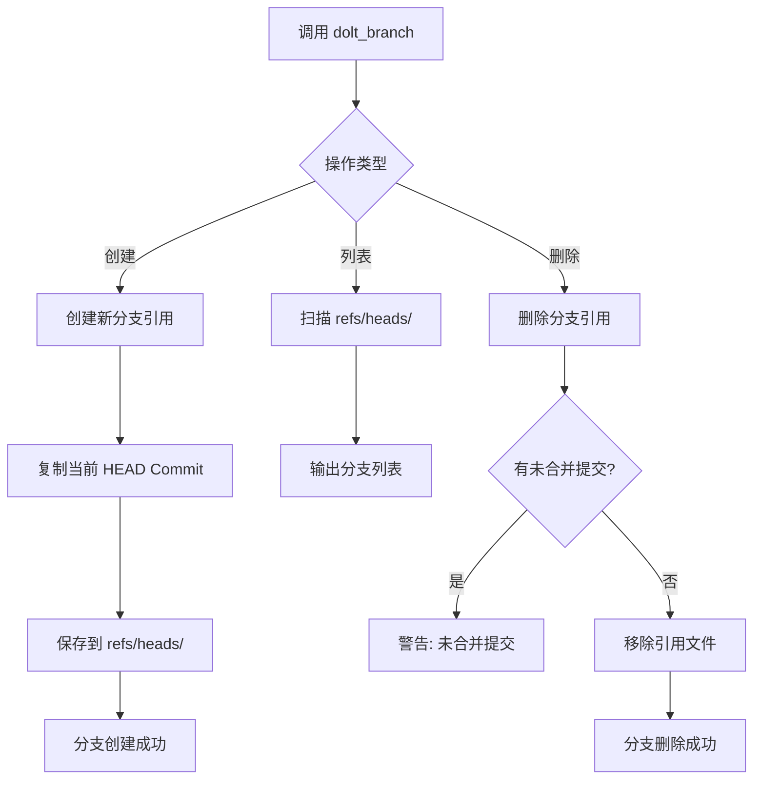
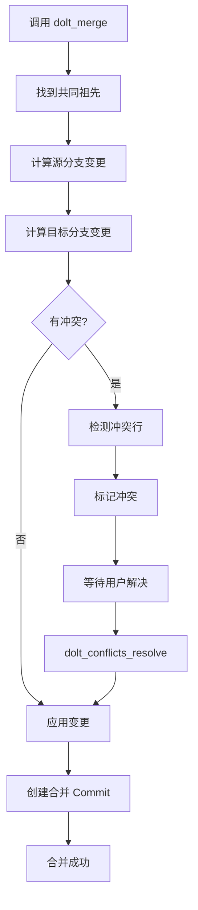
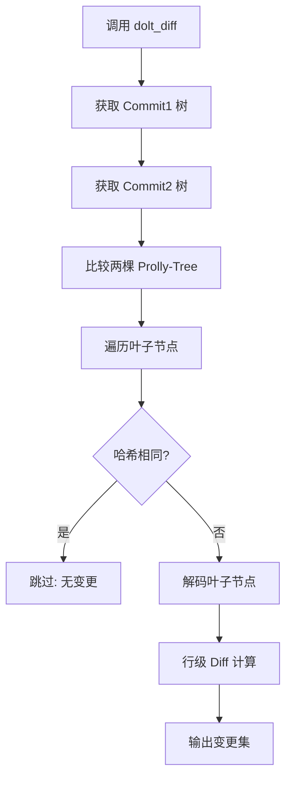
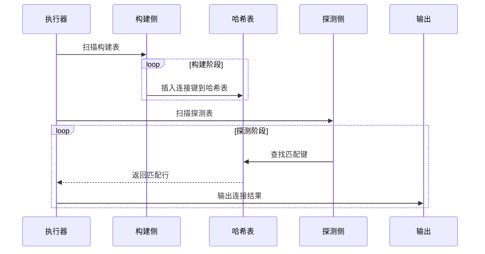
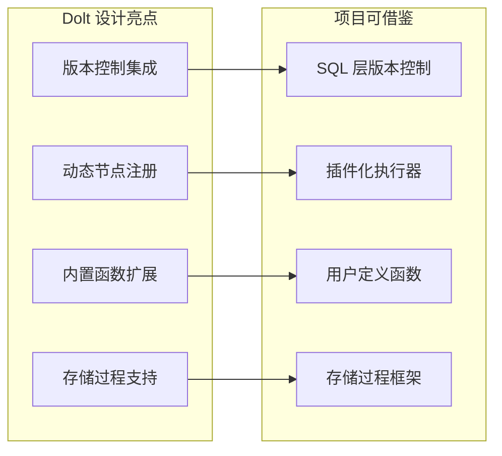

# Dolt 查询或操作引擎

## 学习目标

- 理解 Dolt 的 SQL 查询处理流程
- 掌握基于 Go MySQL Server 的执行器架构
- 了解版本控制操作的实现机制
- 对比分析 Dolt 执行引擎与本项目 algo/ 模块的关联

## 查询执行架构



## SQL 查询执行流程

### 完整查询生命周期



### 核心执行节点



### 执行节点类型

| 节点类型 | 功能 | 适用场景 |
|---------|------|---------|
| SeqScan | 全表扫描 | 无索引查询、小表 |
| IndexScan | 索引扫描 | 有索引的选择查询 |
| HashJoin | 哈希连接 | 等值连接 |
| MergeJoin | 归并连接 | 有序输入连接 |
| NestedLoop | 嵌套循环 | 小表驱动大表 |
| HashAgg | 哈希聚合 | 大数据量聚合 |
| SortAgg | 排序聚合 | 有序输入聚合 |
| Sort | 排序 | ORDER BY |
| Limit | 限制行数 | LIMIT 子句 |

## 版本控制操作引擎

### dolt_commit() 实现



### dolt_branch() 实现



### dolt_merge() 实现



### dolt_diff() 实现



## 核心算法和数据结构

### 查询优化算法

```go
// Go 伪代码：代价估算
func (p *Planner) estimateCost(plan PhysicalPlan) Cost {
    switch plan.Type {
    case SeqScan:
        return Cost{
            IO:  p.tableStats.RowCount * p.tableStats.AvgRowSize,
            CPU: p.tableStats.RowCount,
        }
    case IndexScan:
        selectivity := p.estimateSelectivity(plan.Filter)
        return Cost{
            IO:  p.tableStats.RowCount * selectivity,
            CPU: p.tableStats.RowCount * selectivity * 2,
        }
    case HashJoin:
        buildCost := p.estimateCost(plan.BuildSide)
        probeCost := p.estimateCost(plan.ProbeSide)
        return Cost{
            IO:  buildCost.IO + probeCost.IO,
            CPU: buildCost.CPU + probeCost.CPU + probeCost.RowCount,
        }
    }
}
```

### 哈希连接算法



### Prolly-Tree Diff 算法

```go
// Go 伪代码：Prolly-Tree Diff
func (t *ProllyTree) Diff(other *ProllyTree) []DiffEntry {
    var diffs []DiffEntry
    
    // 自顶向下比较
    if t.rootHash == other.rootHash {
        return diffs // 相同树，无变更
    }
    
    // 并行遍历两棵树
    t.walk(func(node *Node) {
        otherNode := other.findNode(node.Key)
        if otherNode == nil {
            diffs = append(diffs, DiffEntry{Op: INSERT, Key: node.Key, Val: node.Val})
        } else if node.Hash != otherNode.Hash {
            diffs = append(diffs, DiffEntry{Op: UPDATE, Key: node.Key, 
                                            OldVal: otherNode.Val, NewVal: node.Val})
        }
    })
    
    return diffs
}
```

## 与本项目 algo/ 模块的关联

### 架构对比

| 维度 | Dolt 执行引擎 | 本项目 algo 模块 |
|------|--------------|-----------------|
| 语言 | Go | C |
| 执行模型 | Volcano 迭代器 | Volcano 迭代器 |
| 节点注册 | 动态注册表 | 静态函数表 |
| 优化器 | 基于代价 | 基于规则 |
| 版本控制 | 原生集成 | 无 |

### 可借鉴的设计点



### 执行节点对应关系

| Dolt 节点 | 本项目节点 | 功能 |
|----------|-----------|------|
| executeSeqScan | ExecSeqScan | 全表扫描 |
| executeIndexScan | ExecIndexScan | 索引扫描 |
| executeHashJoin | ExecHashJoin | 哈希连接 |
| executeMergeJoin | ExecMergeJoin | 归并连接 |
| executeHashAgg | ExecAgg | 聚合 |
| executeSort | ExecSort | 排序 |
| executeLimit | ExecLimit | 限制 |

### 代码对应示例

```c
// 本项目: engineering/src/db/sql/executor.c
PlanState *ExecInitNode(Plan *plan, EState *estate, int eflags) {
    switch (plan->type) {
        case T_SeqScan:
            return ExecInitSeqScan((SeqScan *)plan, estate, eflags);
        case T_HashJoin:
            return ExecInitHashJoin((HashJoin *)plan, estate, eflags);
        case T_Agg:
            return ExecInitAgg((Agg *)plan, estate, eflags);
        // ...
    }
}
```

```go
// Dolt (Go MySQL Server): go/sqlexec/executor.go
func (e *Executor) Execute(ctx context.Context, query string) (Schema, RowIter, error) {
    plan, err := e.planner.QueryPlan(ctx, query)
    if err != nil {
        return nil, nil, err
    }
    return e.executePlan(ctx, plan)
}
```

## 要点总结

- **SQL 引擎**：基于 Go MySQL Server，支持 MySQL 协议
- **执行模型**：Volcano 迭代器模型，支持流水线执行
- **版本控制集成**：SQL 函数形式暴露（dolt_commit/branch/merge/diff）
- **优化器**：基于代价的优化，支持索引选择和连接顺序优化
- **对比本项目**：架构相似，但 Dolt 原生支持版本控制操作

## 思考题

1. Dolt 如何在 SQL 引擎中集成版本控制操作？这种设计有哪些优缺点？
2. 哈希连接在大数据量场景下的内存管理策略是什么？如何处理内存不足？
3. 本项目的 Volcano 执行器可以借鉴 Dolt 的哪些设计？动态节点注册是否适用？
4. 如何在本项目中实现 SQL 层的版本控制函数？需要修改哪些模块？
5. Dolt 的 Prolly-Tree Diff 算法的时间复杂度是多少？如何优化大规模数据集的 Diff？

## 参考资源

- [Dolt SQL Engine](https://www.dolthub.com/blog/2020-04-20-dolt-sql-engine/)
- [Go MySQL Server](https://github.com/dolthub/go-mysql-server)
- [Volcano 执行模型论文](https://paperhub.s3.amazonaws.com/dace52a42c07f7f8345b0862a7609875.pdf)
- 本项目: engineering/src/db/sql/executor.c