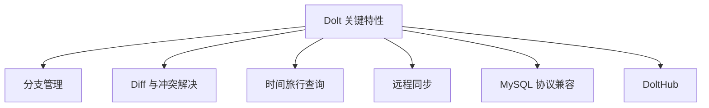

# Dolt 关键特性

## 学习目标

- 掌握 Dolt 的核心功能特性
- 理解版本控制与数据库的结合

## 特性总览



## 分支管理

```bash
# 创建分支
dolt branch feature-1

# 切换分支
dolt checkout feature-1

# 查看分支
dolt branch

# 合并分支
dolt merge feature-1
```

## Diff 与冲突解决

```bash
# 查看表级 diff
dolt diff --table users

# 查看行级 diff
dolt diff --table users --where "id=1"

# 冲突解决
dolt conflicts resolve --theirs users
```

## 时间旅行查询

```sql
-- 查询过去某个时间点的数据
SELECT * FROM users AS OF '2024-01-01';

-- 查询某个 Commit 的数据
SELECT * FROM users AS OF 'abc123def456';
```

## 要点总结

- **分支管理**：数据库分支类似 Git 分支
- **Diff 能力**：表级和行级 diff
- **时间旅行**：AS OF 查询历史数据
- **远程同步**：dolt push/pull/fetch 类似 Git

## 思考题

1. 时间旅行查询的性能如何优化？
2. 合并冲突如何自动解决？
