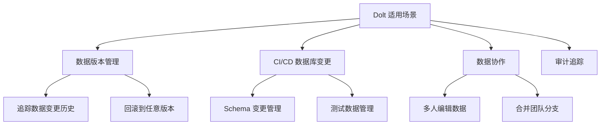

# Dolt 使用场景与选型对比

## 学习目标

- 理解 Dolt 的最佳适用场景
- 掌握数据版本管理方法

## 适用场景

## 选型对比

| 维度 | Dolt | Git-LFS | Liquibase | 传统备份 |
|------|------|---------|-----------|----------|
| 数据版本控制 | 原生 | 文件级 | Schema 级 | 全量 |
| 分支管理 | 支持 | 不支持 | 不支持 | 不支持 |
| 冲突解决 | 行级 | 文件级 | 手动 | 无 |
| SQL 查询 | 支持 | 不支持 | 不支持 | 不支持 |
| 时间旅行 | 支持 | 不支持 | 不支持 | 不支持 |

## 要点总结

- **数据版本管理**是 Dolt 的核心场景
- **CI/CD 集成**可自动化数据库变更流程
- 比 Git-LFS 更精细的数据版本控制

## 思考题

1. Dolt 如何与现有的 CI/CD 流程集成？
2. 数据版本控制对存储空间的影响？
