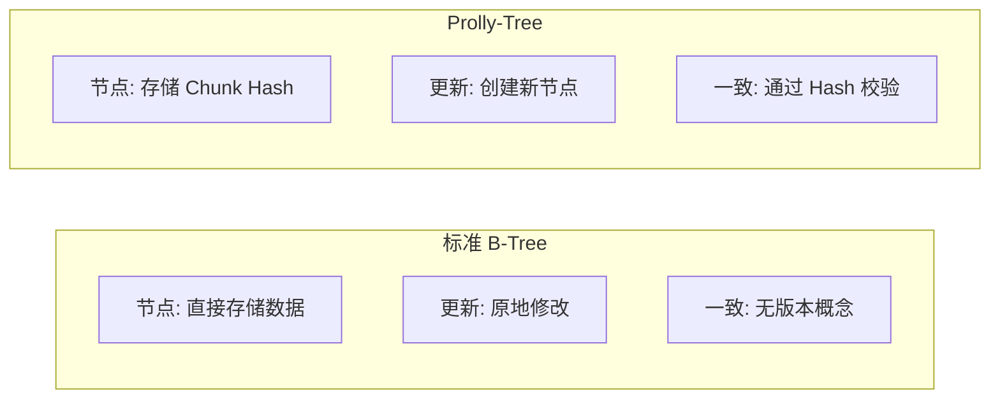

# Dolt 与项目关联

## 学习目标

- 理解 Dolt 与本项目的关系
- 掌握版本控制设计在项目中的应用

## 架构对比

| 维度 | Dolt | 本项目 BTree |
|------|------|--------------|
| 树结构 | Prolly-Tree | 标准 B-Tree |
| 版本控制 | 原生支持 | 无 |
| 内容寻址 | 是 | 否 |
| 数据去重 | 自动 | 无 |

## Prolly-Tree 与 B-Tree 对比

## 可借鉴的设计点

| 借鉴点 | Dolt 实现 | 项目应用 |
|--------|----------|----------|
| 内容可寻址 | Chunk Hash | 实现数据完整性校验 |
| 版本控制 | Commit 链 | 实现数据版本管理 |
| 分支管理 | 分支隔离 | 实现沙箱隔离 |

## 要点总结

- Prolly-Tree 的内容可寻址特性值得借鉴
- 版本控制机制可实现数据审计
- 分支管理可用于沙箱测试

## 思考题

1. 如何在项目 BTree 中实现内容可寻址？
2. 数据版本控制对写性能的影响？
