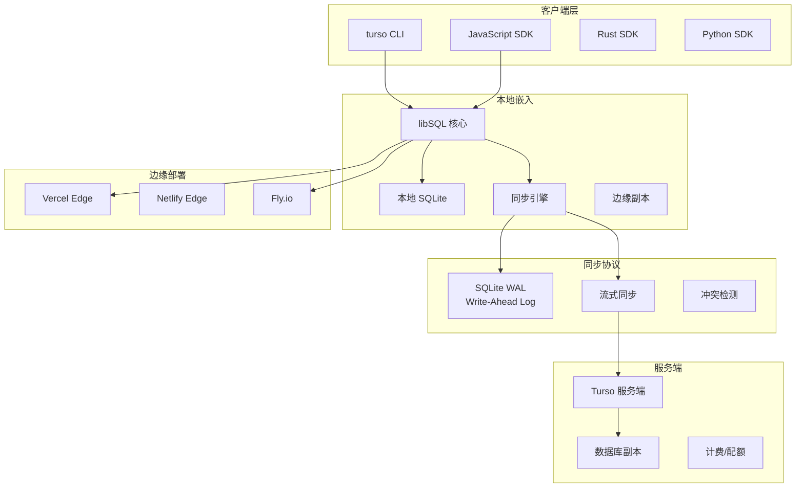

# Turso 项目概览

## 学习目标

- 了解 Turso 的定位和特点
- 掌握 Turso 的边缘分布式 SQLite 架构

## 项目定位

> 边缘分布式 SQLite，基于 libSQL 分支，支持边缘部署和本地优先同步策略

**基本信息**：

- 开发方：Turso Team (ChiselStrike)
- 开源协议：Apache 2.0
- GitHub Stars：~8k

## 核心设计

## 要点总结

- **libSQL 分支**：SQLite 的开源分支，支持嵌入式的网络同步能力
- **边缘部署**：可直接部署到 Vercel Edge、Netlify、Fly.io 等边缘平台
- **本地优先**：数据先写入本地，异步同步到云端，减少延迟
- **多副本同步**：支持为每个用户/租户创建独立的数据库副本
- **SQLite 兼容**：完全兼容 SQLite 语法和扩展
- **无服务器**：按需扩缩容，无需管理服务器
- **复制延迟低**：边缘副本同步延迟通常在毫秒级
- **嵌入式使用**：可在客户端应用中直接嵌入使用

## 相关资源

- GitHub: https://github.com/tursodatabase/libsql
- 文档: https://docs.turso.tech/
