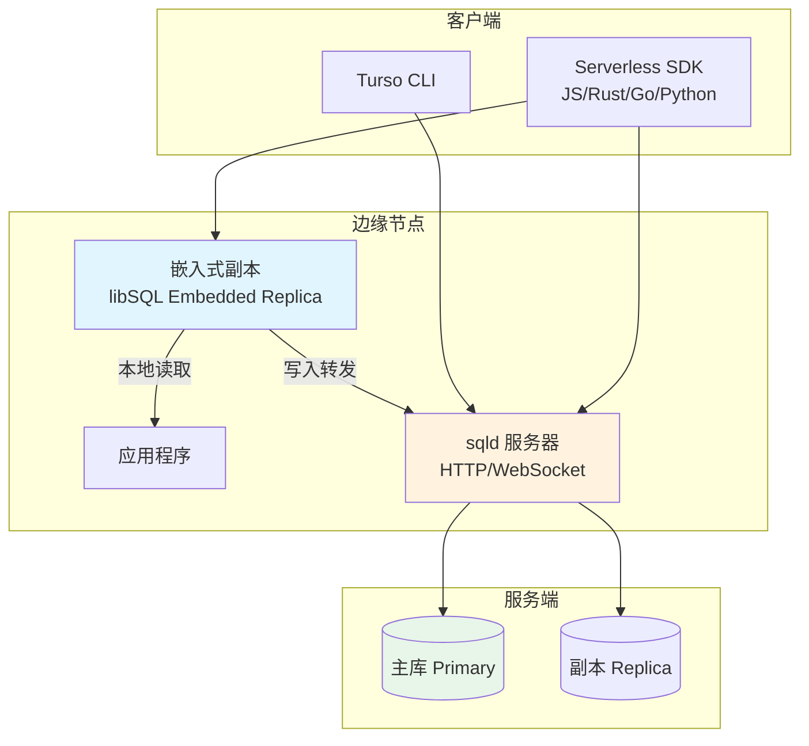
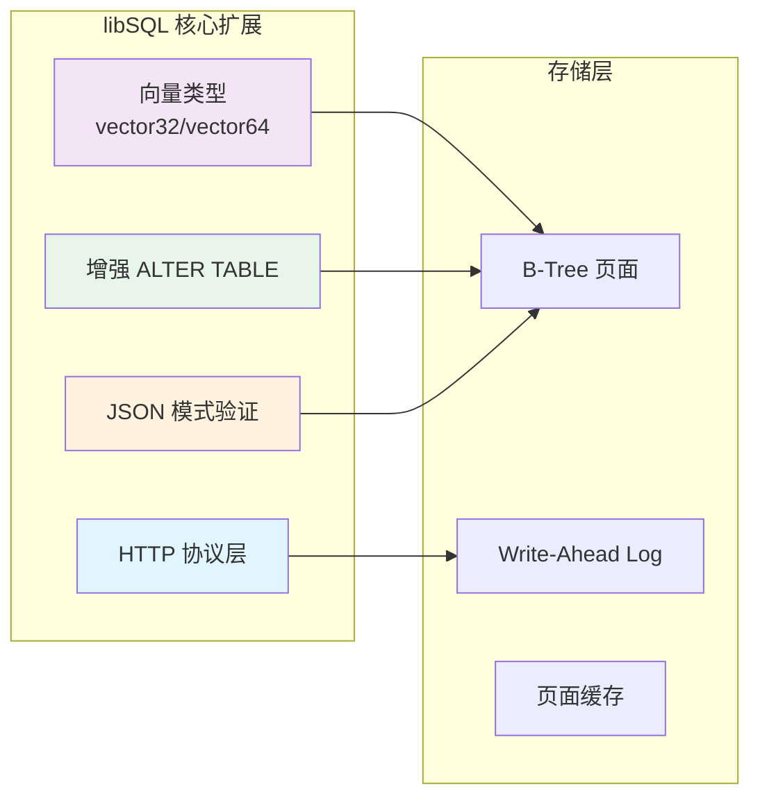
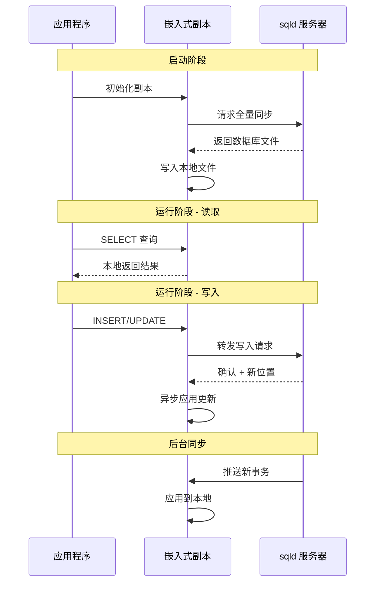
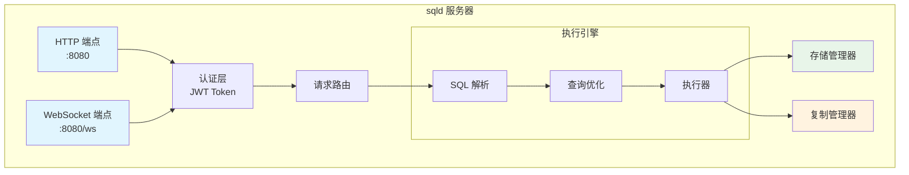
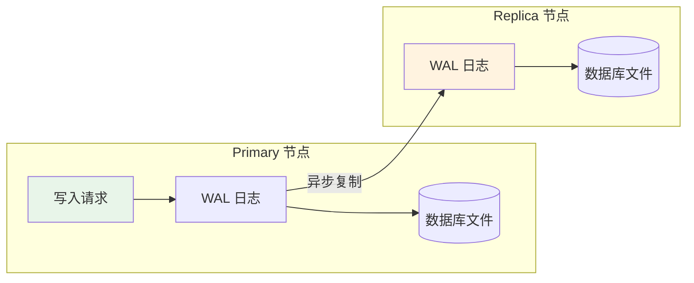
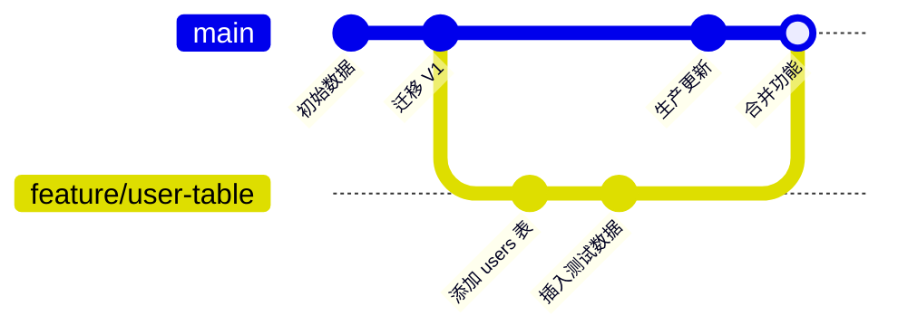
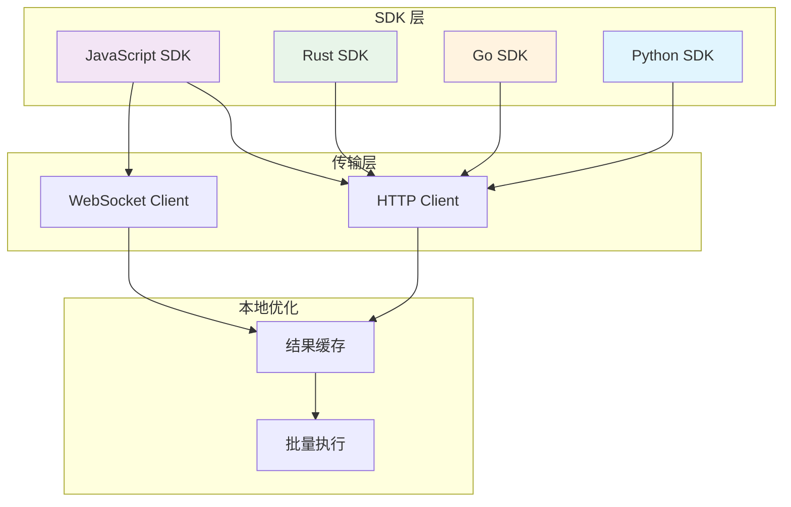

# Turso 架构

## 学习目标
- 理解 libSQL 分支与 SQLite 的关系
- 掌握嵌入式副本（Embedded Replica）的工作原理
- 理解 sqld 服务器的架构设计
- 了解主从同步机制

## 核心架构概览



## libSQL 分支架构

### 1. libSQL 与 SQLite 的关系

| 特性 | SQLite | libSQL |
|------|--------|--------|
| 存储格式 | 单文件 | 单文件 + WAL |
| 网络协议 | 无 | HTTP/WebSocket |
| 向量扩展 | 需手动编译 | 内置 vector 类型 |
| ALTER TABLE | 有限 | 增强版 |
| JSON 支持 | JSON1 扩展 | 内置 JSON 模式 |
| 复制 | 无 | 嵌入式副本 |

### 2. libSQL 扩展架构



## 嵌入式副本（Embedded Replica）

### 1. 工作原理



### 2. 同步策略

```c
// 嵌入式副本同步模式
typedef enum {
    SYNC_MODE_REALTIME,   // 实时同步（WebSocket）
    SYNC_MODE_PERIODIC,   // 周期同步（可配置间隔）
    SYNC_MODE_MANUAL      // 手动触发
} sync_mode_t;

// 副本状态
typedef struct embedded_replica {
    char *db_path;           // 本地数据库路径
    char *remote_url;        // 远程服务器 URL
    uint64_t last_frame;     // 最后同步的帧号
    sync_mode_t sync_mode;   // 同步模式
    uint32_t sync_interval;  // 同步间隔（毫秒）
    bool is_syncing;         // 正在同步标志
} embedded_replica_t;
```

## sqld 服务器架构

### 1. 服务组件



### 2. HTTP 协议

```bash
# 执行 SQL
curl -X POST https://db.example.com/sql \
  -H "Authorization: Bearer $TOKEN" \
  -H "Content-Type: application/json" \
  -d '{
    "statements": [
      "CREATE TABLE users (id INTEGER PRIMARY KEY, name TEXT)",
      "INSERT INTO users VALUES (1, '\''Alice'\'')"
    ]
  }'

# 查询结果
{
  "results": [
    {"rows_affected": 0},
    {"last_insert_rowid": 1}
  ]
}
```

### 3. WebSocket 实时订阅

```javascript
// WebSocket 连接
const ws = new WebSocket('wss://db.example.com/ws?token=xxx');

ws.onopen = () => {
  // 订阅表变更
  ws.send(JSON.stringify({
    type: 'subscribe',
    table: 'users'
  }));
};

ws.onmessage = (event) => {
  const data = JSON.parse(event.data);
  console.log('表变更:', data);
  // { type: 'change', table: 'users', operation: 'INSERT', row: {...} }
};
```

## 主从架构

### 1. Primary-Replica 复制



### 2. 复制流程

```c
// 复制帧结构
typedef struct replication_frame {
    uint32_t frame_no;       // 帧序号
    uint32_t page_no;        // 页面号
    uint32_t db_size;        // 数据库大小
    uint8_t page_data[4096]; // 页面数据（4KB）
} replication_frame_t;

// 复制状态
typedef struct replica_state {
    uint64_t current_frame;  // 当前帧号
    uint64_t applied_frame;  // 已应用帧号
    uint32_t lag_ms;         // 延迟毫秒
    bool is_syncing;         // 同步中
} replica_state_t;
```

## 分支系统（Branching）

### 1. 分支架构



### 2. 分支操作

```bash
# 创建分支
turso db branch create my-db feature-branch

# 切换分支
turso db branch switch my-db feature-branch

# 查看分支
turso db branch list my-db

# 合并分支（合并到 main）
turso db branch merge my-db feature-branch

# 删除分支
turso db branch delete my-db feature-branch
```

## 客户端架构

### 1. Serverless SDK 架构



### 2. SDK 使用示例

```javascript
import { createClient } from '@libsql/client';

const db = createClient({
  url: 'libsql://my-db.turso.io',
  authToken: 'xxx'
});

// 执行查询
const result = await db.execute({
  sql: 'SELECT * FROM users WHERE id = ?',
  args: [1]
});

// 批量执行
await db.batch([
  'CREATE TABLE products (id INTEGER PRIMARY KEY, name TEXT)',
  'INSERT INTO products VALUES (1, '\''Widget'\'')',
  'INSERT INTO products VALUES (2, '\''Gadget'\'')'
]);
```

## 要点总结

- **libSQL 是 SQLite 的增强分支**：添加向量类型、增强 ALTER TABLE、HTTP 协议支持
- **嵌入式副本实现边缘分发**：本地读取 + 写入转发 + 后台同步
- **sqld 提供 HTTP/WebSocket 接口**：无驱动访问 SQLite
- **主从架构支持高可用**：WAL 异步复制
- **分支系统类似 Git**：数据库版本隔离与合并

## 思考题

1. 嵌入式副本与传统的数据库副本有何不同？离线优先场景如何保证数据一致性？
2. libSQL 的向量扩展与专用向量数据库（如 Milvus）相比，优势和劣势分别是什么？
3. Turso 的分支系统与 Dolt 的版本控制有何本质区别？