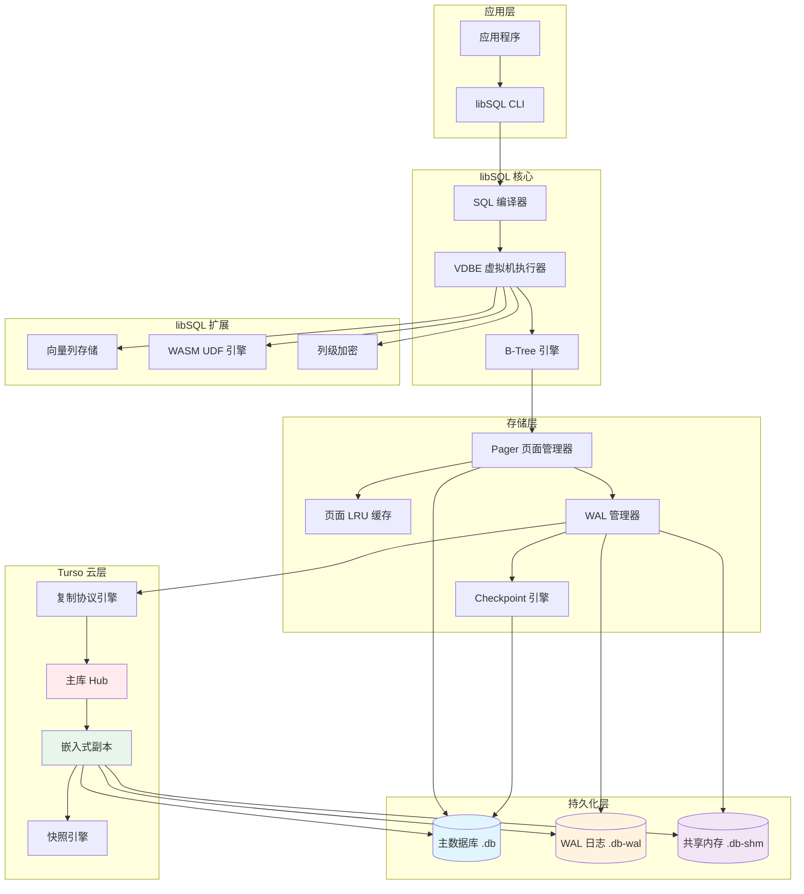

# Turso 存储引擎

## 学习目标

1. 理解 Turso 基于 libSQL（SQLite 分支）的存储架构和设计理念
2. 掌握 Turso 的嵌入式副本存储机制和主从同步日志结构
3. 了解 libSQL 相对于上游 SQLite 在存储层面的关键扩展
4. 对比本项目的 PG 风格存储引擎，理解不同设计取舍

---

## 核心概念

### 1. 核心存储架构

Turso 使用 libSQL，而 libSQL 是 SQLite 的一个友好分支。其存储架构本质上是 **SQLite v3 页面存储引擎**，但在 SQLite 之上增加了分层架构：

```
┌─────────────────────────────────────────────────────────────────────┐
│                         Turso 存储架构                               │
│                                                                     │
│  ┌────────────────────────────────────────────────────────────┐    │
│  │                     libSQL 应用层                             │    │
│  │  ┌──────────┐ ┌──────────┐ ┌──────────┐ ┌──────────────┐ │    │
│  │  │ SQL 编译器│ │ VDBE 执行│ │ 复制协议 │ │ 向量扩展     │ │    │
│  │  └────┬─────┘ └────┬─────┘ └────┬─────┘ └──────┬───────┘ │    │
│  └───────┼───────────┼─────────────┼───────────────┼─────────┘    │
│          │           │             │               │              │
│  ┌───────▼───────────▼─────────────▼───────────────▼─────────┐    │
│  │                     libSQL 核心层                            │    │
│  │  ┌──────────────────────────────────────────────────────┐  │    │
│  │  │              B-Tree 引擎（SQLite v3）                 │  │    │
│  │  │  ┌──────────────────────────────────────────────┐   │  │    │
│  │  │  │  Internal Page  │  Leaf Page  │  Freelist    │   │  │    │
│  │  │  └──────────────────────────────────────────────┘   │  │    │
│  │  └──────────────────────────────────────────────────────┘  │    │
│  │  ┌──────────────────────────────────────────────────────┐  │    │
│  │  │              Pager 页面管理器                          │  │    │
│  │  │  ┌──────┐ ┌──────┐ ┌────────┐ ┌──────────┐         │  │    │
│  │  │  │ LRU  │ │ 脏页  │ │ 预读   │ │ 写回队列 │         │  │    │
│  │  │  └──────┘ └──────┘ └────────┘ └──────────┘         │  │    │
│  │  └──────────────────────────────────────────────────────┘  │    │
│  │  ┌──────────────────────────────────────────────────────┐  │    │
│  │  │              WAL 管理器（Write-Ahead Log）             │  │    │
│  │  │  ┌────────┐ ┌────────┐ ┌────────┐ ┌──────────────┐  │  │    │
│  │  │  │ 帧追加 │ │ 索引   │ │ 提交   │ │ Checkpoint   │  │  │    │
│  │  │  └────────┘ └────────┘ └────────┘ └──────────────┘  │  │    │
│  │  └──────────────────────────────────────────────────────┘  │    │
│  │  ┌──────────────────────────────────────────────────────┐  │    │
│  │  │              VFS 虚拟文件系统层                        │  │    │
│  │  │  ┌─────────┐ ┌─────────┐ ┌─────────┐ ┌──────────┐  │  │    │
│  │  │  │ unix    │ │ win32   │ │ mem     │ │ 加密     │  │  │    │
│  │  │  └─────────┘ └─────────┘ └─────────┘ └──────────┘  │  │    │
│  │  └──────────────────────────────────────────────────────┘  │    │
│  └─────────────────────────────────────────────────────────────┘    │
│                                                                     │
│  ┌────────────────────────────────────────────────────────────┐    │
│  │                     Turso 云层                                │    │
│  │  ┌──────────────┐ ┌──────────────┐ ┌──────────────────┐    │    │
│  │  │ 主库 (Hub)   │ │ 副本集群     │ │ 复制日志存储     │    │    │
│  │  └──────────────┘ └──────────────┘ └──────────────────┘    │    │
│  └─────────────────────────────────────────────────────────────┘    │
│                                                                     │
└─────────────────────────────────────────────────────────────────────┘
```

#### 页面结构（Page）

SQLite 将数据库文件划分为固定大小的页面，默认 4096 字节（可配）。页面类型包括：

| 页面类型 | 说明 |
|---------|------|
| **Lock-byte 页** | 预留的锁定页，防止 NFS 锁问题 |
| **Freelist 页** | 空闲页面链表，重用已释放的空间 |
| **B-Tree 表页** | 存储表的 B-Tree 节点（内部页 + 叶子页） |
| **B-Tree 索引页** | 存储索引的 B-Tree 节点 |
| **Payload 溢出页** | 当单行数据超过页面大小时，超出的数据链式存储 |
| **Pointer Map 页** | 增量 VACUUM 时跟踪页面引用 |
| **WAL 页** | WAL 模式下的日志页面 |

#### B-Tree 存储

SQLite 使用 **B+Tree** 的变体，称为 "Table B-Tree"：

```
┌─────────────────────────────────────────────────────────────────────┐
│                         B-Tree 结构                                  │
│                                                                     │
│                   Internal Page                                     │
│  ┌──────┬──────┬──────┬──────┬──────┬──────┐                      │
│  │ Key1 │ Ptr1 │ Key2 │ Ptr2 │ ...  │ PtrN │                      │
│  └──────┴──────┴──────┴──────┴──────┴──────┘                      │
│         │              │                                            │
│         ▼              ▼                                            │
│  ┌──────────┐   ┌──────────┐                                       │
│  │ Leaf Pg  │   │ Leaf Pg  │  ← 叶子页包含实际数据                   │
│  │ RowID=1  │   │ RowID=5  │                                       │
│  │ RowID=2  │   │ RowID=6  │                                       │
│  │ RowID=3  │   │ RowID=7  │                                       │
│  └──────────┘   └──────────┘                                       │
│                                                                     │
│  叶子页中的行以 RowID 升序排列                                       │
│  每个叶子页构成一个有序数组，内部页做二分查找导航                       │
└─────────────────────────────────────────────────────────────────────┘
```

**关键区别**：SQLite 的 B-Tree 不是传统的 B+Tree——内部页同时存储键和指针，叶子页存储完整行数据（RowID + 剩余列）。内部页的键是 RowID 的最小值。

#### 行存储格式

每一行在叶子页中以 **Record** 格式存储：

```
┌─────────┬─────────┬──────────┬──────────┬──────────┐
│ 类型描述符 │ RowID   │ 列1数据  │ 列2数据  │ 列N数据  │
│ (varint) │ (varint) │ (变长)   │ (变长)   │ (变长)   │
└─────────┴─────────┴──────────┴──────────┴──────────┘
```

类型描述符使用 **varint** 编码，指示每列的数据类型（NULL、INTEGER、REAL、TEXT、BLOB）和长度。这种自描述格式使得 SQLite 的 **manifest typing**（清单类型系统）成为可能——每列的值类型可以独立于表定义。

### 2. 嵌入式副本的存储机制

Turso 的核心创新之一是 **嵌入式副本（Embedded Replica）** 机制，让应用在本地嵌入一个只读的 libSQL 副本。

#### 2.1 副本架构

```
┌─────────────────────────────────────────────────────────────────────┐
│                     嵌入式副本架构                                   │
│                                                                     │
│  主库 (Hub)                                                         │
│  ┌──────────────────────────────────────────────────────┐          │
│  │  libSQL 引擎（读写）                                    │          │
│  │  ┌────────────┐ ┌────────────┐ ┌────────────┐      │          │
│  │  │ 数据库文件  │ │   WAL     │ │  复制状态  │      │          │
│  │  └────────────┘ └────────────┘ └────────────┘      │          │
│  └──────────────────────┬───────────────────────────────┘          │
│                         │                                          │
│                    ┌────▼────┐                                     │
│                    │ 复制协议 │  ← WebSocket 流式传输 WAL 帧         │
│                    └────┬────┘                                     │
│                         │                                          │
│  ┌──────────────────────▼───────────────────────────────┐          │
│  │  嵌入式副本 (Embedded Replica)                          │          │
│  │  ┌──────────────────────────────────────────────────┐│          │
│  │  │  libSQL 引擎（只读）                                ││          │
│  │  │  ┌────────────┐ ┌────────────┐ ┌────────────┐   ││          │
│  │  │  │ 数据库文件  │ │   WAL     │ │ 快照版本   │   ││          │
│  │  │  └────────────┘ └────────────┘ └────────────┘   ││          │
│  │  └──────────────────────────────────────────────────┘│          │
│  │                                                      │          │
│  │  本地文件系统:                                        │          │
│  │  ├── replica.db          # 主数据库文件                │          │
│  │  ├── replica.db-wal      # WAL 日志（本地同步）       │          │
│  │  └── replica.db-shm      # 共享内存（WAL 索引）       │          │
│  └──────────────────────────────────────────────────────┘          │
│                                                                     │
└─────────────────────────────────────────────────────────────────────┘
```

#### 2.2 副本同步流程

```
┌─────────────────────────────────────────────────────────────────────┐
│                       副本同步流程                                    │
│                                                                     │
│  主库:                                                              │
│  ┌──────────────────────────────────────┐                           │
│  │  1. 事务提交 → 写入 WAL              │                           │
│  │  2. 将 WAL 帧通过 WebSocket 推送      │                           │
│  │  3. 记录副本的 LSN（最后同步位置）    │                           │
│  └──────────────┬───────────────────────┘                           │
│                 │                                                   │
│                 ▼                                                   │
│  ┌──────────────────────────────────────┐                           │
│  │  复制协议: libSQL 的帧级复制           │                           │
│  │  ┌────────────────────────────────┐  │                           │
│  │  │ FrameHeader: {                   │  │                           │
│  │  │   page_no: uint32,              │  │                           │
│  │  │   page_data: [byte; 4096],      │  │                           │
│  │  │   seq_no: uint64,               │  │                           │
│  │  │   checksum: uint64              │  │                           │
│  │  │ }                                │  │                           │
│  │  └────────────────────────────────┘  │                           │
│  └──────────────┬───────────────────────┘                           │
│                 │                                                   │
│                 ▼                                                   │
│  副本:                                                              │
│  ┌──────────────────────────────────────┐                           │
│  │  1. 接收 WAL 帧                      │                           │
│  │  2. 追加到本地 WAL 文件              │                           │
│  │  3. 更新 WAL 索引（.db-shm）        │                           │
│  │  4. 可选: 执行 checkpoint 合并到主库  │                           │
│  │  5. 返回 ACK 给主库                  │                           │
│  └──────────────────────────────────────┘                           │
│                                                                     │
└─────────────────────────────────────────────────────────────────────┘
```

#### 2.3 副本快照

副本支持 **快照（Snapshot）** 机制，可以在任意时间点冻结副本状态：

```sql
-- 创建副本快照
CREATE SNAPSHOT snapshot_name FOR DATABASE;

-- 恢复到快照
RESTORE DATABASE FROM SNAPSHOT snapshot_name;
```

快照的实现方式：

```
┌─────────────────────────────────────────────────────────────────────┐
│                      快照存储                                        │
│                                                                     │
│  快照目录:                                                          │
│  snapshots/                                                         │
│  ├── 2026-07-21_120000/                                             │
│  │   ├── snapshot.db              # 数据库文件副本                   │
│  │   ├── snapshot.db-wal          # 对应的 WAL                      │
│  │   └── metadata.json            # 快照元数据                      │
│  ├── 2026-07-21_130000/                                             │
│  └── ...                                                            │
│                                                                     │
│  元数据内容:                                                         │
│  {                                                                  │
│      "version": 1,                                                  │
│      "created_at": "2026-07-21T12:00:00Z",                          │
│      "page_count": 1024,                                            │
│      "wal_pages": 128,                                              │
│      "checksum": "sha256:..."                                       │
│  }                                                                  │
└─────────────────────────────────────────────────────────────────────┘
```

### 3. 主从同步的日志结构

#### 3.1 WAL 帧格式

Turso 的复制基于 libSQL 的 WAL 帧，每个帧是一个完整的页面镜像：

```
┌─────────────────────────────────────────────────────────────────────┐
│                        WAL 帧格式                                    │
│                                                                     │
│  ┌──────────────┬──────────────────────────────────────────────┐   │
│  │ 字段          │ 说明                                         │   │
│  ├──────────────┼──────────────────────────────────────────────┤   │
│  │ page_no      │ 4 字节，目标页号                              │   │
│  │ page_data    │ 4096 字节（默认页面大小），完整页面数据        │   │
│  │ seq_no       │ 8 字节，序列号（单调递增）                    │   │
│  │ checksum     │ 8 字节，帧校验和                              │   │
│  │ commit_flag  │ 1 字节，是否是提交记录                        │   │
│  └──────────────┴──────────────────────────────────────────────┘   │
│                                                                     │
│  WAL 文件布局:                                                      │
│  ┌──────────┬──────────┬──────────┬──────────┬──────────┐         │
│  │ Frame 1  │ Frame 2  │ Frame 3  │ ...     │ Frame N  │         │
│  │ (page 5) │ (page 8) │ (page 5) │         │ (commit) │         │
│  └──────────┴──────────┴──────────┴──────────┴──────────┘         │
│                                                                     │
│  注意: 同一页号可以多次出现（WAL 中只保留最新版本用于读操作）         │
└─────────────────────────────────────────────────────────────────────┘
```

#### 3.2 复制日志结构

Turso 的复制日志是在 WAL 之上构建的 **增量日志流**：

```
┌─────────────────────────────────────────────────────────────────────┐
│                       复制日志结构                                    │
│                                                                     │
│  Log Sequence:                                                      │
│  ┌───────┬───────┬───────┬───────┬───────┬───────┬───────┐         │
│  │ LSN 1 │ LSN 2 │ LSN 3 │ LSN 4 │ LSN 5 │ LSN 6 │ ...   │         │
│  │ Frame │ Frame │ Frame │ Frame │ Frame │ Frame │       │         │
│  └───┬───┴───┬───┴───┬───┴───┬───┴───┬───┴───┬───┴───┘         │
│      │       │       │       │       │       │                     │
│      ▼       ▼       ▼       ▼       ▼       ▼                     │
│  ┌─────────────────────────────────────────────────────────────┐   │
│  │  每个帧包含: 页号 + 页面数据 + 校验和 + 提交标记              │   │
│  │  副本通过 LSN 追踪同步进度（类似 PostgreSQL 的 LSN）          │   │
│  └─────────────────────────────────────────────────────────────┘   │
│                                                                     │
│  同步状态:                                                          │
│  ┌─────────────────────────────────────────────────────────────┐   │
│  │  主库: LSN = 10000（最新写入位置）                            │   │
│  │  副本 A: LSN = 9800（落后 200 帧）                            │   │
│  │  副本 B: LSN = 10000（完全同步）                              │   │
│  └─────────────────────────────────────────────────────────────┘   │
│                                                                     │
└─────────────────────────────────────────────────────────────────────┘
```

#### 3.3 同步策略

Turso 支持三种同步策略：

| 策略 | 行为 | 延迟 | 一致性 |
|------|------|------|--------|
| **FULL** | 主库等待所有副本确认后才返回提交成功 | 高 | 强一致性 |
| **NONE** | 主库不等待副本确认，立即返回 | 低 | 最终一致性 |
| **QUORUM** | 主库等待多数副本确认后返回 | 中 | 多数一致性 |

#### 3.4 Checkpoint 机制

当 WAL 文件增长到一定阈值（默认 1000 页），触发 checkpoint：

```
Checkpoint 模式:
  ┌─ PASSIVE: 不阻塞读写，尽量合并 ──┐
  ├─ FULL:    阻塞所有写入，完全合并 ──┤
  ├─ RESTART: 合并后重置 WAL 为空   ──┤
  └─ TRUNCATE: 合并后截断 WAL 文件  ──┘
```

Turso 的边缘副本使用 **RESTART** 模式 checkpoint，确保副本数据库的 WAL 保持较小尺寸。

### 4. libSQL 扩展（超越 SQLite）

Turso 的 libSQL 在 SQLite 基础上添加了若干关键扩展：

#### 存储层面扩展

| 扩展 | 说明 |
|------|------|
| **WASM 用户定义函数** | 存储可执行的 WASM 模块作为 UDF |
| **向量列支持** | 新增 `F32_BLOB` / `F64_BLOB` 列类型，支持向量相似度索引 |
| **复制协议** | 基于 WAL 的增量复制，支持边缘节点同步 |
| **列级加密** | 对特定列进行加密存储（SQLite 仅支持全库加密） |
| **嵌入式副本** | 本地只读副本，通过 WebSocket 接收 WAL 帧同步 |

#### 复制架构

```
┌──────────────┐         ┌───────────────┐         ┌───────────────┐
│  主库 (Hub)  │         │ 副本 1 (边缘)  │         │ 副本 2 (边缘)  │
│  写入 WAL    │────────▶│ 拉取 WAL 帧   │         │ 拉取 WAL 帧   │
│              │         │ 重放页面      │         │ 重放页面      │
└──────────────┘         └───────────────┘         └───────────────┘
        │                       │                         │
        │               ┌───────┴───────┐         ┌───────┴───────┐
        │               │ 本地 libSQL    │         │ 本地 libSQL    │
        │               │ 只读查询       │         │ 只读查询       │
        │               └───────────────┘         └───────────────┘
        │
  ┌─────▼─────┐
  │ 磁盘存储   │
  │ (主 WAL)  │
  └───────────┘
```

---

## 读写路径

### 读路径

```
┌─────────┐
│  SQL 查询 │
└────┬────┘
     │
     ▼
┌────────────────┐
│  SQL 编译器    │  ← 解析 → 优化 → 生成 VDBE 字节码
│  (sqlite3_prep)│
└──────┬─────────┘
       │
       ▼
┌────────────────┐
│  VDBE 执行器    │  ← 逐条执行字节码指令
│  (虚拟机)       │
└──────┬─────────┘
       │
       ▼
┌────────────────┐
│  B-Tree 层      │  ← 在 B-Tree 中查找指定 RowID 或键
└──────┬─────────┘
       │
       ▼
┌────────────────┐
│  Pager 层       │  ← 检查缓存 → 未命中则从磁盘读
└──────┬─────────┘
       │
       ▼
┌────────────────┐
│  OS 接口层      │  ← read() 系统调用
│  (VFS)         │
└────────────────┘
```

关键点：
- **Pager 层**是缓存核心，维护页面 LRU 缓存
- WAL 模式下，Pager 先检查 WAL 索引再读主数据库
- VDBE 是 SQLite 特有的**虚拟机**设计，类似数据库的 JIT
- 在嵌入式副本上，读路径完全在本地完成，无需网络开销

### 写路径

```
┌─────────┐
│  INSERT   │
└────┬────┘
     │
     ▼
┌────────────────┐
│  VDBE 执行器    │  ← Opcode: OpenWrite → Insert → ResultRow
└──────┬─────────┘
       │
       ▼
┌────────────────┐
│  B-Tree 层      │  ← 在叶子页中找到插入位置
└──────┬─────────┘
       │
       ▼
┌────────────────┐
│  Pager 层       │  ← 获取页面 → 标记脏页
└──────┬─────────┘
       │
       ▼
┌────────────────┐
│  WAL 写入       │  ← 追加写 WAL 帧（顺序 IO）
└──────┬─────────┘
       │
       ▼
┌────────────────┐
│  COMMIT        │  ← fsync WAL → 标记提交记录
└──────┬─────────┘
       │
       ▼
┌────────────────┐
│  复制推送       │  ← 将 WAL 帧推送到所有订阅副本
│  (Replica Push)│
└────────────────┘
```

写路径的核心优化：
- **追加写 WAL**：将随机写转化为顺序写，大幅提升写入性能
- **组提交**：多个事务可以合并一次 fsync
- **延迟 checkpoint**：WAL 积累到阈值才合并回主数据库
- **复制写穿**：写入主库的同时，WAL 帧流式推送到副本

---

## 与项目 storage/ 模块的对比

| 维度 | Turso / libSQL (SQLite) | 本项目 PG 风格引擎 |
|------|------------------------|-------------------|
| **存储格式** | 单文件 B-Tree 页面 | 多文件：数据文件 + WAL + 目录文件 |
| **页面大小** | 固定 4KB（可配） | 固定 8KB |
| **页面管理** | Freelist 链表 | Clock-Sweep Buffer Pool |
| **索引结构** | B-Tree（表 + 索引共用） | Heap + BTree AM 分离 |
| **事务** | WAL 或 Rollback Journal | WAL + CLOG + 2PC |
| **并发控制** | 文件级锁 / WAL 模式共享读 | MVCC + 行级锁 |
| **写入方式** | 追加写 WAL + 批量 checkpoint | WAL + Buffer Pool 脏页刷盘 |
| **缓存** | Pager 层页面缓存 | Buffer Pool (bufmgr.c) |
| **复制** | WAL 帧流式复制（WebSocket） | 基于 WAL 的物理复制 |
| **副本类型** | 嵌入式只读副本 | 独立副本进程 |
| **扩展性** | 嵌入式，单节点写 + 多节点读 | 可分布式，支持分片 |
| **同步粒度** | 页面级（WAL 帧） | 页面级（WAL 记录） |

### 设计哲学差异

| 本项目 (PG 风格) | Turso (libSQL 风格) |
|-----------------|-------------------|
| 服务端-客户端架构 | 嵌入式库 + 云服务 |
| 重型：进程模型 + 共享内存 | 轻量：进程内库 |
| MVCC 行版本管理 | WAL 页面级版本 |
| Buffer Pool 统一管理缓存 | Pager 层 + 操作系统缓存 |
| 面向 OLTP + OLAP 混合 | 面向边缘计算 + OLTP |
| 主从复制基于独立进程 | 主从复制基于嵌入式库 |
| 支持复杂查询优化 | 轻量级优化器 |

---

## Mermaid 图：存储架构全景



---

## 要点总结

1. **Turso = libSQL (SQLite fork) + 边缘副本网络**。存储核心是 SQLite 的 B-Tree 页面引擎
2. **B-Tree 存储**：混合型 B-Tree，内部页存键+指针，叶子页存完整行，RowID 为排序键
3. **行格式**：自描述的 Record 格式（varint 类型描述符 + 变长数据），天然支持 manifest typing
4. **WAL 模式**：默认使用 Write-Ahead Log，追加写提升性能，支持并发读
5. **Pager 层**：页面缓存 + WAL 索引协调，是读写路径的核心枢纽
6. **嵌入式副本**：Turso 核心创新，应用本地嵌入只读 libSQL 副本，通过 WebSocket 接收 WAL 帧同步
7. **复制协议**：基于 WAL 帧的增量复制，帧结构包含页号、页面数据、校验和、序列号
8. **同步策略**：FULL（强一致性）/ NONE（最终一致性）/ QUORUM（多数一致性）三种
9. **libSQL 扩展**：向量列、WASM UDF、复制协议、列级加密、嵌入式副本，超越上游 SQLite
10. **与 PG 风格对比**：嵌入式 vs 服务端、单文件 vs 多文件、页面级版本 vs MVCC

---

## 思考题

1. **设计取舍**：SQLite 选择 B-Tree（非 B+Tree）作为存储结构，叶子页直接存完整行而非仅键。这种设计对边缘计算场景有什么影响？

2. **WAL 与 MVCC**：Turso 使用 WAL 页面级版本控制，而 PG 使用 MVCC 行级版本控制。在边缘副本场景下，WAL 的复制粒度是否比 MVCC 更合适？为什么？

3. **嵌入式副本的一致性**：Turso 的嵌入式副本通过 WebSocket 流式同步 WAL 帧。如果网络中断，副本恢复后如何保证与主库的数据一致性？对比本项目的 WAL 复制机制，有哪些异同？

4. **同步策略选择**：FULL 同步保证强一致性但延迟高，NONE 同步延迟低但可能丢失数据。在边缘场景中，如何根据业务需求选择合适的同步策略？有没有折中方案？

5. **快照与恢复**：Turso 支持数据库快照（RESTORE DATABASE FROM SNAPSHOT）。对比本项目的 pg_dump/物理备份，嵌入式场景的快照恢复有什么独特挑战？