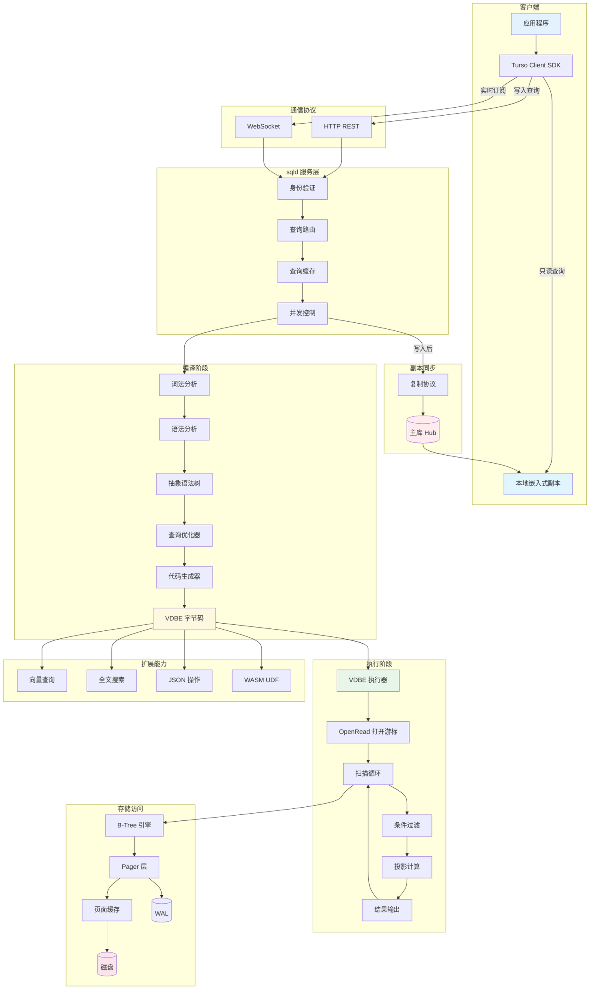

# Turso 查询引擎

## 学习目标

1. 理解 Turso 基于 VDBE 虚拟机的查询执行架构
2. 掌握 sqld HTTP + WebSocket 协议的执行流程
3. 了解嵌入式查询 vs 远程查询的差异和协调机制
4. 对比本项目的 algo/ 模块，探讨算法复用可能性

---

## 核心概念

### 1. 查询执行架构全景

Turso 的查询引擎分为 **嵌入式查询引擎**（本地 libSQL 库）和 **远程查询引擎**（sqld 服务层）：

```
┌─────────────────────────────────────────────────────────────────────┐
│                     Turso 查询执行架构                                │
│                                                                     │
│  ┌────────────────────────────────────────────────────────────┐    │
│  │                    应用层                                     │    │
│  │  ┌──────────┐ ┌──────────┐ ┌──────────┐ ┌──────────────┐  │    │
│  │  │ libSQL   │ │ HTTP     │ │ WebSocket│ │ Turso Client │  │    │
│  │  │ C API    │ │ Client   │ │ Client   │ │ SDK          │  │    │
│  │  └────┬─────┘ └────┬─────┘ └────┬─────┘ └──────┬───────┘  │    │
│  └───────┼────────────┼────────────┼───────────────┼──────────┘    │
│          │            │            │               │              │
│  ┌───────▼────────────▼────────────▼───────────────▼──────────┐    │
│  │                    查询路由层                                  │    │
│  │                                                                 │    │
│  │  ┌─────────────────────┐       ┌──────────────────────────┐   │    │
│  │  │ 本地执行器           │       │ 远程执行器                │   │    │
│  │  │ (嵌入式副本)         │◄─────►│ (sqld 服务)              │   │    │
│  │  └──────────┬──────────┘       └───────────┬──────────────┘   │    │
│  └─────────────┼──────────────────────────────┼──────────────────┘    │
│                │                              │                      │
│  ┌─────────────▼──────────────────────────────▼──────────────────┐    │
│  │                          执行引擎                                │    │
│  │                                                                 │    │
│  │  ┌──────────────────────────────────────────────────────────┐  │    │
│  │  │              VDBE 虚拟机（字节码解释器）                    │  │    │
│  │  │  ┌──────────┐ ┌──────────┐ ┌──────────┐ ┌────────────┐  │  │    │
│  │  │  │ 字节码    │ │ 寄存器   │ │ 游标     │ │ 程序计数器  │  │  │    │
│  │  │  │ 程序区   │ │ 栈区     │ │ 管理     │ │            │  │  │    │
│  │  │  └──────────┘ └──────────┘ └──────────┘ └────────────┘  │  │    │
│  │  └──────────────────────────────────────────────────────────┘  │    │
│  │                                                                 │    │
│  │  ┌──────────────────────────────────────────────────────────┐  │    │
│  │  │                libSQL 扩展执行器                            │  │    │
│  │  │  ┌──────────┐ ┌──────────┐ ┌──────────┐ ┌────────────┐  │  │    │
│  │  │  │ 向量查询  │ │ 全文搜索 │ │ JSON操作 │ │ WASM UDF   │  │  │    │
│  │  │  └──────────┘ └──────────┘ └──────────┘ └────────────┘  │  │    │
│  │  └──────────────────────────────────────────────────────────┘  │    │
│  └─────────────────────────────────────────────────────────────────┘    │
│                                                                         │
│  ┌─────────────────────────────────────────────────────────────────┐    │
│  │                     sqld 服务层（远程）                            │    │
│  │                                                                     │    │
│  │  ┌──────────────────────────────────────────────────────────┐  │    │
│  │  │                HTTP / WebSocket 协议层                     │  │    │
│  │  │  ┌──────────┐ ┌──────────┐ ┌──────────┐ ┌────────────┐  │  │    │
│  │  │  │ 请求解析  │ │ 会话管理 │ │ 事务管理 │ │ 结果序列化 │  │  │    │
│  │  │  └──────────┘ └──────────┘ └──────────┘ └────────────┘  │  │    │
│  │  └──────────────────────────────────────────────────────────┘  │    │
│  │  ┌──────────────────────────────────────────────────────────┐  │    │
│  │  │               查询处理层                                    │  │    │
│  │  │  ┌──────────┐ ┌──────────┐ ┌──────────┐ ┌────────────┐  │  │    │
│  │  │  │ 查询缓存  │ │ 并发控制 │ │ 副本协调 │ │ 负载均衡   │  │  │    │
│  │  │  └──────────┘ └──────────┘ └──────────┘ └────────────┘  │  │    │
│  │  └──────────────────────────────────────────────────────────┘  │    │
│  └─────────────────────────────────────────────────────────────────┘    │
│                                                                         │
└─────────────────────────────────────────────────────────────────────────┘
```

### 2. sqld HTTP + WebSocket 协议

Turso 的远程查询通过 **sqld** 服务暴露，支持 HTTP 和 WebSocket 两种协议。

#### 2.1 HTTP 协议

```http
POST /v1/query HTTP/1.1
Host: your-db.turso.io
Authorization: Bearer <token>
Content-Type: application/json

{
    "statements": [
        {"q": "SELECT * FROM users WHERE id = ?", "params": [1]},
        {"q": "INSERT INTO logs (msg) VALUES (?)", "params": ["login"]}
    ]
}
```

响应格式：

```json
{
    "results": [
        {
            "type": "ok",
            "response": {
                "cols": ["id", "name", "email"],
                "rows": [
                    [1, "Alice", "alice@example.com"],
                    [2, "Bob", "bob@example.com"]
                ]
            },
            "execution_time_ms": 0.5
        },
        {
            "type": "ok",
            "response": {
                "affected_row_count": 1,
                "last_insert_rowid": 42
            },
            "execution_time_ms": 0.3
        }
    ]
}
```

#### 2.2 WebSocket 协议

WebSocket 协议用于需要实时更新的场景（如订阅数据库变更）：

```
┌─────────────────────────────────────────────────────────────────────┐
│                    WebSocket 查询流程                                 │
│                                                                     │
│  客户端                              sqld 服务                       │
│    │                                    │                           │
│    │──── WebSocket 握手 ──────────────► │                           │
│    │◄──── 101 Switching Protocols ──────┤                           │
│    │                                    │                           │
│    │──── JSON 查询请求 ───────────────► │                           │
│    │    {                               │                           │
│    │      "type": "request",            │                           │
│    │      "request_id": "1",           │                           │
│    │      "statements": [{"q": "..."}]  │                           │
│    │    }                               │                           │
│    │                                    │                           │
│    │    [VDBE 执行查询 ...]              │                           │
│    │                                    │                           │
│    │◄──── JSON 查询结果 ────────────────┤                           │
│    │    {                               │                           │
│    │      "type": "response",           │                           │
│    │      "request_id": "1",           │                           │
│    │      "result": {...}               │                           │
│    │    }                               │                           │
│    │                                    │                           │
│    │──── 订阅变更请求 ────────────────► │                           │
│    │    {                               │                           │
│    │      "type": "subscribe",          │                           │
│    │      "table": "users"              │                           │
│    │    }                               │                           │
│    │                                    │                           │
│    │    [其他客户端写入 users 表]        │                           │
│    │                                    │                           │
│    │◄──── 变更通知 ─────────────────────┤                           │
│    │    {                               │                           │
│    │      "type": "change",             │                           │
│    │      "table": "users",             │                           │
│    │      "row_count": 1                │                           │
│    │    }                               │                           │
│    │                                    │                           │
│    │──── 关闭连接 ────────────────────► │                           │
│    │◄──── 关闭确认 ─────────────────────┤                           │
│    │                                    │                           │
└─────────────────────────────────────────────────────────────────────┘
```

#### 2.3 协议对比

| 维度 | HTTP | WebSocket |
|------|------|-----------|
| **连接方式** | 短连接（每次请求新建） | 长连接（持久化） |
| **适用场景** | 一次性查询、批量操作 | 实时订阅、流式查询 |
| **性能** | 请求级开销（TLS 握手等） | 连接级开销，后续请求轻量 |
| **变更订阅** | 不支持 | 支持表级变更通知 |
| **事务** | 支持单次请求多语句事务 | 支持跨请求事务 |
| **结果格式** | JSON | JSON（可扩展其他格式） |

### 3. 嵌入式查询 vs 远程查询

#### 3.1 查询路由

Turso 的客户端 SDK 根据查询类型自动路由到本地或远程执行器：

```
┌─────────────────────────────────────────────────────────────────────┐
│                      查询路由决策流程                                 │
│                                                                     │
│  客户端发起查询:                                                     │
│  ┌──────────────────────────────────────────────┐                   │
│  │  SELECT * FROM users WHERE id = 1             │                   │
│  └──────────────────┬───────────────────────────┘                   │
│                     │                                                │
│                     ▼                                                │
│  ┌──────────────────────────────────────────────┐                   │
│  │  查询类型识别:                                  │                   │
│  │  ├── 只读查询 (SELECT) → 检查本地副本是否可用   │                   │
│  │  └── 写入查询 (INSERT/UPDATE/DELETE) → 路由到主库│                   │
│  └──────────────────┬───────────────────────────┘                   │
│                     │                                                │
│                     ▼                                                │
│  ┌──────────────────────────────────────────────┐                   │
│  │  本地副本可用?                                  │                   │
│  │  ├── 是 → 本地执行（零网络延迟）                 │                   │
│  │  └── 否 → 远程执行（HTTP/WebSocket 到主库）     │                   │
│  └──────────────────┬───────────────────────────┘                   │
│                     │                                                │
│        ┌────────────┴────────────┐                                  │
│        ▼                        ▼                                   │
│  ┌──────────────┐     ┌──────────────────┐                          │
│  │  本地执行器    │     │   远程执行器       │                          │
│  │  (嵌入式副本)  │     │   (sqld 服务)     │                          │
│  └──────────────┘     └──────────────────┘                          │
│                                                                     │
└─────────────────────────────────────────────────────────────────────┘
```

#### 3.2 嵌入式查询执行

嵌入式副本执行只读查询的流程：

```
┌─────────────────────────────────────────────────────────────────────┐
│                   嵌入式副本执行流程                                  │
│                                                                     │
│  1. 检查本地副本是否是最新版本                                       │
│     - 检查本地 LSN 与主库是否一致                                    │
│     - 如不一致，先同步落后 WAL 帧后再执行                            │
│                                                                     │
│  2. 在本地 libSQL 引擎上执行查询                                     │
│     - 本地 B-Tree 扫描 (无网络开销)                                 │
│     - 使用本地 Pager 缓存                                            │
│     - 返回结果给应用                                                │
│                                                                     │
│  3. 如果本地副本不可用或版本过旧:                                    │
│     - 回退到远程查询                                                │
│     - 通过 HTTP 请求 sqld 服务                                      │
│                                                                     │
└─────────────────────────────────────────────────────────────────────┘
```

#### 3.3 远程查询执行

远程查询通过 sqld 服务执行：

```
┌─────────────────────────────────────────────────────────────────────┐
│                   远程查询执行流程                                    │
│                                                                     │
│  客户端:                                                            │
│  ┌──────────────────────────────────────────────────────┐          │
│  │  1. 序列化查询为 JSON                              │          │
│  │  2. 通过 HTTP POST 或 WebSocket 发送到 sqld         │          │
│  │  3. 等待响应                                        │          │
│  └──────────────────────┬───────────────────────────────┘          │
│                         │                                          │
│                         ▼                                          │
│  sqld 服务:                                                        │
│  ┌──────────────────────────────────────────────────────┐          │
│  │  1. 解析请求 JSON                                  │          │
│  │  2. 身份验证和权限检查                              │          │
│  │  3. 查询缓存命中?                                   │          │
│  │     ├── 是 → 直接返回缓存结果                        │          │
│  │     └── 否 → 继续执行                              │          │
│  │  4. 在 libSQL 引擎上执行查询                        │          │
│  │  5. 如果是写入查询，触发 WAL 复制到副本              │          │
│  │  6. 序列化结果为 JSON                               │          │
│  │  7. 返回响应                                        │          │
│  └──────────────────────────────────────────────────────┘          │
│                                                                     │
└─────────────────────────────────────────────────────────────────────┘
```

#### 3.4 执行模式对比

| 维度 | 嵌入式查询 | 远程查询 |
|------|-----------|---------|
| **延迟** | 微秒级（本地执行） | 毫秒级（网络开销） |
| **一致性** | 最终一致性（可能读到旧数据） | 强一致性（直接读主库） |
| **可用性** | 离线可用（本地副本） | 需网络连接 |
| **写入能力** | 不可写（只读副本） | 可写（主库） |
| **数据延迟** | 受复制延迟影响 | 实时 |
| **资源消耗** | 本地磁盘 + 内存 | 网络带宽 |
| **适用场景** | 高频读、离线场景 | 写操作、一致性要求高 |

### 4. 查询编译与执行

#### 4.1 VDBE 虚拟机架构

VDBE（Virtual Database Engine）是 libSQL 的核心执行引擎，采用**字节码虚拟机**模式：

```
┌─────────────────────────────────────────────────────────────────────┐
│                    VDBE 虚拟机                                       │
│                                                                     │
│  ┌─────────────────────────────────────────────────────────────┐   │
│  │                   字节码程序区                                  │   │
│  │   Opcode │ P1 │ P2 │ P3 │ P4 │ P5 │ ...                     │   │
│  │   ───────┼────┼────┼────┼────┼────┼                          │   │
│  │   OpenRead │ 0  │ 1  │ 0  │    │    │  打开游标             │   │
│  │   Rewind   │ 0  │ 10 │    │    │    │  定位到开始           │   │
│  │   Column   │ 0  │ 0  │ 1  │    │    │  读取列 0             │   │
│  │   ...      │    │    │    │    │    │                       │   │
│  └─────────────────────────────────────────────────────────────┘   │
│                                                                     │
│  ┌─────────────────────────────────────────────────────────────┐   │
│  │                   寄存器/栈区                                  │   │
│  │   R[0]  R[1]  R[2]  R[3]  ...  (存储中间结果)                │   │
│  └─────────────────────────────────────────────────────────────┘   │
│                                                                     │
│  ┌─────────────────────────────────────────────────────────────┐   │
│  │                   游标管理                                     │   │
│  │   Cursor[0]: 表扫描游标                                        │   │
│  │   Cursor[1]: 索引扫描游标                                      │   │
│  │   Cursor[N]: 子查询游标                                        │   │
│  └─────────────────────────────────────────────────────────────┘   │
│                                                                     │
│  ┌─────────────────────────────────────────────────────────────┐   │
│  │                   执行状态                                     │   │
│  │   PC: 程序计数器                                              │   │
│  │   RC: 返回码                                                  │   │
│  │   NRes: 结果数量                                              │   │
│  └─────────────────────────────────────────────────────────────┘   │
│                                                                     │
└─────────────────────────────────────────────────────────────────────┘
```

#### 4.2 查询编译流程

```
┌──────────┐
│ SQL 文本  │
│ SELECT *  │
│ FROM users│
│ WHERE id>10│
└─────┬────┘
      │
      ▼
┌────────────────┐
│   词法分析器    │  → Token 流
│   (tokenizer)  │    [SELECT] [*] [FROM] [users] ...
└──────┬─────────┘
       │
       ▼
┌────────────────┐
│   语法分析器    │  → AST (抽象语法树)
│   (parser.y)   │
└──────┬─────────┘
       │
       ▼
┌────────────────┐
│   查询优化器    │  → 查询计划
│   (select.c)   │    - 表访问方式
│                │    - 索引选择
│                │    - 连接顺序
│                │    - 排序策略
└──────┬─────────┘
       │
       ▼
┌────────────────┐
│   代码生成器    │  → VDBE 字节码
│   (vdbeaux.c)  │    [OpenRead] [Rewind] [Column] ...
└──────┬─────────┘
       │
       ▼
┌────────────────┐
│   VDBE 执行器   │  → 结果集
│   (vdbe.c)     │
└────────────────┘
```

#### 4.3 执行示例分析

以简单查询 `SELECT name FROM users WHERE id > 10` 为例：

```sql
SELECT name FROM users WHERE id > 10
```

生成的 VDBE 字节码（简化版）：

```
指令编号  Opcode      P1   P2   P3   说明
────────────────────────────────────────────────────────────────
0        Init        0    12   0    初始化，跳转到指令 12（清理）
1        OpenRead    0    0    0    打开表 users，游标 0
2        Rewind      0    11   0    定位到开始，结束时跳转到 11
3        Column      0    0    1    读取列 0（id）到寄存器 R[1]
4        Le          2    10   1    如果 R[1] <= 10，跳转到指令 10
5        Column      0    1    2    读取列 1（name）到寄存器 R[2]
6        ResultRow   2    1    0    输出 R[2] 作为结果行
7        Next        0    3    0    移动到下一行，跳转到指令 3
8        Goto        0    7    0    无条件跳转到指令 7
9        Close       0    0    0    关闭游标 0
10       Halt        0    0    0    停止执行
11       Noop        0    0    0    （占位）
12       Goto        0    1    0    跳转到指令 1 开始执行
```

执行流程：
1. `Init` 初始化执行环境
2. `OpenRead` 打开 users 表
3. `Rewind` 定位到表开始
4. 循环：`Column` 读取 id → `Le` 条件判断 → `Column` 读取 name → `ResultRow` 输出 → `Next` 下一行
5. `Halt` 结束

### 5. libSQL 扩展查询操作

#### 5.1 向量相似度查询

libSQL 新增向量数据类型和相似度函数：

```sql
-- 创建带向量列的表
CREATE TABLE vectors (
    id INTEGER PRIMARY KEY,
    embedding F32_BLOB(1536)
);

-- 创建向量索引（HNSW 或 IVFFLAT）
CREATE INDEX vec_idx ON vectors(libsql_vector_idx(embedding));

-- 向量相似度查询
SELECT id, vector_distance_cos(embedding, '[0.1, 0.2, ...]')
FROM vectors
ORDER BY vector_distance_cos(embedding, '[0.1, 0.2, ...]')
LIMIT 10;
```

向量查询的 VDBE 扩展 Opcode：

| Opcode | 说明 |
|--------|------|
| `VectorDistance` | 计算向量距离（L2/Cosine/Inner Product） |
| `VectorIdxSearch` | 向量索引 ANN 搜索 |
| `VectorEncode` | 向量编码（量化） |

#### 5.2 全文搜索

libSQL 内置 FTS5 全文搜索引擎：

```sql
-- 创建全文索引
CREATE VIRTUAL TABLE docs_fts USING fts5(content);

-- 全文搜索
SELECT * FROM docs_fts WHERE docs_fts MATCH 'turso AND database' ORDER BY rank;

-- BM25 排序
SELECT bm25(docs_fts), * FROM docs_fts WHERE docs_fts MATCH 'query' ORDER BY bm25(docs_fts);
```

FTS5 的 VDBE 扩展：
- `Fts5Query`：全文查询入口
- `Fts5Tokenize`：分词器调用
- `Fts5Rank`：相关性排序

#### 5.3 JSON 操作

libSQL 支持 JSON 路径查询：

```sql
-- JSON 列查询
SELECT json_extract(data, '$.user.name') AS name
FROM events
WHERE json_extract(data, '$.event.type') = 'login';

-- JSON 数组操作
SELECT json_each.value
FROM events, json_each(data, '$.tags')
WHERE json_each.value LIKE '%urgent%';
```

JSON 的 VDBE 扩展：
- `JsonGet`：路径提取
- `JsonEach`：数组展开
- `JsonType`：类型判断

### 6. 与项目 algo/ 模块的关联

#### 6.1 可复用的算法

| 算法类别 | 本项目 algo/ | Turso 可借鉴 |
|---------|-------------|-------------|
| **排序** | `ds/sort/` (快排/归并/堆排序) | SorterInsert 使用类似归并 |
| **哈希** | `ds/hash/` (CCEH/Linear Hash) | Hash Join 可用 CCEH 优化 |
| **B-Tree** | `ds/tree/` (B+Tree/B-Tree) | 存储引擎可复用 |
| **向量索引** | `index/vector/` (HNSW/IVF/DiskANN) | libSQL 向量索引借鉴 HNSW |
| **距离计算** | `algo/distance/` (SIMD 优化) | 向量相似度查询优化 |
| **分词** | `algo/tokenizer/` | FTS5 可集成 |
| **字符串匹配** | `algo/string/` (KMP/BM) | 全文搜索模式匹配 |

#### 6.2 向量查询优化

本项目的 `index/vector/` 模块实现了多种向量索引：

```
index/vector/
├── hnsw/          # HNSW 图索引
├── ivf/           # IVF 倒排文件
├── diskann/       # DiskANN 磁盘索引
└── pq/            # Product Quantization 量化
```

如果 Turso 要增强向量查询能力，可以借鉴：

1. **HNSW 索引**：高召回率 + 低延迟的 ANN 搜索，适合 libSQL 的嵌入式场景
2. **PQ 量化**：压缩向量存储，降低内存占用，适合边缘设备
3. **DiskANN**：磁盘友好的向量索引，适合大规模数据
4. **SIMD 距离计算**：`algo/distance/` 中的 SSE/AVX 优化可以加速向量距离计算

#### 6.3 本项目可借鉴的设计

| 设计 | Turso | 本项目可学习 |
|------|-------|-------------|
| **VDBE 字节码** | 灵活、可扩展 | 考虑字节码执行引擎 |
| **虚拟表机制** | FTS5/Vector/JSON 扩展 | 插件式存储引擎 |
| **增量编译** | Prepared Statement 复用 | 缓存编译结果 |
| **沙箱隔离** | WASM UDF | 安全的用户定义函数 |
| **嵌入式副本** | 只读副本 + 本地执行 | 边缘计算模式 |
| **HTTP/WS 协议** | 统一的查询接口 | 数据库访问协议设计 |

---

## Mermaid 图：查询执行流程



---

## 要点总结

1. **双模执行**：Turso 支持嵌入式查询（本地只读副本）和远程查询（sqld 服务），根据查询类型自动路由
2. **VDBE 虚拟机**：libSQL 的核心执行引擎，使用字节码解释执行，约 180+ 种 Opcode
3. **HTTP 协议**：短连接，适合一次性查询和批量操作，响应格式为 JSON
4. **WebSocket 协议**：长连接，支持实时订阅和流式查询，可用于表级变更通知
5. **嵌入式查询**：零网络延迟，离线可用，但只能读（最终一致性）
6. **远程查询**：强一致性，可写，但依赖网络连接
7. **查询编译**：SQL → 词法分析 → 语法分析 → 优化器 → 代码生成 → VDBE 字节码
8. **扩展查询**：向量查询（HNSW/IVF）、全文搜索（FTS5）、JSON 操作
9. **与 algo/ 关联**：排序、哈希、B-Tree、向量索引、距离计算、分词等算法可复用
10. **sqld 服务层**：身份验证、查询路由、缓存、并发控制、副本协调

---

## 思考题

1. **执行模型对比**：VDBE 字节码执行 vs 本项目的火山模型（迭代器模型），各有什么优缺点？在边缘计算场景下哪种更合适？

2. **嵌入式副本的一致性**：嵌入式副本使用最终一致性，用户可能读到旧数据。如果要在项目中实现类似的嵌入式副本机制，如何处理本地缓存与主库的一致性问题？

3. **协议设计**：Turso 同时支持 HTTP 和 WebSocket 两种协议。如果要在项目中实现数据库的远程访问协议，应该参考哪种设计？能否将 HTTP 的简单性和 WebSocket 的实时性结合起来？

4. **向量索引集成**：如果要在 libSQL 中实现类似本项目 `index/vector/hnsw/` 的 HNSW 索引，需要扩展哪些 Opcode？如何与现有的 B-Tree 存储协调？

5. **查询缓存**：sqld 服务层实现了查询缓存。在嵌入式场景中，本地 libSQL 的 Pager 缓存和查询缓存是两层独立缓存，如何协调避免缓存一致性问题？