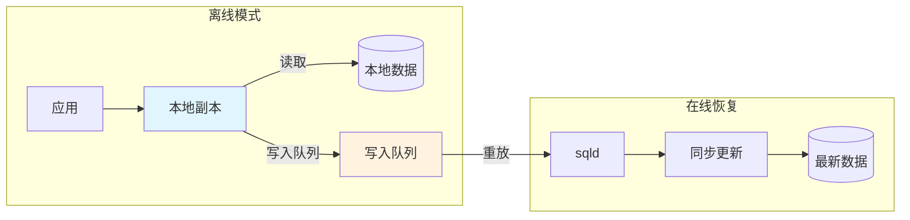
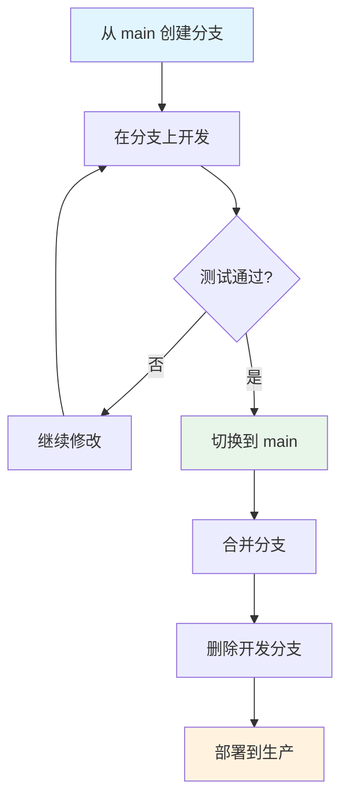

# Turso 核心特性

## 学习目标
- 掌握 libSQL 的扩展功能
- 理解嵌入式副本的工作机制
- 了解 HTTP 协议查询的优势
- 掌握分支系统的使用场景

## libSQL 扩展特性

### 1. 向量类型支持

```sql
-- 创建向量列
CREATE TABLE embeddings (
    id INTEGER PRIMARY KEY,
    content TEXT,
    embedding VECTOR(384)  -- 384 维向量
);

-- 插入向量数据
INSERT INTO embeddings (content, embedding)
VALUES ('hello world', vector('[0.1, 0.2, ..., 0.384]'));

-- 向量相似度搜索
SELECT 
    content,
    vector_distance(embedding, vector('[0.15, 0.25, ...]')) as distance
FROM embeddings
ORDER BY distance
LIMIT 10;
```

| 向量函数 | 说明 |
|----------|------|
| `vector()` | 创建向量值 |
| `vector_distance()` | 计算向量距离（余弦/欧氏） |
| `vector_extract()` | 提取向量元素 |
| `vector_dim()` | 获取向量维度 |

### 2. 增强 ALTER TABLE

```sql
-- 传统 SQLite 限制：不能重命名列
-- libSQL 支持：
ALTER TABLE users RENAME COLUMN name TO full_name;

-- 支持 DROP COLUMN
ALTER TABLE users DROP COLUMN deprecated_field;

-- 支持 ADD COLUMN with DEFAULT
ALTER TABLE users ADD COLUMN created_at TIMESTAMP DEFAULT CURRENT_TIMESTAMP;
```

### 3. JSON 模式验证

```sql
-- 创建带 JSON 模式的表
CREATE TABLE events (
    id INTEGER PRIMARY KEY,
    data JSON CHECK (
        json_valid(data) AND 
        json_extract(data, '$.type') IN ('click', 'view', 'purchase')
    )
);

-- JSON 路径查询
SELECT json_extract(data, '$.user.id') as user_id
FROM events
WHERE json_extract(data, '$.type') = 'purchase';
```

## 嵌入式副本特性

### 1. 离线优先架构



### 2. 同步配置

```javascript
import { createClient } from '@libsql/client';

// 嵌入式副本配置
const db = createClient({
  url: 'file:local.db',           // 本地文件
  syncUrl: 'libsql://db.turso.io', // 远程同步源
  authToken: 'xxx',
  syncInterval: 60  // 每 60 秒同步一次
});

// 手动同步
await db.sync();

// 检查同步状态
const status = await db.syncStatus();
console.log('当前帧号:', status.currentFrame);
console.log('已应用帧号:', status.appliedFrame);
```

### 3. 读写分离

```javascript
// 读取：本地副本直接返回（零延迟）
const users = await db.execute('SELECT * FROM users');

// 写入：转发到远程主库
await db.execute('INSERT INTO users (name) VALUES (?)', ['Alice']);

// 写入后自动同步到本地
await db.sync();
```

## HTTP 协议查询

### 1. 无驱动访问

```bash
# 传统 SQLite 需要驱动
# libSQL 通过 HTTP 协议访问

curl -X POST "https://db-xxx.turso.io/v2/pipeline" \
  -H "Authorization: Bearer $TURSO_AUTH_TOKEN" \
  -H "Content-Type: application/json" \
  -d '{
    "requests": [
      {
        "type": "execute",
        "stmt": {
          "sql": "SELECT * FROM users WHERE id = ?",
          "args": [{"type": "integer", "value": "1"}]
        }
      },
      {
        "type": "close"
      }
    ]
  }'
```

### 2. Pipeline 批量操作

```javascript
// 单次请求执行多条 SQL
const results = await db.batch([
  { sql: 'UPDATE users SET last_login = ? WHERE id = ?', args: [Date.now(), 1] },
  { sql: 'INSERT INTO login_history (user_id, timestamp) VALUES (?, ?)', args: [1, Date.now()] }
], { transaction: true });
```

### 3. WebSocket 实时订阅

```javascript
const ws = new WebSocket('wss://db.turso.io/ws?token=xxx');

// 订阅表变更
ws.send(JSON.stringify({
  type: 'subscribe',
  table: 'users',
  columns: ['id', 'name']
}));

// 接收变更通知
ws.onmessage = (event) => {
  const change = JSON.parse(event.data);
  // { type: 'insert', table: 'users', row: { id: 1, name: 'Alice' } }
  // { type: 'update', table: 'users', row: { id: 1, name: 'Bob' }, old: { id: 1, name: 'Alice' } }
  // { type: 'delete', table: 'users', old: { id: 1, name: 'Bob' } }
};
```

## 分支系统（Branching）

### 1. 分支操作流程

```bash
# 创建开发分支
turso db branch create mydb dev-feature

# 切换到开发分支
turso db branch switch mydb dev-feature

# 在开发分支上进行实验
turso db shell mydb
> CREATE TABLE test_table (id INTEGER);
> INSERT INTO test_table VALUES (1);

# 合并到主分支
turso db branch switch mydb main
turso db branch merge mydb dev-feature

# 删除开发分支
turso db branch delete mydb dev-feature
```

### 2. 分支隔离特性

| 特性 | 主分支 | 开发分支 |
|------|--------|----------|
| 数据隔离 | 生产数据 | 副本数据 |
| 写入影响 | 生产环境 | 隔离环境 |
| 合并 | 接收合并 | 合并到主 |
| 删除 | 不可删除 | 可删除 |

### 3. 典型工作流



## Serverless SDK 特性

### 1. 多语言支持

| 语言 | SDK 包 | 特性 |
|------|--------|------|
| JavaScript | `@libsql/client` | 边缘函数友好 |
| Rust | `libsql` | 原生异步支持 |
| Go | `github.com/libsql/go-libsql` | CGo 绑定 |
| Python | `libsql-client` | 异步 API |

### 2. 边缘函数优化

```javascript
// Cloudflare Worker 示例
import { createClient } from '@libsql/client/web';  // WebAssembly 版本

export default {
  async fetch(request, env) {
    const db = createClient({
      url: env.TURSO_URL,
      authToken: env.TURSO_AUTH_TOKEN
    });
    
    // 边缘节点就近访问
    const result = await db.execute('SELECT * FROM products LIMIT 10');
    
    return Response.json(result.rows);
  }
};
```

### 3. 连接池管理

```javascript
// SDK 自动管理连接池
const db = createClient({
  url: 'libsql://db.turso.io',
  authToken: 'xxx',
  // 连接池配置
  maxConns: 10,        // 最大连接数
  idleTimeout: 30000   // 空闲超时（毫秒）
});
```

## 安全特性

### 1. 认证机制

```bash
# 生成 Token
turso db tokens create mydb --expiration 7d

# 使用 Token
export TURSO_AUTH_TOKEN=xxx
turso db shell mydb
```

### 2. 数据库隔离

```bash
# 每个数据库独立 Token
turso db create production-db
turso db create staging-db

# 生成不同的 Token
turso db tokens create production-db
turso db tokens create staging-db
```

## 要点总结

- **libSQL 扩展了 SQLite**：向量类型、增强 ALTER TABLE、JSON 模式
- **嵌入式副本实现离线优先**：本地读取 + 远程写入 + 后台同步
- **HTTP 协议无驱动访问**：边缘函数友好，无需 SQLite 驱动
- **分支系统支持开发隔离**：类似 Git 的数据库分支
- **Serverless SDK 多语言支持**：边缘部署优化

## 思考题

1. 嵌入式副本的写入队列在离线期间可能无限增长，如何设计队列大小限制和溢出策略？
2. HTTP 协议相比传统 TCP 协议（如 MySQL Wire Protocol）的优劣势是什么？
3. 分支系统在团队协作场景下，如何处理合并冲突？
