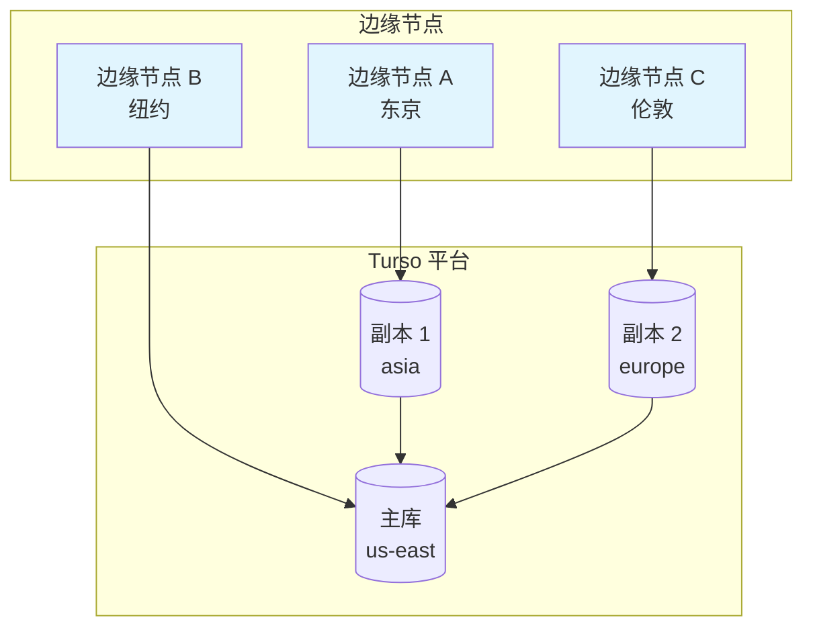
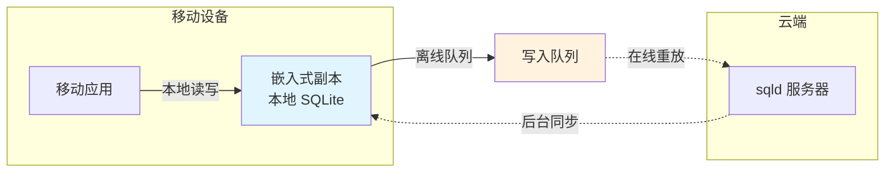
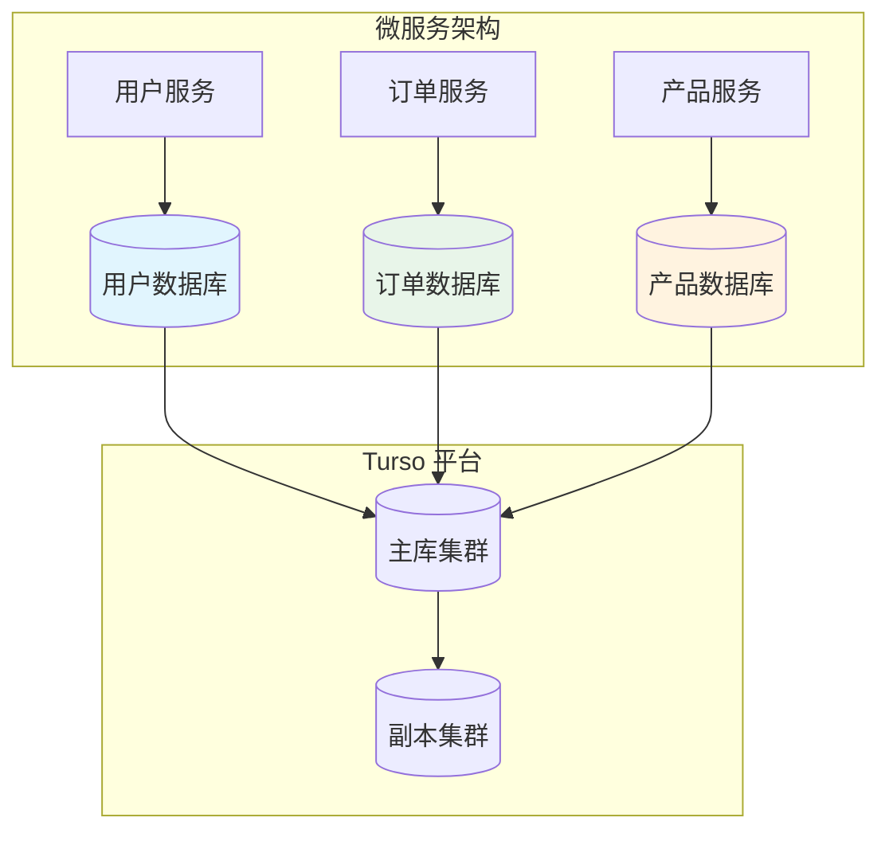
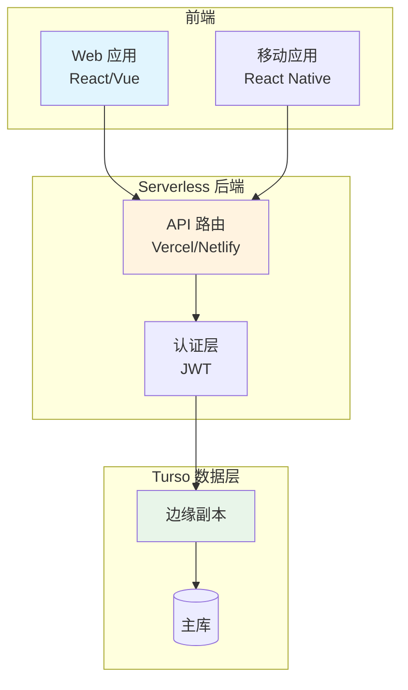

# Turso 应用场景

## 学习目标
- 掌握边缘计算场景的使用方式
- 理解离线优先应用的设计模式
- 了解分布式数据层的架构
- 掌握 Serverless 后端的最佳实践

## 边缘计算场景

### 1. 全球 CDN 数据分发



**优势**：
- 就近读取，延迟 < 50ms
- 自动数据同步
- 故障自动切换

### 2. 边缘函数应用

```javascript
// Cloudflare Worker + Turso
import { createClient } from '@libsql/client/web';

export default {
  async fetch(request, env, ctx) {
    const db = createClient({
      url: env.TURSO_URL,
      authToken: env.TURSO_AUTH_TOKEN
    });
    
    // 根据 IP 地理位置就近查询
    const country = request.cf?.country || 'US';
    
    const products = await db.execute({
      sql: 'SELECT * FROM products WHERE region = ?',
      args: [country]
    });
    
    return Response.json({
      region: country,
      products: products.rows,
      latency: 'edge-optimized'
    });
  }
}
```

### 3. 实时排行榜

```javascript
// 游戏排行榜（全球分布）
async function updateLeaderboard(userId, score) {
  const db = createClient({ url: TURSO_URL, authToken: TOKEN });
  
  // 写入主库
  await db.execute({
    sql: 'INSERT INTO leaderboard (user_id, score, timestamp) VALUES (?, ?, ?)',
    args: [userId, score, Date.now()]
  });
  
  // 通过 WebSocket 推送更新
  // 所有边缘节点实时同步
}
```

## 离线优先应用

### 1. 移动端离线应用



### 2. PWA 离线应用

```javascript
// Service Worker + Turso
self.addEventListener('sync', async (event) => {
  if (event.tag === 'turso-sync') {
    const db = await openTursoDB();
    await db.sync();
  }
});

// 注册后台同步
async function registerSync() {
  if ('serviceWorker' in navigator && 'SyncManager' in window) {
    const registration = await navigator.serviceWorker.ready;
    await registration.sync.register('turso-sync');
  }
}
```

## 分布式数据层

### 1. 多租户架构

```bash
# 为每个租户创建独立数据库
turso db create tenant-001
turso db create tenant-002

# 生成租户专属 Token
turso db tokens create tenant-001 --expiration 30d
```

```javascript
// 租户数据库路由
function getTenantDB(tenantId) {
  const url = 'libsql://' + tenantId + '-db.turso.io';
  return createClient({
    url,
    authToken: getTenantToken(tenantId)
  });
}
```

### 2. 微服务数据隔离



### 3. 读写分离

```javascript
// 写入主库
async function writeOrder(order) {
  const primaryDB = createClient({
    url: 'libsql://primary.turso.io',
    authToken: WRITE_TOKEN
  });
  
  await primaryDB.execute({
    sql: 'INSERT INTO orders (id, user_id, total) VALUES (?, ?, ?)',
    args: [order.id, order.userId, order.total]
  });
}

// 读取副本
async function getOrders(userId) {
  const replicaDB = createClient({
    url: 'libsql://replica-asia.turso.io',
    authToken: READ_TOKEN
  });
  
  const result = await replicaDB.execute({
    sql: 'SELECT * FROM orders WHERE user_id = ?',
    args: [userId]
  });
  
  return result.rows;
}
```

## Serverless 后端

### 1. Vercel / Netlify 函数

```javascript
// API 端点：/api/users
import { createClient } from '@libsql/client/web';

export default async function handler(req, res) {
  const db = createClient({
    url: process.env.TURSO_URL,
    authToken: process.env.TURSO_AUTH_TOKEN
  });
  
  if (req.method === 'GET') {
    const result = await db.execute('SELECT * FROM users');
    return res.json(result.rows);
  }
  
  if (req.method === 'POST') {
    const { name, email } = req.body;
    await db.execute({
      sql: 'INSERT INTO users (name, email) VALUES (?, ?)',
      args: [name, email]
    });
    return res.json({ success: true });
  }
}
```

### 2. 全栈应用架构



### 3. 实时协作应用

```javascript
// WebSocket + Turso 实现协作文档
const ws = new WebSocket('wss://db.turso.io/ws?token=xxx');

// 订阅文档变更
ws.send(JSON.stringify({
  type: 'subscribe',
  table: 'documents',
  filter: { id: 'doc-123' }
}));

// 接收实时更新
ws.onmessage = (event) => {
  const change = JSON.parse(event.data);
  if (change.type === 'update') {
    // 更新本地编辑器内容
    editor.setContent(change.row.content);
  }
};
```

## 典型场景对比

| 场景 | 传统方案 | Turso 方案 | 优势 |
|------|----------|-----------|------|
| 全球应用 | 单主库 + 多从库 | 边缘副本 | 延迟降低 80% |
| 离线应用 | 本地 SQLite + 手动同步 | 嵌入式副本 | 自动同步 |
| Serverless | 连接池 + 连接数限制 | HTTP 协议 | 无连接限制 |
| 微服务 | 多数据库实例 | 多数据库 + 分支 | 成本降低 70% |
| 开发测试 | 复制生产数据 | 分支隔离 | 数据安全 |

## 要点总结

- **边缘计算**：就近访问副本，延迟 < 50ms
- **离线优先**：嵌入式副本实现本地优先，自动同步
- **多租户**：每个租户独立数据库，Token 隔离
- **Serverless 友好**：HTTP 协议无连接数限制
- **实时协作**：WebSocket 订阅 + 自动推送

## 思考题

1. 在离线优先应用中，如何处理写入冲突（多个设备离线修改同一条记录）？
2. 边缘副本的最终一致性延迟在金融交易场景下是否可接受？如何设计补偿机制？
3. Serverless 函数的冷启动延迟如何影响数据库访问性能？如何优化？
