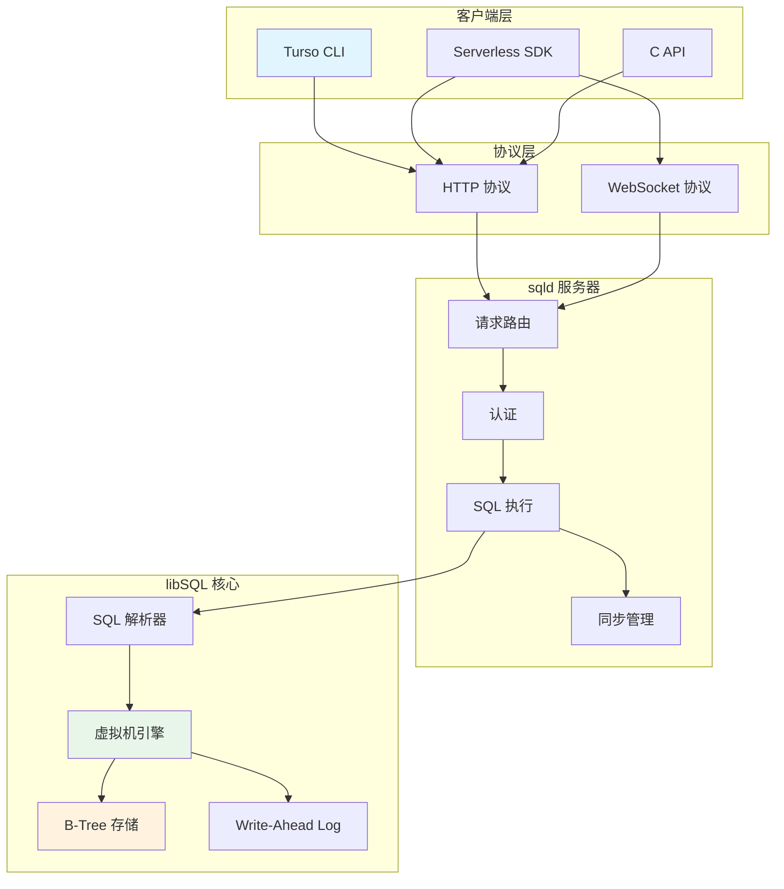

# Turso 资源索引

## 学习目标
- 掌握 Turso 源码结构
- 了解关键文件和模块
- 建立源码阅读路径

## 源码路径

### 1. 官方仓库

| 项目 | 地址 | 说明 |
|------|------|------|
| Turso 官方网站 | https://turso.tech | 官方文档和教程 |
| libSQL GitHub | https://github.com/libsql | libSQL 组织 |
| libSQL 核心 | https://github.com/libsql/libsql | SQLite 分支 |
| sqld 服务器 | https://github.com/libsql/sqld | libSQL 服务器 |
| libsql-client-c | https://github.com/libsql/libsql-client-c | C 客户端 |

### 2. 本地参考路径

```
reference/open-source/turso/
├── libsql/                          # libSQL 核心
│   ├── src/                         # 源码目录
│   │   ├── main.c                   # SQLite 入口
│   │   ├── shell.c                  # CLI Shell
│   │   └── vdbe.c                   # 虚拟数据库引擎
│   ├── ext/                         # 扩展模块
│   │   ├── vector/                  # 向量扩展
│   │   └── http/                    # HTTP 扩展
│   └── test/                        # 测试用例
├── sqld/                            # sqld 服务器
│   ├── src/                         # 源码目录
│   │   ├── server/                  # HTTP/WebSocket 服务器
│   │   ├── replica/                 # 副本管理
│   │   └── auth/                    # 认证模块
│   └── lib/                         # 库代码
└── libsql-client-c/                 # C 客户端
    ├── src/
    │   ├── http.c                   # HTTP 客户端
    │   └── ws.c                     # WebSocket 客户端
    └── include/
        └── libsql.h                 # 公共 API 头文件
```

## 关键文件解析

### 1. libSQL 核心

| 文件 | 说明 |
|------|------|
| libsql/src/vdbe.c | SQL 执行引擎核心（虚拟机） |
| libsql/src/vdbeapi.c | VDBE API 接口 |
| libsql/src/where.c | WHERE 子句优化 |
| libsql/ext/vector/vector.c | 向量扩展实现 |
| libsql/src/vdbeInt.h | VDBE 内部数据结构 |

### 2. sqld 服务器

| 文件 | 说明 |
|------|------|
| sqld/src/server/mod.rs | 服务器入口 |
| sqld/src/server/http.rs | HTTP 协议处理 |
| sqld/src/server/websocket.rs | WebSocket 协议 |
| sqld/src/replica/mod.rs | 副本管理逻辑 |
| sqld/src/auth/jwt.rs | JWT 认证 |

### 3. 嵌入式副本

| 文件 | 说明 |
|------|------|
| libsql-client-c/src/replica.c | 副本同步逻辑 |
| libsql-client-c/src/frame.c | WAL 帧处理 |
| libsql-client-c/include/libsql.h | 公共 API |

## 核心模块架构



## API 参考

### 1. C API 核心函数

```c
// 数据库连接
libsql_database_t libsql_open(const char *path);
libsql_database_t libsql_open_ext(const char *path, const char *remote_url, const char *auth_token);
void libsql_close(libsql_database_t db);

// 同步
int libsql_sync(libsql_database_t db);
sync_status_t libsql_sync_status(libsql_database_t db);

// 语句执行
libsql_stmt_t libsql_prepare(libsql_database_t db, const char *sql);
int libsql_step(libsql_stmt_t stmt);
int libsql_reset(libsql_stmt_t stmt);
void libsql_finalize(libsql_stmt_t stmt);

// 值绑定
void libsql_bind_int(libsql_stmt_t stmt, int col, int64_t val);
void libsql_bind_double(libsql_stmt_t stmt, int col, double val);
void libsql_bind_text(libsql_stmt_t stmt, int col, const char *val);
void libsql_bind_vector(libsql_stmt_t stmt, int col, const float *val, int dim);

// 值获取
int64_t libsql_column_int(libsql_stmt_t stmt, int col);
double libsql_column_double(libsql_stmt_t stmt, int col);
const char *libsql_column_text(libsql_stmt_t stmt, int col);
float *libsql_column_vector(libsql_stmt_t stmt, int col, int *dim);
```

### 2. HTTP API 端点

| 端点 | 方法 | 说明 |
|------|------|------|
| /v2/pipeline | POST | 批量执行 SQL |
| /v2/execute | POST | 执行单条 SQL |
| /health | GET | 健康检查 |
| /ws | WebSocket | 实时订阅 |

## 源码阅读路径

### 路径 1：理解 SQL 执行

```
SQL 字符串
    -> libsql/src/tokenize.c (词法分析)
    -> libsql/src/parse.y (语法分析)
    -> libsql/src/prepare.c (语句准备)
    -> libsql/src/vdbe.c (VDBE 执行)
    -> libsql/src/vdbeapi.c (API 接口)
```

### 路径 2：理解向量扩展

```
vector('[0.1, 0.2, 0.3]')
    -> libsql/ext/vector/vector.c (向量解析)
    -> libsql/ext/vector/distance.c (距离计算)
    -> libsql/ext/vector/index.c (向量索引)
```

### 路径 3：理解嵌入式副本

```
libsql_sync()
    -> libsql-client-c/src/replica.c (同步入口)
    -> libsql-client-c/src/frame.c (帧处理)
    -> sqld/src/replica/mod.rs (服务器端处理)
```

## 常用调试技巧

### 1. 启用详细日志

```bash
# 启用 libSQL 日志
export LIBSQL_LOG=debug

# 启用 sqld 日志
RUST_LOG=debug sqld --http-listen-addr 0.0.0.0:8080
```

### 2. 使用 EXPLAIN 分析

```sql
-- 查看查询计划
EXPLAIN QUERY PLAN SELECT * FROM users WHERE id = 1;

-- 详细分析
EXPLAIN SELECT * FROM users WHERE id = 1;
```

### 3. 性能分析

```bash
# 使用 strace 跟踪系统调用
strace -f turso db shell my-db "SELECT * FROM users"

# 使用 perf 分析 CPU
perf record -g turso db shell my-db "SELECT * FROM users"
perf report
```

## 要点总结

- **libSQL 核心路径**：src/vdbe.c 是 SQL 执行引擎核心
- **向量扩展路径**：ext/vector/ 实现向量类型和距离计算
- **sqld 服务器路径**：src/server/ 处理 HTTP/WebSocket 协议
- **副本同步路径**：libsql-client-c/src/replica.c 实现同步逻辑
- **HTTP API 端点**：/v2/pipeline 是批量执行主入口

## 思考题

1. libSQL 的 VDBE 与 PostgreSQL 的执行器有何本质区别？
2. 嵌入式副本的帧同步机制与 PostgreSQL 的流复制有何异同？
3. libSQL 的向量扩展与专用向量数据库（如 Milvus）的索引结构有何不同？
