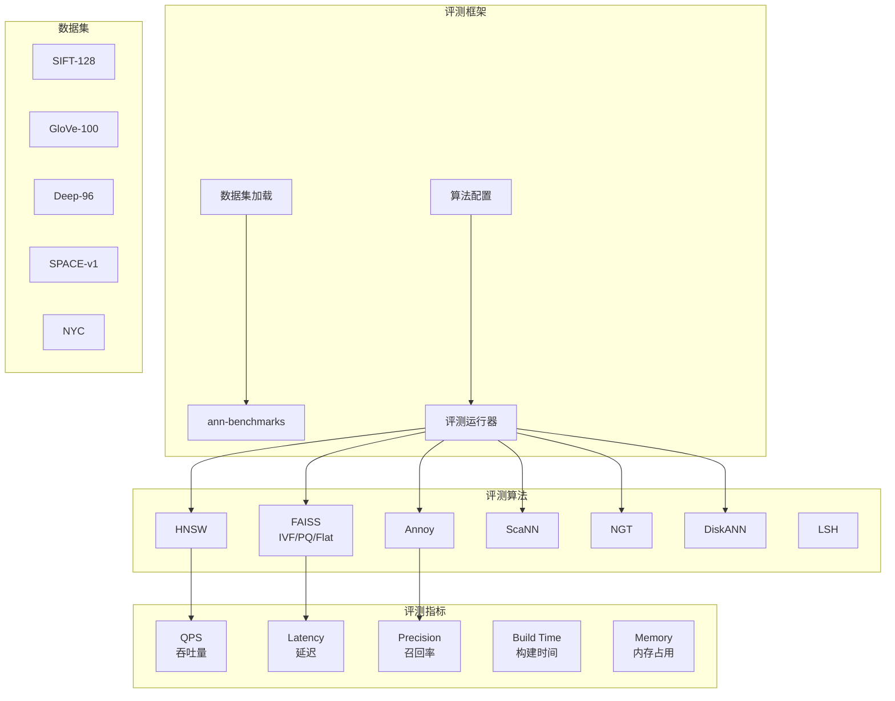

# ANN-Benchmarks 项目概览

## 学习目标

- 了解 ANN-Benchmarks 的定位和特点
- 掌握向量检索算法评测框架与基准测试方法

## 项目定位

> 近似最近邻搜索算法的标准化基准测试框架，评测 HNSW、FAISS、Annoy 等算法的精度与性能

**基本信息**：

- 开发方：ANN-Benchmarks Team
- 开源协议：MIT
- GitHub Stars：~5k

## 核心设计

## 要点总结

- **标准化评测**：统一的评测环境和数据集，保证算法可比性
- **多算法覆盖**：支持 HNSW、FAISS、Annoy、ScaNN、NGT、DiskANN、LSH 等主流算法
- **多数据集**：提供 SIFT、GloVe、Deep 等标准向量数据集
- **核心指标**：评测 QPS、延迟、召回率、构建时间、内存占用
- **结果可视化**：生成精度-性能权衡曲线，便于对比选型
- **可扩展框架**：易于添加新的算法和数据集
- **实时排行榜**：提供公开的评测结果排行榜
- **参数调优**：支持不同参数配置下的性能评测

## 相关资源

- GitHub: https://github.com/erikbern/ann-benchmarks
- 排行榜: https://ann-benchmarks.com/
