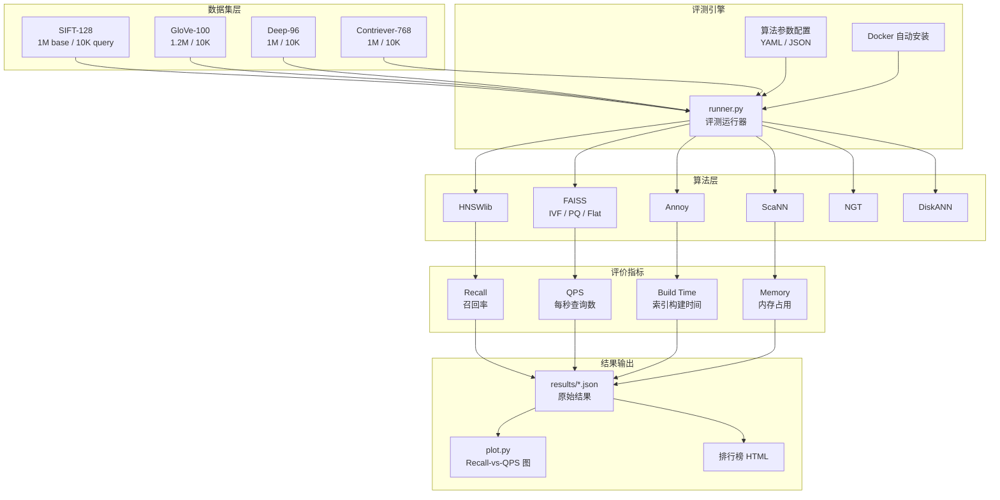
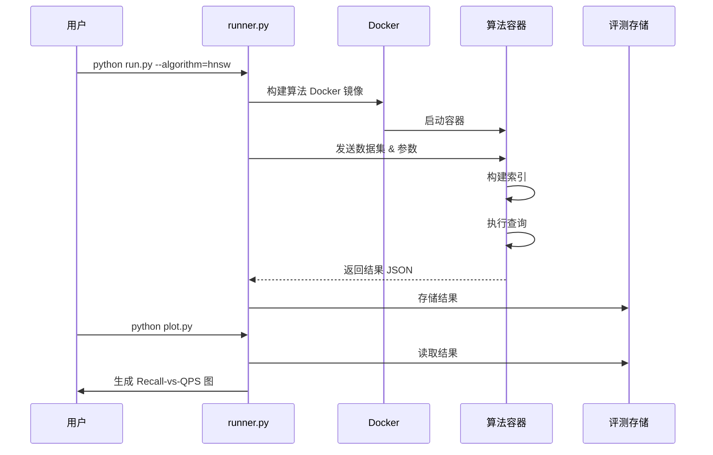

# ANN-Benchmarks 架构设计

## 学习目标
- 理解 ANN-Benchmarks 的整体架构分层
- 掌握评测流水线的数据流

## 整体架构



## 评测流水线



## 数据格式

### fvecs / ivecs 格式

```
4字节 dim + dim * 4字节 float/int = 一个向量
```

```
# 读取示例（C 风格）
for each vector:
    dim = read_int32(file)        # 4 字节维度
    for i in range(dim):
        data[i] = read_float(file) # 4 字节浮点
```

### HDF5 格式

```
数据集文件结构：
├── train      # 训练集（base 向量）
├── test       # 测试集（query 向量）
├── neighbors  # 精确最近邻（ground truth）
├── distances  # 精确距离
```

## 目录结构

```
ann-benchmarks/
├── ann_benchmarks/        # 核心代码
│   ├── __init__.py
│   ├── runner.py          # 评测运行器
│   ├── plot.py            # 结果可视化
│   ├── measure.py         # 指标计算
│   ├── algorithms/        # 算法 Dockerfile
│   │   ├── hnsw.py
│   │   ├── faiss.py
│   │   └── annoy.py
│   └── datasets/          # 数据集定义
├── results/               # 评测结果 JSON
├── install/               # Docker 安装脚本
└── Dockerfile             # 基础镜像
```

## 要点总结

- 架构分为数据集层、算法层、评测引擎和结果输出四层
- 评测流水线：Docker 自动化构建 → 算法容器 → 索引构建 → 查询 → 结果收集 → 可视化
- 数据格式支持 fvecs/ivecs（标准向量格式）和 HDF5（含 ground truth）
- 核心指标：Recall、QPS、Build Time、Memory

## 思考题

1. 为什么 ANN-Benchmarks 选择 Docker 容器化算法，而不是直接在宿主机运行？
2. fvecs 格式中每个向量开头存储 dim 的设计有什么好处？
3. 评测结果中 Recall 和 QPS 通常存在 trade-off，为什么？