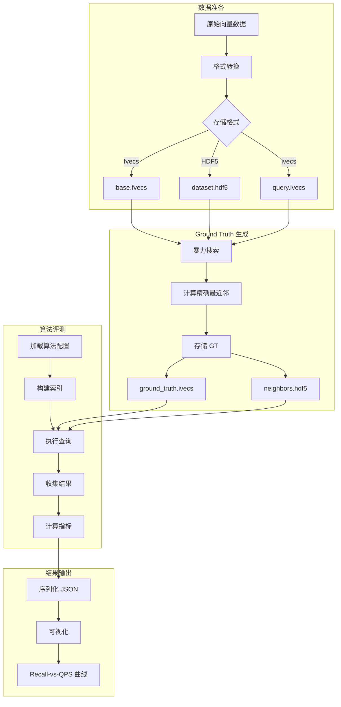
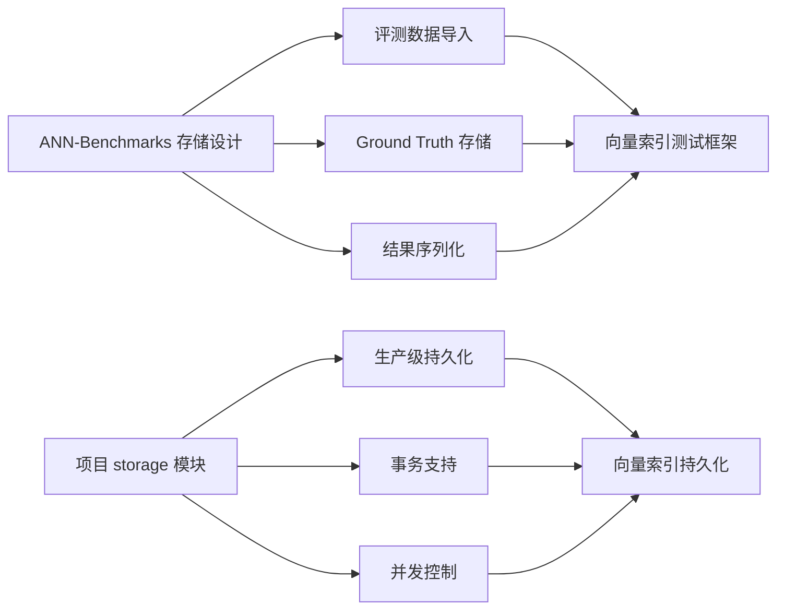

# ANN-Benchmarks 评测框架

## 学习目标

- 掌握向量检索评测中的数据集存储格式（fvecs/ivecs/HDF5）
- 理解 Ground Truth 的计算与存储机制
- 了解算法结果序列化格式
- 对比 ANN-Benchmarks 与项目 storage 模块的设计差异

## 核心概念

### 数据集存储格式

ANN-Benchmarks 支持两种主流的向量数据集存储格式：

#### fvecs / ivecs 格式

这是最经典的向量存储格式，由 Texas A&M 大学提出，广泛用于 ANN 研究领域。

**二进制布局**：

```
每个向量 = [4 字节 dim] + [dim * 4 字节 float/int]
```

| 字段 | 类型 | 大小 | 说明 |
|------|------|------|------|
| dim | int32 | 4 字节 | 向量维度 |
| data[dim] | float / int32 | dim * 4 字节 | 向量数据 |

**读取示例**：

```c
// 读取 fvecs 文件
float *read_fvecs(const char *filename, int *n, int *dim) {
    FILE *f = fopen(filename, "rb");
    int d;  // 维度
    fread(&d, sizeof(int), 1, f);  // 先读维度
    fseek(f, 0, SEEK_END);
    long size = ftell(f);
    fseek(f, 0, SEEK_SET);
    
    *n = size / (4 + d * 4);  // 计算向量数量
    *dim = d;
    
    float *data = malloc(*n * d * sizeof(float));
    for (int i = 0; i < *n; i++) {
        int d_check;
        fread(&d_check, sizeof(int), 1, f);  // 每个向量开头都有维度
        assert(d_check == d);
        fread(&data[i * d], sizeof(float), d, f);
    }
    fclose(f);
    return data;
}

// 读取 ivecs 文件（整数向量，用于存储 ground truth ID）
int *read_ivecs(const char *filename, int *n, int *dim) {
    FILE *f = fopen(filename, "rb");
    int d;
    fread(&d, sizeof(int), 1, f);
    fseek(f, 0, SEEK_END);
    long size = ftell(f);
    fseek(f, 0, SEEK_SET);
    
    *n = size / (4 + d * 4);
    *dim = d;
    
    int *data = malloc(*n * d * sizeof(int));
    for (int i = 0; i < *n; i++) {
        int d_check;
        fread(&d_check, sizeof(int), 1, f);
        assert(d_check == d);
        fread(&data[i * d], sizeof(int), d, f);
    }
    fclose(f);
    return data;
}
```

#### HDF5 格式

HDF5（Hierarchical Data Format 5）是一种更现代的科学数据格式，支持层次化数据组织。

**数据集结构**：

```
dataset.hdf5
├── /train      # 基向量集合 (n_base x dim)
├── /test       # 查询向量集合 (n_query x dim)
├── /neighbors  # 精确最近邻 ID (n_query x k)
└── /distances  # 精确距离值 (n_query x k)
```

**读取示例**：

```python
import h5py

def load_hdf5_dataset(filename):
    """加载 HDF5 格式的向量数据集"""
    with h5py.File(filename, 'r') as f:
        train = f['train'][:]      # 基向量
        test = f['test'][:]        # 查询向量
        neighbors = f['neighbors'][:]  # Ground truth ID
        distances = f['distances'][:]  # Ground truth 距离
    return train, test, neighbors, distances

# 示例：SIFT-1M HDF5 数据集
train, test, neighbors, distances = load_hdf5_dataset('sift-128-euclidean.hdf5')
print(f"基向量: {train.shape}")     # (1000000, 128)
print(f"查询向量: {test.shape}")    # (10000, 128)
print(f"最近邻: {neighbors.shape}") # (10000, 100)
```

### Ground Truth 计算与存储

Ground Truth 是评测 ANN 算法召回率的基准，通过暴力搜索计算得到。

#### 计算方法

```python
import numpy as np
from sklearn.neighbors import NearestNeighbors

def compute_ground_truth(base_vectors, query_vectors, k=100, metric='euclidean'):
    """
    计算精确最近邻作为 Ground Truth
    
    参数:
        base_vectors: 基向量集合 (n_base x dim)
        query_vectors: 查询向量集合 (n_query x dim)
        k: 返回的最近邻数量
        metric: 距离度量 ('euclidean', 'cosine', 'ip')
    
    返回:
        neighbors: 最近邻 ID (n_query x k)
        distances: 最近邻距离 (n_query x k)
    """
    # 构建暴力搜索索引
    nbrs = NearestNeighbors(n_neighbors=k, algorithm='brute', metric=metric)
    nbrs.fit(base_vectors)
    
    # 执行查询
    distances, neighbors = nbrs.kneighbors(query_vectors)
    
    return neighbors, distances

# 示例：计算 SIFT-1M 的 Ground Truth
base = np.random.randn(1000000, 128).astype(np.float32)
queries = np.random.randn(10000, 128).astype(np.float32)
neighbors, distances = compute_ground_truth(base, queries, k=100)
```

#### 存储格式

Ground Truth 通常以 ivecs 或 HDF5 格式存储：

```
# ivecs 格式（每个查询一行，存储 k 个最近邻 ID）
ground_truth.ivecs:
  [k, id1, id2, ..., id_k]  # 查询 0 的结果
  [k, id1, id2, ..., id_k]  # 查询 1 的结果
  ...

# HDF5 格式
ground_truth.hdf5:
  /neighbors  # (n_query, k) int32 数组
  /distances  # (n_query, k) float32 数组
```

### 算法结果序列化

ANN-Benchmarks 将算法评测结果序列化为 JSON 格式：

```json
{
    "algorithm": "hnswlib",
    "dataset": "sift-128-euclidean",
    "parameters": {
        "M": 16,
        "efConstruction": 200,
        "ef": 50
    },
    "results": [
        {
            "ef": 10,
            "recall": 0.82,
            "qps": 15432.5,
            "latency_ms": 0.065,
            "build_time_s": 12.3
        },
        {
            "ef": 50,
            "recall": 0.95,
            "qps": 5234.1,
            "latency_ms": 0.191,
            "build_time_s": 12.3
        }
    ],
    "memory_usage_mb": 512.3
}
```

## 评测流程



## 与项目 storage 模块对比

| 维度 | ANN-Benchmarks | 项目 storage 模块 |
|------|----------------|-------------------|
| **设计目标** | 算法评测框架 | 生产级存储引擎 |
| **数据格式** | fvecs/ivecs/HDF5（研究标准） | 自定义二进制格式 |
| **持久化** | 文件级存储，无事务 | 页面级管理，支持 WAL |
| **并发访问** | 单线程评测 | 多连接并发 |
| **内存管理** | 简单 buffer | Buffer Pool + Clock-Sweep |
| **Ground Truth** | 外部计算后存储 | 无内置支持 |
| **结果格式** | JSON（可读性强） | 二进制（效率优先） |

### 项目 storage 模块架构

```c
// 项目中的存储引擎接口
// 文件位置：engineering/include/db/storage/storage_engine.h

typedef struct storage_engine {
    // Buffer Pool 管理
    buffer_pool_t *buffer_pool;
    
    // WAL 日志
    wal_t *wal;
    
    // 数据文件
    data_file_t *data_file;
    
    // 索引文件
    index_file_t *index_file;
} storage_engine_t;

// 页面结构
typedef struct page {
    page_id_t page_id;
    char data[PAGE_SIZE];
    bool is_dirty;
    int pin_count;
} page_t;
```

### 借鉴建议



**可借鉴的设计点**：

1. **标准化测试数据集**：引入 SIFT、GloVe 等标准数据集的加载能力
2. **Ground Truth 管理**：存储精确最近邻结果，支持召回率计算
3. **评测结果可视化**：JSON 格式输出，便于绘制 Recall-vs-QPS 曲线
4. **参数网格搜索**：自动化参数遍历，找到最优配置

## 要点总结

- **fvecs/ivecs 格式**：经典的向量存储格式，每个向量以维度开头
- **HDF5 格式**：层次化数据格式，支持将 base/query/ground truth 组织在同一文件
- **Ground Truth**：通过暴力搜索计算精确最近邻，用于评测召回率
- **结果序列化**：JSON 格式存储算法参数、指标和性能数据
- **与项目对比**：ANN-Benchmarks 侧重评测便利性，项目 storage 侧重生产可靠性

## 思考题

1. fvecs 格式中每个向量重复存储维度的设计，在大规模数据集上会带来多少额外开销？
2. 为什么 Ground Truth 通常只存储前 100 个最近邻，而不是更多或更少？
3. 如果要在项目的 storage 模块中支持 fvecs 数据导入，需要实现哪些接口？
4. JSON 格式的评测结果在大规模参数网格搜索中可能产生大量文件，如何优化存储效率？
