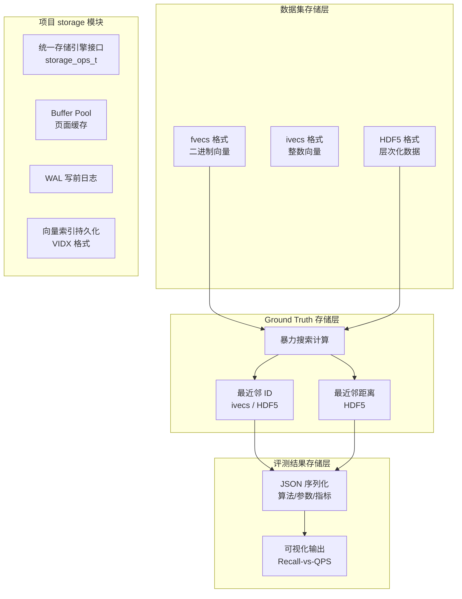
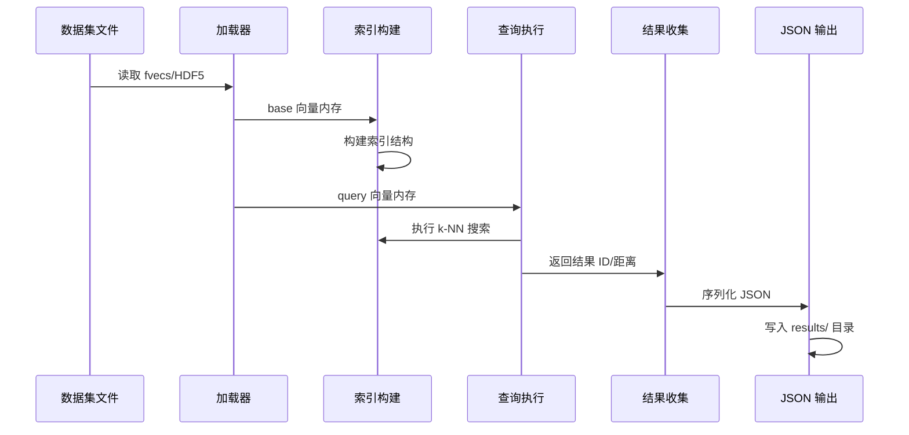
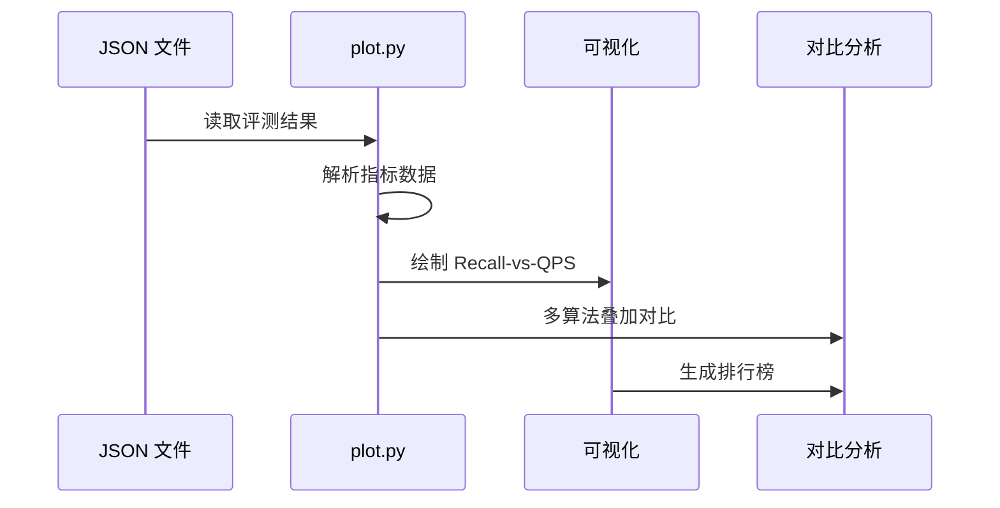
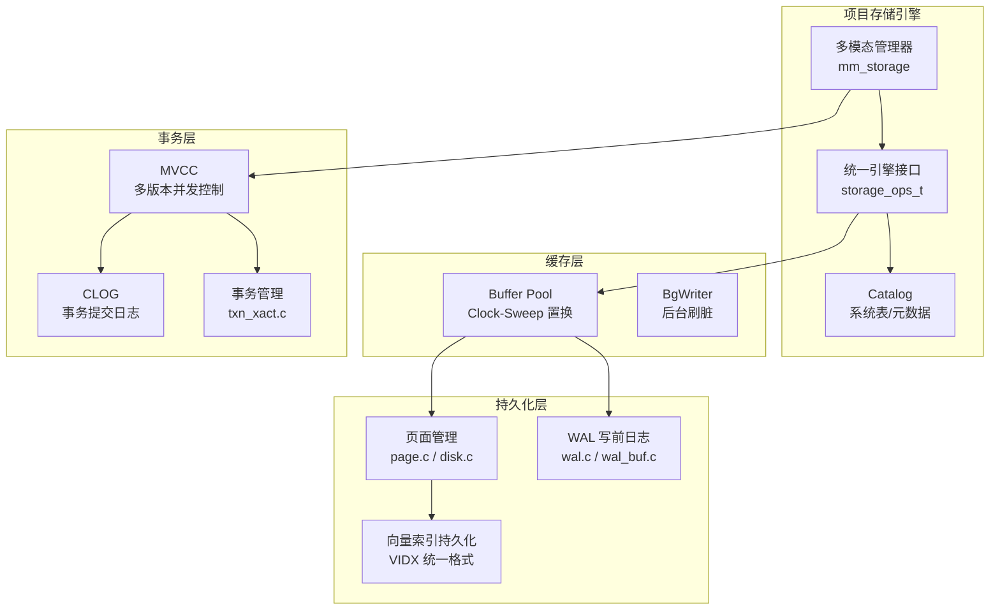
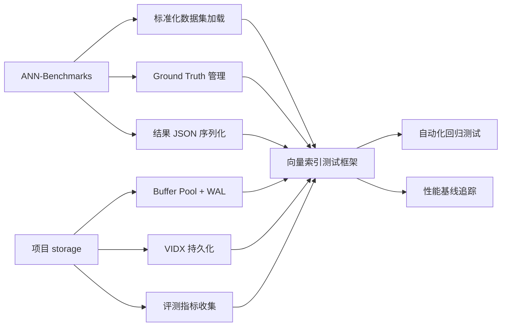

# ANN-Benchmarks 存储引擎

## 学习目标

- 理解 ANN-Benchmarks 的核心存储架构与数据结构
- 掌握向量数据持久化机制（fvecs / ivecs / HDF5）
- 了解 Ground Truth 的生成与存储流程
- 对比 ANN-Benchmarks 存储设计与项目 storage 模块的异同

## 核心概念

### 存储架构总览

ANN-Benchmarks 的存储架构围绕"标准化评测"这一核心目标设计，主要分为三个层次：

1. **数据集存储层** — 向量数据本身的持久化格式
2. **Ground Truth 存储层** — 精确最近邻结果的持久化
3. **评测结果存储层** — 算法性能指标的序列化



### 向量数据持久化

#### fvecs 格式

fvecs 是 ANN 研究领域最经典的向量存储格式，由 Texas A&M 大学提出。每个向量以 4 字节维度字段开头，后接维度个 4 字节浮点数。

**二进制布局**：

```
向量 0: [dim(4B) | float0(4B) | float1(4B) | ... | float_{dim-1}(4B)]
向量 1: [dim(4B) | float0(4B) | float1(4B) | ... | float_{dim-1}(4B)]
...
向量 N: [dim(4B) | float0(4B) | float1(4B) | ... | float_{dim-1}(4B)]
```

**设计考量**：

| 特性 | 说明 |
|------|------|
| 自描述 | 每个向量携带维度信息，允许变长向量混存 |
| 顺序读取 | 无需索引即可从头到尾顺序扫描 |
| 内存映射友好 | 可 mmap 后按固定偏移访问 |
| 额外开销 | 每个向量多 4 字节，100 万 128 维向量约 3.8MB 开销 |

#### ivecs 格式

与 fvecs 结构相同，但数据元素为 int32，用于存储整数类型的向量 ID 或标签。

**用途**：
- Ground Truth 最近邻 ID 存储
- 查询集索引标记
- 向量分类标签

#### HDF5 格式

HDF5（Hierarchical Data Format 5）是一种更现代的科学数据格式，支持层次化数据组织、压缩和并行 I/O。

**数据集文件结构**：

```
dataset.hdf5
├── /train        # 基向量集合 (n_base x dim) — float32
├── /test         # 查询向量集合 (n_query x dim) — float32
├── /neighbors    # 精确最近邻 ID (n_query x k) — int32
└── /distances    # 精确距离值 (n_query x k) — float32
```

**HDF5 相比 fvecs 的优势**：

| 维度 | fvecs | HDF5 |
|------|-------|------|
| 数据结构化 | 仅一维数组 | 层次化数据集 |
| Ground Truth | 需单独文件 | 同一文件包含 |
| 压缩支持 | 无 | 内置 Gzip/Szip |
| 随机访问 | 需计算偏移 | 数据集级别随机访问 |
| 元数据 | 无 | 属性系统支持 |
| 跨语言 | C/Python 手动解析 | h5py/PyTables 等 |

### Ground Truth 存储

Ground Truth 是 ANN 算法召回率评测的基准，通过暴力搜索计算得到精确的 k 个最近邻。

**计算流程**：

```
原始向量数据
     │
     ▼
暴力搜索 (Brute Force)
  └── 计算每个 query 与所有 base 向量的距离
  └── 排序选出 top-k
     │
     ▼
存储结果
  ├── ivecs: [k, id1, id2, ..., id_k]  // 每个查询一行
  └── HDF5:  /neighbors + /distances
```

**存储格式对比**：

```python
# ivecs 格式 — 仅存储 ID
# ground_truth.ivecs
[k, id1, id2, ..., id_k]   # query 0
[k, id1, id2, ..., id_k]   # query 1

# HDF5 格式 — ID 和距离一起存储
# ground_truth.hdf5
# /neighbors : (n_query, k) int32
# /distances : (n_query, k) float32
```

**k 值选择**：通常选择 k=100，原因如下：

- 覆盖常用评测范围（Recall@1, @10, @100）
- 存储开销可接受（100 万查询 × 100 × 4B = 400MB）
- 暴力搜索复杂度 O(N·dim·k)，k=100 是合理的精度/计算权衡

### 评测结果序列化

ANN-Benchmarks 将每次评测结果序列化为 JSON 文件，包含算法信息、参数配置和性能指标。

```json
{
    "algorithm": "hnswlib",
    "dataset": "sift-128-euclidean",
    "parameters": {
        "M": 16,
        "efConstruction": 200
    },
    "results": [
        {
            "ef": 10,
            "recall": 0.82,
            "qps": 15432.5,
            "latency_ms": 0.065,
            "build_time_s": 12.3
        }
    ]
}
```

**结果目录结构**：

```
results/
├── sift-128-euclidean/
│   ├── hnsw.json
│   ├── faiss-ivf.json
│   └── annoy.json
├── glove-100-angular/
│   ├── hnsw.json
│   └── scann.json
└── deep-96-euclidean/
    └── ...
```

### 读写路径

#### 写入路径



#### 读取路径



### 与项目 storage 模块对比

| 维度 | ANN-Benchmarks 存储 | 项目 storage 模块 |
|------|---------------------|-------------------|
| **设计目标** | 算法评测标准化 | 生产级多模态存储 |
| **数据格式** | fvecs/ivecs/HDF5 | 自定义二进制 + VIDX 统一格式 |
| **持久化粒度** | 文件级，全量加载 | 页面级 (4KB/8KB)，Buffer Pool |
| **事务支持** | 无 | WAL + MVCC + CLOG |
| **并发控制** | 单线程评测 | 多连接并发 + 锁管理器 |
| **缓存管理** | 无（直接 mmap/load） | Clock-Sweep 置换 + Hash 查找 |
| **校验机制** | 无 | CRC32 头部校验 + 数据校验 |
| **元数据** | 文件路径编码 | Catalog 系统表 |
| **压缩** | HDF5 内置压缩 | 自定义量化压缩 (PQ/OPQ) |
| **Ground Truth** | 外部计算后存储 | 无内置，需集成评测框架 |

#### 项目 storage 模块存储架构

项目采用 PostgreSQL 风格的存储引擎架构，核心组件如下：



#### 向量索引持久化格式 (VIDX)

项目的向量索引持久化使用统一的 `VIDX` 格式，设计特点：

```
┌─────────────────────────────────────────────────┐
│              VIDX 文件头 (128 bytes)              │
├─────────────────────────────────────────────────┤
│  Magic "VIDX" (4B) | Version (4B)               │
│  IndexType (4B) | Dims (4B) | nTotal (8B)       │
│  CreatedAt (8B) | ModifiedAt (8B)               │
│  HeaderChecksum (4B) | DataChecksum (4B)        │
│  DataSize (8B) | Flags (4B) | Reserved (64B)   │
├─────────────────────────────────────────────────┤
│              索引特定数据区                        │
│  (格式由 index_type 决定: HNSW / DiskANN / IVF)  │
└─────────────────────────────────────────────────┘
```

**与 ANN-Benchmarks fvecs 的对比**：

| 特性 | fvecs | VIDX |
|------|-------|------|
| 魔数校验 | 无 | "VIDX" + CRC32 |
| 版本管理 | 无 | 显式版本号，兼容性检查 |
| 索引类型 | 无 | 6 种索引类型标识 |
| 校验和 | 无 | 头部 + 数据双重 CRC32 |
| 时间戳 | 无 | 创建/修改时间戳 |
| 自描述 | 仅维度 | 完整元数据 |

### 借鉴与融合



**可借鉴的设计点**：

1. **标准化测试数据集**：引入 SIFT、GloVe、Deep 等标准数据集的 fvecs/HDF5 加载能力
2. **Ground Truth 管理**：在项目测试框架中集成暴力搜索 GT 生成与缓存
3. **评测结果序列化**：复用 JSON 格式存储性能指标，支持历史对比
4. **参数网格搜索**：利用 VIDX 的版本管理能力，记录不同参数下的索引快照

## 要点总结

- **fvecs/ivecs**：经典的 ANN 向量存储格式，自描述但缺乏元数据保护
- **HDF5**：层次化科学数据格式，支持 ground truth 一体化存储
- **Ground Truth**：暴力搜索计算精确最近邻，k=100 是标准选择
- **结果 JSON**：算法/参数/指标的标准化序列化格式
- **项目 VIDX**：统一的向量索引持久化格式，带 CRC32 校验和版本兼容性
- **核心差异**：ANN-Benchmarks 侧重评测便利性，项目 storage 侧重生产可靠性

## 思考题

1. fvecs 格式中每个向量重复存储维度的设计，在 10 亿级数据集上会带来多少额外 I/O 开销？
2. 如果要在项目的 storage 模块中实现 fvecs 到 VIDX 的格式转换，需要处理哪些兼容性问题？
3. HDF5 的 /neighbors 和 /distances 存储了 top-100 精确结果，对于高维数据（如 768 维 Contriever），暴力搜索的计算量如何估算？
4. JSON 评测结果文件在大规模参数网格搜索中可能产生大量小文件，如何优化为更高效的存储方式（如 SQLite 或 Parquet）？
5. 项目的 Buffer Pool + WAL 架构能否用于加速 ANN-Benchmarks 的大数据集加载？可能的瓶颈在哪里？