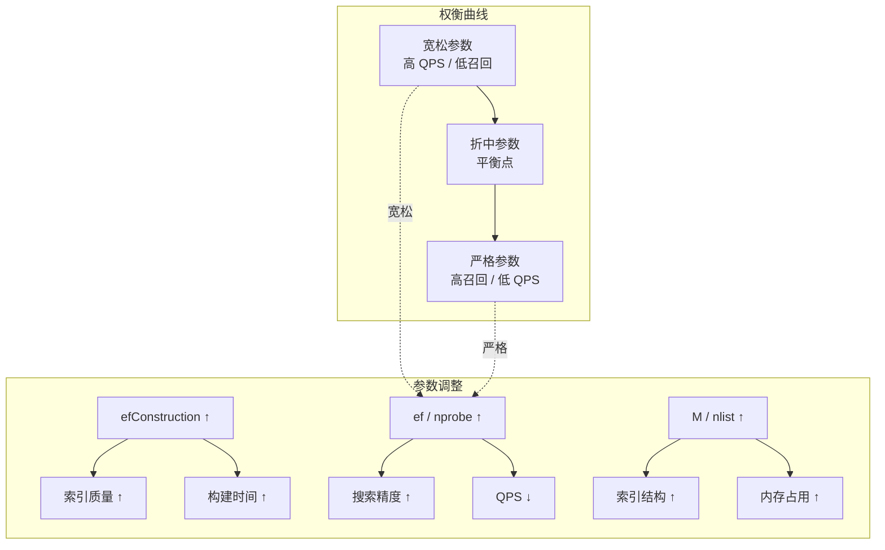
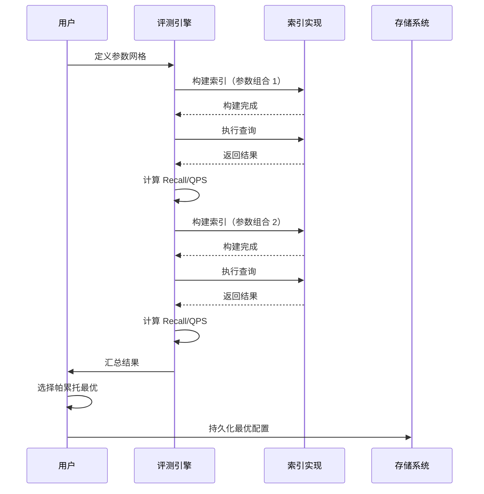

# ANN-Benchmarks 评测指标与查询

## 学习目标

- 理解 Recall / QPS / Build Time 等核心指标的计算方法
- 掌握召回率与性能的权衡分析方法
- 了解参数调优实验的流程
- 关联项目 algo 模块的向量索引实现

## 核心概念

### 核心指标定义

ANN-Benchmarks 通过以下四个核心指标评估向量索引算法：

#### 1. Recall（召回率）

召回率衡量 ANN 算法返回结果与真实最近邻之间的重合程度。

**公式**：

```
Recall@k = (1 / N) * Σ (|P_i ∩ G_i| / k)

其中:
  N = 查询总数
  P_i = 算法返回的第 i 个查询的 top-k 结果集合
  G_i = Ground truth 中第 i 个查询的 top-k 结果集合
```

**代码实现**：

```python
import numpy as np

def compute_recall(predicted_ids, ground_truth_ids, k=10):
    """
    计算召回率
    
    参数:
        predicted_ids: (n_queries, k) 算法预测的最近邻 ID
        ground_truth_ids: (n_queries, k) 精确最近邻 ID
        k: top-k
    
    返回:
        recall: 平均召回率
    """
    n_queries = predicted_ids.shape[0]
    total_hits = 0
    
    for i in range(n_queries):
        pred_set = set(predicted_ids[i][:k])
        gt_set = set(ground_truth_ids[i][:k])
        hits = len(pred_set & gt_set)
        total_hits += hits
    
    recall = total_hits / (n_queries * k)
    return recall


def compute_recall_at_radius(predicted_ids, ground_truth_ids, radii):
    """
    计算不同 k 值下的召回率（用于绘制曲线）
    
    参数:
        predicted_ids: (n_queries, max_k)
        ground_truth_ids: (n_queries, max_k)
        radii: 需要计算的 k 值列表，如 [1, 10, 100]
    
    返回:
        recalls: 各 k 值对应的召回率
    """
    recalls = {}
    for k in radii:
        recall = compute_recall(predicted_ids, ground_truth_ids, k)
        recalls[k] = recall
    return recalls
```

#### 2. QPS（Queries Per Second，每秒查询数）

QPS 衡量索引的查询吞吐能力。

**公式**：

```
QPS = N_query / T_total

其中:
  N_query = 查询总数
  T_total = 所有查询的总耗时（秒）
```

**代码实现**：

```python
import time

def measure_qps(index, queries, batch_size=1000):
    """
    测量 QPS
    
    参数:
        index: 已构建的向量索引
        queries: (n_queries, dim) 查询向量集合
        batch_size: 用于预热的小批次大小
    
    返回:
        qps: 每秒查询数
        avg_latency_ms: 平均延迟（毫秒）
    """
    n_queries = queries.shape[0]
    
    # 预热（避免冷启动影响）
    for i in range(min(batch_size, n_queries)):
        _ = index.search(queries[i], 10)
    
    # 正式测量
    start = time.perf_counter()
    for i in range(n_queries):
        _ = index.search(queries[i], 10)
    elapsed = time.perf_counter() - start
    
    qps = n_queries / elapsed
    avg_latency_ms = (elapsed / n_queries) * 1000
    
    return qps, avg_latency_ms
```

#### 3. Latency（延迟）

延迟衡量单次查询的响应时间。

**分位延迟**：

```python
def compute_latency_percentiles(latencies_ms):
    """
    计算延迟分位数
    
    参数:
        latencies_ms: 每次查询的延迟列表
    
    返回:
        p50: 中位数延迟
        p90: 90 分位延迟
        p95: 95 分位延迟
        p99: 99 分位延迟
    """
    sorted_latencies = np.sort(latencies_ms)
    n = len(sorted_latencies)
    
    return {
        'p50': sorted_latencies[int(n * 0.50)],
        'p90': sorted_latencies[int(n * 0.90)],
        'p95': sorted_latencies[int(n * 0.95)],
        'p99': sorted_latencies[int(n * 0.99)],
        'mean': np.mean(sorted_latencies),
        'std': np.std(sorted_latencies),
    }
```

#### 4. Build Time（索引构建时间）

索引构建时间包括数据加载、索引结构创建和参数配置的时间。

```python
def measure_build_time(index, base_vectors, index_params):
    """
    测量索引构建时间
    
    参数:
        index: 索引实例
        base_vectors: (n_base, dim) 基向量
        index_params: 索引构建参数
    
    返回:
        build_time_s: 构建时间（秒）
        memory_mb: 内存占用（MB）
    """
    import tracemalloc
    
    # 记录内存基线
    tracemalloc.start()
    baseline = tracemalloc.get_traced_memory()
    
    # 构建索引
    start = time.perf_counter()
    index.build(base_vectors, index_params)
    build_time = time.perf_counter() - start
    
    # 计算内存增量
    current, peak = tracemalloc.get_traced_memory()
    tracemalloc.stop()
    
    memory_mb = (peak - baseline[0]) / (1024 * 1024)
    
    return build_time, memory_mb
```

### 召回率与性能的权衡

ANN 算法的核心权衡：**召回率越高，QPS 越低**。



**典型参数权衡示例**：

| 参数 | 增大效果 | 减小效果 |
|------|----------|----------|
| HNSW ef | 召回率 ↑, QPS ↓ | 召回率 ↓, QPS ↑ |
| HNSW M | 召回率 ↑, 内存 ↑ | 召回率 ↓, 内存 ↓ |
| IVF nlist | 索引质量 ↑, 构建时间 ↑ | 索引质量 ↓, 构建时间 ↓ |
| IVF nprobe | 召回率 ↑, QPS ↓ | 召回率 ↓, QPS ↑ |
| PQ m | 精度 ↑, 内存 ↓ | 精度 ↓, 内存 ↑ |

### 指标计算流程

```mermaid
flowchart LR
    subgraph 数据准备
        A[基向量] --> B[构建索引]
        C[查询向量] --> D[执行搜索]
        E[Ground Truth] --> F[计算召回率]
    end

    subgraph 指标计算
        B --> G[Build Time]
        D --> H[QPS]
        D --> I[Latency]
        D --> J[Throughput]
        F --> K[Recall@k]
    end

    subgraph 结果分析
        G --> L[性能基线]
        H --> L
        I --> L
        K --> M[权衡曲线]
        L --> M
    end

    subgraph 参数调优
        M --> N[调整参数]
        N --> B
    end
```

## 参数调优实验流程

### 网格搜索

```python
import itertools
import json

def parameter_grid_search(algorithm_class, base_vectors, query_vectors, 
                          ground_truth, param_grid, k=10):
    """
    参数网格搜索实验
    
    参数:
        algorithm_class: 算法类
        base_vectors: 基向量
        query_vectors: 查询向量
        ground_truth: 精确最近邻
        param_grid: 参数字典，如 {'M': [8,16,32], 'efConstruction': [100,200]}
        k: top-k
    
    返回:
        results: 所有参数组合的评测结果
    """
    results = []
    
    # 生成参数组合
    keys = param_grid.keys()
    values = param_grid.values()
    combinations = list(itertools.product(*values))
    
    print(f"总参数组合数: {len(combinations)}")
    
    for combo in combinations:
        params = dict(zip(keys, combo))
        print(f"评测参数: {params}")
        
        # 创建并构建索引
        index = algorithm_class()
        build_start = time.perf_counter()
        index.build(base_vectors, params)
        build_time = time.perf_counter() - build_start
        
        # 执行查询
        predicted = []
        query_start = time.perf_counter()
        for q in query_vectors:
            result = index.search(q, k)
            predicted.append(result)
        query_time = time.perf_counter() - query_start
        
        # 计算指标
        predicted = np.array(predicted)
        recall = compute_recall(predicted, ground_truth, k)
        qps = len(query_vectors) / query_time
        
        results.append({
            'params': params,
            'recall': recall,
            'qps': qps,
            'build_time_s': build_time
        })
        
        print(f"  Recall@{k}: {recall:.4f}, QPS: {qps:.1f}, Build: {build_time:.2f}s")
    
    return results
```

### 帕累托最优分析

```python
def find_pareto_frontier(results):
    """
    找到帕累托前沿（高召回 + 高 QPS）
    
    参数:
        results: 评测结果列表
    
    返回:
        pareto: 帕累托最优的参数组合
    """
    pareto = []
    sorted_results = sorted(results, key=lambda x: (-x['recall'], -x['qps']))
    
    max_qps = 0
    for r in sorted_results:
        if r['qps'] > max_qps:
            pareto.append(r)
            max_qps = r['qps']
    
    return pareto
```

### 典型调优流程



## 与项目 algo 模块的关联

### 项目中的向量索引

```c
// 文件位置：engineering/include/db/index/vector_index/

// HNSW 索引
VectorIndex *hnsw_create(int dim, int M, int ef_construction);
// 搜索参数: ef (搜索时的候选集大小)

// IVF 索引
VectorIndex *ivf_create(int dim, int nlist, int nprobe);
// 搜索参数: nprobe (搜索时检查的倒排列表数)

// DiskANN 索引
VectorIndex *diskann_create(int dim, int R, int L);
// 搜索参数: L (搜索时的候选集大小), beam_width
```

### 评测接口映射

```python
# 项目评测接口（仿照 ANN-Benchmarks）
def evaluate_project_index(index_impl, params, dataset):
    """
    评测项目中的索引实现
    
    参数:
        index_impl: 索引创建函数（如 hnsw_create）
        params: 索引参数
        dataset: 数据集（包含 base, query, ground_truth）
    """
    base = dataset['base']
    query = dataset['query']
    gt = dataset['ground_truth']
    
    # 构建索引
    t0 = time.perf_counter()
    index = index_impl.build(base, params)
    build_time = time.perf_counter() - t0
    
    # 搜索
    predicted = []
    t0 = time.perf_counter()
    for q in query:
        res = index.search(q, params.get('k', 10))
        predicted.append(res)
    search_time = time.perf_counter() - t0
    
    # 计算指标
    recall = compute_recall(np.array(predicted), gt)
    qps = len(query) / search_time
    
    return {
        'recall': recall,
        'qps': qps,
        'build_time_s': build_time
    }


# 使用示例
dataset = load_hdf5_dataset('sift-128-euclidean.hdf5')

# 参数调优
param_grid = {
    'M': [8, 16, 32],
    'efConstruction': [100, 200, 400],
    'ef': [50, 100, 200]
}

results = parameter_grid_search(
    algorithm_class=HNSWIndex,
    base_vectors=dataset['base'],
    query_vectors=dataset['query'],
    ground_truth=dataset['neighbors'],
    param_grid=param_grid,
    k=10
)

# 找帕累托前沿
pareto = find_pareto_frontier(results)
```

### 指标对比

| 指标 | ANN-Benchmarks 实现 | 项目对应 |
|------|---------------------|----------|
| Recall@k | 集合交运算 | 需自行实现 |
| QPS | 总查询数 / 总时间 | 项目已有计时工具 |
| Build Time | 构建前后时间差 | 项目已有计时工具 |
| Memory | tracemalloc | 需集成内存分析 |
| I/O 开销 | 无 | 对 DiskANN 重要 |

## 要点总结

- **Recall**：ANN 算法返回结果与精确最近邻的交集比例，核心精度指标
- **QPS**：每秒查询数，衡量索引的查询吞吐能力
- **Build Time**：索引构建时间，影响索引更新频率
- **权衡曲线**：Recall-vs-QPS 曲线是评估 ANN 算法最核心的可视化方式
- **参数调优**：网格搜索 + 帕累托最优分析是标准方法
- **项目关联**：ANN-Benchmarks 的评测方法可直接应用于项目中的 HNSW、IVF、DiskANN 实现

## 思考题

1. 为什么 Recall-vs-QPS 曲线比单一指标更能反映 ANN 算法的实际表现？
2. 在参数调优实验中，如何平衡搜索空间覆盖度和实验耗时？
3. 对于项目的 DiskANN 实现，I/O 延迟如何影响 QPS 计算，是否应该纳入评测？
4. 如果评测结果中出现了"高召回率但 QPS 也高"的异常点，可能是什么原因？
5. 如何在项目现有的测试框架中集成自动化性能回归测试，防止索引重构导致性能退化？