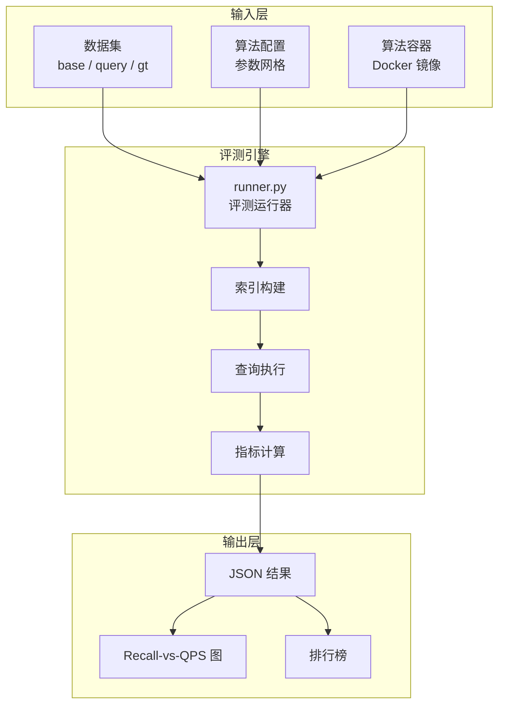
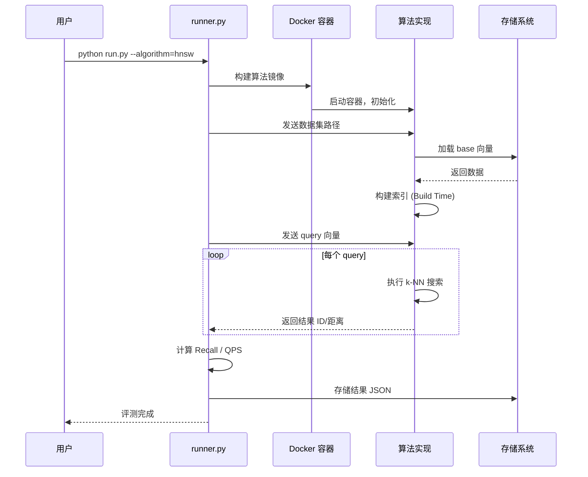
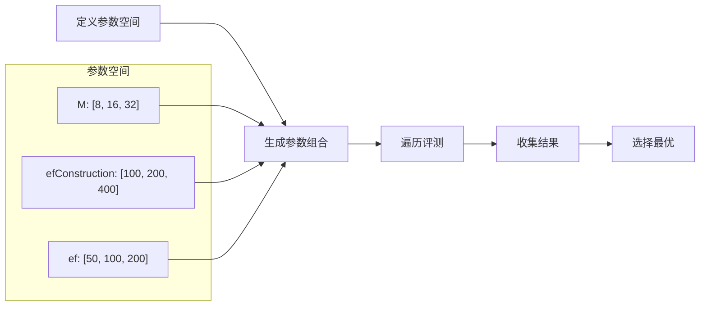
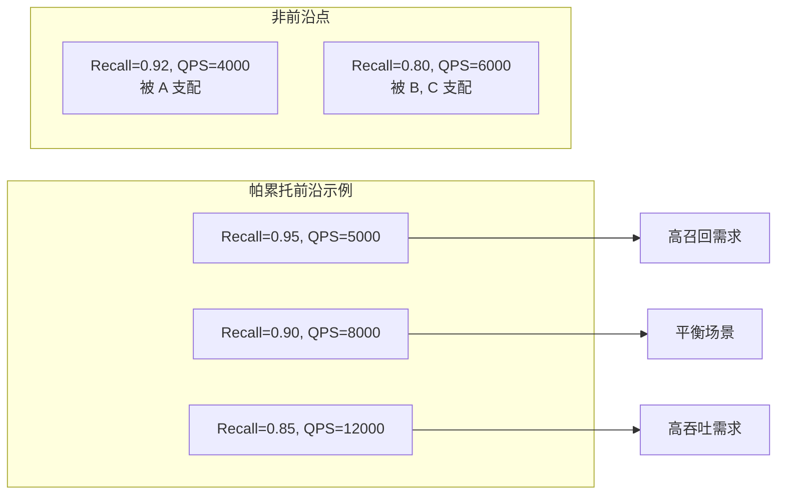
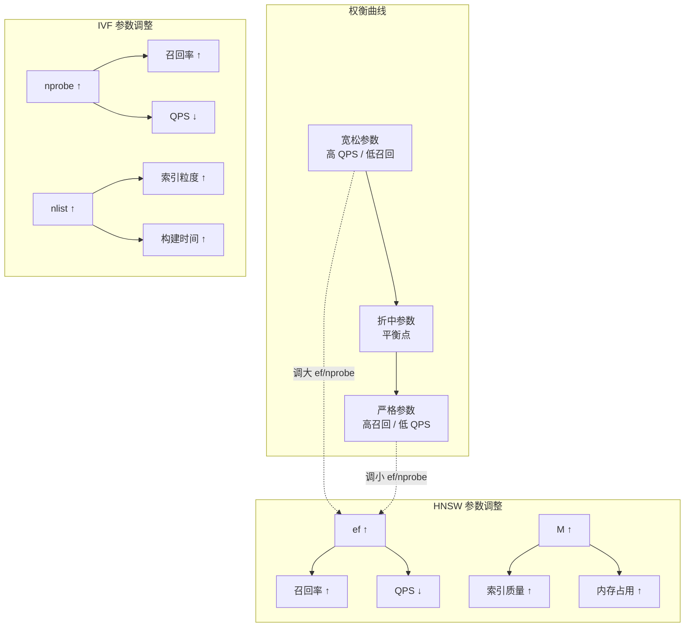

# ANN-Benchmarks 查询与操作引擎

## 学习目标

- 理解 ANN-Benchmarks 的评测流水线与查询执行流程
- 掌握核心评测算法（Recall、QPS、Latency 计算）
- 了解参数搜索与帕累托最优分析方法
- 关联项目向量索引模块的评测能力

## 核心概念

### 评测流水线架构

ANN-Benchmarks 的查询/操作引擎围绕"标准化评测"设计，核心流程如下：



### 查询执行流程



### 核心评测算法

#### 1. Recall@k 召回率计算

召回率衡量 ANN 算法返回的 top-k 结果与精确最近邻的重合程度。

**公式**：

```
Recall@k = (1/N) * Σ |P_i ∩ G_i| / k

其中:
  N = 查询总数
  P_i = 算法返回的第 i 个查询的 top-k 结果集合
  G_i = Ground Truth 中第 i 个查询的 top-k 结果集合
```

**实现要点**：

```python
def compute_recall(predicted_ids, ground_truth_ids, k=10):
    """
    计算 Recall@k

    参数:
        predicted_ids: (n_queries, k) 算法预测的最近邻 ID
        ground_truth_ids: (n_queries, k) 精确最近邻 ID
        k: top-k

    返回:
        recall: 平均召回率
    """
    n_queries = predicted_ids.shape[0]
    total_hits = 0

    for i in range(n_queries):
        # 集合交运算计算命中数
        pred_set = set(predicted_ids[i][:k])
        gt_set = set(ground_truth_ids[i][:k])
        hits = len(pred_set & gt_set)
        total_hits += hits

    recall = total_hits / (n_queries * k)
    return recall
```

**召回率特性**：

| k 值 | 召回率特征 | 适用场景 |
|------|-----------|----------|
| k=1 | 最严格，对精度要求极高 | 精确匹配、去重 |
| k=10 | 平衡精度与容错 | 推荐系统 Top-10 |
| k=100 | 宽松，召回更多候选 | 粗排、候选生成 |

#### 2. QPS 查询吞吐量

QPS（Queries Per Second）衡量索引的查询吞吐能力，是生产环境的关键指标。

**公式**：

```
QPS = N_query / T_total

其中:
  N_query = 查询总数
  T_total = 所有查询的总耗时（秒）
```

**测量要点**：

```python
def measure_qps(index, queries, k=10, warmup=100):
    """
    测量 QPS

    参数:
        index: 已构建的向量索引
        queries: (n_queries, dim) 查询向量集合
        k: top-k
        warmup: 预热查询数（避免冷启动）

    返回:
        qps: 每秒查询数
        latency_ms: 平均延迟（毫秒）
    """
    n_queries = queries.shape[0]

    # 预热阶段（不计入 QPS）
    for i in range(min(warmup, n_queries)):
        _ = index.search(queries[i], k)

    # 正式测量
    latencies = []
    start = time.perf_counter()
    for i in range(n_queries):
        t0 = time.perf_counter()
        _ = index.search(queries[i], k)
        latencies.append(time.perf_counter() - t0)
    elapsed = time.perf_counter() - start

    qps = n_queries / elapsed
    latency_ms = np.mean(latencies) * 1000

    return qps, latency_ms
```

**预热的重要性**：首次查询可能触发缓存加载、JIT 编译、内存分配等延迟，预热可消除这些冷启动影响。

#### 3. 分位延迟 (Latency Percentiles)

P50/P90/P95/P99 延迟比平均延迟更能反映用户体验。

```python
def compute_latency_percentiles(latencies_ms):
    """
    计算延迟分位数

    参数:
        latencies_ms: 每次查询的延迟列表

    返回:
        dict: 各分位延迟值
    """
    sorted_latencies = np.sort(latencies_ms)
    n = len(sorted_latencies)

    return {
        'p50': sorted_latencies[int(n * 0.50)],
        'p90': sorted_latencies[int(n * 0.90)],
        'p95': sorted_latencies[int(n * 0.95)],
        'p99': sorted_latencies[int(n * 0.99)],
        'max': sorted_latencies[-1],
        'mean': np.mean(sorted_latencies),
        'std': np.std(sorted_latencies),
    }
```

**分位延迟解读**：

| 指标 | 含义 | 典型要求 |
|------|------|----------|
| P50 | 50% 请求的延迟低于此值 | 用户体验基线 |
| P90 | 90% 请求延迟低于此值 | 大部分用户感知 |
| P99 | 99% 请求延迟低于此值 | 长尾优化目标 |
| P99.9 | 极端情况延迟 | SLO 告警阈值 |

### 参数搜索与调优

#### 网格搜索 (Grid Search)



**网格搜索实现**：

```python
import itertools

def parameter_grid_search(algorithm_class, base_vectors, query_vectors,
                          ground_truth, param_grid, k=10):
    """
    参数网格搜索

    参数:
        algorithm_class: 算法类
        param_grid: 参数字典，如 {'M': [8,16,32], 'efConstruction': [100,200]}
        k: top-k

    返回:
        results: 所有参数组合的评测结果
    """
    results = []
    keys = list(param_grid.keys())
    values = list(param_grid.values())
    combinations = list(itertools.product(*values))

    print(f"总参数组合数: {len(combinations)}")

    for combo in combinations:
        params = dict(zip(keys, combo))

        # 构建索引
        index = algorithm_class()
        build_start = time.perf_counter()
        index.build(base_vectors, params)
        build_time = time.perf_counter() - build_start

        # 执行查询
        predicted = []
        query_start = time.perf_counter()
        for q in query_vectors:
            result = index.search(q, k)
            predicted.append(result)
        query_time = time.perf_counter() - query_start

        # 计算指标
        recall = compute_recall(np.array(predicted), ground_truth, k)
        qps = len(query_vectors) / query_time

        results.append({
            'params': params,
            'recall': recall,
            'qps': qps,
            'build_time_s': build_time
        })

    return results
```

#### 帕累托最优分析

帕累托前沿（Pareto Frontier）是在多目标优化中无法同时改进的目标组合。



**帕累托前沿算法**：

```python
def find_pareto_frontier(results):
    """
    找到帕累托前沿（高召回 + 高 QPS）

    参数:
        results: 评测结果列表

    返回:
        pareto: 帕累托最优的参数组合
    """
    pareto = []
    # 按 recall 降序排序
    sorted_results = sorted(results, key=lambda x: -x['recall'])

    max_qps = 0
    for r in sorted_results:
        # 当前 recall 下，如果 qps 超过已知的最大值，则为帕累托最优
        if r['qps'] > max_qps:
            pareto.append(r)
            max_qps = r['qps']

    return pareto
```

### 召回率与性能的权衡

ANN 算法的核心权衡：**召回率越高，QPS 越低**。



**典型参数权衡表**：

| 参数 | 增大效果 | 减小效果 | 适用场景 |
|------|----------|----------|----------|
| HNSW ef | 召回率 ↑, QPS ↓ | 召回率 ↓, QPS ↑ | 查询时调优 |
| HNSW M | 召回率 ↑, 内存 ↑ | 召回率 ↓, 内存 ↓ | 构建时调优 |
| IVF nprobe | 召回率 ↑, QPS ↓ | 召回率 ↓, QPS ↑ | 查询时调优 |
| IVF nlist | 索引质量 ↑, 构建时间 ↑ | 索引质量 ↓, 构建时间 ↓ | 构建时调优 |
| PQ m | 精度 ↑, 内存 ↓ | 精度 ↓, 内存 ↑ | 内存受限场景 |

### 与项目向量索引模块关联

#### 项目向量索引接口

项目支持多种向量索引类型，提供了统一的评测接口：

```c
// 文件位置：engineering/include/db/index/vector_index/streaming/streaming_index.h

// 流式索引支持的底层索引类型
typedef enum {
    STREAMING_INDEX_HNSW = 0,      // HNSW
    STREAMING_INDEX_DISKANN = 1,   // DiskANN
    STREAMING_INDEX_IVF_PQ = 2,    // IVF-PQ
} streaming_index_type_t;

// 流式索引配置
typedef struct streaming_index_config {
    streaming_index_type_t index_type;

    // 索引参数
    int32_t dims;
    int32_t M;                    // HNSW M 参数
    int32_t ef_construction;      // HNSW ef_construction
    int32_t ef_search;            // HNSW ef_search

    // 流式参数
    int32_t buffer_capacity;
    int32_t buffer_flush_threshold;
} streaming_index_config_t;

// 搜索接口
int32_t streaming_index_search(
    streaming_index_t *index,
    const float *query,
    int32_t k,
    float *distances,
    int32_t *ids);
```

#### DiskANN 分区策略

项目实现了 DiskANN 的多种分区策略，可用于大规模向量评测：

```c
// 文件位置：engineering/include/db/index/vector_index/diskann/diskann_partition.h

typedef enum {
    DISKANN_PARTITION_RANDOM = 0,           // 随机分区
    DISKANN_PARTITION_KMEANS = 1,           // K-Means 分区
    DISKANN_PARTITION_COORDINATE_RANGE = 2, // 坐标范围分区
} diskann_partition_method_t;

// 执行分区
int32_t diskann_partition_data(
    const float *vectors,
    int32_t n,
    int32_t dims,
    diskann_partition_method_t method,
    int32_t partition_count,
    int32_t *partition_ids);
```

#### 项目评测接口映射

```python
# 项目评测接口（仿照 ANN-Benchmarks）
def evaluate_project_index(index_impl, params, dataset, k=10):
    """
    评测项目中的索引实现

    参数:
        index_impl: 索引创建函数
        params: 索引参数
        dataset: 数据集 (base, query, ground_truth)
        k: top-k
    """
    base = dataset['base']
    query = dataset['query']
    gt = dataset['neighbors']

    # 构建索引
    t0 = time.perf_counter()
    index = index_impl.build(base, params)
    build_time = time.perf_counter() - t0

    # 搜索
    predicted = []
    latencies = []
    t0 = time.perf_counter()
    for q in query:
        t1 = time.perf_counter()
        res = index.search(q, k)
        latencies.append(time.perf_counter() - t1)
        predicted.append(res)
    search_time = time.perf_counter() - t0

    # 计算指标
    recall = compute_recall(np.array(predicted), gt, k)
    qps = len(query) / search_time
    latency_stats = compute_latency_percentiles(latencies)

    return {
        'recall': recall,
        'qps': qps,
        'build_time_s': build_time,
        'latency': latency_stats
    }
```

#### 项目指标收集系统

项目已实现 Prometheus 格式的指标收集：

```c
// 文件位置：engineering/include/db/metrics.h

void metrics_observe_search_duration(double seconds);  // 记录搜索延迟
void metrics_observe_insert_duration(double seconds);  // 记录插入延迟
void metrics_inc_vectors_total(int64_t delta);         // 向量总数
double metrics_get_buffer_hit_ratio(void);             // 缓存命中率
```

### 评测指标对比

| 指标 | ANN-Benchmarks 实现 | 项目对应 |
|------|---------------------|----------|
| Recall@k | 集合交运算 | 需自行实现 |
| QPS | 总查询数 / 总时间 | metrics_observe_search_duration |
| Build Time | 构建前后时间差 | 可用 time.perf_counter() |
| Latency P99 | 分位数计算 | metrics_observe_search_duration + histogram |
| Memory | tracemalloc | 需集成内存分析 |
| I/O 开销 | 无 | DiskANN 关键指标 |

## 要点总结

- **评测流水线**：数据集加载 → 索引构建 → 查询执行 → 指标计算 → 结果存储
- **Recall@k**：ANN 结果与 Ground Truth 的集合交集比例，核心精度指标
- **QPS**：每秒查询数，衡量查询吞吐能力，需预热消除冷启动影响
- **分位延迟**：P50/P90/P99 延迟比平均值更能反映用户体验
- **帕累托前沿**：高召回 + 高 QPS 的最优参数组合，用于多目标优化
- **参数权衡**：ef/nprobe 调召回率，M/nlist 调索引质量，需在精度/性能/内存间平衡
- **项目关联**：项目向量索引接口可直接集成 ANN-Benchmarks 评测框架

## 思考题

1. 为什么 Recall-vs-QPS 曲线比单一指标更能反映 ANN 算法的实际表现？
2. 在参数调优实验中，如何平衡搜索空间覆盖度和实验耗时？是否可以用贝叶斯优化替代网格搜索？
3. 对于项目的 DiskANN 实现，I/O 延迟如何影响 QPS 计算，是否应该将磁盘读取时间纳入评测？
4. 如果评测结果中出现了"高召回率但 QPS 也高"的异常点，可能是什么原因？（提示：考虑数据分布、缓存效果）
5. 如何在项目现有的测试框架中集成自动化性能回归测试，防止索引重构导致性能退化？
6. 项目的流式索引（streaming_index_t）支持缓冲区写入，在评测时如何保证缓冲区已完全合并，避免结果偏差？