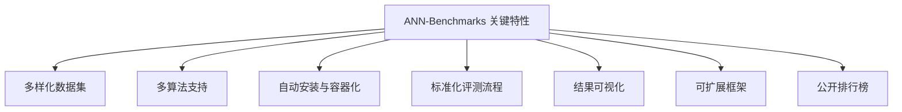
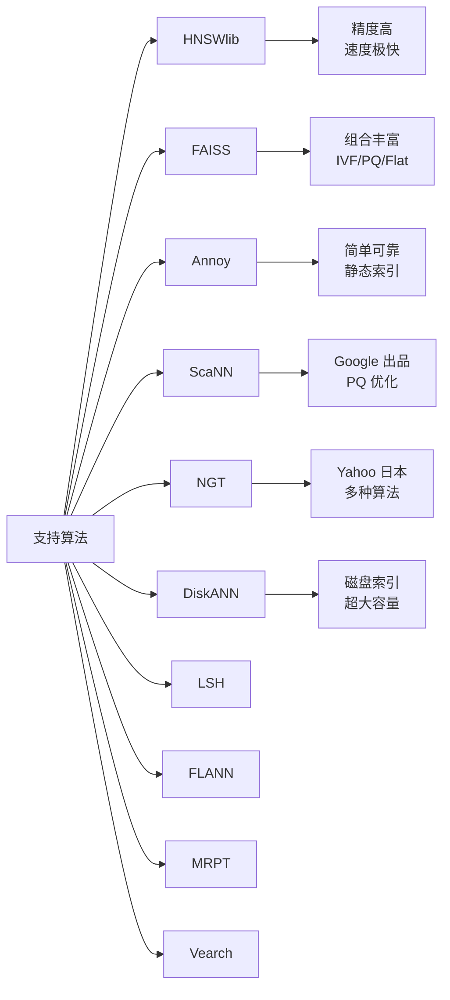
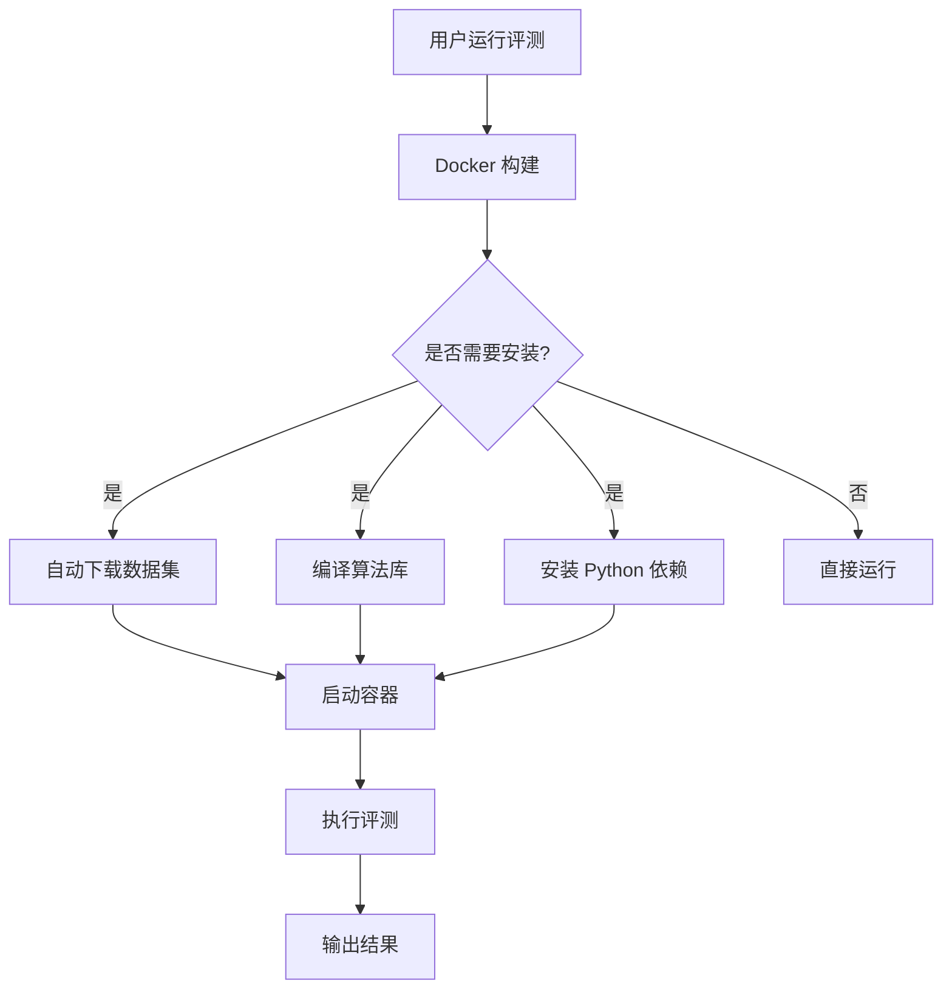
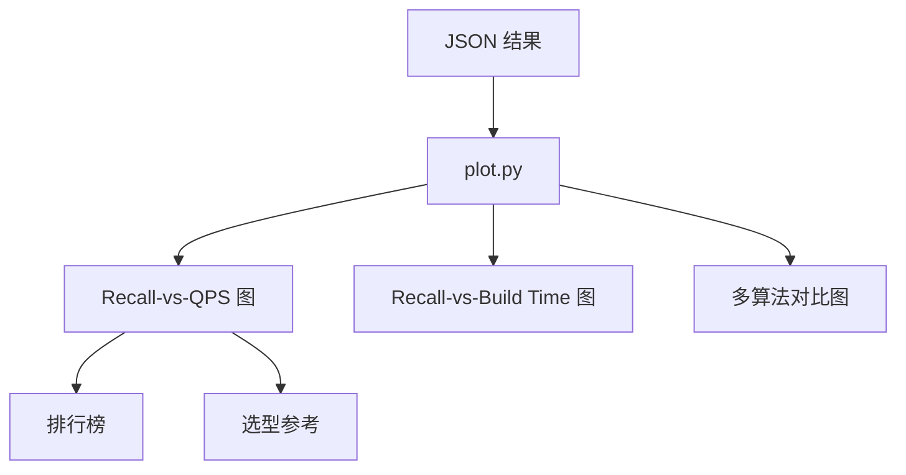

# ANN-Benchmarks 关键特性

## 学习目标
- 了解 ANN-Benchmarks 的关键特性
- 掌握这些特性如何支持向量检索算法评测

## 特性总览



## 多样化数据集

| 数据集 | 维度 | 向量数 | 查询数 | 距离度量 | 说明 |
|--------|------|--------|--------|----------|------|
| SIFT-128 | 128 | 1,000,000 | 10,000 | L2 | 图像 SIFT 特征 |
| GIST-960 | 960 | 1,000,000 | 1,000 | L2 | 图像 GIST 特征 |
| GloVe-100 | 100 | 1,183,514 | 10,000 | 余弦 | 词向量 |
| GloVe-200 | 200 | 1,183,514 | 10,000 | 余弦 | 词向量 |
| Deep-96 | 96 | 1,000,000 | 10,000 | L2 | 深度学习特征 |
| Deep-256 | 256 | 1,000,000 | 10,000 | L2 | 深度学习特征 |
| Contriever-768 | 768 | 1,000,000 | 10,000 | 余弦 | 文本嵌入 |
| SPACE-v1 | 100 | 1,000,000 | 10,000 | 内积 | 最大内积搜索 |

## 多算法支持



## 自动安装与容器化



## 标准化评测流程

每个算法的评测流程一致：

1. **加载数据集**：读取 base 向量和 query 向量
2. **构建索引**：使用算法参数配置构建索引
3. **执行查询**：对每个 query 执行 k-NN 搜索
4. **计算召回**：与 ground truth 对比计算召回率
5. **记录性能**：记录 QPS、构建时间、内存占用
6. **存储结果**：JSON 格式保存

## 结果可视化



## 可扩展框架

添加新算法步骤：

```python
# 1. 在 ann_benchmarks/algorithms/ 下创建 Dockerfile
# 2. 在 algorithms/ 下添加算法包装器
# 3. 在配置中定义参数搜索空间

# 配置示例（YAML）
hnsw:
  docker-tag: ghcr.io/erikbern/ann-benchmarks-hnsw:latest
  module: ann_benchmarks.algorithms.hnsw
  constructor: HNSW
  base-args: ["@metric"]
  run-groups:
    M:
      args: [16]
      construction-args:
        efConstruction: [200, 400]
```

## 要点总结

- 提供从图像到文本的多样化标准数据集，覆盖不同维度和规模
- 支持 10+ 主流向量检索算法，评测框架统一
- Docker 容器化实现零配置自动安装，保证评测环境一致性
- 标准化评测流程确保各算法结果可比
- 可视化生成 Recall-vs-QPS 图，直观展示精度-性能权衡
- 开放架构易于扩展新算法和新数据集

## 思考题

1. 不同数据集上的评测结果为何不能直接类比？
2. 容器化评测相比裸机评测有哪些优缺点？
3. 如何为新算法添加 ANN-Benchmarks 支持？