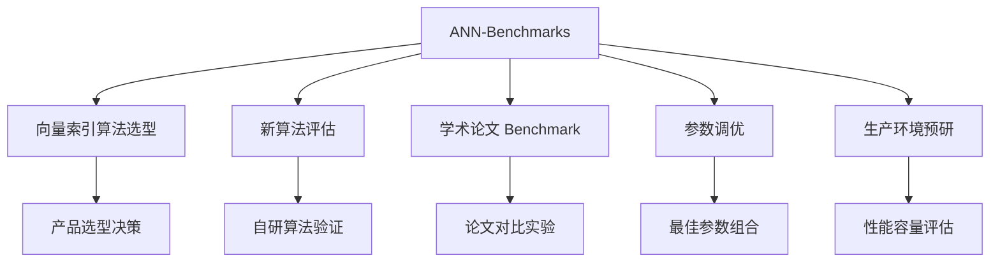
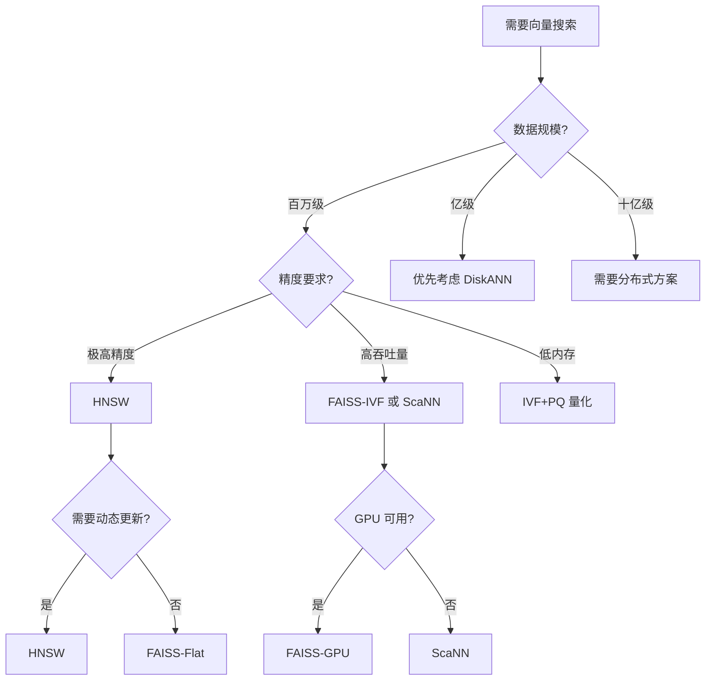

# ANN-Benchmarks 使用场景与选型对比

## 学习目标
- 理解 ANN-Benchmarks 的最佳适用场景
- 掌握如何利用 Benchmark 结果进行向量索引选型

## 核心概念

- **评测维度**：召回率、QPS、构建时间、内存占用、索引大小
- **算法分类**：内存索引 vs 磁盘索引、精确搜索 vs 近似搜索
- **选型权衡**：精度与速度的 trade-off，不同场景有不同的最优解

## 适用场景

## 选型对比

| 维度 | HNSW | FAISS-IVF | DiskANN | ScaNN | Annoy |
|------|------|-----------|---------|-------|-------|
| 召回率 | 极高 | 中-高 | 高 | 高 | 中 |
| QPS | 极高 | 高 | 中 | 极高 | 中 |
| 构建时间 | 中 | 快 | 慢 | 中 | 快 |
| 内存占用 | 高 | 中 | 低(磁盘) | 高 | 中 |
| 索引大小 | 大 | 中 | 小 | 大 | 中 |
| 动态更新 | 支持 | 不支持 | 不支持 | 不支持 | 不支持 |
| 适用规模 | 百万级 | 百万-千万级 | 亿级 | 百万级 | 百万级 |

## 决策流程

## 如何阅读 Benchmark 结果

## 选型案例分析

### 案例 1：电商图片搜索
- **需求**：百万级商品图片，要求召回率 > 95%
- **推荐**：HNSW（efConstruction=400, M=16）
- **理由**：高精度、高 QPS、支持动态增删

### 案例 2：日志分析系统
- **需求**：十亿级日志向量，内存受限
- **推荐**：DiskANN
- **理由**：磁盘索引、低内存占用、亿级规模

### 案例 3：实时推荐系统
- **需求**：百万级用户向量，要求毫秒级响应
- **推荐**：FAISS-IVF（nlist=4096, nprobe=64）
- **理由**：高 QPS、可调精度、GPU 加速可选

## 要点总结

- ANN-Benchmarks 是向量索引选型的权威参考工具
- 选型需综合考虑数据规模、精度要求、硬件资源、动态更新需求
- 不存在"最好"的算法，只有"最适合"的算法
- Benchmark 结果需结合自身业务场景解读，不可盲目套用

## 思考题

1. 为什么 HNSW 在百万级数据上表现优异，到亿级数据却不如 DiskANN？
2. 选型时，召回率损失 1% 换取 2 倍 QPS 提升是否值得？如何判断？
3. 生产环境中，如何设计自己的 Benchmark 实验来验证选型决策？