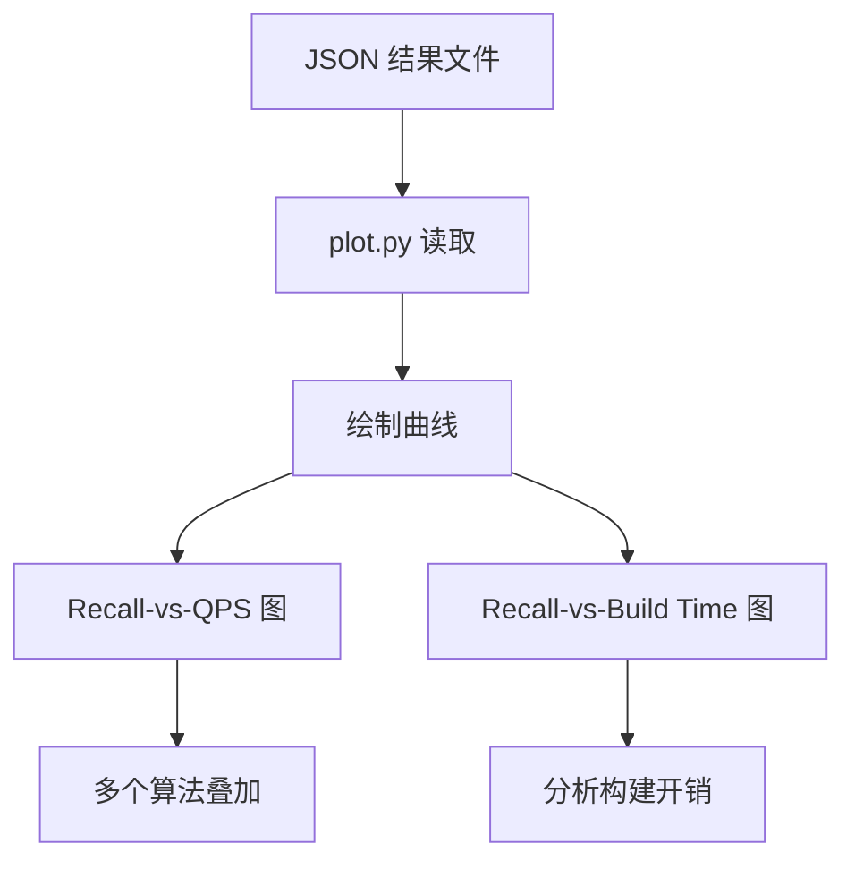

# ANN-Benchmarks 动手实验

## 学习目标
- 掌握 ANN-Benchmarks 的 Docker 部署与运行方法
- 通过实验对比不同向量索引算法的性能差异

## 实验环境要求

- **操作系统**：Linux / macOS / Windows（WSL2）
- **内存**：16GB+（SIFT 数据集约 2GB）
- **磁盘**：20GB+ 空闲空间
- **依赖**：Docker 20.10+、Python 3.8+、Git
- **时间**：首次运行约 1-2 小时（含下载数据集和构建镜像）

## 实验一：Docker 部署 ANN-Benchmarks

```bash
# 1. 克隆代码
git clone https://github.com/erikbern/ann-benchmarks.git
cd ann-benchmarks

# 2. 安装 Python 依赖
pip install -r requirements.txt

# 3. 构建基础镜像
docker build -t ann-benchmarks .

# 4. 验证安装
python -c "import ann_benchmarks; print('OK')"
```

## 实验二：运行单算法评测

```bash
# 运行 HNSW 算法评测（使用 SIFT-128 数据集）
python run.py --algorithm=hnsw --local --dataset=sift-128-euclidean

# 运行 FAISS-IVF 算法评测
python run.py --algorithm=faiss-ivf --local --dataset=sift-128-euclidean

# 运行 Annoy 算法评测
python run.py --algorithm=annoy --local --dataset=sift-128-euclidean
```

### 参数说明

| 参数 | 说明 | 默认值 |
|------|------|--------|
| `--algorithm` | 算法名称 | 必填 |
| `--local` | 本地运行（不使用 Docker） | False |
| `--dataset` | 数据集名称 | 无 |
| `--runs` | 每组参数运行次数 | 3 |
| `--count` | 每次查询返回的最近邻数 | 10 |

## 实验三：结果可视化

```bash
# 生成 Recall-vs-QPS 图
python plot.py --dataset=sift-128-euclidean --output=results.png

# 对比多个算法
python plot.py --dataset=sift-128-euclidean \
  --algorithms=hnsw,faiss-ivf,annoy \
  --output=comparison.png
```



## 实验四：对比不同算法性能

```bash
# 批量运行多个算法
python run.py --algorithm=hnsw --dataset=sift-128-euclidean
python run.py --algorithm=faiss-ivf --dataset=sift-128-euclidean
python run.py --algorithm=scann --dataset=sift-128-euclidean
python run.py --algorithm=ngt --dataset=sift-128-euclidean

# 生成对比图
python plot.py --dataset=sift-128-euclidean \
  --output=sift_comparison.png
```

## 实验五：自定义参数搜索

```bash
# 编辑算法配置，添加自定义参数组合
# 文件位置：ann_benchmarks/algorithms/hnsw.py

# 运行评测
python run.py --algorithm=hnsw --dataset=sift-128-euclidean

# 查看结果
cat results/sift-128-euclidean/hnsw.json | python -m json.tool
```

## 实验对比

| 实验 | 工具 | 指标 | 预期结果 |
|------|------|------|----------|
| HNSW 评测 | run.py | Recall@10 / QPS | 召回率 > 95%，QPS > 5K |
| FAISS-IVF 评测 | run.py | Recall@10 / QPS | 召回率 > 85%，QPS > 10K |
| Annoy 评测 | run.py | Recall@10 / QPS | 召回率 > 70%，QPS > 3K |
| 多算法对比 | plot.py | 曲线图 | HNSW 精度最高，FAISS 吞吐最高 |
| 参数调优 | run.py + 配置 | 最佳参数 | 找到 efConstruction 最优值 |

## 要点总结

- Docker 部署可一键运行，无需手动安装算法库
- 使用 `run.py` 运行单算法评测，`plot.py` 生成可视化结果
- 在相同数据集上对比不同算法，可以直观分析精度-性能权衡
- 自定义参数搜索有助于找到特定场景的最佳配置

## 思考题

1. 在 SIFT 和 GloVe 数据集上，HNSW 和 FAISS 的性能差异是否一致？为什么？
2. 如何设计实验来验证"DiskANN 适合亿级数据"这个结论？
3. 如果需要在生产环境持续跟踪索引性能，如何扩展 ANN-Benchmarks 的评测框架？