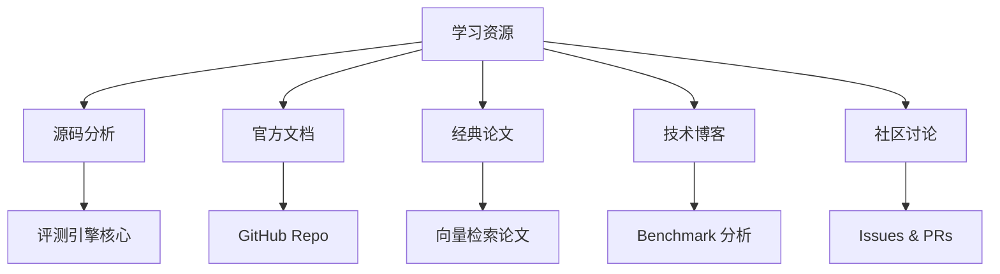
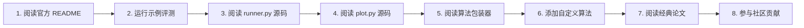

# ANN-Benchmarks 学习资源

## 学习目标
- 获取 ANN-Benchmarks 的最佳学习资源
- 建立系统化的学习路径

## 核心资源



## 源码路径

```
ann-benchmarks/
├── ann_benchmarks/            # 核心代码
│   ├── runner.py              # 评测运行器 — 核心入口
│   ├── plot.py                # 结果可视化 — 生成 Recall-vs-QPS 图
│   ├── measure.py             # 指标计算 — 召回率、QPS 计算
│   ├── algorithms/            # 算法 Dockerfile 和包装器
│   │   ├── hnsw.py            # HNSW 算法包装
│   │   ├── faiss.py           # FAISS 算法包装
│   │   ├── annoy.py           # Annoy 算法包装
│   │   ├── scann.py           # ScaNN 算法包装
│   │   ├── ngt.py             # NGT 算法包装
│   │   └── diskann.py         # DiskANN 算法包装
│   ├── datasets/              # 数据集定义
│   │   ├── __init__.py
│   │   └── get_dataset.py     # 数据集下载与加载
│   └── constants.py           # 常量定义
├── results/                   # 评测结果（JSON 格式）
├── install/                   # Docker 安装脚本
├── Dockerfile                 # 基础镜像
└── requirements.txt           # Python 依赖
```

## 关键文件说明

| 文件 | 路径 | 说明 |
|------|------|------|
| runner.py | `ann_benchmarks/runner.py` | 评测入口，调度算法执行 |
| plot.py | `ann_benchmarks/plot.py` | 结果可视化，matplotlib 绘图 |
| measure.py | `ann_benchmarks/measure.py` | 召回率、QPS 等指标计算 |
| algorithms/hnsw.py | `ann_benchmarks/algorithms/hnsw.py` | HNSW 算法包装器示例 |
| get_dataset.py | `ann_benchmarks/datasets/get_dataset.py` | 数据集下载与加载逻辑 |
| Dockerfile | 根目录 | 基础镜像定义 |

## 经典论文

- **Efficient and robust approximate nearest neighbor search using Hierarchical Navigable Small World graphs**（HNSW 原论文）— 理解 HNSW 算法原理
- **Billion-scale similarity search with GPUs**（FAISS 论文）— 理解 FAISS 的 GPU 加速方案
- **DiskANN: Fast Accurate Billion-point Nearest Neighbor Search on a Single Node**（DiskANN 论文）— 理解磁盘索引方案
- **Accelerating Large-Scale Inference with Anisotropic Vector Quantization**（ScaNN 论文）— 理解 PQ 优化的进阶方法

## 技术博客

| 资源 | 链接 | 说明 |
|------|------|------|
| ANN-Benchmarks 排行榜 | https://ann-benchmarks.com/ | 实时排行榜 |
| erikbern 博客 | https://erikbern.com/ | 作者博客，Benchmark 思路 |
| FAISS 官方文档 | https://faiss.ai/ | FAISS 使用指南 |
| HNSWlib 文档 | https://github.com/nmslib/hnswlib | HNSW 实现库 |

## 推荐学习路径



## 要点总结

- 源码阅读从 runner.py 和 plot.py 入手，理解评测主流程
- 算法包装器（algorithms/ 目录）是理解算法集成方式的关键
- 经典论文需结合源码阅读，加深对算法原理的理解
- 排行榜和社区讨论是持续跟踪最新进展的重要渠道

## 思考题

1. 阅读 runner.py 源码，理解评测调度流程如何处理算法参数搜索？
2. 如何为项目新增一个自定义算法包装器？
3. plot.py 中的可视化逻辑如何支持多算法对比？