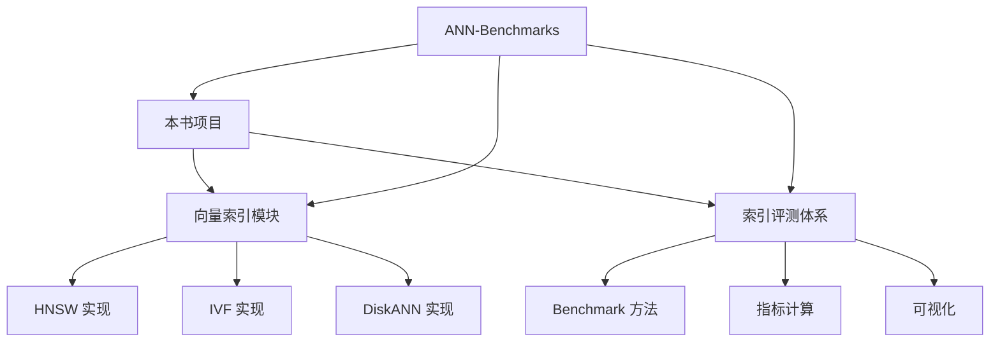
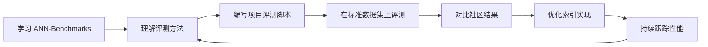

# ANN-Benchmarks 项目关联

## 学习目标
- 理解 ANN-Benchmarks 与本书项目向量索引模块的关系
- 掌握如何借鉴 ANN-Benchmarks 的评测方法来评估项目中的索引

## 核心概念

- **对标评测**：使用 ANN-Benchmarks 的评测方法评估项目中的 HNSW、IVF、DiskANN 实现
- **可借鉴点**：标准化评测流水线、指标计算方法、可视化方案
- **待改进点**：项目中向量索引评测的规范化方向

## 与本项目的关联



## 可借鉴的设计

| ANN-Benchmarks 特性 | 本项目对应 | 改进方向 |
|---------------------|------------|----------|
| 标准化数据集加载 | 测试数据生成 | 引入标准数据集（SIFT/GloVe） |
| 多算法参数搜索 | 静态参数配置 | 实现自动化参数搜索 |
| Recall-vs-QPS 图 | 无可视化 | 添加结果可视化模块 |
| Docker 容器化评测 | 本地测试 | 构建隔离的评测环境 |
| 排行榜机制 | 无 | 建立索引性能基线 |

## 项目中向量索引模块

```c
// 项目中的向量索引接口示例
// 文件位置：engineering/include/db/mm_storage.h

// 向量索引的通用接口
typedef struct VectorIndex {
    void (*build)(struct VectorIndex *idx, float *vectors, size_t n);
    void (*search)(struct VectorIndex *idx, float *query, int k, int *results);
    void (*free)(struct VectorIndex *idx);
} VectorIndex;

// 各索引实现
VectorIndex *hnsw_create(int dim, int M, int ef_construction);
VectorIndex *ivf_create(int dim, int nlist, int nprobe);
VectorIndex *diskann_create(int dim, int R, int L);
```

## 借评测方法评估项目索引

```python
# 借鉴 ANN-Benchmarks 的评测思路
# 在项目中实现类似的评测脚本

import numpy as np
import time

def evaluate_index(index, queries, ground_truth, k=10):
    """评估向量索引的召回率和 QPS"""
    start = time.time()
    results = []
    for q in queries:
        res = index.search(q, k)
        results.append(res)
    elapsed = time.time() - start

    # 计算召回率
    recall = 0
    for pred, gt in zip(results, ground_truth):
        recall += len(set(pred) & set(gt)) / k
    recall /= len(queries)

    # 计算 QPS
    qps = len(queries) / elapsed

    return {
        'recall': recall,
        'qps': qps,
        'latency_ms': elapsed / len(queries) * 1000
    }
```

## 学习与实践路径



## 预期收获

- 掌握标准化的向量索引评测方法，能够评估项目中的索引实现
- 通过对比社区结果，发现项目中索引实现的性能瓶颈
- 建立可持续的索引性能追踪体系，驱动优化迭代

## 要点总结

- ANN-Benchmarks 的评测方法论可直接应用于本项目向量索引的评估
- 标准化评测有助于发现索引实现中的性能问题
- 定期 Benchmark 是保持索引性能的关键手段
- 对比社区成熟实现可以明确优化方向

## 思考题

1. 项目中 HNSW 实现的综合性能与 HNSWlib 相比如何？差距在哪里？
2. 如何设计一个自动化脚本来持续跟踪项目索引的性能变化？
3. 除了 Recall 和 QPS，还有哪些指标对项目特定的应用场景更重要？