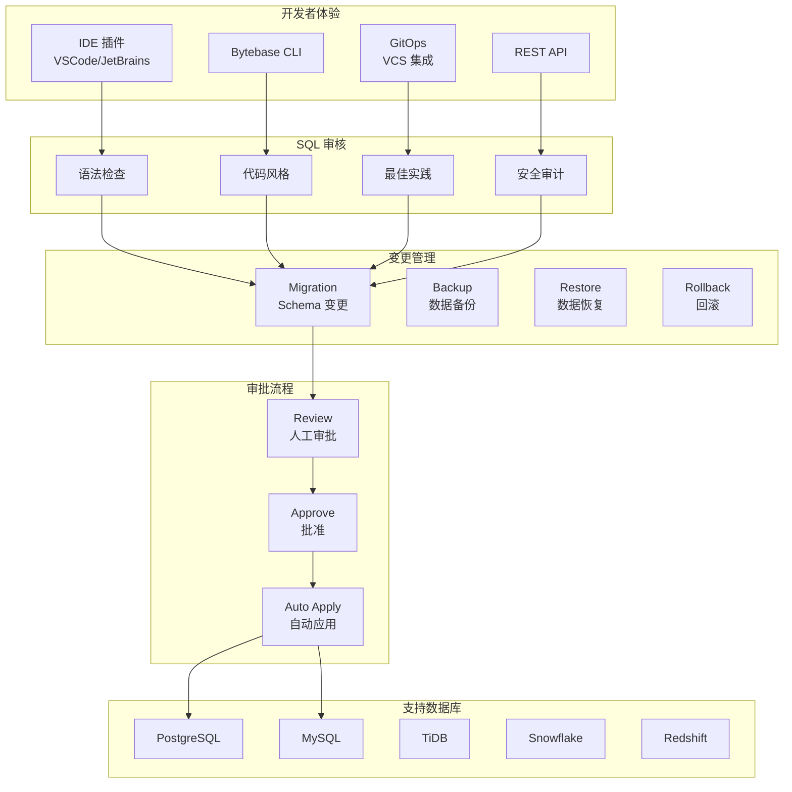

# Bytebase 项目概览

## 学习目标

- 了解 Bytebase 的定位和特点
- 掌握 Bytebase 的 Schema 即代码与 SQL 审核工作流

## 项目定位

> 数据库变更管理平台，实践 Schema 即代码理念，提供 SQL 审核、迁移管理、备份恢复等 DevOps 能力

**基本信息**：

- 开发方：Bytebase Team
- 开源协议：MIT
- GitHub Stars：~12k

## 核心设计

## 要点总结

- **Schema 即代码**：数据库变更纳入 Git 管理，支持 Code Review 流程
- **SQL 审核规则**：可配置的 SQL 风格和最佳实践检查规则
- **多数据库支持**：PostgreSQL、MySQL、TiDB、Snowflake、Redshift 等
- **审批工作流**：可配置的审批流程，支持人工审批和自动通过
- **迁移版本化**：记录每次 Schema 变更，支持回滚
- **备份恢复**：自动备份和数据恢复能力
- **GitOps 集成**：与 GitHub/GitLab 深度集成，PR 触发审核
- **IDE 插件**：提供 VSCode 和 JetBrains 插件，提升开发者体验

## 相关资源

- GitHub: https://github.com/bytebase/bytebase
- 文档: https://www.bytebase.com/docs/
