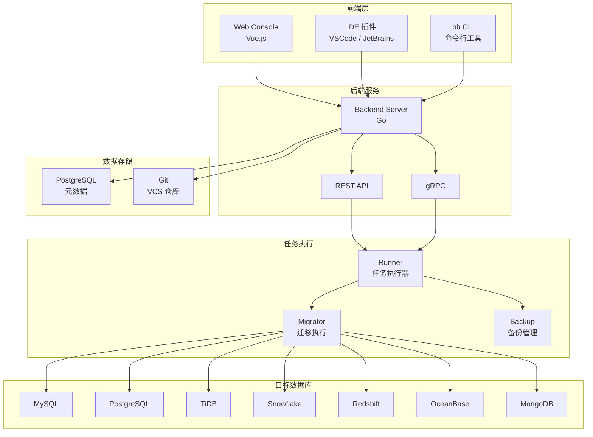
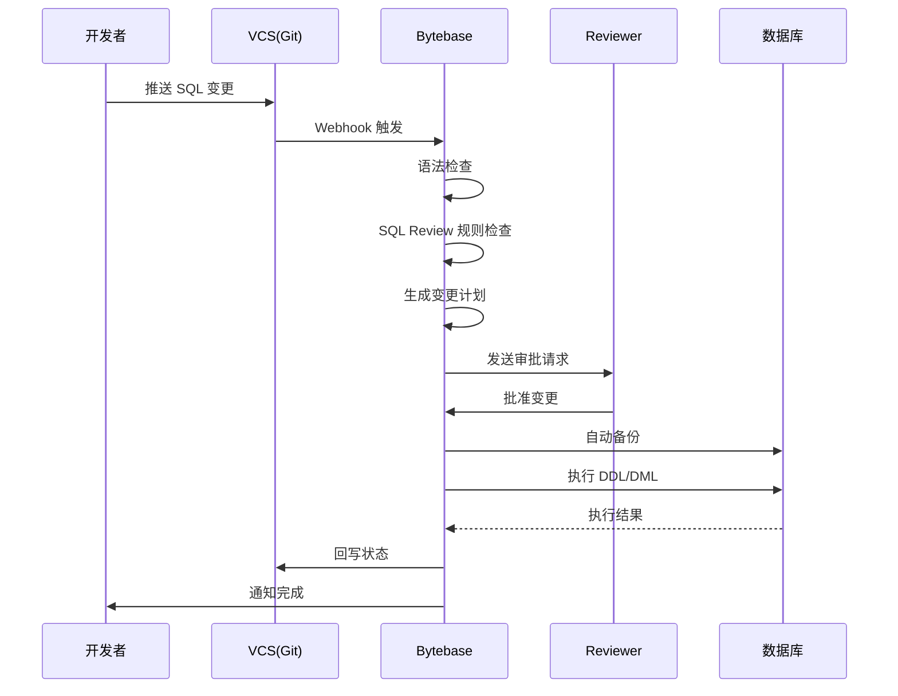
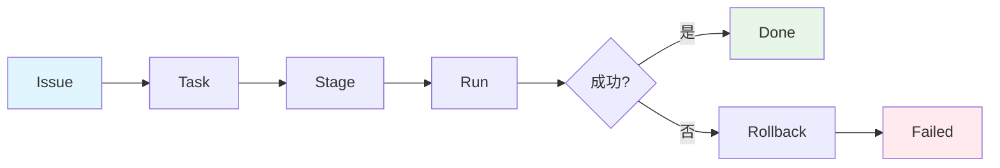
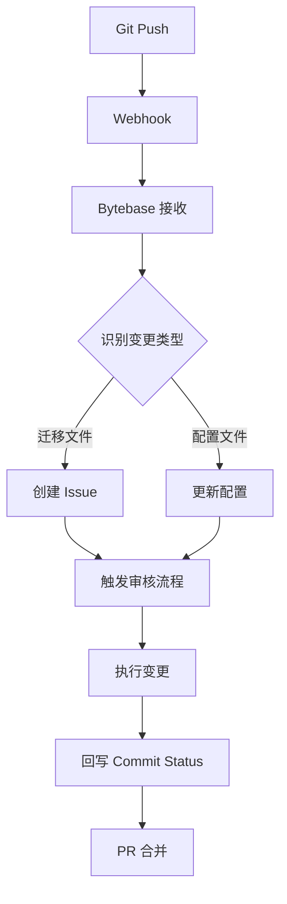

# Bytebase 架构设计

## 学习目标
- 理解 Bytebase 的整体架构分层
- 掌握 SQL 审核流程与变更管理流水线

## 整体架构



## SQL 审核流程



## 变更管理 Pipeline



### 核心概念

| 概念 | 说明 |
|------|------|
| Issue | 变更需求，由开发者创建 |
| Task | 具体的数据库变更任务 |
| Stage | 任务在特定环境中的执行阶段 |
| Run | 一次实际的执行动作 |
| Rollback | 失败后自动回滚 |

## VCS 集成



## 目录结构

```
bytebase/
├── backend/                 # Go 后端服务
│   ├── server/              # HTTP/gRPC 服务
│   ├── plugin/              # 数据库驱动插件
│   │   ├── db/              # 数据库连接
│   │   └── parser/          # SQL 解析器
│   ├── api/                 # API 定义
│   └── component/           # 业务组件
├── frontend/                # Vue.js 前端
│   ├── src/
│   └── public/
├── runner/                  # 任务执行器
├── migrator/                # 迁移工具
├── scripts/                 # 部署脚本
└── proto/                   # Protobuf 定义
```

## 要点总结

- 架构分为前端层（Console/IDE/CLI）、后端服务、任务执行、数据存储四层
- SQL 审核流程：语法检查 → SQL Review → 备份 → 执行 → 回滚（失败时）
- 变更管理 Pipeline：Issue → Task → Stage → Run → Done/Failed
- VCS 集成支持 GitOps，PR 触发审核，执行结果回写 Git

## 思考题

1. Bytebase 为什么采用 Issue-Task-Stage-Run 的四级结构？
2. VCS 集成的 GitOps 模式相比手动提交 SQL 有哪些优势？
3. 自动备份和回滚机制在生产环境中有哪些边界情况需要考虑？