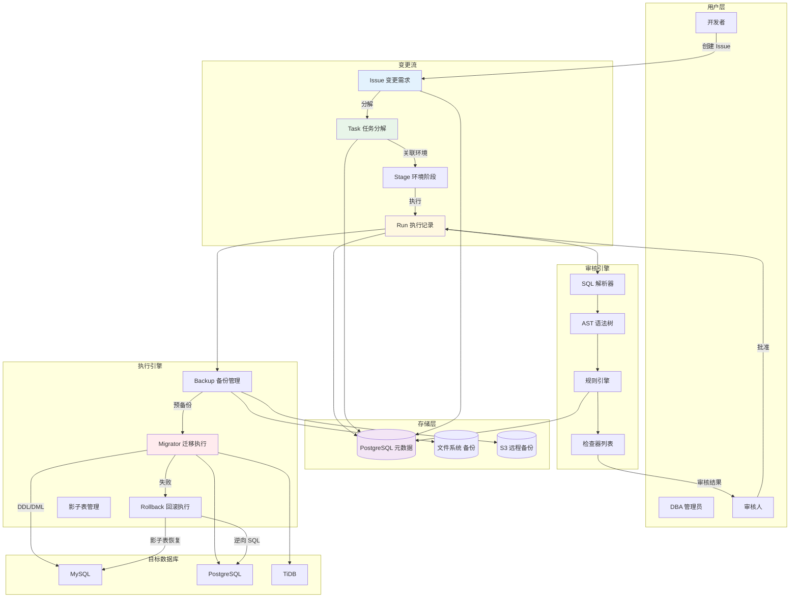

# Bytebase 变更流水线引擎

## 学习目标

1. 理解 Bytebase 变更流水线（Issue → Task → Run → Done）的存储模型和状态机
2. 掌握 SQL 审核规则的存储表示（语法检查树、规则引擎存储）
3. 了解备份与回滚数据的存储机制
4. 对比本项目 storage/ 模块的存储设计，理解元数据管理 vs 业务数据存储的差异

---

## 核心概念

### 1. 变更流水线架构

Bytebase 的变更管理围绕 **Issue（变更需求）** 展开，每个 Issue 包含多个 Task（数据库变更任务），每个 Task 对应一个 Run（执行记录），最终进入 Done 或 Failed 状态：

```
┌─────────────────────────────────────────────────────────────────────┐
│                        变更流水线全景                                 │
│                                                                     │
│   Issue (变更需求)                                                    │
│   ┌──────────────────────────────────────────────────────┐          │
│   │  Task 1: 创建 users 表                                │          │
│   │  ┌────────────────────────────────────────────────┐  │          │
│   │  │  Run 1.1: 预执行 (Pending)                      │  │          │
│   │  │  Run 1.2: 语法检查 (Review)                     │  │          │
│   │  │  Run 1.3: 备份 (Backup)                        │  │          │
│   │  │  Run 1.4: 执行 (Running)                       │  │          │
│   │  │  Run 1.5: 完成 (Done)                          │  │          │
│   │  │  或 Run 1.5: 失败 (Failed) → Rollback           │  │          │
│   │  └────────────────────────────────────────────────┘  │          │
│   │                                                      │          │
│   │  Task 2: 创建 orders 表                               │          │
│   │  ┌────────────────────────────────────────────────┐  │          │
│   │  │  Run 2.1: 预执行                               │  │          │
│   │  │  ...                                          │  │          │
│   │  └────────────────────────────────────────────────┘  │          │
│   └──────────────────────────────────────────────────────┘          │
│                                                                     │
│   状态流转: Issue → Task → Stage → Run → Done/Failed                │
└─────────────────────────────────────────────────────────────────────┘
```

### 2. 存储模型

#### 2.1 元数据存储（PostgreSQL）

Bytebase 使用 PostgreSQL 存储所有元数据。核心表结构如下：

```sql
-- 变更需求（Issue）
CREATE TABLE issue (
    id              BIGSERIAL PRIMARY KEY,
    project_id      BIGINT NOT NULL REFERENCES project(id),
    creator_id      BIGINT NOT NULL REFERENCES principal(id),
    title           TEXT NOT NULL,
    description     TEXT,
    status          TEXT NOT NULL DEFAULT 'OPEN',  -- OPEN / REVIEWING / DONE / CANCELED
    type            TEXT NOT NULL,                  -- DATABASE_CHANGE / DATA_EXPORT / ...
    assignee_id     BIGINT REFERENCES principal(id),
    created_at      TIMESTAMPTZ NOT NULL DEFAULT NOW(),
    updated_at      TIMESTAMPTZ NOT NULL DEFAULT NOW()
);

-- 变更任务（Task）
CREATE TABLE task (
    id              BIGSERIAL PRIMARY KEY,
    issue_id        BIGINT NOT NULL REFERENCES issue(id),
    database_id     BIGINT NOT NULL REFERENCES database(id),
    title           TEXT NOT NULL,
    status          TEXT NOT NULL DEFAULT 'PENDING', -- PENDING / REVIEWING / RUNNING / DONE / FAILED / CANCELED
    type            TEXT NOT NULL,                   -- DDL / DML / BACKUP / RESTORE
    payload         JSONB,                           -- 任务内容（SQL、备份配置等）
    created_at      TIMESTAMPTZ NOT NULL DEFAULT NOW(),
    updated_at      TIMESTAMPTZ NOT NULL DEFAULT NOW()
);

-- 执行记录（Run）
CREATE TABLE run (
    id              BIGSERIAL PRIMARY KEY,
    task_id         BIGINT NOT NULL REFERENCES task(id),
    status          TEXT NOT NULL DEFAULT 'PENDING', -- PENDING / RUNNING / DONE / FAILED
    detail          JSONB,                           -- 执行详情（影响行数、耗时等）
    started_at      TIMESTAMPTZ,
    finished_at     TIMESTAMPTZ,
    created_at      TIMESTAMPTZ NOT NULL DEFAULT NOW()
);

-- 备份记录（Backup）
CREATE TABLE backup (
    id              BIGSERIAL PRIMARY KEY,
    task_id         BIGINT NOT NULL REFERENCES task(id),
    database_id     BIGINT NOT NULL REFERENCES database(id),
    type            TEXT NOT NULL,                   -- MANUAL / AUTOMATIC / PRE_MIGRATION
    storage_path    TEXT NOT NULL,                   -- 备份文件路径
    status          TEXT NOT NULL DEFAULT 'PENDING', -- PENDING / RUNNING / DONE / FAILED
    size_bytes      BIGINT,
    checksum        TEXT,
    created_at      TIMESTAMPTZ NOT NULL DEFAULT NOW()
);
```

#### 2.2 状态机模型

每条变更任务都有严格的状态转换规则：

```
PENDING ──→ REVIEWING ──→ RUNNING ──→ DONE
    │            │            │
    │            │            ├──→ FAILED ──→ ROLLBACK_DONE
    │            │            │
    │            │            └──→ CANCELED
    │            │
    │            └──→ REJECTED
    │
    └──→ CANCELED
```

Bytebase 在 Go 后端中使用 **状态模式（State Pattern）** 管理状态转换：

```go
// Bytebase 状态机实现（简化）
type TaskStatus string

const (
    TaskPending   TaskStatus = "PENDING"
    TaskReviewing TaskStatus = "REVIEWING"
    TaskRunning   TaskStatus = "RUNNING"
    TaskDone      TaskStatus = "DONE"
    TaskFailed    TaskStatus = "FAILED"
    TaskCanceled  TaskStatus = "CANCELED"
)

var taskTransitions = map[TaskStatus][]TaskStatus{
    TaskPending:   {TaskReviewing, TaskCanceled},
    TaskReviewing: {TaskRunning, TaskRejected, TaskCanceled},
    TaskRunning:   {TaskDone, TaskFailed},
    TaskFailed:    {TaskRollbackDone},
}
```

### 3. SQL 审核规则的存储

Bytebase 的 SQL 审核规则引擎分为 **规则定义层** 和 **规则执行层**，两者在存储上分离。

#### 3.1 规则定义存储

规则定义存储在 PostgreSQL 的 `policy` 和 `review_rule` 表中：

```sql
-- 审核策略（一组规则的集合）
CREATE TABLE policy (
    id              BIGSERIAL PRIMARY KEY,
    name            TEXT NOT NULL,
    project_id      BIGINT REFERENCES project(id),
    environment_id  BIGINT REFERENCES environment(id),
    type            TEXT NOT NULL,  -- SQL_REVIEW / BACKUP_POLICY / ...
    payload         JSONB NOT NULL  -- 规则配置（JSON 格式）
);

-- 审核规则实例
CREATE TABLE review_rule (
    id              BIGSERIAL PRIMARY KEY,
    policy_id       BIGINT NOT NULL REFERENCES policy(id),
    rule_type       TEXT NOT NULL,  -- 规则类型（语法类/命名类/安全类等）
    level           TEXT NOT NULL DEFAULT 'ERROR',  -- ERROR / WARNING / DISABLED
    payload         JSONB,          -- 规则参数
    created_at      TIMESTAMPTZ NOT NULL DEFAULT NOW()
);
```

每条规则存储在 `payload` JSONB 字段中，包含：

```json
{
    "rule_type": "naming.table_name",
    "level": "ERROR",
    "payload": {
        "pattern": "^[a-z_]+$",
        "message": "表名必须使用小写字母和下划线"
    }
}
```

#### 3.2 语法检查树的存储

Bytebase 的 SQL 解析器基于 **TiDB 的 parser**（MySQL 协议）或 **pg_query**（PostgreSQL 协议），将 SQL 解析为 AST（抽象语法树）。AST 的结构如下：

```
SQL: SELECT u.name, COUNT(*) FROM users u JOIN orders o ON u.id = o.user_id WHERE u.age > 18 GROUP BY u.name

AST (简化):
┌──────────────────────────────────────────────────────────────┐
│                           SelectStmt                          │
│  ┌─────────────────────────────────────────────────────────┐ │
│  │  Fields:                                                  │ │
│  │    ├── ColumnRef: u.name                                  │ │
│  │    └── AggregateExpr: COUNT(*)                            │ │
│  │  From:                                                    │ │
│  │    ├── TableRef: users (alias: u)                         │ │
│  │    └── Join: INNER JOIN orders (alias: o) ON u.id=o.user_id│ │
│  │  Where:                                                   │ │
│  │    └── BinaryExpr: u.age > 18                             │ │
│  │  GroupBy:                                                  │ │
│  │    └── ColumnRef: u.name                                  │ │
│  └─────────────────────────────────────────────────────────┘ │
└──────────────────────────────────────────────────────────────┘
```

AST 在 Bytebase 中以 **Go 结构体** 形式存在于内存中，不持久化到磁盘。每次审核时重新解析 SQL 生成 AST。

#### 3.3 规则引擎的存储结构

规则引擎本身是一个 **插件系统**，每个规则是一个独立的检查器：

```go
// Bytebase 规则引擎接口（简化）
type Checker interface {
    Check(ctx context.Context, ast *AST, rule *ReviewRule) []Advice
}

type Advice struct {
    Status    AdviceStatus  // ERROR / WARNING / NOTICE
    Code      int
    Title     string
    Content   string
    Line      int
    Column    int
}
```

规则注册表存储在 `plugin/parser/` 目录下，每个数据库类型有自己的规则集：

```
plugin/
└── parser/
    ├── mysql/         # MySQL 规则集
    │   ├── naming.go      # 命名规范检查
    │   ├── statement.go   # 语句结构检查
    │   ├── column.go      # 列定义检查
    │   └── index.go       # 索引检查
    ├── postgresql/    # PostgreSQL 规则集
    │   ├── naming.go
    │   ├── statement.go
    │   └── ...
    └── tidb/          # TiDB 规则集
        └── ...
```

### 4. 备份与回滚数据的存储

#### 4.1 备份存储

Bytebase 的备份机制：

1. **预执行备份**：在执行 DDL/DML 前，先备份受影响的数据
2. **备份类型**：
   - `PRE_MIGRATION`：变更前自动备份
   - `MANUAL`：手动触发的备份
   - `AUTOMATIC`：定时自动备份

备份数据的存储路径：

```
backup/
├── <project_id>/
│   ├── <database_id>/
│   │   ├── <backup_id>_schema.sql       # DDL 前的 Schema 快照
│   │   ├── <backup_id>_data.sql         # DML 前的数据快照
│   │   └── <backup_id>_metadata.json    # 备份元数据
│   └── ...
└── ...
```

#### 4.2 回滚机制

回滚数据基于 **逆向 SQL** 生成：

```sql
-- 原始 DDL
ALTER TABLE users ADD COLUMN email TEXT;

-- 逆向 DDL（回滚脚本）
ALTER TABLE users DROP COLUMN email;

-- 原始 DML
UPDATE users SET status = 'active' WHERE id = 1;

-- 逆向 DML（基于备份数据）
UPDATE users SET status = 'inactive' WHERE id = 1;
```

Bytebase 使用 **影子表（Shadow Table）** 技术实现安全的 DDL 回滚：

```
┌──────────────────────────────────────────────────────────────┐
│                  影子表回滚流程                                 │
│                                                                │
│  Step 1: CREATE TABLE users_new (LIKE users)                   │
│  Step 2: ALTER TABLE users_new ... (应用变更)                   │
│  Step 3: INSERT INTO users_new SELECT * FROM users             │
│  Step 4: RENAME TABLE users TO users_old,                      │
│          users_new TO users                                     │
│  Step 5: 备份 users_old                                         │
│  Step 6: DROP TABLE users_old (在确认后)                       │
└──────────────────────────────────────────────────────────────┘
```

#### 4.3 备份存储引擎对比

| 备份类型 | 存储位置 | 存储格式 | 恢复方式 |
|---------|---------|---------|---------|
| Schema 快照 | 本地文件系统 / S3 | SQL 文本 | 直接执行 |
| 数据快照 | 本地文件系统 / S3 | SQL 文本 / CSV | 逐行恢复 |
| 影子表 | 目标数据库 | 物理表 | RENAME 切换 |
| WAL 归档 | 目标数据库 | 二进制 WAL | 日志回放 |

### 5. 与项目 storage/ 模块的对比

| 维度 | Bytebase（变更流水线） | 本项目 PG 风格引擎 |
|------|----------------------|-------------------|
| **存储目标** | 变更元数据 + 审核规则 + 备份文件 | 业务数据（表/索引/元组） |
| **存储引擎** | PostgreSQL（元数据）+ 文件系统（备份） | 自研 Bufmgr + WAL |
| **数据模型** | 关系型（主键/外键关联）+ JSONB | 页面 + 元组 |
| **状态管理** | 状态机（Issue/Task/Run 状态转换） | 事务状态（CLOG） |
| **持久化类型** | 业务持久化（元数据不丢失） | 事务持久化（ACID 保证） |
| **并发控制** | PostgreSQL 原生 MVCC | 自研 MVCC + 行级锁 |
| **备份机制** | 预执行备份 + 影子表 + 逆向 SQL | 物理备份（WAL 归档） |
| **规则存储** | JSONB 配置 + Go 代码插件 | 无对应功能 |
| **扩展方式** | 插件式规则注册 | 模块化存储引擎 |

#### 设计哲学差异

| 本项目 (PG 风格) | Bytebase（变更管理） |
|-----------------|-------------------|
| 面向数据存储和查询 | 面向变更过程和元数据管理 |
| 页面级物理存储 | 逻辑级语义存储 |
| 事务保证数据一致性 | 状态机保证流程一致性 |
| 自研存储引擎，控制底层 | 基于成熟数据库（PG）构建上层 |
| 追求高性能和低延迟 | 追求可靠性和可追溯性 |

---

## Mermaid 图：变更流水线架构



---

## 要点总结

1. **四级流水线模型**：Issue → Task → Stage → Run，每级有独立的状态机，支持回滚和取消
2. **元数据存储**：主存储使用 PostgreSQL，核心表包括 issue / task / run / backup / policy / review_rule
3. **审核规则存储**：规则定义以 JSONB 格式存储在 policy 和 review_rule 表中，规则实现则是 Go 代码插件
4. **AST 不持久化**：SQL 解析生成的抽象语法树仅在内存中使用，每次审核时重新解析
5. **备份机制**：预执行备份 + 影子表技术 + 逆向 SQL 生成，支持 DDL 和 DML 的安全回滚
6. **备份存储**：支持本地文件系统和 S3 远程存储，备份文件为 SQL 文本或 CSV 格式
7. **状态机驱动**：任务状态转换严格受限，保证变更流程的一致性和可追溯性
8. **与 PG 风格对比**：Bytebase 面向变更元数据管理，本项目面向业务数据存储，两者目标不同

---

## 思考题

1. **状态机设计**：Bytebase 使用严格的状态转换表（TaskStatus → []TaskStatus）来管理状态。如果项目中的 CLOG 事务状态也采用类似的状态机模式，现有的 2PC 状态管理能否简化？

2. **影子表 vs 逆向 SQL**：DDL 回滚有两种方案——影子表（先建新表再切换）和逆向 SQL（生成反向 DDL）。各有什么优劣？在多表关联的场景下，影子表策略有无局限性？

3. **规则存储设计**：Bytebase 将审核规则存储在 JSONB 中，规则实现则用 Go 接口。如果项目要引入类似的规则引擎（如 SQL 质量检查），应该采用配置驱动还是代码驱动？两者在扩展性上有什么差异？

4. **备份粒度**：Bytebase 的备份是表级快照（SQL 导出），而本项目 PG 引擎的 WAL 归档是页面级物理备份。在变更回滚场景中，哪种备份粒度更合适？为什么？

5. **元数据 vs 业务数据**：本项目 PG 引擎的 Catalog 系统表存储数据库元数据，Bytebase 用 PostgreSQL 存储变更流水线元数据。两者在设计上有什么共同点？如果要在项目中实现变更历史追踪，Catalog 的扩展方向是什么？