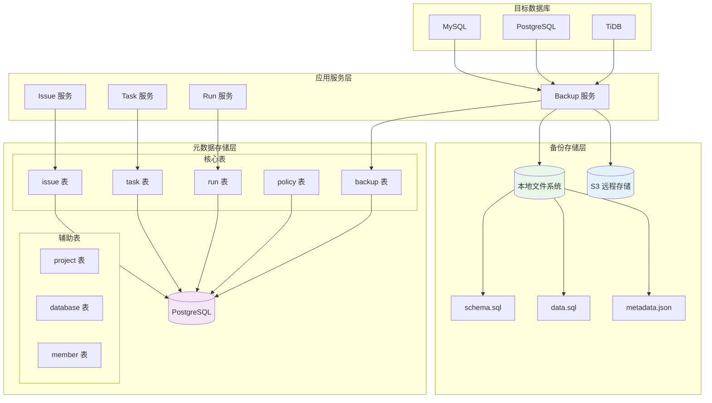

# Bytebase 存储引擎

## 学习目标

1. 理解 Bytebase 核心存储架构和数据结构设计
2. 掌握数据持久化机制（元数据存储 + 备份存储）
3. 了解读写路径和数据流转过程
4. 对比本项目 storage/ 模块的存储设计，理解不同场景的存储选型

---

## 核心概念

### 1. 存储架构总览

Bytebase 的存储架构分为两层：**元数据存储层** 和 **备份存储层**。元数据存储使用 PostgreSQL，备份存储支持本地文件系统和 S3。

```
┌─────────────────────────────────────────────────────────────────────┐
│                      Bytebase 存储架构                                │
│                                                                     │
│  ┌─────────────────────────────────────────────────────────────┐   │
│  │                     应用层                                    │   │
│  │  ┌──────────┐ ┌──────────┐ ┌──────────┐ ┌──────────┐       │   │
│  │  │ Issue    │ │ Task     │ │ Run      │ │ Policy   │       │   │
│  │  │ 服务     │ │ 服务     │ │ 服务     │ │ 服务     │       │   │
│  │  └────┬─────┘ └────┬─────┘ └────┬─────┘ └────┬─────┘       │   │
│  └───────┼────────────┼────────────┼────────────┼─────────────┘   │
│          │            │            │            │                  │
│          ▼            ▼            ▼            ▼                  │
│  ┌─────────────────────────────────────────────────────────────┐   │
│  │                   元数据存储层                                │   │
│  │                                                              │   │
│  │  ┌────────────────────────────────────────────────────┐     │   │
│  │  │              PostgreSQL 数据库                       │     │   │
│  │  │  ┌──────────┐ ┌──────────┐ ┌──────────┐ ┌──────────┐│     │   │
│  │  │  │ issue    │ │ task     │ │ run      │ │ policy   ││     │   │
│  │  │  │ 表       │ │ 表       │ │ 表       │ │ 表       ││     │   │
│  │  │  └──────────┘ └──────────┘ └──────────┘ └──────────┘│     │   │
│  │  │  ┌──────────┐ ┌──────────┐ ┌──────────┐ ┌──────────┐│     │   │
│  │  │  │ backup   │ │ member   │ │ project  │ │ database ││     │   │
│  │  │  │ 表       │ │ 表       │ │ 表       │ │ 表       ││     │   │
│  │  │  └──────────┘ └──────────┘ └──────────┘ └──────────┘│     │   │
│  │  └────────────────────────────────────────────────────┘     │   │
│  └─────────────────────────────────────────────────────────────┘   │
│                              │                                      │
│                              ▼                                      │
│  ┌─────────────────────────────────────────────────────────────┐   │
│  │                   备份存储层                                  │   │
│  │                                                              │   │
│  │  ┌──────────────────┐         ┌──────────────────┐          │   │
│  │  │  本地文件系统     │         │   S3 远程存储    │          │   │
│  │  │  backup/         │         │  bucket/backup/  │          │   │
│  │  │  ├── schema.sql  │         │  ├── schema.sql  │          │   │
│  │  │  ├── data.sql    │         │  ├── data.sql    │          │   │
│  │  │  └── metadata.json│         │  └── metadata.json│          │   │
│  │  └──────────────────┘         └──────────────────┘          │   │
│  └─────────────────────────────────────────────────────────────┘   │
│                                                                     │
└─────────────────────────────────────────────────────────────────────┘
```

### 2. 核心数据结构

#### 2.1 元数据表结构

Bytebase 的核心元数据存储在 PostgreSQL 中，主要表结构如下：

```sql
-- 项目表
CREATE TABLE project (
    id              BIGSERIAL PRIMARY KEY,
    name            TEXT NOT NULL,
    key             TEXT NOT NULL UNIQUE,    -- 项目标识
    visibility      TEXT NOT NULL DEFAULT 'PRIVATE',
    creator_id      BIGINT NOT NULL REFERENCES principal(id),
    created_at      TIMESTAMPTZ NOT NULL DEFAULT NOW()
);

-- 数据库实例表
CREATE TABLE database (
    id              BIGSERIAL PRIMARY KEY,
    name            TEXT NOT NULL,
    environment_id  BIGINT NOT NULL REFERENCES environment(id),
    instance_id     BIGINT NOT NULL REFERENCES instance(id),
    schema_version  TEXT,                     -- 当前 Schema 版本
    created_at      TIMESTAMPTZ NOT NULL DEFAULT NOW()
);

-- 数据库实例连接表
CREATE TABLE instance (
    id              BIGSERIAL PRIMARY KEY,
    name            TEXT NOT NULL,
    engine          TEXT NOT NULL,            -- MYSQL / POSTGRES / TIDB
    host            TEXT NOT NULL,
    port            INT NOT NULL,
    username        TEXT NOT NULL,
    password        TEXT,                     -- 加密存储
    created_at      TIMESTAMPTZ NOT NULL DEFAULT NOW()
);
```

#### 2.2 变更流水线表结构

```sql
-- Issue 表
CREATE TABLE issue (
    id              BIGSERIAL PRIMARY KEY,
    project_id      BIGINT NOT NULL REFERENCES project(id),
    title           TEXT NOT NULL,
    description     TEXT,
    status          TEXT NOT NULL DEFAULT 'OPEN',
    type            TEXT NOT NULL,
    assignee_id     BIGINT REFERENCES principal(id),
    created_at      TIMESTAMPTZ NOT NULL DEFAULT NOW()
);

-- Task 表
CREATE TABLE task (
    id              BIGSERIAL PRIMARY KEY,
    issue_id        BIGINT NOT NULL REFERENCES issue(id),
    database_id     BIGINT NOT NULL REFERENCES database(id),
    status          TEXT NOT NULL DEFAULT 'PENDING',
    type            TEXT NOT NULL,            -- DDL / DML / BACKUP
    payload         JSONB,                    -- 任务内容
    created_at      TIMESTAMPTZ NOT NULL DEFAULT NOW()
);

-- Run 表
CREATE TABLE run (
    id              BIGSERIAL PRIMARY KEY,
    task_id         BIGINT NOT NULL REFERENCES task(id),
    status          TEXT NOT NULL DEFAULT 'PENDING',
    detail          JSONB,                    -- 执行详情
    started_at      TIMESTAMPTZ,
    finished_at     TIMESTAMPTZ
);
```

#### 2.3 JSONB 字段使用

Bytebase 大量使用 PostgreSQL 的 JSONB 类型存储半结构化数据：

```json
-- Task.payload 示例（DDL 任务）
{
    "statement": "ALTER TABLE users ADD COLUMN email VARCHAR(255)",
    "schema_version": "V002",
    "rollback_statement": "ALTER TABLE users DROP COLUMN email",
    "estimated_rows": 0
}

-- Run.detail 示例（执行结果）
{
    "affected_rows": 0,
    "execution_time_ms": 1523,
    "backup_id": 12345,
    "error_message": null
}

-- Policy.payload 示例（审核规则配置）
{
    "rules": [
        {
            "type": "naming.table_name",
            "level": "ERROR",
            "payload": {"pattern": "^[a-z_]+$"}
        },
        {
            "type": "statement.no-select-star",
            "level": "WARNING"
        }
    ]
}
```

### 3. 数据持久化机制

#### 3.1 元数据持久化

Bytebase 的元数据存储依赖 PostgreSQL 的 ACID 特性：

```
┌──────────────────────────────────────────────────────────────┐
│                    PostgreSQL 持久化保证                        │
│                                                                │
│  1. WAL（Write-Ahead Logging）                                 │
│     - 所有修改先写 WAL 日志                                     │
│     - 崩溃后通过 WAL 重放恢复                                   │
│     - 保证 Durability                                          │
│                                                                │
│  2. MVCC（多版本并发控制）                                      │
│     - 读写不阻塞                                               │
│     - 通过 xmin/xmax 实现行版本管理                            │
│     - 保证 Isolation                                           │
│                                                                │
│  3. Checkpoint                                                 │
│     - 定期将脏页刷盘                                           │
│     - 减少 WAL 重放时间                                        │
│     - 保证 Recovery 性能                                       │
│                                                                │
│  4. JSONB 索引                                                 │
│     - 支持 GIN 索引加速 JSONB 查询                             │
│     - payload 字段可建立表达式索引                             │
│                                                                │
└──────────────────────────────────────────────────────────────┘
```

JSONB 查询示例：

```sql
-- 查询所有包含 "naming.table_name" 规则的策略
SELECT * FROM policy 
WHERE payload->'rules' @> '[{"type": "naming.table_name"}]';

-- 查询所有执行时间超过 1 秒的 Run
SELECT * FROM run 
WHERE (detail->>'execution_time_ms')::int > 1000;
```

#### 3.2 备份持久化

备份文件的存储格式：

```
backup/
├── <project_id>/
│   ├── <database_id>/
│   │   ├── <backup_id>_schema.sql       # Schema 快照
│   │   ├── <backup_id>_data.sql         # 数据快照（可选）
│   │   └── <backup_id>_metadata.json    # 备份元数据
│   └── ...
└── ...

-- metadata.json 内容
{
    "backup_id": "b12345",
    "database_id": "db001",
    "type": "PRE_MIGRATION",
    "created_at": "2024-01-15T10:30:00Z",
    "size_bytes": 15728640,
    "checksum": "sha256:abc123...",
    "schema_version": "V001",
    "tables": ["users", "orders", "products"]
}
```

### 4. 读写路径

#### 4.1 写路径（Issue 创建）

```
┌──────────────────────────────────────────────────────────────┐
│                     Issue 创建写路径                           │
│                                                                │
│  Step 1: 用户创建 Issue                                        │
│     │                                                          │
│     ▼                                                          │
│  Step 2: 后端验证权限和参数                                     │
│     │                                                          │
│     ▼                                                          │
│  Step 3: 开启事务                                              │
│     │                                                          │
│     ├── INSERT INTO issue (project_id, title, ...)            │
│     │                                                          │
│     ├── INSERT INTO task (issue_id, database_id, ...)         │
│     │      (一个 Issue 可能产生多个 Task)                        │
│     │                                                          │
│     └── 提交事务                                               │
│          │                                                     │
│          ▼                                                     │
│  Step 4: PostgreSQL 写 WAL                                     │
│          │                                                     │
│          ▼                                                     │
│  Step 5: 返回 Issue ID                                         │
│          │                                                     │
│          ▼                                                     │
│  Step 6: 触发异步任务（通知、Webhook）                          │
│                                                                │
└──────────────────────────────────────────────────────────────┘
```

#### 4.2 读路径（Run 查询）

```
┌──────────────────────────────────────────────────────────────┐
│                     Run 查询读路径                             │
│                                                                │
│  Step 1: 用户查询 Run 详情                                     │
│     │                                                          │
│     ▼                                                          │
│  Step 2: 后端验证权限                                          │
│     │                                                          │
│     ▼                                                          │
│  Step 3: 查询 PostgreSQL                                       │
│     │                                                          │
│     SELECT r.*, t.title, d.name as db_name                     │
│     FROM run r                                                 │
│     JOIN task t ON r.task_id = t.id                            │
│     JOIN database d ON t.database_id = d.id                    │
│     WHERE r.id = $1                                            │
│     │                                                          │
│     ▼                                                          │
│  Step 4: PostgreSQL 从 Buffer Pool 读取                        │
│     │   (如果页面不在内存，从磁盘加载)                          │
│     │                                                          │
│     ▼                                                          │
│  Step 5: 返回结果（包含 JSONB detail 字段）                     │
│     │                                                          │
│     ▼                                                          │
│  Step 6: 后端组装响应并返回                                    │
│                                                                │
└──────────────────────────────────────────────────────────────┘
```

#### 4.3 备份读写路径

```
写入备份:
┌────────────┐     ┌────────────┐     ┌────────────┐
│ 目标数据库  │────▶│ mysqldump  │────▶│ 本地文件   │
│ (MySQL/PG) │     │ pg_dump    │     │ 或 S3      │
└────────────┘     └────────────┘     └────────────┘
                         │
                         ▼
                  ┌────────────┐
                  │ 记录 backup │
                  │ 表元数据    │
                  └────────────┘

读取备份（恢复）:
┌────────────┐     ┌────────────┐     ┌────────────┐
│ 本地文件   │────▶│ 解析 SQL   │────▶│ 目标数据库  │
│ 或 S3      │     │ 逐条执行    │     │ (恢复数据)  │
└────────────┘     └────────────┘     └────────────┘
```

### 5. 与项目 storage/ 模块的对比

| 维度 | Bytebase 存储引擎 | 本项目 PG 风格存储引擎 |
|------|-------------------|------------------------|
| **存储目标** | 变更管理元数据 | 业务数据（表/索引/元组） |
| **存储介质** | PostgreSQL + 文件系统/S3 | 自研 Buffer Pool + 磁盘文件 |
| **数据模型** | 关系型 + JSONB | 页面 + 元组 |
| **持久化方式** | 依赖 PostgreSQL WAL | 自研 WAL + CLOG |
| **并发控制** | PostgreSQL MVCC | 自研 MVCC + 行级锁 |
| **索引结构** | B+Tree + GIN | BTree AM |
| **备份机制** | 逻辑备份（SQL 导出） | 物理备份（WAL 归档） |
| **事务隔离** | 依赖 PG 事务隔离级别 | 自研 2PC + Snapshot |
| **扩展方式** | 水平扩展（读副本） | 单机存储引擎 |

#### 设计哲学对比

```
┌──────────────────────────────────────────────────────────────┐
│                     存储引擎设计哲学对比                        │
│                                                                │
│  Bytebase (元数据管理):                                        │
│  ├── 目标: 可靠性 > 性能                                       │
│  ├── 借助成熟数据库 (PostgreSQL) 保证 ACID                     │
│  ├── JSONB 灵活存储规则配置                                    │
│  ├── 备份采用逻辑导出（SQL 文本）                              │
│  └── 关注点: 变更追溯、权限控制、审计日志                      │
│                                                                │
│  本项目 (业务数据存储):                                        │
│  ├── 目标: 性能 + 控制力                                       │
│  ├── 自研存储引擎，精细控制每一层                              │
│  ├── 页面级物理存储，紧凑高效                                  │
│  ├── WAL 保证事务持久化                                        │
│  └── 关注点: 查询性能、并发吞吐、存储效率                      │
│                                                                │
└──────────────────────────────────────────────────────────────┘
```

#### 可借鉴的设计点

| Bytebase 设计 | 本项目可借鉴方向 |
|--------------|-----------------|
| JSONB 存储 Task.payload | 系统表可支持 JSONB 字段存储扩展元数据 |
| 状态机管理 Task 状态 | CLOG 事务状态可引入状态机模式 |
| 备份元数据表设计 | 实现备份元数据管理模块 |
| 多存储后端（本地/S3） | 支持备份文件远程存储 |

---

## Mermaid 图：存储架构全景



---

## 要点总结

1. **双层存储架构**：元数据存储使用 PostgreSQL，备份存储支持本地文件系统和 S3
2. **核心表结构**：issue / task / run / policy / backup 五张核心表，存储变更流水线所有状态
3. **JSONB 灵活存储**：Task.payload 和 Run.detail 使用 JSONB 类型，支持半结构化数据
4. **持久化保证**：依赖 PostgreSQL 的 WAL 和 MVCC 保证元数据的 ACID
5. **备份机制**：逻辑备份（SQL 导出）+ 元数据表记录 + 文件存储
6. **写路径**：事务批量写入 issue + task，PostgreSQL WAL 保证持久化
7. **读路径**：JOIN 查询关联多表，PostgreSQL Buffer Pool 缓存热数据
8. **与本项目对比**：Bytebase 面向元数据管理，本项目面向业务数据存储，设计目标不同

---

## 思考题

1. **存储选型**：Bytebase 选择 PostgreSQL 存储元数据，而非自己实现存储引擎。这种"借用成熟数据库"的策略在什么场景下是合适的？本项目如果要做变更历史追踪，是否应该复用 Bytebase 的方案？

2. **JSONB vs 关系表**：Bytebase 大量使用 JSONB 存储 Task.payload 和 Run.detail。这种设计的优劣是什么？如果 payload 字段需要支持复杂查询，JSONB 的性能如何优化？

3. **备份策略**：Bytebase 的备份是逻辑备份（SQL 导出），本项目 PG 引擎支持 WAL 物理备份。在变更回滚场景中，两种备份方式各有什么适用场景？

4. **状态机复用**：Bytebase 的 Task 状态转换使用严格的状态机（TaskStatus → []TaskStatus）。本项目 CLOG 的事务状态管理是否可以借鉴这种模式？如何实现事务状态的状态机化？

5. **多租户隔离**：Bytebase 通过 project_id 实现多租户数据隔离。本项目的 Catalog 系统表如果要支持多租户，应该如何设计？
