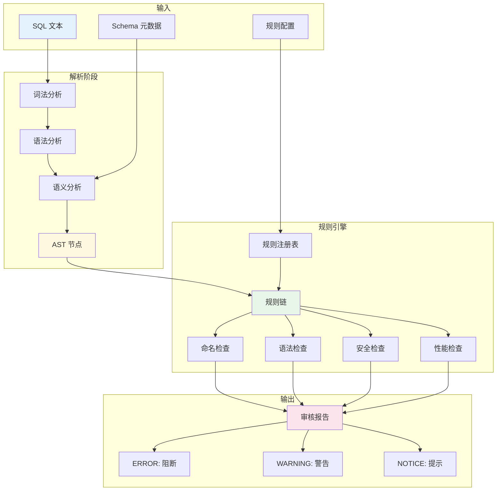

# Bytebase SQL 审核引擎

## 学习目标

1. 理解 Bytebase SQL 解析与语法检查流程
2. 掌握静态分析规则的分类和实现方式
3. 了解规则引擎的架构设计
4. 对比本项目 algo/ 模块的算法能力，探讨复用可能性

---

## 核心概念

### 1. SQL 审核引擎架构

Bytebase 的 SQL 审核引擎是一个多阶段流水线，包括 **解析 → 检查 → 报告** 三个核心阶段：

```
┌─────────────────────────────────────────────────────────────────────┐
│                      SQL 审核引擎架构                                 │
│                                                                     │
│  输入 SQL                                                           │
│     │                                                               │
│     ▼                                                               │
│  ┌────────────────┐                                                 │
│  │  词法分析器     │  → Token 流                                     │
│  │  (Lexer)       │    [SELECT] [id] [,] [name] [FROM] ...          │
│  └───────┬────────┘                                                 │
│          │                                                          │
│          ▼                                                          │
│  ┌────────────────┐                                                 │
│  │  语法分析器     │  → AST (抽象语法树)                              │
│  │  (Parser)      │                                                 │
│  └───────┬────────┘                                                 │
│          │                                                          │
│          ▼                                                          │
│  ┌────────────────┐                                                 │
│  │  语义分析器     │  → 类型检查 / 表解析 / 列解析                     │
│  │  (Analyzer)    │                                                 │
│  └───────┬────────┘                                                 │
│          │                                                          │
│          ▼                                                          │
│  ┌────────────────────────────────────────────────────┐            │
│  │              规则引擎 (Rule Engine)                   │            │
│  │  ┌──────────┐ ┌──────────┐ ┌──────────┐ ┌──────────┐│            │
│  │  │ 命名检查  │ │ 语法检查  │ │ 安全检查  │ │ 性能检查  ││            │
│  │  └────┬─────┘ └────┬─────┘ └────┬─────┘ └────┬─────┘│            │
│  │       │            │            │            │      │            │
│  │       └────────────┴────────────┴────────────┘      │            │
│  │                       │                             │            │
│  └───────────────────────┼─────────────────────────────┘            │
│                          │                                          │
│                          ▼                                          │
│  ┌────────────────┐                                                 │
│  │  报告生成器     │  → 审核报告（ERROR / WARNING / NOTICE）           │
│  └────────────────┘                                                 │
│                                                                     │
└─────────────────────────────────────────────────────────────────────┘
```

### 2. SQL 解析流程

#### 2.1 词法分析（Lexing）

词法分析器将 SQL 文本分割为 Token 流。Bytebase 使用数据库原生的词法分析器：

```go
// MySQL 使用 TiDB parser 的词法分析器
import "github.com/pingcap/tidb/parser"

lexer := parser.NewLexer(sql)
tokens := lexer.Lex()

// PostgreSQL 使用 pg_query 的词法分析器
import "github.com/pganalyze/pg_query_go/v4"

result, _ := pg_query.Parse(sql)
```

Token 类型示例：

| Token | 类型 | 示例 |
|-------|------|------|
| `SELECT` | 关键字 | `SELECT`, `FROM`, `WHERE` |
| `id` | 标识符 | 表名、列名 |
| `123` | 数字字面量 | 整数、浮点数 |
| `'hello'` | 字符串字面量 | 单引号字符串 |
| `*` | 操作符 | `+`, `-`, `*`, `/`, `=` |

#### 2.2 语法分析（Parsing）

语法分析器将 Token 流转换为 AST。以简单查询为例：

```sql
SELECT id, name FROM users WHERE age > 18
```

对应的 AST（简化表示）：

```
SelectStmt
├── SelectList
│   ├── ColumnRef: id
│   └── ColumnRef: name
├── FromClause
│   └── TableRef: users
├── WhereClause
│   └── BinaryExpr
│       ├── ColumnRef: age
│       ├── Operator: >
│       └── Literal: 18
└── GroupByClause: (empty)
    └── OrderByClause: (empty)
```

#### 2.3 语义分析（Semantic Analysis）

语义分析器对 AST 进行类型检查和引用解析：

```
┌──────────────────────────────────────────────────────────────┐
│                      语义分析流程                                │
│                                                                │
│  1. 表解析                                                      │
│     - 检查表是否存在                                             │
│     - 加载表结构（列名、类型、约束）                              │
│     - 处理表别名                                                 │
│                                                                │
│  2. 列解析                                                      │
│     - 检查列是否存在                                             │
│     - 解析列所属表（处理 JOIN 歧义）                             │
│     - 验证列类型兼容性                                           │
│                                                                │
│  3. 表达式类型推导                                               │
│     - 算术表达式: INT + INT → INT                                │
│     - 比较表达式: ANY → BOOLEAN                                  │
│     - 聚合函数: AVG(INT) → REAL                                 │
│                                                                │
│  4. 约束检查                                                    │
│     - NOT NULL 约束                                             │
│     - UNIQUE 约束                                               │
│     - 外键约束                                                   │
└──────────────────────────────────────────────────────────────┘
```

### 3. 静态分析规则

Bytebase 的静态分析规则分为 **四大类别**：

#### 3.1 命名规范类（Naming Rules）

| 规则 | 说明 | 示例 |
|------|------|------|
| `naming.table_name` | 表名格式检查 | `^[a-z_]+$` |
| `naming.column_name` | 列名格式检查 | `^[a-z_]+$` |
| `naming.index_name` | 索引名格式检查 | `idx_<table>_<column>` |
| `naming.primary_key` | 主键命名规范 | `pk_<table>` |
| `naming.foreign_key` | 外键命名规范 | `fk_<table>_<ref>` |

命名规则的检查流程：

```
AST 节点: CreateTableStmt
    │
    ├── 提取表名: users_info
    │       │
    │       ▼
    │   匹配正则: ^[a-z_]+$
    │       │
    │       ▼ (不匹配)
    │   报告: ERROR - 表名应使用小写字母和下划线
    │
    └── 提取列名: userId
            │
            ▼
        匹配正则: ^[a-z_]+$
            │
            ▼ (不匹配)
        报告: WARNING - 列名应使用 snake_case
```

#### 3.2 语法规范类（Syntax Rules）

| 规则 | 说明 | 检查方式 |
|------|------|---------|
| `statement.select.no-star` | 禁止 SELECT * | 遍历 SelectList 节点 |
| `statement.where.no-or` | WHERE 禁止 OR | 检查 WhereClause 二叉树 |
| `statement.where.no-function` | WHERE 禁止函数调用 | 检查 WhereClause 节点类型 |
| `statement.join.no-cross` | 禁止 CROSS JOIN | 检查 JoinType |
| `statement.order-by.constant` | ORDER BY 禁止常量 | 检查 OrderBy 节点 |

SELECT * 检查实现：

```go
func CheckNoStar(stmt *SelectStmt, rule *ReviewRule) []Advice {
    var advices []Advice
    for _, field := range stmt.SelectList.Fields {
        if field.IsStar() {
            advices = append(advices, Advice{
                Status:  AdviceError,
                Code:    101,
                Title:   "禁止 SELECT *",
                Content: "SELECT * 会导致不必要的列读取，影响性能",
                Line:    field.Line,
            })
        }
    }
    return advices
}
```

#### 3.3 安全规范类（Security Rules）

| 规则 | 说明 | 风险 |
|------|------|------|
| `security.no-drop-table` | 禁止 DROP TABLE | 数据丢失风险 |
| `security.no-truncate-table` | 禁止 TRUNCATE TABLE | 数据丢失风险 |
| `security.no-delete-without-where` | DELETE 必须有 WHERE | 全表删除风险 |
| `security.no-update-without-where` | UPDATE 必须有 WHERE | 全表更新风险 |
| `security.no-sensitive-column` | 敏感列禁止明文存储 | 数据泄露风险 |

DELETE 无 WHERE 检查：

```go
func CheckDeleteWithWhere(stmt *DeleteStmt, rule *ReviewRule) []Advice {
    if stmt.WhereClause == nil {
        return []Advice{{
            Status:  AdviceError,
            Code:    201,
            Title:   "DELETE 语句必须包含 WHERE 条件",
            Content: "没有 WHERE 条件的 DELETE 会删除全表数据",
            Line:    stmt.Line,
        }}
    }
    return nil
}
```

#### 3.4 性能规范类（Performance Rules）

| 规则 | 说明 | 原理 |
|------|------|------|
| `performance.where.index-hint` | WHERE 条件需索引支持 | 全表扫描风险 |
| `performance.join.index-hint` | JOIN 条件需索引支持 | 笛卡尔积风险 |
| `performance.order-by.index-hint` | ORDER BY 需索引支持 | 文件排序风险 |
| `performance.limit-required` | 大表查询需 LIMIT | 内存溢出风险 |
| `performance.no-subquery` | 避免子查询 | 性能损耗 |

索引覆盖检查：

```go
func CheckIndexHint(stmt *SelectStmt, schema *Schema, rule *ReviewRule) []Advice {
    var advices []Advice
    
    // 提取 WHERE 条件中的列
    whereColumns := extractWhereColumns(stmt.WhereClause)
    
    // 检查是否有索引覆盖
    for _, col := range whereColumns {
        if !schema.HasIndex(col.TableName, col.ColumnName) {
            advices = append(advices, Advice{
                Status:  AdviceWarning,
                Code:    301,
                Title:   "建议为 WHERE 条件列添加索引",
                Content: fmt.Sprintf("列 %s.%s 没有 index，可能导致全表扫描", col.TableName, col.ColumnName),
                Line:    col.Line,
            })
        }
    }
    return advices
}
```

### 4. 规则引擎架构

Bytebase 的规则引擎采用 **责任链模式** 和 **插件架构**：

```
┌─────────────────────────────────────────────────────────────────────┐
│                      规则引擎架构                                     │
│                                                                     │
│  ┌────────────────────────────────────────────────────────────┐    │
│  │                    RuleRegistry（规则注册表）                  │    │
│  │  ┌──────────────────────────────────────────────────────┐  │    │
│  │  │  MySQL Rules       PostgreSQL Rules    TiDB Rules    │  │    │
│  │  │  ├── naming.*      ├── naming.*        ├── naming.*  │  │    │
│  │  │  ├── statement.*   ├── statement.*     ├── statement.*│  │    │
│  │  │  ├── security.*    ├── security.*      ├── security.*│  │    │
│  │  │  └── performance.* └── performance.*   └── ...      │  │    │
│  │  └──────────────────────────────────────────────────────┘  │    │
│  └────────────────────────────────────────────────────────────┘    │
│                              │                                      │
│                              ▼                                      │
│  ┌────────────────────────────────────────────────────────────┐    │
│  │                   RuleChain（规则链）                         │    │
│  │                                                              │    │
│  │   Checker 1 ──→ Checker 2 ──→ Checker 3 ──→ Checker N       │    │
│  │       │              │              │              │         │    │
│  │       ▼              ▼              ▼              ▼         │    │
│  │   Advice[]      Advice[]      Advice[]      Advice[]        │    │
│  │                                                              │    │
│  └────────────────────────────────────────────────────────────┘    │
│                              │                                      │
│                              ▼                                      │
│  ┌────────────────────────────────────────────────────────────┐    │
│  │                  ReportBuilder（报告生成）                     │    │
│  │                                                              │    │
│  │   ERROR:   3 条（阻止执行）                                    │    │
│  │   WARNING: 5 条（警告提示）                                    │    │
│  │   NOTICE:  2 条（信息提示）                                    │    │
│  │                                                              │    │
│  └────────────────────────────────────────────────────────────┘    │
│                                                                     │
└─────────────────────────────────────────────────────────────────────┘
```

#### 4.1 Checker 接口

每个规则实现统一的 Checker 接口：

```go
type Checker interface {
    // Check 执行规则检查
    Check(ctx context.Context, stmt Statement, schema *Schema, rule *ReviewRule) []Advice
}

type Statement interface {
    // GetAST 返回 AST 节点
    GetAST() ast.Node
    // GetDatabase 返回目标数据库
    GetDatabase() string
}

type Advice struct {
    Status  AdviceStatus  // ERROR / WARNING / NOTICE
    Code    int           // 规则编码
    Title   string        // 规则标题
    Content string        // 详细说明
    Line    int           // 行号
    Column  int           // 列号
}
```

#### 4.2 规则优先级

规则的严重程度决定了处理方式：

```
┌──────────────────────────────────────────────────────────────┐
│                    规则严重程度                                 │
│                                                                │
│  ERROR (阻断):                                                 │
│  ├── 阻止变更执行                                              │
│  ├── 必须修复后才能继续                                        │
│  └── 示例: DROP TABLE、DELETE 无 WHERE                         │
│                                                                │
│  WARNING (警告):                                               │
│  ├── 显示警告但不阻止                                          │
│  ├── 建议修复                                                  │
│  └── 示例: WHERE 条件无索引、SELECT *                          │
│                                                                │
│  NOTICE (提示):                                                │
│  ├── 仅作信息提示                                              │
│  ├── 不影响执行                                                │
│  └── 示例: 命名风格建议、索引命名规范                           │
│                                                                │
└──────────────────────────────────────────────────────────────┘
```

### 5. 与项目 algo/ 模块的关联

Bytebase 的 SQL 审核引擎主要依赖 **字符串匹配**、**树遍历** 和 **模式匹配**，与本项目 algo/ 模块有以下关联：

#### 5.1 可复用的算法

| 算法类别 | 本项目 algo/ | SQL 审核应用 |
|---------|-------------|-------------|
| **字符串匹配** | `algo/string/` (KMP/BM) | 正则匹配、关键字识别 |
| **哈希表** | `ds/hash/` (CCEH/Linear Hash) | 符号表、变量表 |
| **树遍历** | `ds/tree/` (二叉树/B+Tree) | AST 遍历、表达式树 |
| **正则引擎** | 无 | 命名规范检查 |
| **距离计算** | `algo/distance/` (编辑距离) | SQL 相似度检测 |

#### 5.2 AST 遍历算法

AST 是一个树结构，SQL 审核需要遍历整棵树进行规则检查：

```
AST 遍历模式:

1. 深度优先遍历（DFS）
   - 用于语义分析（类型推导、引用解析）
   - 遍历顺序: 根 → 左子树 → 右子树

2. 广度优先遍历（BFS）
   - 用于规则检查（按层次应用规则）
   - 遍历顺序: 同层节点先处理

3. 访问者模式（Visitor Pattern）
   - 分离数据结构（AST）和操作（检查规则）
   - 每个规则实现一个 Visitor
```

访问者模式实现：

```go
// AST 节点接口
type Node interface {
    Accept(visitor Visitor) error
}

// 访问者接口
type Visitor interface {
    VisitSelectStmt(stmt *SelectStmt) error
    VisitInsertStmt(stmt *InsertStmt) error
    VisitUpdateStmt(stmt *UpdateStmt) error
    VisitDeleteStmt(stmt *DeleteStmt) error
}

// AST 节点实现
type SelectStmt struct {
    SelectList *SelectList
    FromClause *FromClause
    WhereClause *WhereClause
}

func (s *SelectStmt) Accept(visitor Visitor) error {
    return visitor.VisitSelectStmt(s)
}

// 规则检查实现 Visitor
type NoStarVisitor struct{}

func (v *NoStarVisitor) VisitSelectStmt(stmt *SelectStmt) error {
    for _, field := range stmt.SelectList.Fields {
        if field.IsStar() {
            return fmt.Errorf("SELECT * 不允许")
        }
    }
    return nil
}
```

#### 5.3 表达式树求值

WHERE 条件的表达式树需要类型推导和求值：

```
表达式树: age > 18 AND status = 'active'

        AND
       /    \
      >      =
     / \    /   \
   age  18 status 'active'

类型推导:
  age: INT
  18: INT
  age > 18: BOOLEAN
  status: VARCHAR
  'active': VARCHAR
  status = 'active': BOOLEAN
  AND: BOOLEAN
```

本项目 `ds/tree/` 模块的二叉树遍历可以支持表达式树的处理。

---

## Mermaid 图：SQL 审核流程



---

## 要点总结

1. **三级流水线**：SQL 审核分为词法分析 → 语法分析 → 语义分析三个阶段，生成 AST
2. **四类规则**：命名规范、语法规范、安全规范、性能规范，覆盖不同层面的检查需求
3. **插件架构**：规则引擎使用 Checker 接口和访问者模式，支持规则独立扩展
4. **严重程度分级**：ERROR（阻断）、WARNING（警告）、NOTICE（提示），不同处理策略
5. **AST 不持久化**：AST 是内存数据结构，每次审核时重新解析生成
6. **树遍历算法**：SQL 审核的核心是 AST 树遍历，本项目 ds/tree/ 可复用
7. **访问者模式**：分离 AST 结构和检查逻辑，每个规则实现一个 Visitor
8. **与 algo/ 关联**：字符串匹配、哈希表、树遍历、正则引擎等算法可复用于审核引擎

---

## 思考题

1. **解析器选择**：Bytebase 使用 TiDB parser（MySQL）和 pg_query（PostgreSQL）。如果项目要实现 SQL 解析器，应该自己手写（如 `engineering/src/db/sql/` 中的 parser）还是集成开源解析器？两种方式的优劣是什么？

2. **AST 持久化**：Bytebase 的 AST 仅在内存中使用，不持久化。如果要在项目中实现 SQL 执行计划的缓存（类似 PG 的 Prepared Statement），AST 是否需要持久化？持久化的挑战是什么？

3. **规则引擎性能**：当 SQL 非常复杂（多层嵌套子查询、大量 JOIN）时，遍历 AST 检查所有规则的开销如何优化？是否可以基于规则类型做剪枝？

4. **访问者模式 vs 责任链**：Bytebase 同时使用访问者模式（遍历 AST）和责任链模式（规则链）。这两种模式在审核引擎中各承担什么职责？能否合并？

5. **算法复用**：本项目的 `algo/distance/` 实现了编辑距离算法。如果要在 SQL 审核中实现"SQL 相似度检测"（检测重复或相似 SQL），如何基于编辑距离设计检查规则？