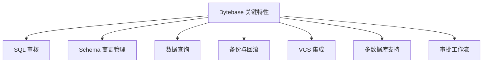
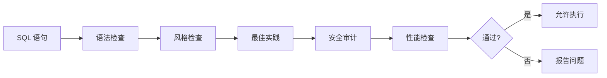
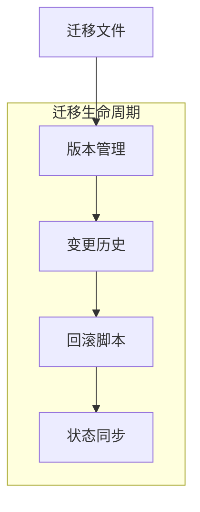
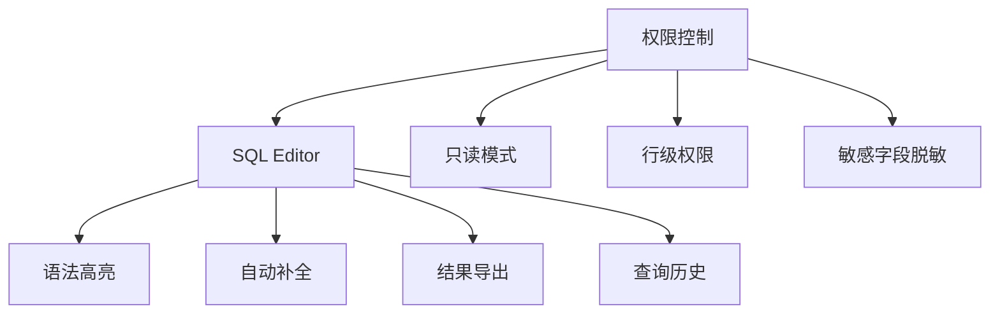
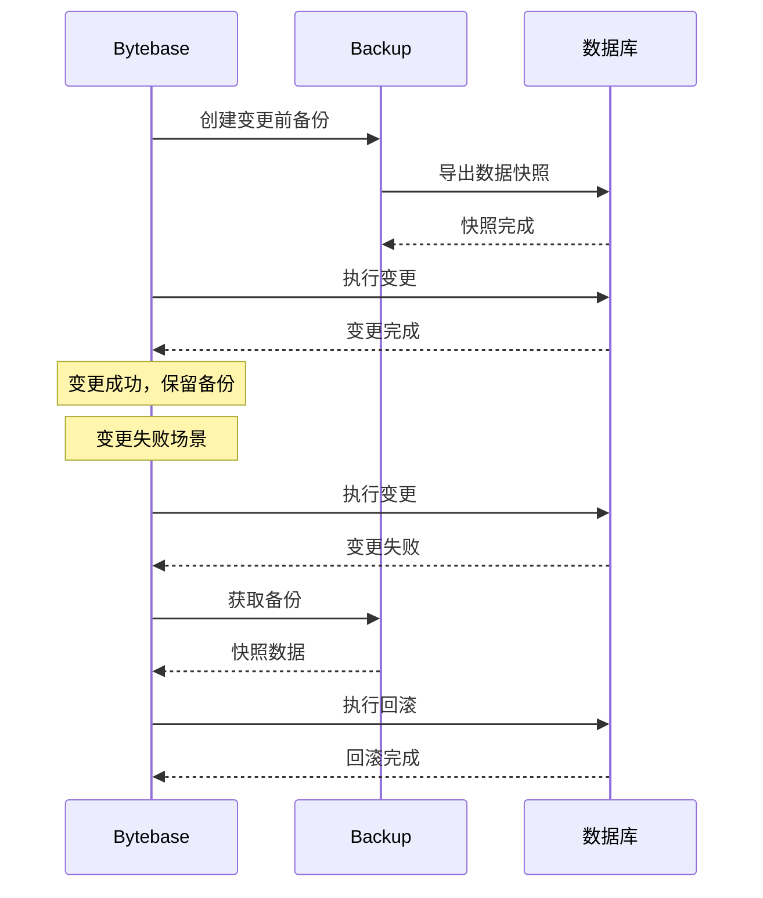
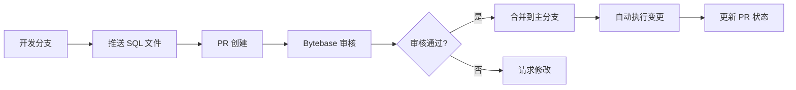
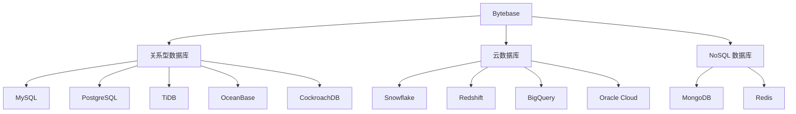
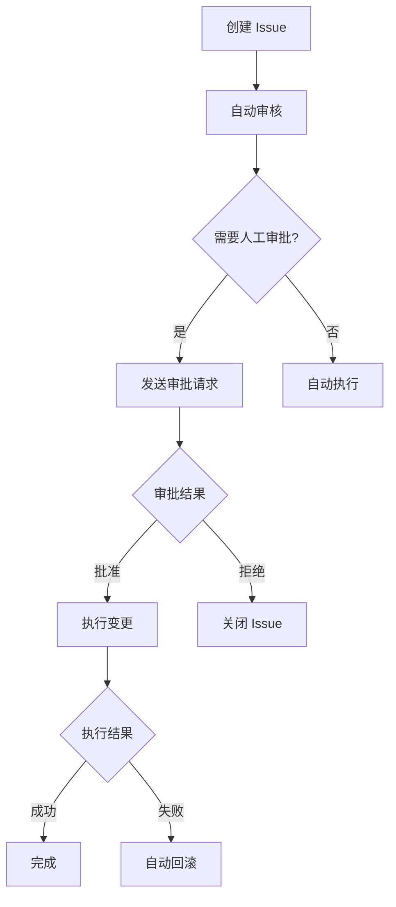

# Bytebase 关键特性

## 学习目标
- 了解 Bytebase 的关键特性
- 掌握这些特性如何支持数据库 DevOps 实践

## 特性总览



## SQL 审核



### 审核规则示例

| 规则类别 | 规则名称 | 说明 |
|----------|----------|------|
| 命令规范 | 禁止 DROP TABLE | 防止误删表 |
| 命名规范 | 表名小写蛇形 | 统一命名风格 |
| 索引规范 | 必须有主键 | 每个表必须有主键 |
| 索引规范 | 禁止大表全表扫描 | 检查查询计划 |
| 性能规范 | 禁止 SELECT * | 只查需要的列 |
| 安全规范 | 禁止 GRANT ALL | 细粒度权限控制 |
| 性能规范 | 大表变更需分批 | 避免长时间锁表 |

## Schema 变更管理



### 迁移文件示例

```sql
-- V001__create_users_table.sql
CREATE TABLE users (
    id BIGSERIAL PRIMARY KEY,
    name VARCHAR(100) NOT NULL,
    email VARCHAR(255) UNIQUE NOT NULL,
    created_at TIMESTAMP DEFAULT CURRENT_TIMESTAMP
);

-- V001__rollback.sql
DROP TABLE IF EXISTS users;
```

## 数据查询



## 备份与回滚



## VCS 集成（GitOps）



### 支持的 VCS 平台

| 平台 | 集成方式 | 特性 |
|------|----------|------|
| GitHub | App | PR 状态同步 |
| GitLab | Webhook | MR 状态同步 |
| Bitbucket | Webhook | PR 状态同步 |
| Azure DevOps | Webhook | PR 状态同步 |

## 多数据库支持



## 审批工作流



## 要点总结

- SQL 审核提供语法、风格、安全、性能等多维度规则检查
- Schema 变更管理支持版本化、历史追踪、回滚脚本自动生成
- 数据查询提供 SQL Editor 和细粒度权限控制
- 备份与回滚在变更前后自动执行，保障数据安全
- VCS 集成实现 GitOps，PR 驱动数据库变更流程
- 多数据库支持覆盖主流关系型、云数据库和 NoSQL
- 审批工作流可配置，支持自动通过和人工审批

## 思考题

1. 如何平衡 SQL 审核规则的严格程度与开发效率？
2. GitOps 模式的数据库变更对团队协作有哪些要求？
3. 备份与回滚机制在处理大表变更时可能面临哪些性能挑战？