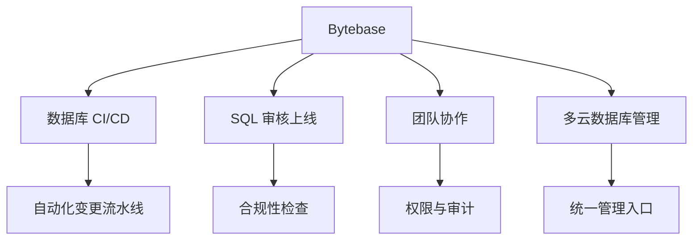
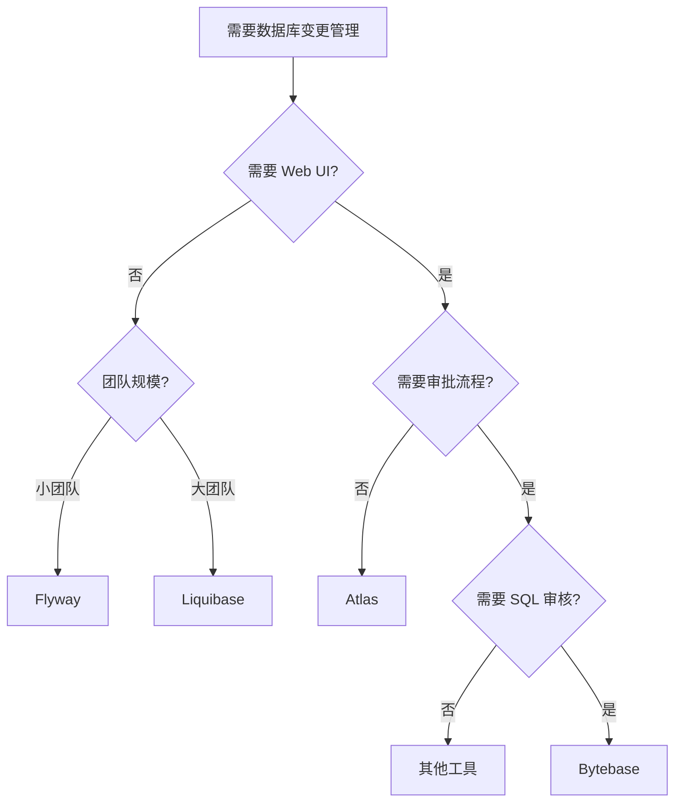

# Bytebase 使用场景与选型对比

## 学习目标
- 理解 Bytebase 的最佳适用场景
- 掌握与其他数据库变更管理工具的选型对比

## 核心概念

- **数据库 CI/CD**：将数据库变更纳入持续集成/持续部署流水线
- **Schema 即代码**：数据库 Schema 变更像代码一样管理、审核、部署
- **SQL 审核**：自动化的 SQL 规范检查和最佳实践验证

## 适用场景

## 典型使用场景

### 场景 1：企业数据库合规管理
- **需求**：SQL 变更需要经过严格审核，确保符合企业规范
- **挑战**：人工审核效率低、标准不统一、难以追溯
- **Bytebase 方案**：
  - 配置 SQL 审核规则（命名、索引、安全等）
  - 自动化审核流程，强制执行规范
  - 变更历史全记录，满足审计要求

### 场景 2：多数据库环境统一管理
- **需求**：同时管理 MySQL、PostgreSQL、TiDB 等多种数据库
- **挑战**：不同数据库语法差异，管理工具碎片化
- **Bytebase 方案**：
  - 统一的变更管理平台
  - 自动适配不同数据库的 DDL 语法
  - 一致的工作流体验

### 场景 3：GitOps 驱动的数据库变更
- **需求**：数据库变更纳入 Git 流程，支持 Code Review
- **挑战**：SQL 文件分散，难以与代码变更同步
- **Bytebase 方案**：
  - 迁移文件随代码提交
  - PR 触发自动审核
  - 审核通过后自动执行

## 选型对比

| 维度 | Bytebase | Flyway | Liquibase | Atlas |
|------|----------|--------|-----------|-------|
| SQL 审核 | 完整 | 无 | 有限 | 有 |
| Web UI | 有 | 无 | 无 | 有 |
| GitOps | 完整 | CLI | CLI | 有 |
| 多数据库 | 20+ | 10+ | 20+ | 8+ |
| 备份回滚 | 自动 | 无 | 无 | 有 |
| 权限管理 | 完整 | 无 | 无 | 有 |
| 审批流程 | 有 | 无 | 无 | 有 |
| 开源协议 | MIT | Apache 2.0 | Apache 2.0 | Apache 2.0 |

## 决策流程

## 适用人群

| 角色 | 价值 |
|------|------|
| DBA | 统一管理入口、自动化审核、风险预警 |
| 后端开发 | SQL Editor、变更历史、回滚能力 |
| DevOps | CI/CD 集成、GitOps 支持、监控告警 |
| 安全合规 | 变更审计、权限控制、敏感数据保护 |

## 要点总结

- Bytebase 适合需要完整 SQL 审核、审批流程、Web UI 的团队
- 对于简单场景，Flyway 或 Liquibase 可能更轻量
- GitOps 模式适合代码和数据库变更需要同步的场景
- 多数据库环境统一管理是 Bytebase 的核心优势之一

## 思考题

1. 在什么情况下 Flyway/Liquibase 比 Bytebase 更合适？
2. 如何在团队中推广 GitOps 模式的数据库变更？
3. Bytebase 的 SQL 审核规则如何根据团队实际情况定制？