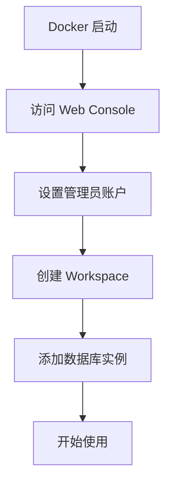
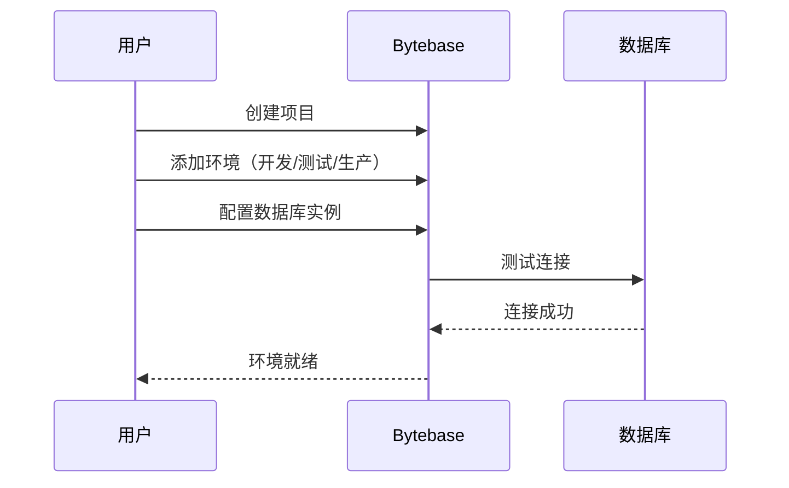
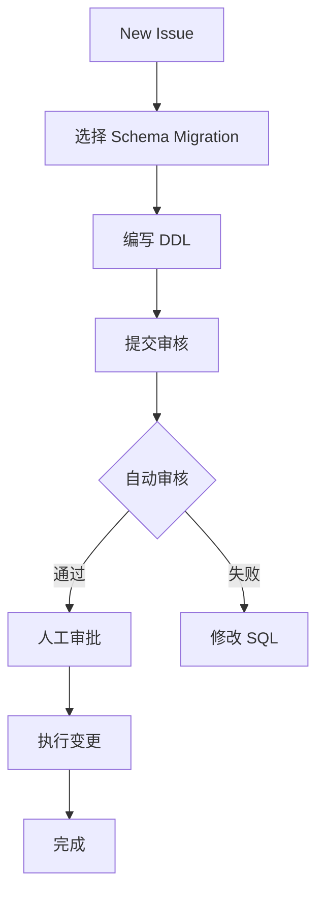
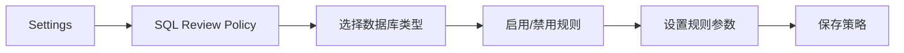
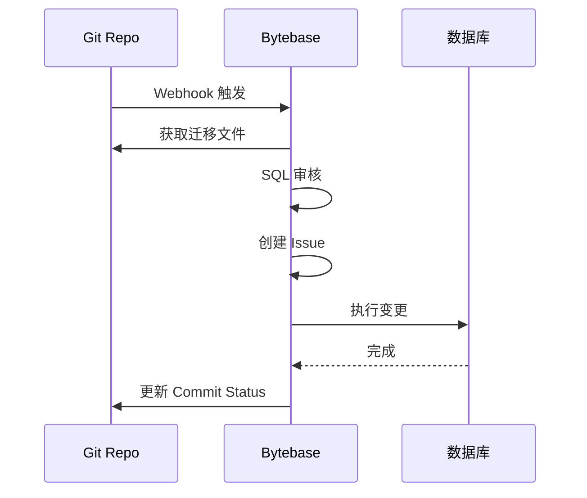

# Bytebase 动手实验

## 学习目标
- 掌握 Bytebase 的 Docker 部署方法
- 通过实验验证 SQL 审核、Schema 变更、GitOps 集成等核心功能

## 实验环境要求

- **操作系统**：Linux / macOS / Windows（WSL2）
- **内存**：4GB+
- **磁盘**：10GB+ 空闲空间
- **依赖**：Docker 20.10+、Git
- **时间**：首次部署约 30 分钟

## 实验一：Docker 部署 Bytebase

```bash
# 1. 创建数据目录
mkdir -p ~/bytebase/data

# 2. 启动 Bytebase 容器
docker run --init --name bytebase \
  --port 5678:8080 \
  --volume ~/bytebase/data:/var/opt/bytebase \
  bytebase/bytebase:latest

# 3. 访问 Web Console
# 打开浏览器访问 http://localhost:5678
# 首次登录设置管理员账户
```



## 实验二：创建项目与环境



### 操作步骤

1. **创建项目**：Projects → New Project，填写项目名称
2. **创建环境**：Environments → New Environment，定义开发、测试、生产环境
3. **添加数据库实例**：Instances → Add Instance，配置数据库连接信息
4. **测试连接**：点击 Test Connection 验证配置正确

## 实验三：Schema 变更

```sql
-- 创建变更任务
-- Issue → New Issue → Schema Migration

-- 迁移文件内容
CREATE TABLE users (
    id BIGSERIAL PRIMARY KEY,
    username VARCHAR(50) NOT NULL UNIQUE,
    email VARCHAR(100) NOT NULL UNIQUE,
    created_at TIMESTAMP DEFAULT CURRENT_TIMESTAMP
);

-- 点击 Create，等待审核通过后执行
```



## 实验四：SQL 审核

```sql
-- 触发审核警告的 SQL 示例

-- 1. 缺少主键（触发规则：必须有主键）
CREATE TABLE bad_table (
    name VARCHAR(100)
);

-- 2. SELECT * 查询（触发规则：禁止 SELECT *）
SELECT * FROM users;

-- 3. 索引缺失（触发规则：WHERE 条件需有索引）
SELECT * FROM users WHERE email = 'test@example.com';
-- 如果 email 列没有索引，会触发警告
```

### 配置审核规则



## 实验五：GitOps 集成

```bash
# 1. 在 Git 仓库中创建迁移目录
mkdir -p migrations/

# 2. 添加迁移文件
cat > migrations/V001__create_users.sql << 'EOF'
CREATE TABLE users (
    id BIGSERIAL PRIMARY KEY,
    name VARCHAR(100)
);
EOF

# 3. 推送到 Git
git add migrations/
git commit -m "Add users table migration"
git push origin main

# 4. 在 Bytebase 中配置 VCS 集成
# Settings → VCS → Add VCS → 配置 GitLab/GitHub
```



## 实验六：数据查询

```sql
-- 在 SQL Editor 中执行查询

-- 基本查询
SELECT id, username, email
FROM users
WHERE created_at > '2024-01-01'
ORDER BY created_at DESC
LIMIT 100;

-- 导出查询结果
-- 点击 Export 按钮下载为 CSV/JSON
```

## 实验对比

| 实验 | 功能 | 预期结果 |
|------|------|----------|
| 部署 | Docker 启动 | Web Console 可访问 |
| 项目配置 | 创建项目/环境/实例 | 数据库连接成功 |
| Schema 变更 | 执行 DDL | 表创建成功 |
| SQL 审核 | 触发规则 | 显示警告信息 |
| GitOps | 推送迁移文件 | 自动创建 Issue |
| 数据查询 | SQL Editor | 结果正常显示 |

## 要点总结

- Docker 部署简单快速，适合快速体验
- SQL 审核规则可根据团队需求灵活配置
- GitOps 集成将数据库变更纳入代码评审流程
- 数据查询功能支持细粒度权限控制

## 思考题

1. 如何根据团队实际情况定制 SQL 审核规则？
2. GitOps 模式相比手动提交 SQL 有哪些优势和劣势？
3. 生产环境的 Schema 变更如何设计更安全的审批流程？