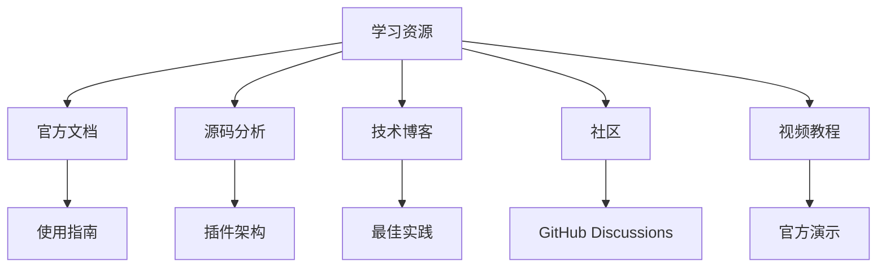
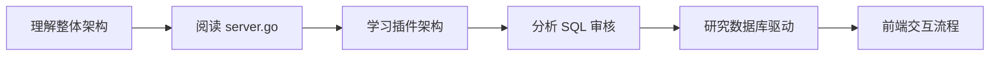

# Bytebase 学习资源

## 学习目标
- 获取 Bytebase 的最佳学习资源
- 建立系统化的学习路径

## 核心资源



## 源码路径

```
bytebase/
├── backend/                 # Go 后端服务
│   ├── server/              # HTTP/gRPC 服务入口
│   │   ├── router.go        # 路由定义
│   │   └── server.go        # 服务启动
│   ├── plugin/              # 数据库驱动插件
│   │   ├── db/              # 数据库连接实现
│   │   │   ├── pg/          # PostgreSQL 驱动
│   │   │   ├── mysql/       # MySQL 驱动
│   │   │   └── tidb/        # TiDB 驱动
│   │   └── parser/          # SQL 解析器
│   ├── api/                 # API 定义
│   │   └── v1/              # API v1 版本
│   ├── component/           # 业务组件
│   │   ├── sql_review/      # SQL 审核核心
│   │   ├── schema_sync/     # Schema 同步
│   │   └── backup/          # 备份管理
│   └── store/               # 数据存储层
├── frontend/                # Vue.js 前端
│   ├── src/
│   │   ├── components/      # UI 组件
│   │   ├── views/           # 页面视图
│   │   └── store/           # 状态管理
│   └── public/
├── runner/                  # 任务执行器
├── migrator/                # 迁移工具
├── proto/                   # Protobuf 定义
└── scripts/                 # 部署脚本
```

## 关键文件说明

| 文件/目录 | 路径 | 说明 |
|-----------|------|------|
| server.go | `backend/server/server.go` | 服务启动入口 |
| router.go | `backend/server/router.go` | API 路由定义 |
| sql_review/ | `backend/component/sql_review/` | SQL 审核核心逻辑 |
| plugin/db/ | `backend/plugin/db/` | 数据库驱动插件 |
| parser/ | `backend/plugin/parser/` | SQL 解析器 |
| runner/ | `runner/` | 任务执行器 |
| frontend/src/ | `frontend/src/` | Vue.js 前端源码 |

## 官方资源

| 资源 | 链接 | 说明 |
|------|------|------|
| 官方文档 | https://www.bytebase.com/docs/ | 完整使用指南 |
| GitHub Repo | https://github.com/bytebase/bytebase | 源码和 Issue |
| 官方博客 | https://www.bytebase.com/blog/ | 技术文章 |
| 演示环境 | https://demo.bytebase.com/ | 在线体验 |
| Discord | https://discord.gg/bytebase | 社区讨论 |

## 核心模块学习路径



### 关键源码阅读顺序

1. **server.go**：理解服务启动流程
2. **router.go**：理解 API 路由设计
3. **plugin/db/**：理解数据库驱动插件架构
4. **component/sql_review/**：理解 SQL 审核规则实现
5. **runner/**：理解任务执行机制
6. **frontend/src/views/**：理解前端页面结构

## 推荐书籍

| 书名 | 作者 | 说明 |
|------|------|------|
| Database Reliability Engineering | Laine Campbell | 数据库运维实践 |
| SQL Antipatterns | Bill Karwin | SQL 反模式与最佳实践 |
| Database Design for Mere Mortals | Michael J. Hernandez | 数据库设计基础 |

## 要点总结

- 官方文档是首要参考资源，涵盖部署、配置、使用全流程
- 源码阅读从 server.go 和 plugin 架构入手
- SQL 审核核心在 `component/sql_review/` 目录
- 数据库驱动插件在 `plugin/db/` 目录，支持扩展新数据库

## 思考题

1. 阅读 `plugin/db/` 目录结构，理解如何添加新的数据库驱动？
2. SQL 审核规则的实现逻辑在哪些文件中？
3. 如何通过源码理解 Bytebase 的任务执行机制？