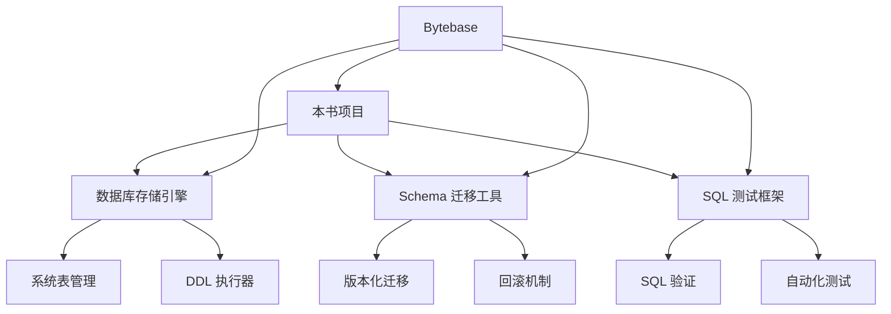
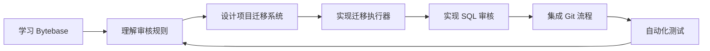

# Bytebase 项目关联

## 学习目标
- 理解 Bytebase 与本书项目的关系
- 掌握 SQL 审核思路和数据库变更管理的最佳实践

## 核心概念

- **SQL 审核**：学习 Bytebase 的审核规则设计，应用于项目数据库开发规范
- **Schema 迁移**：借鉴 Bytebase 的版本化迁移方案，管理项目数据库变更
- **GitOps**：将数据库变更纳入 Git 流程，实现代码与数据库同步

## 与本项目的关联



## 可借鉴的设计

| Bytebase 特性 | 本项目对应 | 改进方向 |
|---------------|------------|----------|
| 版本化迁移 | 手动 Schema 定义 | 实现自动迁移系统 |
| SQL 审核规则 | 无 | 添加 SQL 规范检查 |
| 自动备份回滚 | 无 | 实现变更前备份 |
| 审批工作流 | 无 | 建立变更审批流程 |
| GitOps 集成 | 无 | 迁移文件版本管理 |
| 多数据库支持 | 单数据库 | 抽象数据库访问层 |

## 项目中的 Schema 迁移

```yaml
# 迁移文件格式参考（借鉴 Bytebase 的命名规范）
# engineering/src/db/core/migration/

migrations/
├── V001__create_users_table.sql
├── V001__rollback.sql
├── V002__add_email_index.sql
├── V002__rollback.sql
└── V003__create_orders_table.sql
```

```c
// 项目中迁移执行器的接口设计
typedef struct Migration {
    char *version;      // 版本号，如 "V001"
    char *name;         // 名称，如 "create_users_table"
    char *sql;          // 正向迁移 SQL
    char *rollback;     // 回滚 SQL
    int status;         // PENDING / APPLIED / FAILED
} Migration;

// 迁移管理器
typedef struct MigrationManager {
    void (*apply)(struct MigrationManager *mgr, Migration *m);
    void (*rollback)(struct MigrationManager *mgr, Migration *m);
    int (*get_version)(struct MigrationManager *mgr);
    Migration **(*get_pending)(struct MigrationManager *mgr);
} MigrationManager;
```

## SQL 审核思路借鉴

```c
// 借鉴 Bytebase 的审核规则，在项目中实现 SQL 检查

typedef enum SqlRule {
    SQL_RULE_MUST_HAVE_PK,         // 必须有主键
    SQL_RULE_NO_SELECT_STAR,       // 禁止 SELECT *
    SQL_RULE_NO_DROP,              // 禁止 DROP TABLE
    SQL_RULE_INDEX_HINT,           // WHERE 条件需索引
    SQL_RULE_COLUMN_COMMENT,       // 列必须有注释
} SqlRule;

// 审核接口
int sql_review(const char *sql, SqlRule *rules, int rule_count);
```

## 学习与实践路径



## 预期收获

- 借鉴 Bytebase 的版本化迁移方案，规范项目数据库变更管理
- 引入 SQL 审核规则，提升项目数据库开发质量
- 建立自动化的迁移测试流程，确保变更安全可靠

## 要点总结

- Bytebase 的版本化迁移方案可以为项目提供数据库变更管理的参考模式
- SQL 审核规则可嵌入项目开发流程，从源头保证数据库质量
- GitOps 思路可应用于项目，实现代码与数据库 Schema 的同步管理
- 自动备份和回滚机制是生产环境数据库变更的关键保障

## 思考题

1. 项目中哪些阶段适合引入 SQL 审核规则？
2. 如何设计适合项目特点的迁移文件命名和执行策略？
3. 借鉴 Bytebase 的审批流程，如何为项目设计合理的变更审批策略？