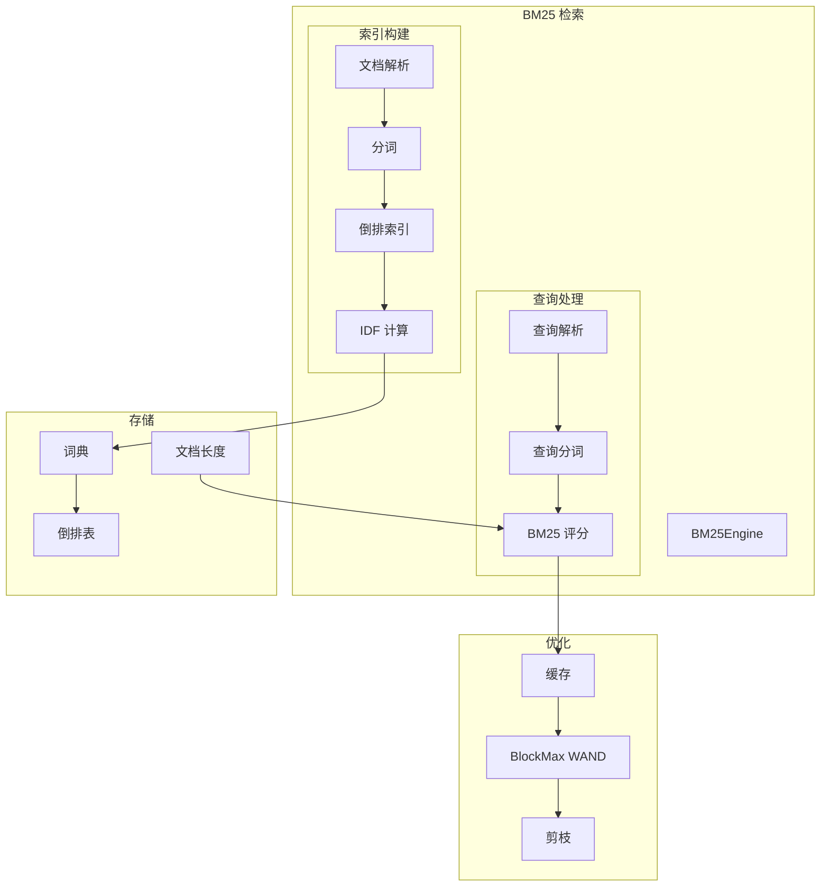
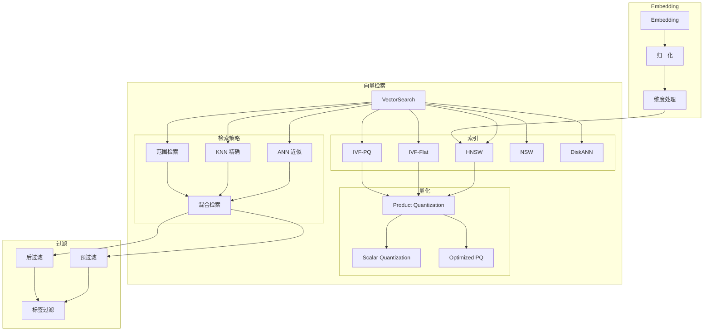
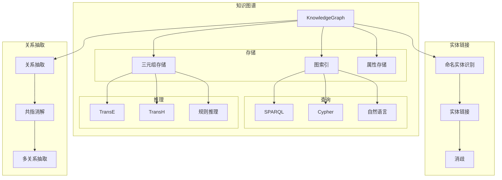
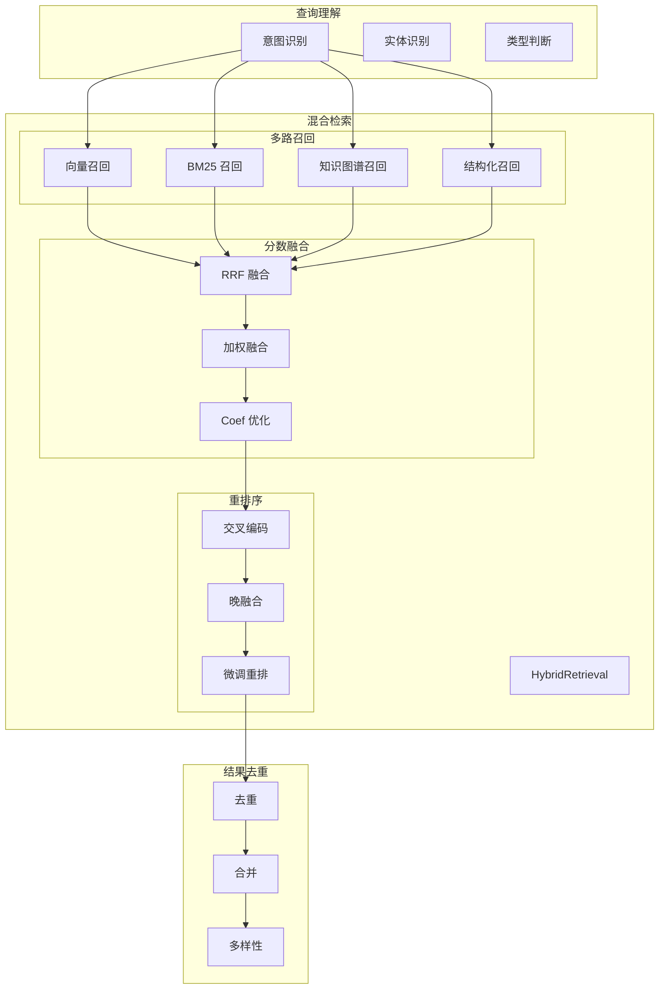
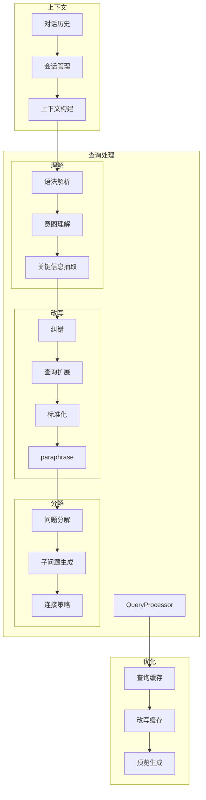
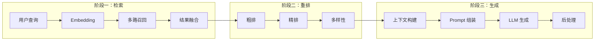
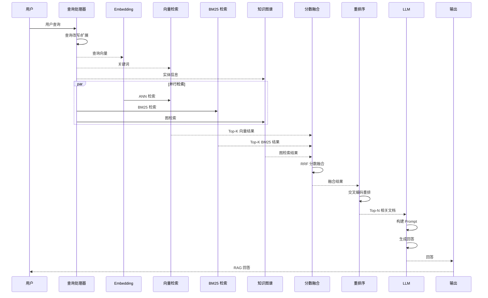
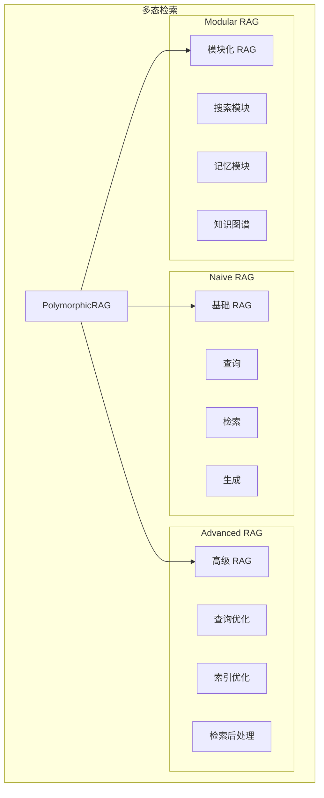
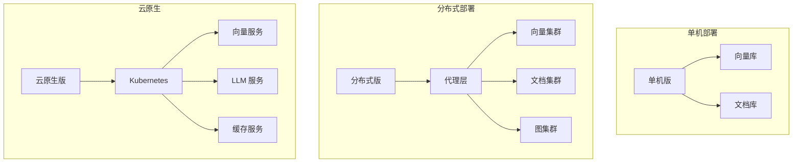

# 多态 RAG 架构

## 整体架构

```mermaid
graph TB
    subgraph "接入层"
        API[REST API]
        SDK[多语言 SDK]
        CLI[CLI 工具]
    end

    subgraph "RAG 核心"
        subgraph "查询处理"
            Query[查询理解]
            Rewrite[查询改写]
            Expand[查询扩展]
        end

        subgraph "检索引擎"
            BM25[BM25 检索]
            Vector[向量检索]
            Graph[图检索]
            Hybrid[混合检索]
        end

        subgraph "重排序"
            RRF[RRF 重排]
            Reranker[重排模型]
            Score[分数融合]
        end
    end

    subgraph "索引层"
        subgraph "索引类型"
            TextIdx[文本索引]
            VecIdx[向量索引]
            GraphIdx[知识图谱]
            SQLIdx[结构化索引]
        end
    end

    subgraph "存储层"
        DocStore[文档存储]
        VecStore[向量存储]
        GraphStore[图存储]
        MetaStore[元数据存储]
    end

    subgraph "Embedding 模型"
        EmbModel[Embedding 模型]
        OpenAI[OpenAI]
        BGE[BGE]
        M3E[M3E]
        Jina[Jina]
    end

    subgraph "LLM"
        LLM[大语言模型]
        ChatGPT[ChatGPT]
        Claude[Claude]
        LocalLLM[本地 LLM]
    end

    API --> Query
    SDK --> Query
    CLI --> Query
    Query --> Rewrite
    Rewrite --> Expand
    Expand --> Hybrid
    Hybrid --> BM25
    Hybrid --> Vector
    Hybrid --> Graph
    BM25 --> TextIdx
    Vector --> VecIdx
    Graph --> GraphIdx
    Hybrid --> RRF
    RRF --> Reranker
    Reranker --> Score
    Score --> LLM
    LLM --> ChatGPT
    LLM --> Claude
    LLM --> LocalLLM
    Vector --> EmbModel
    EmbModel --> OpenAI
    EmbModel --> BGE
    EmbModel --> M3E
    EmbModel --> Jina
```

## 子模块架构

### 1. 文本索引 (BM25)



### 2. 向量检索



### 3. 知识图谱检索



### 4. 混合检索



### 5. 查询处理



### 6. RAG 流程





## 多态特性

### 检索模式



### 存储模式

| 模式 | 适用场景 | 索引类型 |
|------|----------|----------|
| 纯向量 | 语义相似 | HNSW, IVF-PQ |
| 纯文本 | 关键词精确 | BM25, Inverted |
| 知识图谱 | 关系推理 | Graph, Triple |
| 混合 | 综合检索 | Vector + BM25 + KG |
| 多模态 | 图文音视频 | CLIP, Audio |

### 部署模式


