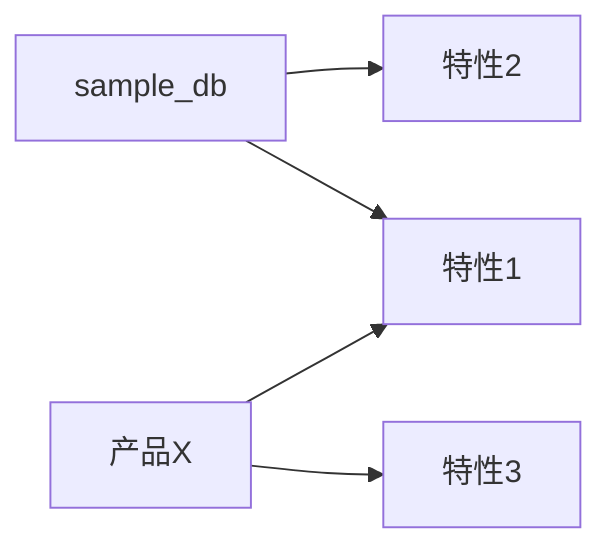
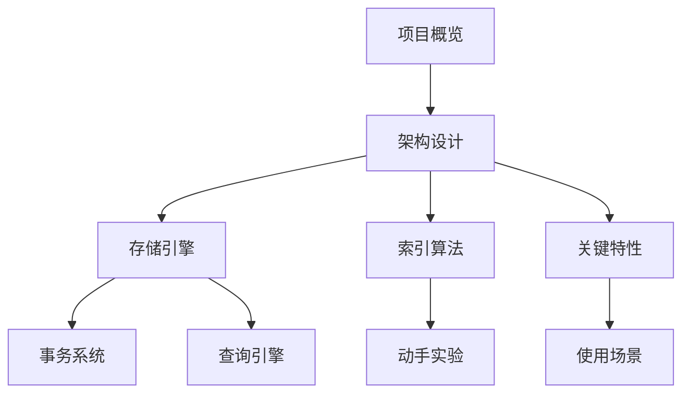
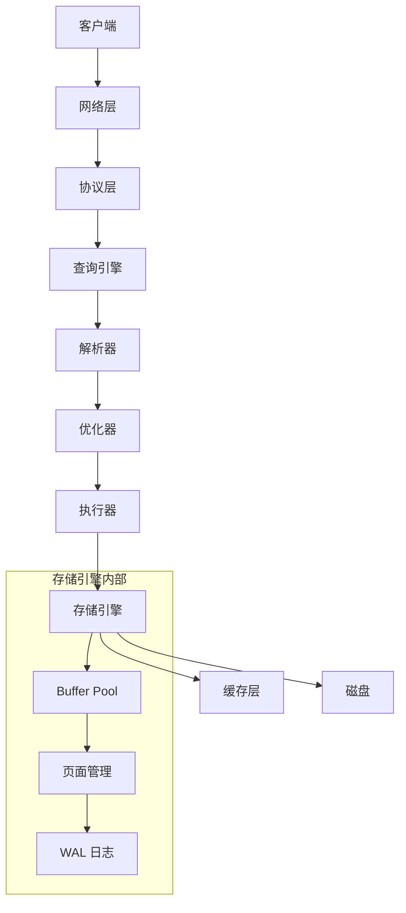
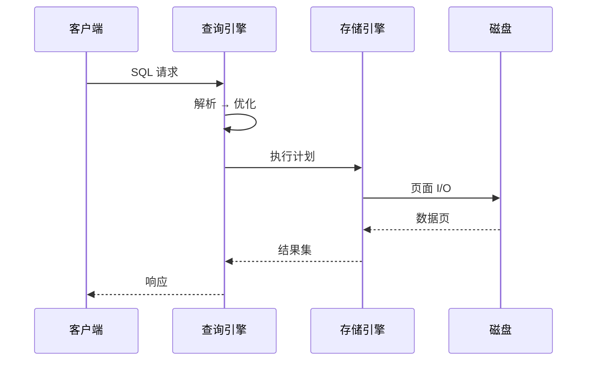
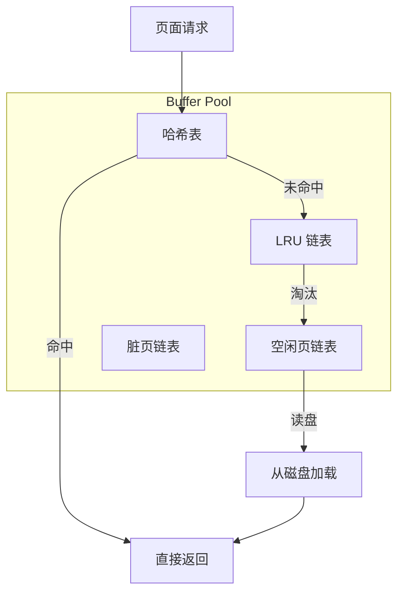
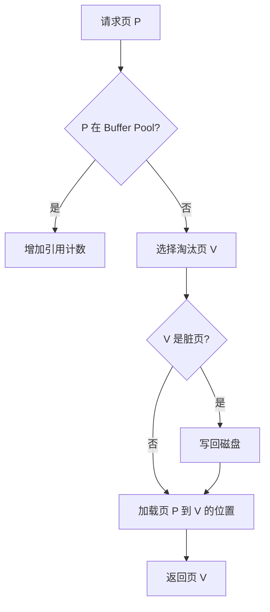

# 数据库学习 Wiki 实施计划

> **For agentic workers:** REQUIRED SUB-SKILL: 使用 subagent-driven-development 或 executing-plans 按任务逐项执行。步骤使用 checkbox（`- [ ]`）语法追踪。

**目标**：为 `reference/open-source/` 下 53 个开源数据库创建完整的学习 Wiki，按 15 个数据模型类别组织，存储在 `docs/db_wiki/` 下。

**架构**：
- 5 套模板族（关系型/向量/KV/时序/图），其他类别从模板族派生
- 每个数据库独立子目录，含 8-12 个 `.md` 文件
- 每个文件包含：学习目标 → 核心概念 → 主体内容（含 Mermaid 图）→ 要点总结 → 思考题
- 每个类别目录有一个 `README.md` 做横向对比

**技术栈**：Markdown + Mermaid 图

**全局约束**：
- 目录名、文件名全部使用下划线，不用中划线
- 序号前缀：类别目录 `01_`-`15_`，文件 `00_`-`10_`
- 每个 `.md` 文件必须包含 1-3 个 Mermaid 图，图必须画数据流/控制流
- 所有内容使用简体中文
- Mermaid 图标注使用中文
- 不逐行分析源码，只讲算法逻辑和架构设计

---

## 文件结构总览

```
docs/db_wiki/
├── README.md                     # 设计文档（已完成）
├── 00_template/                  # 模板示例
├── 01_relational/
│   ├── README.md                 # 该类别横向对比
│   ├── postgres/                 # 10 个文件
│   ├── mysql/                    # 10 个文件
│   ├── tidb/                     # 10 个文件
│   ├── sqlite3/                  # 10 个文件
│   ├── duckdb/                   # 10 个文件
│   ├── cockroach/                # 10 个文件
│   ├── oceanbase/                # 10 个文件
│   ├── opengauss/                # 10 个文件
│   └── stonedb/                  # 10 个文件
├── 02_key_value/
│   ├── README.md
│   ├── redis/                    # 8 个文件
│   ├── dragonfly/                # 8 个文件
│   ├── etcd/                     # 8 个文件
│   ├── garnet/                   # 8 个文件
│   └── nats/                     # 8 个文件
├── 03_vector/
│   ├── README.md
│   ├── faiss/                    # 8 个文件
│   ├── milvus/                   # 8 个文件
│   ├── qdrant/                   # 8 个文件
│   ├── chroma/                   # 8 个文件
│   ├── weaviate/                 # 8 个文件
│   ├── pgvector/                 # 8 个文件
│   ├── vald/                     # 8 个文件
│   └── lancedb/                  # 8 个文件
├── 04_graph/
│   ├── README.md
│   ├── neo4j/                    # 9 个文件
│   ├── nebula/                   # 9 个文件
│   ├── arangodb/                 # 9 个文件
│   ├── dgraph/                   # 9 个文件
│   └── janusgraph/               # 9 个文件
├── 05_time_series/
│   ├── README.md
│   ├── timescaledb/              # 8 个文件
│   ├── questdb/                  # 8 个文件
│   ├── greptimedb/               # 8 个文件
│   └── victoria_metrics/         # 8 个文件
├── 06_search_engine/
│   ├── README.md
│   ├── elasticsearch/            # 8 个文件
│   ├── meilisearch/              # 8 个文件
│   ├── tantivy/                  # 8 个文件
│   ├── zincsearch/               # 8 个文件
│   └── paradedb/                 # 8 个文件
├── 07_analytical/
│   ├── README.md
│   ├── clickhouse/               # 8 个文件
│   ├── druid/                    # 8 个文件
│   └── starrocks/                # 8 个文件
├── 08_streaming/
│   ├── README.md
│   ├── redpanda/                 # 8 个文件
│   └── risingwave/               # 8 个文件
├── 09_embedded/
│   ├── README.md
│   ├── leveldb/                  # 8 个文件
│   ├── rocksdb/                  # 8 个文件
│   └── badger/                   # 8 个文件
├── 10_document/
│   ├── README.md
│   ├── ferretdb/                 # 8 个文件
│   ├── appwrite/                 # 8 个文件
│   └── nocodb/                   # 8 个文件
├── 11_multi_model/
│   ├── README.md
│   └── surrealdb/                # 8 个文件
├── 12_versioned/
│   ├── README.md
│   └── dolt/                     # 8 个文件
├── 13_edge/
│   ├── README.md
│   └── turso/                    # 8 个文件
├── 14_benchmark/
│   ├── README.md
│   └── ann_benchmarks/           # 4 个文件（精简版）
├── 15_devops/
│   ├── README.md
│   └── bytebase/                 # 4 个文件（精简版）
```

---

### Phase 0：基础设施搭建

**此阶段在所有 Wiki 内容编写之前完成，为后续任务提供目录骨架和写作模板。**

---

### Task 0.1：创建目录结构

**文件清单**：
- 创建所有 15 个类别目录（`01_relational/` ~ `15_devops/`）
- 创建所有 53 个数据库子目录
- 每个数据库目录先放一个占位 `README.md`

**步骤**：

- [ ] **Step 1: 创建类别目录**

```bash
cd docs/db_wiki

# 创建 15 个类别目录
for dir in 01_relational 02_key_value 03_vector 04_graph 05_time_series \
           06_search_engine 07_analytical 08_streaming 09_embedded 10_document \
           11_multi_model 12_versioned 13_edge 14_benchmark 15_devops; do
  mkdir -p $dir
done
```

- [ ] **Step 2: 创建所有数据库子目录**

```bash
cd docs/db_wiki

# 关系型
for db in postgres mysql tidb sqlite3 duckdb cockroach oceanbase opengauss stonedb; do
  mkdir -p 01_relational/$db
done

# KV
for db in redis dragonfly etcd garnet nats; do
  mkdir -p 02_key_value/$db
done

# 向量
for db in faiss milvus qdrant chroma weaviate pgvector vald lancedb; do
  mkdir -p 03_vector/$db
done

# 图
for db in neo4j nebula arangodb dgraph janusgraph; do
  mkdir -p 04_graph/$db
done

# 时序
for db in timescaledb questdb greptimedb victoria_metrics; do
  mkdir -p 05_time_series/$db
done

# 搜索引擎
for db in elasticsearch meilisearch tantivy zincsearch paradedb; do
  mkdir -p 06_search_engine/$db
done

# 分析型
for db in clickhouse druid starrocks; do
  mkdir -p 07_analytical/$db
done

# 流式
for db in redpanda risingwave; do
  mkdir -p 08_streaming/$db
done

# 嵌入式
for db in leveldb rocksdb badger; do
  mkdir -p 09_embedded/$db
done

# 文档
for db in ferretdb appwrite nocodb; do
  mkdir -p 10_document/$db
done

# 多模型/版本化/边缘
mkdir -p 11_multi_model/surrealdb
mkdir -p 12_versioned/dolt
mkdir -p 13_edge/turso

# 基准测试/DevOps
mkdir -p 14_benchmark/ann_benchmarks
mkdir -p 15_devops/bytebase
```

- [ ] **Step 3: 验证目录完整性**

```bash
find docs/db_wiki -maxdepth 2 -type d | sort
```
预期输出：1 个 `00_template/` + 15 个类别目录 + 53 个数据库目录 = 69 个目录（含 `docs/db_wiki/` 本身）

- [ ] **Step 4: 提交**

```bash
git add docs/db_wiki/
git commit -m "feat: 创建 db_wiki 目录骨架，15 类别 53 数据库子目录就绪"
git push
```

---

### Task 0.2：创建模板示例文件

**文件清单**：
- `docs/db_wiki/00_template/01_relational/sample_db/` — 关系型模板示例集
- 包含 10 个模板文件，展示每个应达到的内容密度和 Mermaid 图密度

**文件结构**：

```
00_template/01_relational/sample_db/
├── 00_overview.md
├── 01_architecture.md
├── 02_storage/
│   ├── buffer_pool.md
│   ├── heap_table.md
│   ├── page_layout.md
│   └── wal.md
├── 03_transaction/
│   ├── mvcc.md
│   ├── locking.md
│   └── isolation.md
├── 04_query/
│   ├── parser.md
│   ├── planner.md
│   └── executor.md
├── 05_index/
│   ├── btree.md
│   ├── hash.md
│   └── other_indexes.md
├── 06_features.md
├── 07_use_cases.md
├── 08_experiments.md
├── 09_resources.md
└── 10_project_connection.md
```

- [ ] **Step 1: 创建模板示例目录**

```bash
mkdir -p docs/db_wiki/00_template/01_relational/sample_db/{02_storage,03_transaction,04_query,05_index}
```

- [ ] **Step 2: 编写 `00_overview.md` 模板**

```markdown
# sample_db 项目概览

## 学习目标
- 了解 sample_db 的定位和历史背景
- 掌握其核心设计理念和适用场景

## 项目定位

> 一句话描述：sample_db 是什么、解决什么问题。

**基本信息**：
- 开发方/作者：[公司/个人]
- 首次发布：[年份]
- 开源协议：[协议名]
- 最新版本：[版本]
- GitHub Stars：[数量]

## 核心设计理念

[2-3 段说明项目的核心设计哲学]

## 与其他产品的对比



## 学习路线图

建议按以下顺序学习 sample_db：



## 要点总结

- sample_db 的核心优势是什么
- 学习时重点关注什么

## 思考题

1. sample_db 为什么选择这种架构？
2. 与同类产品相比，它的决定性差异是什么？
```

- [ ] **Step 3: 编写 `01_architecture.md` 模板**

```markdown
# sample_db 架构设计

## 学习目标
- 理解 sample_db 的整体架构分层
- 掌握各层之间的数据流

## 整体架构



## 各层职责

### 网络层
[说明]
### 协议层
[说明]
### 查询引擎
[说明]
### 存储引擎
[说明]
### 工具层
[说明]

## 关键数据流



## 要点总结

- 架构的核心分层思路
- 各层间的接口设计

## 思考题

1. 为什么 sample_db 选择这种分层？
2. 如果去掉某一层会有什么后果？
```

- [ ] **Step 4: 编写 `02_storage/buffer_pool.md` 模板**（含 Buffer Pool 架构图、淘汰策略流程图）

```markdown
# Buffer Pool 实现

## 学习目标
- 理解 Buffer Pool 在数据库中的角色
- 掌握缓存淘汰算法和并发控制

## 核心概念

- **Buffer Pool**：内存中的页面缓存区，减少磁盘 I/O
- **Page**：最小的数据单元，通常 4KB-16KB
- **Dirty Page**：被修改后尚未写盘的页面
- **淘汰策略**：LRU/Clock/ARC 等

## 架构设计



## 淘汰算法



## 要点总结

## 思考题
```

- [ ] **Step 5: 为其余 6 个模块文件（03_transaction/、04_query/、05_index/、06_features.md、07_use_cases.md、08_experiments.md、09_resources.md、10_project_connection.md）创建模板示例**

- [ ] **Step 6: 验证模板完整性**

```bash
find docs/db_wiki/00_template -type f | sort | wc -l
```
预期输出：17（关系型模板文件数，包括子目录中的文件）

- [ ] **Step 7: 提交**

```bash
git add docs/db_wiki/00_template/
git commit -m "feat: 添加 db_wiki 模板示例文件，覆盖关系型模板族全部 17 个文件"
git push
```

---

### Phase 1：关系型数据库（10 个）

关系型数据库是核心，每个数据库完整按模板族 1 编写 10 个文件。按学习价值排序：

- Task 1.1：PostgreSQL（最全面，参考实现）
- Task 1.2：MySQL（用户最广）
- Task 1.3：SQLite3（嵌入式关系型代表）
- Task 1.4：DuckDB（列式/OLAP 代表）
- Task 1.5：CockroachDB（分布式关系型代表）
- Task 1.6：TiDB（分布式 HTAP）
- Task 1.7：OceanBase（分布式 + 高可用）
- Task 1.8：openGauss（开源关系型）
- Task 1.9：StoneDB（列式存储）

---

### Task 1.1：PostgreSQL

**文件路径**：
- `docs/db_wiki/01_relational/postgres/00_overview.md`
- `docs/db_wiki/01_relational/postgres/01_architecture.md`
- `docs/db_wiki/01_relational/postgres/02_storage/buffer_pool.md`
- `docs/db_wiki/01_relational/postgres/02_storage/heap_table.md`
- `docs/db_wiki/01_relational/postgres/02_storage/page_layout.md`
- `docs/db_wiki/01_relational/postgres/02_storage/wal.md`
- `docs/db_wiki/01_relational/postgres/03_transaction/mvcc.md`
- `docs/db_wiki/01_relational/postgres/03_transaction/locking.md`
- `docs/db_wiki/01_relational/postgres/03_transaction/isolation.md`
- `docs/db_wiki/01_relational/postgres/04_query/parser.md`
- `docs/db_wiki/01_relational/postgres/04_query/planner.md`
- `docs/db_wiki/01_relational/postgres/04_query/executor.md`
- `docs/db_wiki/01_relational/postgres/05_index/btree.md`
- `docs/db_wiki/01_relational/postgres/05_index/hash.md`
- `docs/db_wiki/01_relational/postgres/05_index/other_indexes.md`
- `docs/db_wiki/01_relational/postgres/06_features.md`
- `docs/db_wiki/01_relational/postgres/07_use_cases.md`
- `docs/db_wiki/01_relational/postgres/08_experiments.md`
- `docs/db_wiki/01_relational/postgres/09_resources.md`
- `docs/db_wiki/01_relational/postgres/10_project_connection.md`

- [ ] **Step 1: 创建 postgres 子目录及子模块目录**

```bash
mkdir -p docs/db_wiki/01_relational/postgres/{02_storage,03_transaction,04_query,05_index}
```

- [ ] **Step 2 → Step 20: 逐个编写 17 个文件**（含全部 Mermaid 图）

每个文件的编写遵循以下模式：

```markdown
# 标题

## 学习目标
- 目标 1
- 目标 2

## 核心概念
- 概念 1：定义
- 概念 2：定义

## 内容主体
[多级标题 + 正文 + Mermaid 图]

## 要点总结
- 要点 1
- 要点 2

## 思考题
1. 问题 1
2. 问题 2
```

**关键 Mermaid 图清单（PostgreSQL 版）**：
- 架构图：`01_architecture.md` — 整体分层 + 进程模型
- Buffer Pool 数据流：`02_storage/buffer_pool.md` — Clock Sweep 流程图
- 页面结构：`02_storage/page_layout.md` — 页内布局（ItemId/Tuple/Special）
- MVCC 流程：`03_transaction/mvcc.md` — 快照隔离 + xmin/xmax 链
- Planner 流程：`04_query/planner.md` — 查询规划树 + 代价估算
- Executor 流程：`04_query/executor.md` — 火山模型迭代器
- BTree 算法：`05_index/btree.md` — BTree 分裂/合并流程图

- [ ] **Step 21: 提交**

```bash
git add docs/db_wiki/01_relational/postgres/
git commit -m "feat(db_wiki): 完成 PostgreSQL 学习 Wiki，17 个文件含全部 Mermaid 图"
git push
```

---

### Task 1.2：MySQL

**文件路径**：`docs/db_wiki/01_relational/mysql/`（同模板族 1 结构，20 个文件）

**与 PostgreSQL 的差异点**：
- 存储引擎层重点讲 InnoDB（区别于 PostgreSQL 的 heap-only）
- 事务系统讲 MVCC + Undo Log + Redo Log（PG 只靠 xmin/xmax）
- 索引讲 B+Tree + 聚簇索引（PG 是堆表 + 非聚簇索引）
- 架构讲 Thread-Per-Connection（PG 是进程模型）

- [ ] **Step 1 → Step 20: 编写全部 17 个文件**

**关键 Mermaid 图清单（MySQL 版）**：
- InnoDB 架构图：Buffer Pool + Change Buffer + Adaptive Hash Index
- B+Tree 聚簇索引 vs 二级索引对比图
- Undo Log MVCC 版本链
- Redo Log 循环写入 + Checkpoint
- 主从复制流程

- [ ] **Step 21: 提交**

---

### Task 1.3：SQLite3

**文件路径**：`docs/db_wiki/01_relational/sqlite3/`

**差异点**：
- 嵌入式、零配置、单文件数据库
- 存储格式重点讲 BTree 页面 + 自由页列表
- 无独立的 Buffer Pool（使用 OS 页面缓存）
- 无独立的网络层/协议层
- 事务用日志（Rollback Journal 或 WAL 模式）
- 锁粒度很低（5 级锁状态机）

- [ ] **Step 1 → Step 15: 编写文件**

**关键 Mermaid 图清单**：
- 页面类型结构（表页/索引页/溢出页/自由页）
- SQLite 5 级锁状态机
- Rollback Journal 流程
- WAL 模式读写并发
- VDBE（虚拟机）执行流程

- [ ] **Step 16: 提交**

---

### Task 1.4：DuckDB

**文件路径**：`docs/db_wiki/01_relational/duckdb/`

**差异点**：
- 列式存储 + 向量化执行引擎
- 嵌入式 OLAP
- 重点讲向量化执行
- 压缩算法（RLE/Delta/字典）
- 物化列存储格式

- [ ] **Step 1 → Step 15: 编写全部文件**

- [ ] **Step 16: 提交**

---

### Task 1.5：CockroachDB

**文件路径**：`docs/db_wiki/01_relational/cockroach/`

**差异点**：
- 分布式关系型数据库
- 重点讲：分层架构（SQL → Transaction → Distribution → Replication → Storage）
- Raft 共识协议
- 分布式事务（2PC + 时钟）
- 范围分区 + 自动再平衡

- [ ] **Step 1 → Step 17: 编写全部文件**

- [ ] **Step 18: 提交**

---

### Task 1.6-1.9：TiDB / OceanBase / openGauss / StoneDB

**文件路径**：对应 `01_relational/<name>/`

**每任务步骤** → 对应模板族 1 结构，按各自差异点调整

- [ ] **Step 1-17**: 编写全部文件并提交

---

### Phase 2：向量数据库（8 个）

按模板族 2 编写，每个数据库 8 个文件。重点关注索引算法和搜索执行流程。

**顺序**：
- Task 2.1：Faiss（向量索引库 标杆，重点讲量化）
- Task 2.2：Milvus（分布式向量数据库 标杆）
- Task 2.3：Qdrant（Rust 向量数据库）
- Task 2.4：Chroma（轻量向量数据库）
- Task 2.5：Weaviate（向量 + 对象存储）
- Task 2.6：pgvector（PG 扩展）
- Task 2.7：Vald / LanceDB

### Task 2.1：Faiss

**文件结构**（模板族 2）：

```
03_vector/faiss/
├── 00_overview.md
├── 01_architecture.md
├── 02_index/
│   ├── flat.md
│   ├── ivf.md
│   ├── hnsw.md
│   ├── pq.md
│   └── diskann.md
├── 03_search.md
├── 04_features.md
├── 05_use_cases.md
├── 06_experiments.md
├── 07_resources.md
└── 08_project_connection.md
```

- [ ] **Step 1: 创建目录**

- [ ] **Step 2-8: 编写全部文件**

### Task 2.2-2.8：其余向量数据库

**每任务**：按模板族 2 编写 8 个文件。

---

### Phase 3：KV 存储/内存数据库（5 个）

按模板族 3 编写，每个数据库 8 个文件。

### Task 3.1：Redis

- [ ] 重点讲：对象系统 + SDS + 跳表 + RDB/AOF + Sentinel/Cluster

### Task 3.2-3.5：Dragonfly / etcd / Garnet / NATS

---

### Phase 4：图数据库（5 个）

按模板族 5 编写，每个数据库 9 个文件。

### Task 4.1：Neo4j

- [ ] 重点讲：属性图模型 + Cypher + 遍历算法 + 原生图存储

### Task 4.2-4.5：Nebula / ArangoDB / Dgraph / JanusGraph

---

### Phase 5：时序数据库（4 个）

按模板族 4 编写，每个数据库 8 个文件。

### Task 5.1：TimescaleDB

- [ ] 重点讲：Hypertable + 自动分区 + 压缩 + 连续聚合

### Task 5.2-5.4：QuestDB / GreptimeDB / VictoriaMetrics

---

### Phase 6：搜索引擎（5 个）

派生模板族（参考模板族 2 + 模板族 1）。每个数据库约 8 个文件。

### Task 6.1：Elasticsearch

- [ ] 重点讲：倒排索引 + 分词 + 聚合 + 分布式（分片/副本）+ Lucene 内核

### Task 6.2-6.5：Meilisearch / Tantivy / ZincSearch / ParadeDB

---

### Phase 7：分析型（3 个）+ 嵌入式（3 个）

### Task 7.1：ClickHouse

- [ ] 重点讲：列式存储 + MergeTree 家族 + 向量化执行 + 分区/排序键

### Task 7.2-7.3：Druid / StarRocks

### Task 7.4：RocksDB

- [ ] 重点讲：LSM-Tree + Compaction + WriteBatch + 列族 + WAL

### Task 7.5-7.6：LevelDB / Badger

---

### Phase 8：其余数据库（6 个类别，8 个数据库）

包含：document(3) + streaming(2) + multi_model(1) + versioned(1) + edge(1) + devops(1) + benchmark(1)

### Task 8.1-8.8：逐个编写

**streaming(Redpanda/RisingWave)** 特殊说明：
- Redpanda：Kafka 兼容 + Raft 存储 + io_uring
- RisingWave：物化视图 + 实时流计算 + 状态存储

---

### Phase 9：类别 README.md（15 个横向对比）

在每种类别目录下添加 `README.md`，用于横向对比同类数据库。

### Task 9.1-9.15：15 个类别横向对比

每个 `README.md` 结构：

```markdown
# 类别名称 数据库横向对比

## 概览清单

| 数据库 | 数据模型 | 语言 | 存储格式 | 分布式 | 事务 | 特色 |
|--------|---------|------|---------|-------|------|------|
| DB1    |         |      |         |       |      |      |
| DB2    |         |      |         |       |      |      |
| ...    |         |      |         |       |      |      |

## 架构对比

```mermaid
graph TD
    [各类别架构横向对比图]
```

## 选型建议

- 场景 A → 推荐 DB1
- 场景 B → 推荐 DB2

## 各数据库学习路线

- [DB1 学习路线](db1/00_overview.md)
- [DB2 学习路线](db2/00_overview.md)
```

**示例 Task 9.1：关系型数据库横向对比**

```
docs/db_wiki/01_relational/README.md
```

- [ ] 完成 15 个类别 README.md，逐个提交

---

### Phase 10：最终验证

- [ ] **Step 1: 验证文件完整性**

```bash
find docs/db_wiki -type f -name "*.md" | wc -l
```
预期输出：约 530+（所有 Wiki 文件）

- [ ] **Step 2: 验证每个文件是否有 Mermaid 图**

```bash
grep -r "```mermaid" docs/db_wiki --include="*.md" -c | wc -l
```
预期输出：与文件数接近（每个文件至少 1 个）

- [ ] **Step 3: 验证没有横杠命名的目录和文件**

```bash
find docs/db_wiki -name "*-*" | sort
```
预期输出：（空，无中划线文件名）

- [ ] **Step 4: 提交最终验证**

---

## 任务总结

| 阶段 | 任务数 | 数据库数 | 文件数（大约） | 主要类型 |
|------|--------|---------|---------------|---------|
| Phase 0 | 2 | — | 18 | 基础设施 + 模板示例 |
| Phase 1 | 9 | 10 | 170 | 关系型数据库 Wiki |
| Phase 2 | 8 | 8 | 64 | 向量数据库 Wiki |
| Phase 3 | 5 | 5 | 40 | KV 存储 Wiki |
| Phase 4 | 5 | 5 | 45 | 图数据库 Wiki |
| Phase 5 | 4 | 4 | 32 | 时序数据库 Wiki |
| Phase 6 | 5 | 5 | 40 | 搜索引擎 Wiki |
| Phase 7 | 6 | 6 | 48 | 分析型 + 嵌入式 Wiki |
| Phase 8 | 8 | 8 | 56 | 其余数据库 Wiki |
| Phase 9 | 15 | — | 15 | 类别横向对比 |
| Phase 10 | 1 | — | — | 最终验证 |
| **总计** | **68** | **53** | **~528** | |

> 注：实际文件数可能因数据库结构调整（如精简版只有 4 个文件的 ann_benchmarks/bytebase）而略有浮动。
