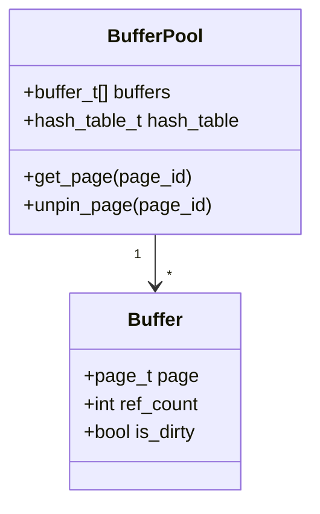
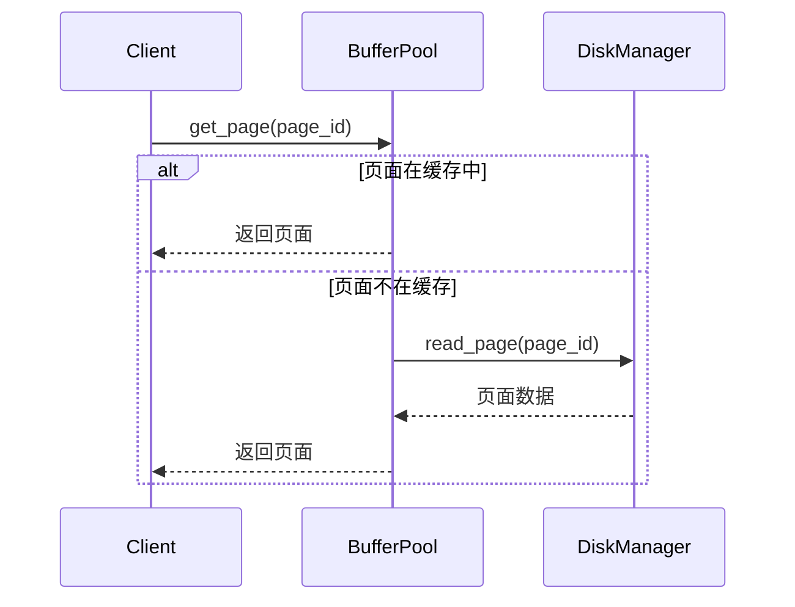
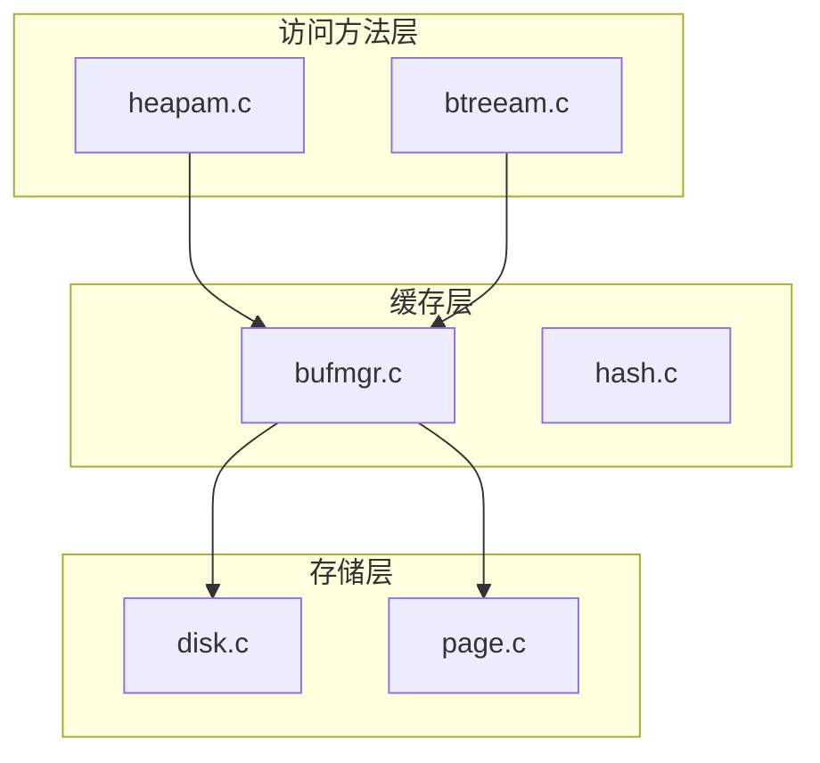
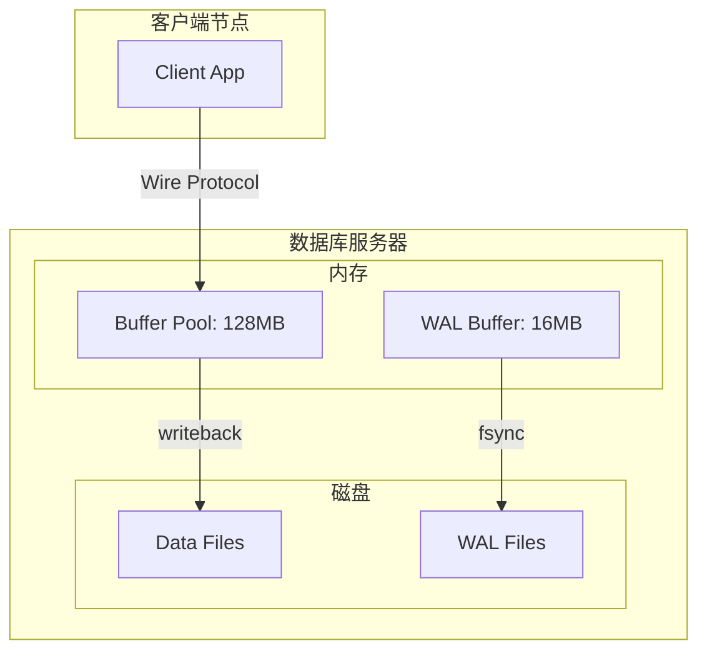

# 架构设计图补齐计划 - 设计规格文档

## 文档信息

- **创建日期**: 2026-07-16
- **目标**: 为所有子项目补齐 4+1 视图架构设计图
- **产出位置**: `docs/architecture/<项目名>/`
- **格式**: Markdown + Mermaid 图表

---

## 一、设计原则与规范

### 1.1 4+1 视图定义

采用 Philippe Kruchten 经典定义：

| 视图 | 关注点 | 图表类型 |
|------|--------|----------|
| **逻辑视图** | 功能需求、静态结构 | 类图、包图、组件图 |
| **过程视图** | 并发、运行时行为 | 序列图、活动图、状态图 |
| **开发视图** | 模块划分、代码组织 | 包图、组件图 |
| **物理视图** | 部署拓扑、硬件映射 | 部署图 |
| **场景视图** | 核心用例、用户视角 | 用例图 |

### 1.2 特性层级划分

采用 **子系统/模块 + 功能能力** 双层级：

```
项目级 4+1 视图
├── 子系统架构图
│   ├── 大特性架构图（如 HNSW 索引）
│   │   ├── 小特性流程图（如 HNSW 插入流程）
│   │   └── 小特性流程图（如 HNSW 搜索流程）
│   └── 大特性架构图（如 IVF 索引）
│       └── ...
└── ...
```

### 1.3 文件命名规范

```
docs/architecture/
├── db/                           # 数据库存储引擎
│   ├── README.md                 # 子系统概览
│   ├── 01-logical-view.md        # 逻辑视图
│   ├── 02-process-view.md        # 过程视图
│   ├── 03-development-view.md    # 开发视图
│   ├── 04-physical-view.md       # 物理视图
│   ├── 05-scenario-view.md       # 场景视图
│   ├── storage/                  # 存储核心大特性
│   │   ├── architecture.md       # 存储架构
│   │   ├── buffer-pool.md        # Buffer Pool 小特性
│   │   ├── wal.md                # WAL 日志小特性
│   │   └── ...
│   ├── access-methods/           # 访问方法大特性
│   │   ├── heapam.md
│   │   ├── btreeam.md
│   │   └── ...
│   └── ...
├── vector-index/                 # 向量索引子系统
├── algo/                         # 算法库
├── redis/                        # Redis 核心组件
├── rag/                          # RAG 系统
├── kbase/                        # 知识库应用
├── vdb-cli/                      # 向量数据库 CLI
├── db-driver/                    # 数据库驱动
├── todo-app/                     # 待办应用
├── knowledge-hub/                # 知识追踪平台
├── reading-radar/                # 阅读雷达
└── games/                        # 游戏应用
```

### 1.4 Mermaid 图表规范

- **类图**: `classDiagram` - 展示静态结构
- **序列图**: `sequenceDiagram` - 展示交互流程
- **活动图**: `flowchart` / `stateDiagram` - 展示业务流程
- **组件图**: `flowchart LR/TB` - 展示模块关系
- **部署图**: `flowchart` + 节点样式 - 展示部署拓扑
- **用例图**: `flowchart` + actor 样式 - 展示用户交互

---

## 二、子系统清单与层级划分

### 2.1 db 数据库存储引擎

**子系统架构**：
```
db/
├── 存储核心（storage subsystem）
│   ├── buffer-pool（Buffer Pool 管理）
│   ├── disk-manager（磁盘管理）
│   ├── page-manager（页面管理）
│   └── wal（写前日志）
├── 访问方法层（access methods）
│   ├── heapam（堆表访问方法）
│   ├── btreeam（BTree 索引访问方法）
│   └── rel（Relation 抽象层）
├── Catalog 系统（元数据管理）
│   ├── pg_class（表元数据）
│   ├── pg_attribute（列元数据）
│   └── pg_index（索引元数据）
├── SQL 层（sql subsystem）
│   ├── parser（SQL 解析器）
│   ├── planner（查询计划器）
│   └── executor（查询执行器）
├── 事务与并发（transaction & concurrency）
│   ├── txn（事务管理）
│   ├── lock（锁管理）
│   └── mvcc（多版本并发控制）
├── 索引系统（index subsystem）
│   ├── 传统索引（btree/hash/gin/gist/brin/spgist）
│   └── 向量索引（hnsw/ivf/diskann 等 33 种）
├── 多模态存储（multi-modal storage）
│   ├── kv-engine（键值存储）
│   ├── vector-engine（向量存储）
│   ├── doc-engine（文档存储）
│   ├── ts-engine（时序存储）
│   ├── spatial-engine（空间存储）
│   ├── graph-engine（图存储）
│   └── yang-engine（层次存储）
├── 分布式能力（distributed）
│   ├── sharding（分片与路由）
│   ├── dist-txn（分布式事务）
│   ├── raft（Raft 共识）
│   └── coordinator（多节点协调）
├── 后台工作（bgworker）
│   ├── scheduler（任务调度器）
│   ├── task-queue（任务队列）
│   └── worker-pool（工作线程池）
└── 工具层（tools）
    ├── initdb（数据库初始化）
    ├── pg_ctl（服务控制）
    └── db_server（Wire 协议服务器）
```

**需要产出的架构图**：
- 项目级：5 个视图（逻辑/过程/开发/物理/场景）
- 子系统级：9 个子系统架构图
- 大特性级：约 30 个大特性架构图
- 小特性级：约 80 个小特性流程图

**预计图表总数**: ~120 张

### 2.2 向量索引子系统（vector_index）

**子系统架构**：
```
vector_index/
├── HNSW 系列
│   ├── hnsw（基础 HNSW）
│   ├── hnsw_pq（PQ 量化 HNSW）
│   ├── hnsw_sq（标量量化 HNSW）
│   └── nsw（基础 NSW）
├── IVF 系列
│   ├── ivf（基础 IVF）
│   ├── ivf_flat（IVF-Flat）
│   ├── ivf_pq（IVF-PQ）
│   ├── ivf_hnsw（IVF-HNSW 混合）
│   └── faiss_ivf_compat（FAISS IVF 兼容）
├── 图索引
│   ├── diskann（DiskANN 磁盘索引）
│   ├── ssg（SSG 图索引）
│   └── tiered_index（分层索引）
├── 树索引
│   ├── kd_tree（KD 树）
│   ├── ball_tree（球树）
│   └── annoy（Annoy 索引）
├── 哈希索引
│   ├── lsh（局部敏感哈希）
│   ├── lsh_multiprobe（多探针 LSH）
│   ├── spectral_hash（谱哈希）
│   └── itq（迭代量化）
├── 量化技术
│   ├── pq（乘积量化）
│   ├── sq（标量量化）
│   ├── rq（残差量化）
│   ├── lvq（局部向量量化）
│   └── opq（优化乘积量化）
├── 特殊索引
│   ├── scann（ScaNN 索引）
│   ├── milvus_ivf（Milvus IVF 兼容）
│   └── streaming（流式索引）
├── 全文检索
│   ├── BM25（BM25 排序）
│   └── fulltext（全文索引）
├── 混合检索
│   ├── multimodal（多模态索引）
│   ├── hybrid_search（混合搜索）
│   └── reranker（重排序器）
└── 持久化与删除
    ├── persist（持久化）
    └── delete（删除管理）
```

**需要产出的架构图**：
- 项目级：5 个视图
- 子系统级：10 个子系统架构图
- 大特性级：约 33 个索引类型架构图
- 小特性级：约 100 个流程图（每个索引的插入/搜索/删除流程）

**预计图表总数**: ~140 张

### 2.3 algo 算法库

**子系统架构**：
```
algo/
├── 距离计算
│   ├── simd-euclidean（SIMD 欧氏距离）
│   ├── simd-cosine（SIMD 余弦距离）
│   └── simd-ip（SIMD 内积）
├── 聚类算法
│   └── kmeans（K-Means 聚类）
├── 量化算法
│   ├── pq（乘积量化）
│   └── lvq（局部向量量化）
├── 分词与词典
│   ├── tokenizer（分词器）
│   └── dictionary（词典）
└── 排序与搜索
    ├── sort（排序算法）
    └── binary-search（二分查找）
```

**需要产出的架构图**：
- 项目级：5 个视图
- 子系统级：5 个子系统架构图
- 大特性级：约 10 个大特性架构图
- 小特性级：约 20 个流程图

**预计图表总数**: ~40 张

### 2.4 Redis 核心组件

**子系统架构**：
```
redis/
├── sds（动态字符串）
├── adlist（双向链表）
├── skiplist（跳表）
└── zmalloc（内存管理）
```

**需要产出的架构图**：
- 项目级：5 个视图
- 大特性级：4 个组件架构图
- 小特性级：约 12 个流程图

**预计图表总数**: ~25 张

### 2.5 RAG 系统

**子系统架构**：
```
rag/
├── 文档处理
│   ├── parser（文档解析）
│   └── chunker（分块器）
├── 向量索引
│   ├── index（索引管理）
│   └── persist（持久化）
├── 检索与重排
│   ├── retrieval（检索器）
│   ├── reranker（重排序器）
│   ├── query-expansion（查询扩展）
│   └── graph-retrieval（图检索）
├── 知识图谱
│   ├── knowledge-graph（知识图谱）
│   └── entity-extraction（实体抽取）
├── LLM 集成
│   └── llm（LLM 接口）
├── 持久化与服务
│   ├── persist（持久化）
│   ├── server（服务器）
│   ├── cli（命令行）
│   └── config（配置）
└── 评估与监控
    ├── evaluator（评估器）
    └── metrics（指标）
```

**需要产出的架构图**：
- 项目级：5 个视图
- 子系统级：6 个子系统架构图
- 大特性级：约 21 个模块架构图
- 小特性级：约 60 个流程图

**预计图表总数**: ~90 张

### 2.6 kbase 知识库应用

**子系统架构**：
```
kbase/
├── index（索引管理）
├── search（搜索引擎）
├── embed（嵌入集成）
└── infra（基础设施）
```

**需要产出的架构图**：
- 项目级：5 个视图
- 大特性级：4 个模块架构图
- 小特性级：约 10 个流程图

**预计图表总数**: ~20 张

### 2.7 vdb_cli 向量数据库 CLI

**需要产出的架构图**：
- 项目级：5 个视图
- 小特性级：约 5 个流程图

**预计图表总数**: ~10 张

### 2.8 db_driver 数据库驱动（Python）

**需要产出的架构图**：
- 项目级：5 个视图
- 大特性级：6 个模块（connection/cursor/pool/exceptions）
- 小特性级：约 10 个流程图

**预计图表总数**: ~20 张

### 2.9 todo-app 待办应用

**需要产出的架构图**：
- 项目级：5 个视图
- 大特性级：4 个模块
- 小特性级：约 8 个流程图

**预计图表总数**: ~15 张

### 2.10 knowledge_hub 知识追踪平台（Taro 跨端）

**子系统架构**：
```
knowledge_hub/
├── 数据层
│   ├── data（数据源）
│   └── types（类型定义）
├── 业务层
│   ├── services（服务层）
│   ├── stores（状态管理）
│   └── hooks（自定义 Hooks）
├── UI 层
│   ├── pages（页面）
│   ├── components（组件）
│   └── styles（样式）
└── 工具层
    └── utils（工具函数）
```

**需要产出的架构图**：
- 项目级：5 个视图
- 子系统级：4 层架构图
- 大特性级：约 10 个模块架构图
- 小特性级：约 20 个流程图

**预计图表总数**: ~40 张

### 2.11 reading-radar 阅读雷达

**需要产出的架构图**：
- 项目级：5 个视图
- 大特性级：约 5 个模块
- 小特性级：约 10 个流程图

**预计图表总数**: ~20 张

### 2.12 games 游戏应用

**子系统架构**：
```
games/
├── snake（贪吃蛇）
├── 2048
└── sudoku（数独）
```

**需要产出的架构图**：
- 项目级：5 个视图（每个游戏独立）
- 小特性级：每个游戏约 5 个流程图

**预计图表总数**: ~30 张（3 个游戏 × 10 张）

---

## 三、实施计划

### 3.1 总体统计

| 子系统 | 项目级视图 | 子系统架构 | 大特性架构 | 小特性流程 | 总计 |
|--------|-----------|-----------|-----------|-----------|------|
| db | 5 | 9 | 30 | 80 | **124** |
| vector_index | 5 | 10 | 33 | 100 | **148** |
| algo | 5 | 5 | 10 | 20 | **40** |
| redis | 5 | 0 | 4 | 12 | **21** |
| rag | 5 | 6 | 21 | 60 | **92** |
| kbase | 5 | 0 | 4 | 10 | **19** |
| vdb_cli | 5 | 0 | 0 | 5 | **10** |
| db_driver | 5 | 0 | 6 | 10 | **21** |
| todo-app | 5 | 0 | 4 | 8 | **17** |
| knowledge_hub | 5 | 4 | 10 | 20 | **39** |
| reading-radar | 5 | 0 | 5 | 10 | **20** |
| games | 15 | 0 | 3 | 15 | **33** |
| **总计** | **70** | **34** | **130** | **350** | **~584** |

### 3.2 分批次实施建议

**Batch 1: db 存储引擎核心**（优先级最高）
- 存储核心
- Catalog 系统
- 访问方法层
- 预计图表：50 张

**Batch 2: db SQL 层与事务**
- SQL 层
- 事务与并发
- 预计图表：30 张

**Batch 3: 向量索引层 - 基础索引**
- HNSW 系列、IVF 系列、图索引
- 预计图表：60 张

**Batch 4: 向量索引层 - 高级索引**
- 树索引、哈希索引、量化技术
- 预计图表：50 张

**Batch 5: 向量索引层 - 特殊索引与混合检索**
- 特殊索引、混合检索、持久化
- 预计图表：40 张

**Batch 6: 多模态存储与分布式能力**
- 多模态存储引擎
- 分布式能力
- 预计图表：30 张

**Batch 7: 算法库与 Redis 组件**
- algo 算法库
- Redis 核心组件
- 预计图表：60 张

**Batch 8: RAG 系统**
- 全部 RAG 模块
- 预计图表：90 张

**Batch 9: 应用层 - CLI 与驱动**
- vdb_cli、db_driver、kbase、todo-app
- 预计图表：70 张

**Batch 10: Web 应用层**
- knowledge_hub、reading-radar
- 预计图表：60 张

**Batch 11: 游戏应用**
- snake、2048、sudoku
- 预计图表：30 张

### 3.3 单批次工作流程

每个 Batch 的执行步骤：

1. **创建目录结构**
   ```bash
   mkdir -p docs/architecture/<项目名>
   ```

2. **编写项目级 5 个视图**（每个视图一个 Markdown 文件）

3. **编写子系统架构图**（如果有）

4. **编写大特性架构图**
   - 每个大特性一个目录
   - 包含架构总览 + 各小特性流程图

5. **编写小特性流程图**
   - 插入/查询/更新/删除等核心流程
   - 并发/错误处理等特殊流程

---

## 四、图表内容规范

### 4.1 逻辑视图内容

- **静态结构**：类/模块/组件及其关系
- **核心接口**：公开 API 定义
- **数据模型**：核心数据结构

示例 Mermaid 类图：


### 4.2 过程视图内容

- **运行时交互**：序列图展示调用链
- **并发模型**：线程/进程模型
- **状态变迁**：状态图展示生命周期

示例 Mermaid 序列图：


### 4.3 开发视图内容

- **模块划分**：目录结构
- **依赖关系**：模块间依赖
- **构建层次**：编译顺序

示例 Mermaid 组件图：


### 4.4 物理视图内容

- **部署拓扑**：服务器/节点布局
- **运行环境**：操作系统/依赖
- **资源分配**：内存/磁盘/网络

示例 Mermaid 部署图：


### 4.5 场景视图内容

- **核心用例**：用户关键操作
- **端到端流程**：从输入到输出
- **参与者**：用户/系统/外部服务

示例 Mermaid 用例图：
```mermaid
flowchart LR
    actor User
    subgraph "向量数据库系统"
        UC1[(插入向量)]
        UC2[(相似搜索)]
        UC3[(索引管理)]
        UC4[(持久化)]
    end
    User --> UC1
    User --> UC2
    User --> UC3
    UC1 --> UC4
    UC2 --> UC4
```

---

## 五、质量检查清单

每个架构图完成后需检查：

- [ ] **完整性**：是否覆盖该子系统的所有核心组件
- [ ] **准确性**：图表是否与实际代码结构一致
- [ ] **清晰性**：图表是否易于理解，命名是否规范
- [ ] **一致性**：图表间的术语、命名是否统一
- [ ] **可追溯性**：是否标注关键代码文件位置

---

## 六、风险与对策

| 风险 | 影响 | 对策 |
|------|------|------|
| 图表数量多，维护成本高 | 后续代码变更可能导致图表过时 | 在图表中标注关键代码文件，便于同步更新 |
| Mermaid 对复杂图表支持有限 | 部分复杂架构难以清晰表达 | 拆分为多个子图，或使用文字补充说明 |
| 子系统边界理解偏差 | 图表分类不合理 | 先产出初版，根据用户反馈调整 |

---

## 七、后续行动

设计规格文档完成后，需要：

1. **用户评审**：确认子系统集成和层级划分是否合理
2. **分批次实施**：按照 Batch 1-11 顺序执行
3. **持续迭代**：根据实施过程中的发现更新规格
