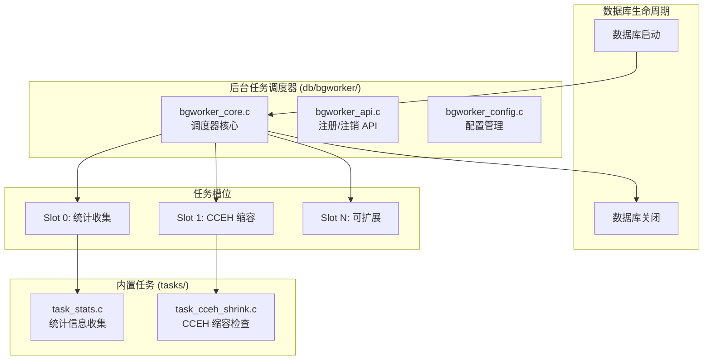
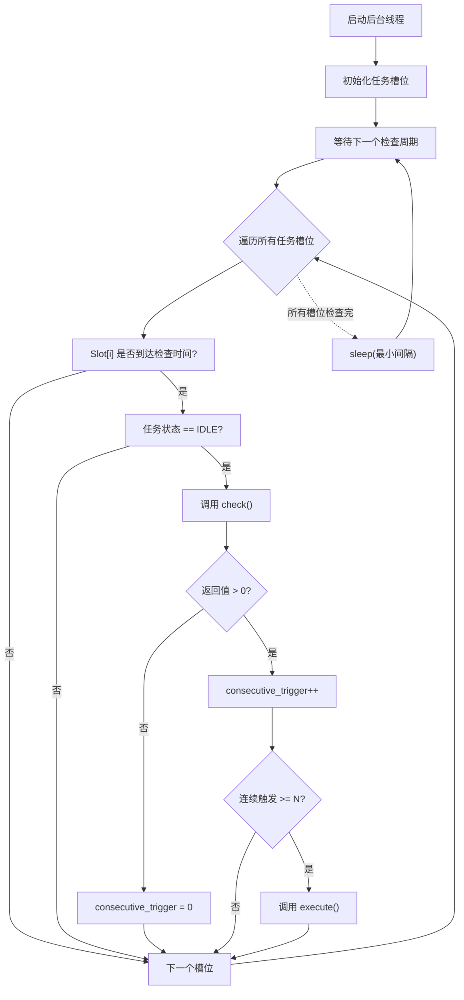
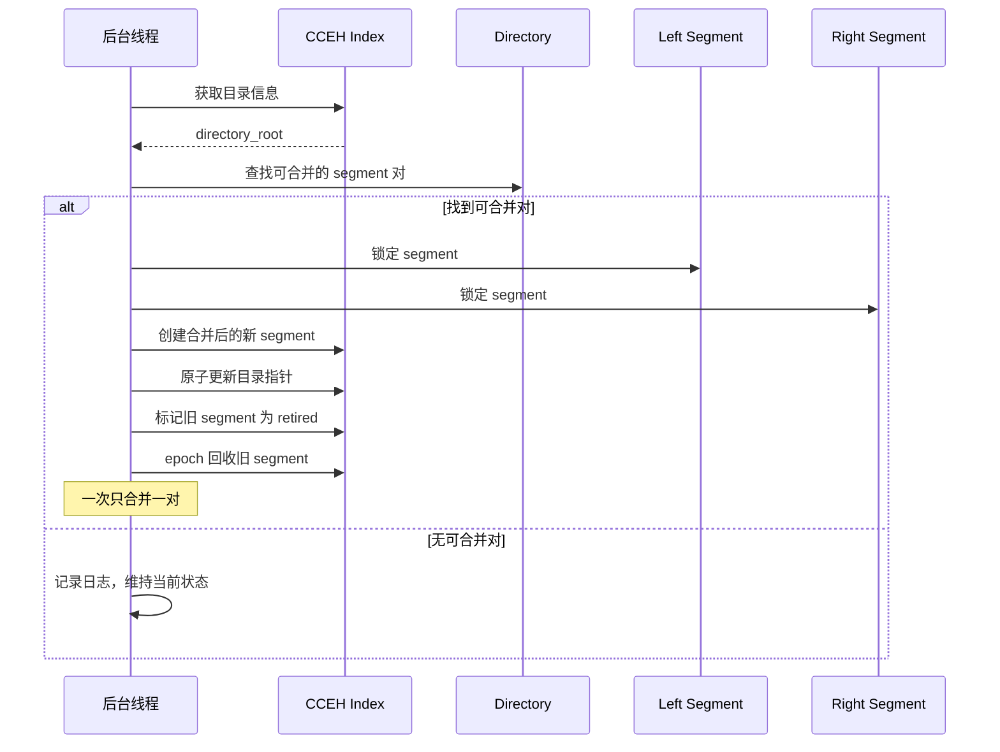
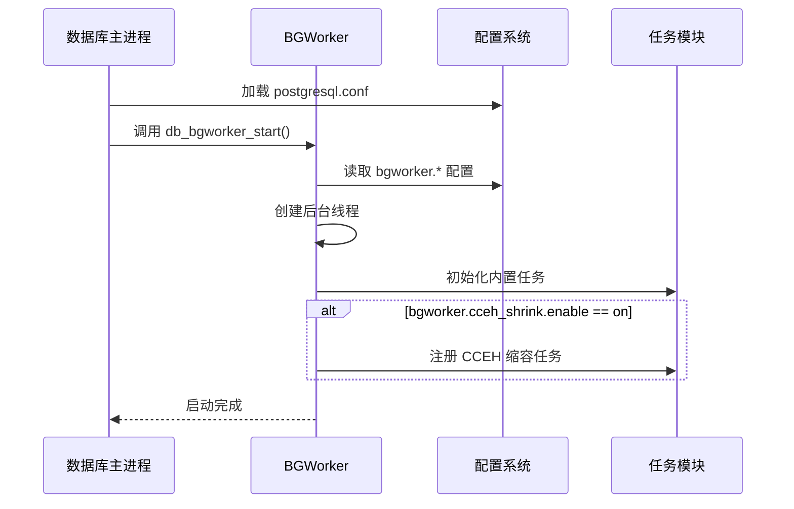
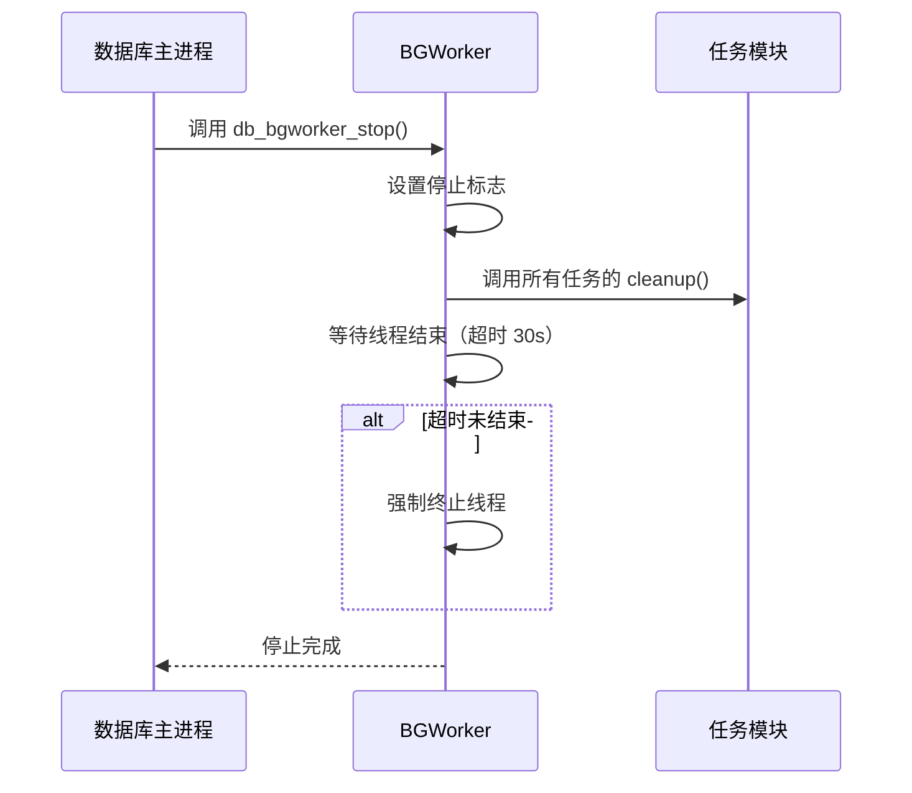

# DB 后台任务调度器设计文档

**版本**: v1.1
**日期**: 2026-07-16
**状态**: 已实现

---

## 1. 概述

### 1.1 目标

设计并实现一个通用的**后台线程框架**，用于执行数据库系统的后台任务，首要应用是判断 CCEH 索引是否需要缩容。未来可扩展支持统计收集、检查点、碎片整理等更多后台任务。

### 1.2 设计原则

| 原则 | 说明 |
|------|------|
| **独立模块化** | 后台任务调度器作为独立子系统，与具体业务解耦 |
| **时间窗口触发** | 避免抖动：连续 N 次检查满足条件才触发操作 |
| **分片执行** | 每次只处理一个工作单元，避免长时间阻塞主线程 |
| **插件式扩展** | 核心任务内置 + 扩展任务可运行时注册 |
| **跨平台支持** | Linux (dlopen) / Windows (LoadLibrary) 条件编译 |

### 1.3 术语表

| 术语 | 定义 |
|------|------|
| **BGWorker** | Background Worker，后台任务调度器 |
| **Task Slot** | 任务槽，每个槽位可注册一个后台任务 |
| **Shrink** | 缩容，指 CCEH 目录缩小（减少 segment 数量） |
| **Load Factor** | 负载因子 = 记录数 / (segment数 × segment容量) |
| **Time Window** | 时间窗口，连续 N 次检查满足条件才触发 |

---

## 2. 系统架构

### 2.1 整体架构图



### 2.2 目录结构

```
engineering/src/db/
├── bgworker/
│   ├── CMakeLists.txt              # 构建配置
│   ├── bgworker.h                  # 公共 API 头文件
│   ├── bgworker.c                  # 调度器核心实现
│   ├── bgworker_api.c              # 任务注册/注销 API
│   ├── bgworker_config.c           # 配置管理
│   ├── bgworker_internal.h         # 内部数据结构
│   └── tasks/
│       ├── CMakeLists.txt
│       ├── task_iface.h            # 任务接口定义
│       ├── task_stats.c            # 内置：统计收集任务
│       └── task_cceh_shrink.c      # 内置：CCEH 缩容任务

engineering/include/db/
├── bgworker.h                      # 公共头文件（暴露给外部）
└── bgworker/
    ├── task_iface.h                # 任务接口定义
    └── config.h                    # 配置参数定义
```

### 2.3 核心组件

#### 2.3.1 任务接口 (task_iface.h)

```c
/**
 * 后台任务上下文
 */
typedef struct db_bg_task_context {
    void      *user_data;           /* 用户自定义数据 */
    uint64_t   last_check_time;     /* 上次检查时间 (ms) */
    uint32_t   consecutive_trigger; /* 连续触发计数 */
    atomic_uint status;             /* 任务状态 */
} db_bg_task_context_t;

/**
 * 后台任务定义
 */
typedef struct db_bg_task {
    const char *name;               /* 任务名称（唯一标识） */
    uint32_t    interval_ms;        /* 检查间隔（毫秒） */
    int        (*init)(db_bg_task_context_t *ctx);
                                        /* 初始化回调，返回 0 表示成功 */
    int        (*check)(db_bg_task_context_t *ctx);
                                        /* 检查回调，返回值含义：
                                         *  > 0: 满足触发条件
                                         *  = 0: 不满足条件
                                         *  < 0: 错误 */
    int        (*execute)(db_bg_task_context_t *ctx);
                                        /* 执行回调，返回 0 表示成功 */
    void       (*cleanup)(db_bg_task_context_t *ctx);
                                        /* 清理回调 */
    db_bg_task_context_t *ctx;      /* 任务上下文 */
} db_bg_task_t;

/* 任务状态 */
#define DB_BG_TASK_STATUS_IDLE      0  /* 空闲 */
#define DB_BG_TASK_STATUS_CHECKING  1  /* 检查中 */
#define DB_BG_TASK_STATUS_EXECUTING 2  /* 执行中 */
#define DB_BG_TASK_STATUS_PAUSED    3  /* 暂停 */
```

#### 2.3.2 调度器核心 (bgworker_core.c)

**主循环逻辑**：



---

## 3. CCEH 缩容任务设计

### 3.1 缩容触发条件

| 参数 | 默认值 | 说明 |
|------|--------|------|
| `load_factor_threshold` | 0.25 | 负载因子阈值 |
| `time_window_size` | 3 | 连续触发次数 |
| `min_global_depth` | 1 | 最小全局深度（防止过度缩容） |

**触发公式**：

```
满足条件 = (load_factor < 0.25) 连续出现 3 次
```

其中：

```
load_factor = n_total / (segment_count * segment_capacity)
```

### 3.2 分片缩容策略

每次缩容操作只处理**一对相邻 segment 的合并**，避免长时间阻塞。



### 3.3 缩容安全检查

执行缩容前必须满足以下条件：

1. **最小深度限制**：`global_depth > min_global_depth`
2. **无并发写**：当前无活跃的 insert/split 操作
3. **读者已释放**：所有读者已退出当前 segment
4. **负载持续低**：时间窗口内负载因子持续低于阈值

---

## 4. 配置系统

### 4.1 GUC 参数

| 参数名 | 类型 | 默认值 | 说明 |
|--------|------|--------|------|
| `bgworker.enabled` | bool | true | 是否启用后台任务调度器 |
| `bgworker.tick_ms` | int | 1000 | 主循环检查间隔（毫秒） |
| `bgworker.max_tasks` | int | 16 | 最大任务槽位数 |
| `bgworker.cceh_shrink.enable` | bool | true | 是否启用 CCEH 缩容任务 |
| `bgworker.cceh_shrink.interval_ms` | int | 5000 | CCEH 缩容检查间隔 |
| `bgworker.cceh_shrink.load_factor_threshold` | float | 0.25 | 负载因子阈值 |
| `bgworker.cceh_shrink.time_window` | int | 3 | 时间窗口大小 |
| `bgworker.cceh_shrink.min_global_depth` | int | 1 | 最小全局深度 |

### 4.2 配置文件格式

```ini
# postgresql.conf 风格
bgworker.enabled = on
bgworker.tick_ms = 1000
bgworker.max_tasks = 16

# CCEH 缩容任务配置
bgworker.cceh_shrink.enable = on
bgworker.cceh_shrink.interval_ms = 5000
bgworker.cceh_shrink.load_factor_threshold = 0.25
bgworker.cceh_shrink.time_window = 3
bgworker.cceh_shrink.min_global_depth = 1
```

---

## 5. API 设计

### 5.1 公共 API (bgworker.h)

```c
#ifdef __cplusplus
extern "C" {
#endif

/**
 * 启动后台任务调度器
 * @return 0 成功，-1 失败
 */
int db_bgworker_start(void);

/**
 * 停止后台任务调度器
 * @return 0 成功，-1 失败
 */
int db_bgworker_stop(void);

/**
 * 注册后台任务
 * @param task 任务定义
 * @param slot_out 输出分配的任务槽位
 * @return 0 成功，-1 失败
 */
int db_bgworker_register(db_bg_task_t *task, int *slot_out);

/**
 * 注销后台任务
 * @param name 任务名称
 * @return 0 成功，-1 未找到
 */
int db_bgworker_unregister(const char *name);

/**
 * 暂停后台任务
 * @param name 任务名称
 * @return 0 成功，-1 未找到
 */
int db_bgworker_pause(const char *name);

/**
 * 恢复后台任务
 * @param name 任务名称
 * @return 0 成功，-1 未找到
 */
int db_bgworker_resume(const char *name);

/**
 * 获取任务状态
 * @param name 任务名称
 * @param status_out 输出状态
 * @return 0 成功，-1 未找到
 */
int db_bgworker_get_status(const char *name, unsigned int *status_out);

/**
 * 获取调度器统计信息
 */
typedef struct db_bgworker_stats {
    uint32_t task_count;          /* 已注册任务数 */
    uint32_t running_time_ms;     /* 运行时间（毫秒） */
    uint64_t total_cycles;        /* 总检查周期数 */
} db_bgworker_stats_t;

int db_bgworker_get_stats(db_bgworker_stats_t *stats_out);

#ifdef __cplusplus
}
#endif
```

### 5.2 使用示例

```c
#include <db/bgworker.h>

/* 自定义任务初始化 */
static int my_task_init(db_bg_task_context_t *ctx) {
    ctx->user_data = my_alloc_context();
    return 0;
}

/* 自定义检查逻辑 */
static int my_task_check(db_bg_task_context_t *ctx) {
    my_context_t *c = (my_context_t *)ctx->user_data;
    return check_condition(c) ? 1 : 0;
}

/* 自定义执行逻辑 */
static int my_task_execute(db_bg_task_context_t *ctx) {
    my_context_t *c = (my_context_t *)ctx->user_data;
    return perform_action(c);
}

/* 自定义清理 */
static void my_task_cleanup(db_bg_task_context_t *ctx) {
    my_free_context(ctx->user_data);
}

/* 注册任务 */
void register_my_task(void) {
    db_bg_task_t task = {
        .name = "my_custom_task",
        .interval_ms = 10000,
        .init = my_task_init,
        .check = my_task_check,
        .execute = my_task_execute,
        .cleanup = my_task_cleanup,
        .ctx = NULL
    };
    
    int slot;
    db_bgworker_register(&task, &slot);
}
```

---

## 6. 生命周期管理

### 6.1 数据库启动流程



### 6.2 数据库关闭流程



---

## 7. 错误处理与日志

### 7.1 错误码

| 错误码 | 含义 |
|--------|------|
| 0 | 成功 |
| -1 | 通用错误 |
| -2 | 任务未找到 |
| -3 | 任务已存在 |
| -4 | 调度器未运行 |
| -5 | 内存分配失败 |
| -6 | 线程创建失败 |

### 7.2 日志级别

| 级别 | 使用场景 |
|------|----------|
| DEBUG | 每次检查的执行细节 |
| INFO | 任务注册/注销、调度器启动/停止 |
| WARN | 缩容条件满足、执行超时 |
| ERROR | 任务执行失败、线程异常 |

---

## 8. 测试计划

### 8.1 单元测试

| 测试用例 | 描述 |
|----------|------|
| `test_bgworker_register` | 测试任务注册功能 |
| `test_bgworker_unregister` | 测试任务注销功能 |
| `test_bgworker_lifecycle` | 测试启动/停止流程 |
| `test_bgworker_pause_resume` | 测试暂停/恢复功能 |
| `test_cceh_shrink_trigger` | 测试缩容触发条件 |
| `test_cceh_shrink_execute` | 测试缩容执行逻辑 |
| `test_time_window` | 测试时间窗口机制 |

### 8.2 集成测试

| 测试用例 | 描述 |
|----------|------|
| `test_bgworker_with_cceh` | 后台任务调度器与 CCEH 集成测试 |
| `test_concurrent_operations` | 并发读写时的后台任务测试 |
| `test_graceful_shutdown` | 优雅关闭测试 |

---

## 9. 实现计划

### 9.1 阶段划分

| 阶段 | 任务 | 预计工作量 |
|------|------|-----------|
| **Phase 1** | 核心框架搭建 | 2h |
| | - 目录结构与 CMake 配置 | |
| | - 任务接口定义 | |
| | - 调度器核心实现 | |
| **Phase 2** | CCEH 缩容任务 | 2h |
| | - 缩容检查逻辑 | |
| | - 分片缩容实现 | |
| | - 时间窗口机制 | |
| **Phase 3** | 配置与 API | 1h |
| | - GUC 参数集成 | |
| | - 公共 API 实现 | |
| **Phase 4** | 测试与文档 | 1h |
| | - 单元测试 | |
| | - 集成测试 | |
| | - 使用文档 | |

### 9.2 依赖关系

```
Phase 1 (核心框架)
    ↓
Phase 2 (CCEH 缩容) ← cceh.h
    ↓
Phase 3 (配置 API) ← guc.h
    ↓
Phase 4 (测试文档)
```

---

## 10. 附录

### 10.1 参考实现

- **PostgreSQL**: `src/backend/postmaster/bgworker.c`
- **MySQL**: `storage/innobase/srv/srv0start.cc` (srv_manager_thread)
- **RocksDB**: `utilities/background_thread.h`

### 10.2 未来扩展

| 扩展方向 | 描述 |
|----------|------|
| **统计收集任务** | 定期收集表/索引统计信息 |
| **检查点任务** | 定期执行检查点操作 |
| **碎片整理** | 定期整理表碎片 |
| **健康检查** | 定期检查系统健康状态 |
| **插件机制** | 支持动态加载外部任务插件 |

---

## 11. 设计决策记录

| 决策 | 选择 | 理由 |
|------|------|------|
| 缩容触发条件 | 时间窗口 | 避免负载因子抖动导致的频繁缩容 |
| 架构模式 | 混合模式任务槽 | 内置核心任务 + 运行时可扩展 |
| 执行策略 | 分片缩容 | 避免长时间阻塞，影响前端请求 |
| 生命周期 | 数据库启动/关闭 | 与数据库生命周期一致 |
| 任务配置 | 运行时 API 注册 | 灵活配置，核心任务内置 |
| 扩展方案 | 完整插件框架 | 未来支持动态加载外部任务 |
| 跨平台支持 | 条件编译 | 兼容 Linux/Windows |
