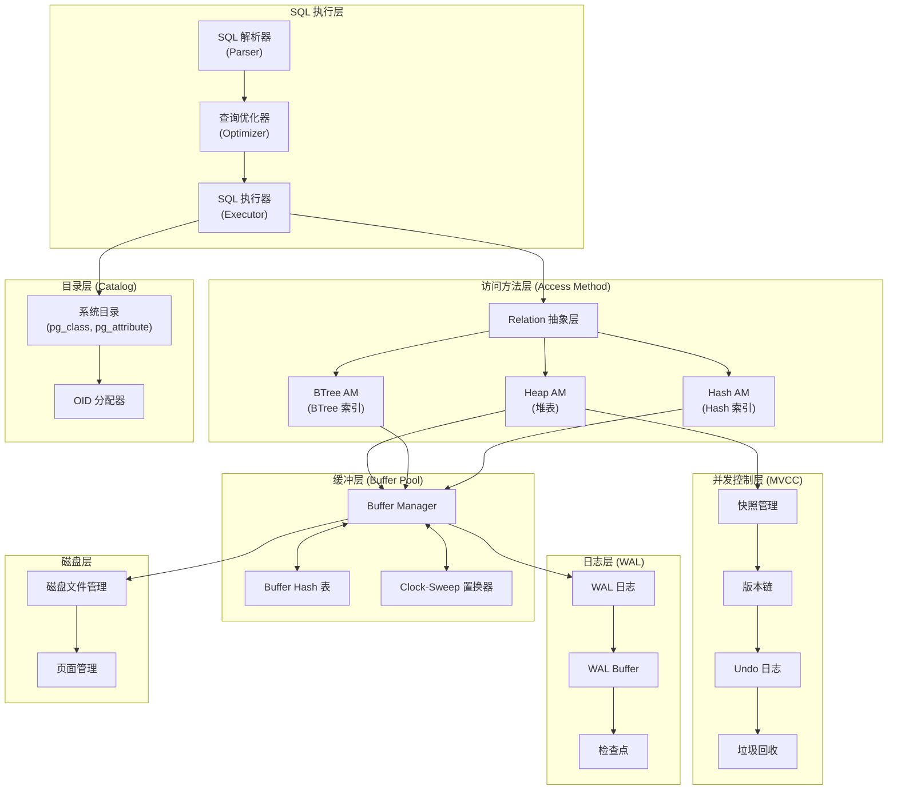
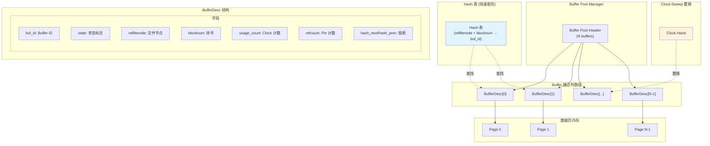
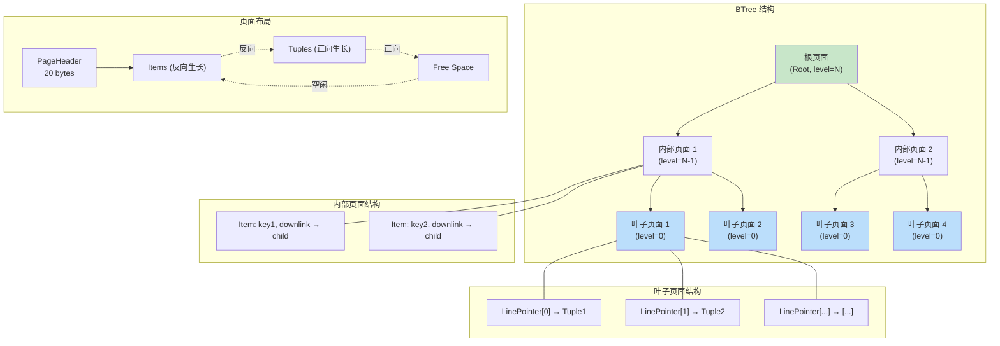
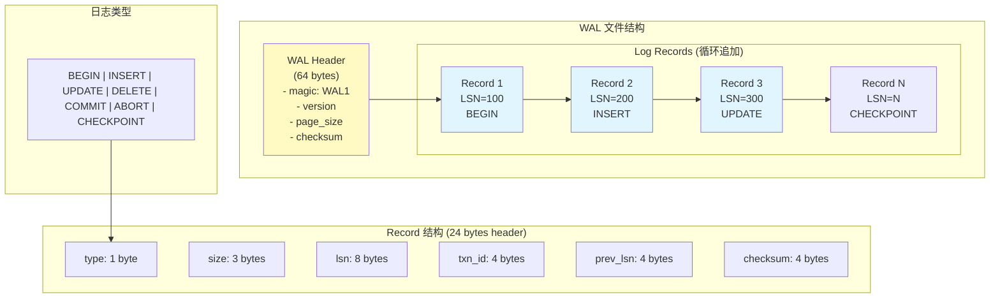
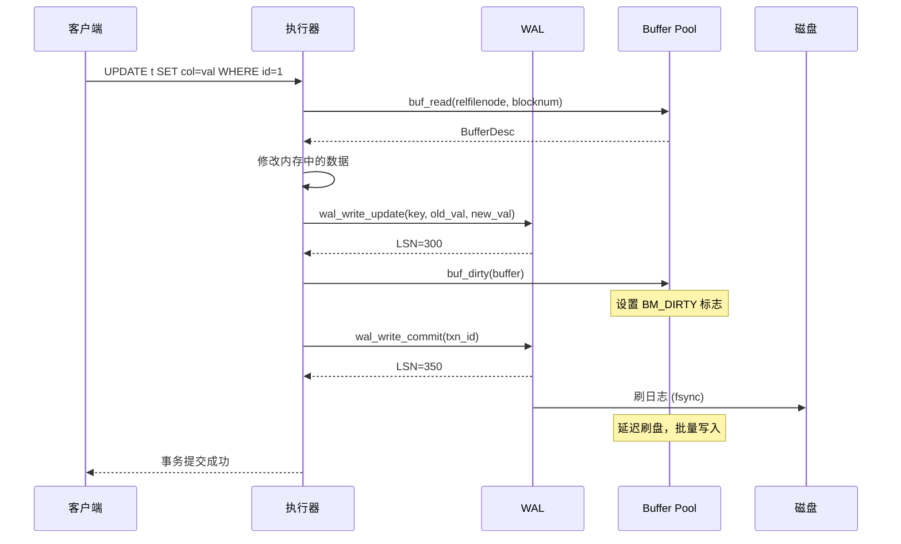
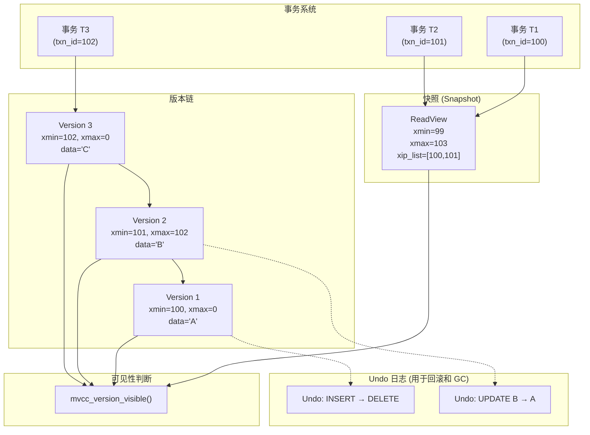
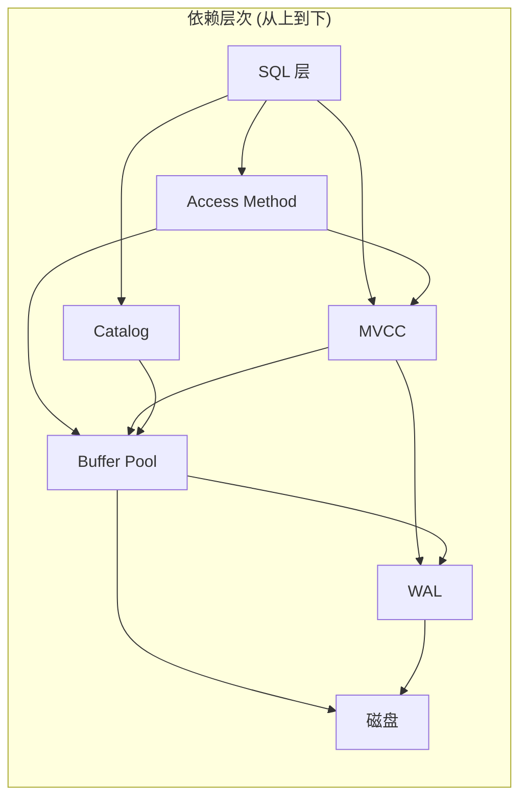

# 存储引擎架构图

> 本文档记录数据库存储引擎的完整架构设计，参考 PostgreSQL 风格实现。

---

## 1. 整体架构



---

## 2. Buffer Pool 架构



**关键概念：**

| 概念 | 说明 |
|------|------|
| **BufferDesc** | 每个 Buffer 的元数据描述符，包含状态、锁信息、Hash 链表指针 |
| **Hash 表** | 通过 (relfilenode, blocknum) 快速定位 Buffer |
| **Clock-Sweep** | 页面置换算法，遍历环形缓冲区找 usage_count=0 的页面 |
| **Pin/Unpin** | Pin 增加 refcount 表示页面正在使用，不能被置换 |
| **Dirty Page** | 标记为脏的页面需要在置换前刷盘 |

---

## 3. BTree 索引架构



**BTree 查找过程：**

```
1. 从根页面开始
2. 在内部页面二分查找：key < downlink_key → 左子树
3. 重复直到叶子页面
4. 在叶子页面二分查找匹配的键
5. 返回 heap tuple 指针
```

**页面分裂（Insert 时）：**

```
当页面满时：
1. 分配新页面
2. 将后半部分数据移动到新页面
3. 在父页面插入新的 downlink
4. 如果父页面也满，继续分裂向上传播
```

---

## 4. WAL (Write-Ahead Logging) 架构



**WAL 与 Buffer Pool 的协作：**



**检查点 (Checkpoint) 流程：**

```
1. 写入 CHECKPOINT 日志记录
2. 将所有脏页刷到磁盘
3. 更新控制文件中的检查点位置
4. 后续恢复只需从检查点开始
```

---

## 5. MVCC (多版本并发控制) 架构



**快照可见性规则：**

```
版本 V 对快照 S 可见当且仅当：

1. xmin 规则：V.xmin 在快照中已提交
   - V.xmin < S.xmax
   - V.xmin 不在 S.xip_list 中

2. xmax 规则：V 未被已提交的事务删除
   - V.xmax = 0（从未被删除）
   - 或 V.xmax 在快照中仍活跃（未提交）
   - 或 V.xmax >= S.xmax（删除事务未提交）

3. 自可见：事务自身创建的版本始终可见
   - V.xmin == 当前事务ID
```

**版本链遍历：**

```c
mvcc_version* mvcc_version_find_visible(
    mvcc_version_t* head,      // 版本链头
    mvcc_snapshot_t* snapshot,  // 快照
    mvcc_txn_id_t cur_txn_id   // 当前事务ID
) {
    for (v = head; v != NULL; v = v->next) {
        if (mvcc_version_visible(snapshot, v->xmin, v->xmax, cur_txn_id)) {
            return v;  // 找到可见版本
        }
    }
    return NULL;  // 无可见版本
}
```

---

## 6. Heap 存储架构

```mermaid
graph TB
    subgraph "堆表页面结构"
        PAGE_HDR["PageHeaderData<br/>24 bytes<br/>- pd_lsn<br/>- pd_lower<br/>- pd_upper<br/>- pd_special"]
        
        subgraph "LinePointer 数组 (pd_lower 起始)"
            LP1["[0] offset=128, flags=USED"]
            LP2["[1] offset=256, flags=USED"]
            LP3["[2] offset=0, flags=DEAD"]
            LP4["[3] offset=384, flags=USED"]
        end
        
        subgraph "Tuple 数据 (pd_upper 起始，向低地址生长)"
            T1["Tuple 1: xmin=100, xmax=0, data"]
            T2["Tuple 2: xmin=101, xmax=102, data"]
            T3["Tuple 3: xmin=103, xmax=0, data"]
        end
        
        subgraph "空闲空间 (pd_lower 到 pd_upper 之间)"
            FREE["Free Space"]
        end
    end

    PAGE_HDR --> LP1
    PAGE_HDR --> LP2
    PAGE_HDR --> LP3
    PAGE_HDR --> LP4

    T1 -.->|在页面中| LP1
    T2 -.->|在页面中| LP2
    T3 -.->|在页面中| LP4

    LP3 -.x.|已删除| T2

    subgraph "MVCC 字段"
        T_XMIN["t_xmin: 创建事务ID"]
        T_XMAX["t_xmax: 删除事务ID"]
        T_CID["t_cid: 命令ID"]
        T_CTID["t_ctid: 版本链指针"]
    end

    T1 --> T_XMIN
    T1 --> T_XMAX
    T1 --> T_CID
    T1 --> T_CTID

    style FREE fill:#f5f5f5
    style PAGE_HDR fill:#e8f5e9
```

**插入流程：**

```
heap_insert(rel, tuple):
1. 获取目标页面 Buffer
2. 检查页面空闲空间
3. 如果空间不足，分配新页面
4. 在 pd_upper 位置写入 Tuple
5. 在 pd_lower 位置添加 LinePointer
6. 更新 pd_lower 和 pd_upper
7. 更新 pd_lsn
8. 标记 Buffer 为脏
```

**HOT (Heap-Only Tuple) 更新：**

```
UPDATE 时尽量在同一页面内完成：
1. 在页面内添加新 Tuple
2. 旧 Tuple 的 t_xmax = 当前事务ID
3. 旧 Tuple 的 t_ctid → 新 Tuple
4. 避免更新所有索引（只更新必要索引）

好处：
- 减少随机 I/O
- 减少索引维护开销
```

---

## 7. 模块依赖关系



---

## 8. 数据流总览

```mermaid
flowchart TB
    subgraph "INSERT 数据流"
        I1["解析 SQL"]
        I2["优化查询计划"]
        I3["获取表锁/行锁"]
        I4["分配事务ID"]
        I5["创建新版本"]
        I6["写入 WAL"]
        I7["修改 Buffer"]
        I8["标记脏页"]
        I9["提交事务"]
        I10["刷 WAL (fsync)"]
    end

    I1 --> I2 --> I3 --> I4 --> I5 --> I6 --> I7 --> I8 --> I9 --> I10

    subgraph "SELECT 数据流"
        S1["解析 SQL"]
        S2["创建快照"]
        S3["获取 MVCC 快照"]
        S4["扫描 Heap"]
        S5["遍历版本链"]
        S6["可见性判断"]
        S7["返回可见版本"]
    end

    S1 --> S2 --> S3 --> S4 --> S5 --> S6 --> S7

    subgraph "恢复流程"
        R1["读取检查点"]
        R2["分析 WAL"]
        R3["确定活动事务"]
        R4["重做已提交"]
        R5["撤销未提交"]
        R6["恢复完成"]
    end

    R1 --> R2 --> R3 --> R4 --> R5 --> R6
```



---

## 9. 核心数据结构速查

| 模块 | 核心结构 | 用途 |
|------|----------|------|
| Buffer Pool | `BufferDesc_s` | Buffer 元数据，包含状态、Pin 计数、Hash 链表指针 |
| BTree | `BTPageHeaderData` | BTree 页面头，包含层级、指针链 |
| BTree | `BTreekirtData` | 索引元组，指向堆元组 |
| Heap | `PageHeaderData` | 堆页面头，包含 LSN、空间管理 |
| Heap | `HeapLinePointerData` | 行指针，指向页面中的元组 |
| WAL | `wal_record_header` | 日志记录头，24 字节 |
| MVCC | `mvcc_snapshot` | 快照，包含 xmin/xmax/xip_list |
| MVCC | `mvcc_version` | 行版本，包含 xmin/xmax/版本链指针 |
| MVCC | `mvcc_undo_record` | Undo 记录，用于回滚和 GC |

---

*文档版本: v1.0*
*最后更新: 2026-07-12*
