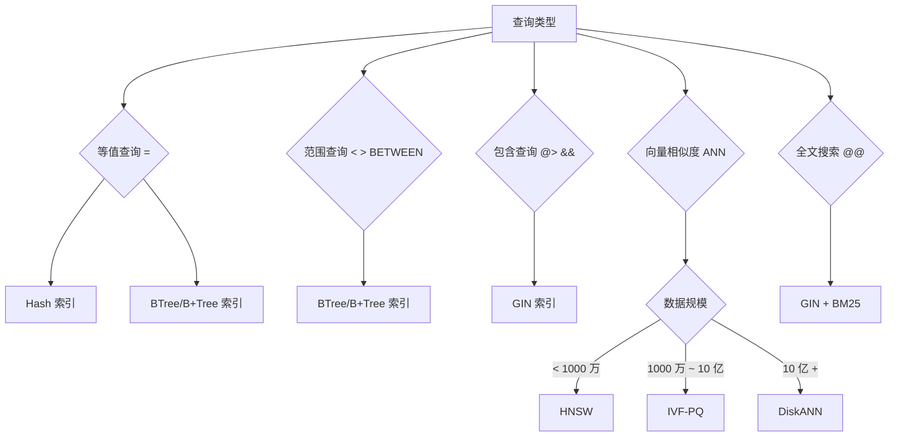

# 数据库索引架构文档

> 本目录包含数据库存储引擎中各类索引的详细架构文档，包含原理、存储结构、增删改查逻辑和面试知识点。

---

## 索引类型总览

### 传统关系型索引

| 索引类型 | 文档 | 适用场景 | 面试频率 |
|----------|------|----------|----------|
| BTree | [btree/README.md](btree/README.md) | 等值查询、范围查询、主键索引 | ⭐⭐⭐⭐⭐ |
| B+Tree | [bplus_tree/README.md](bplus_tree/README.md) | 范围查询、排序、数据库主索引 | ⭐⭐⭐⭐⭐ |
| Hash | [hash/README.md](hash/README.md) | 等值查询（=, IN）、内存数据库 | ⭐⭐⭐⭐ |
| Bitmap | [bitmap/README.md](bitmap/README.md) | 低基数列、OLAP、统计查询 | ⭐⭐⭐ |

### PostgreSQL 专用索引

| 索引类型 | 文档 | 适用场景 | 面试频率 |
|----------|------|----------|----------|
| GIN | [gin/README.md](gin/README.md) | 全文搜索、JSONB、数组包含查询 | ⭐⭐⭐ |
| GiST | [gist/README.md](gist/README.md) | 空间数据、范围类型、可扩展索引 | ⭐⭐⭐ |
| BRIN | [brin/README.md](brin/README.md) | 顺序写入大表、时间序列、日志 | ⭐⭐⭐ |
| ART | [art/README.md](art/README.md) | 字符串索引、变长键、前缀压缩 | ⭐⭐⭐ |
| R-Tree | [rtree/README.md](rtree/README.md) | 空间数据、GIS、几何查询 | ⭐⭐ |

### 向量索引（AI 时代）

| 索引类型 | 文档 | 适用场景 | 面试频率 |
|----------|------|----------|----------|
| HNSW | [hnsw/README.md](hnsw/README.md) | 近似最近邻、向量检索、推荐系统 | ⭐⭐⭐⭐⭐ |
| DiskANN | [diskann/README.md](diskann/README.md) | 超大规模向量、磁盘存储、内存受限 | ⭐⭐⭐⭐ |
| IVF-PQ | [ivf_pq/README.md](ivf_pq/README.md) | 大规模向量压缩、近似搜索 | ⭐⭐⭐⭐ |
| BM25 | [bm25/README.md](bm25/README.md) | 全文搜索、相关性排序、搜索引擎 | ⭐⭐⭐⭐ |

---

## 索引选择指南

### 按查询类型选择

### 按数据特征选择

| 数据特征 | 推荐索引 | 原因 |
|----------|----------|------|
| 唯一值/高基数 | BTree | 高效等值和范围查询 |
| 中低基数（< 1000） | Bitmap | 空间紧凑，位操作快 |
| 字符串/变长键 | ART | 前缀压缩，自适应节点 |
| 空间几何数据 | R-Tree / GiST | 多维空间查询 |
| 时间序列/顺序写入 | BRIN | 索引极小，写入开销低 |
| 全文文档 | GIN + BM25 | 包含查询 + 相关性排序 |
| 向量嵌入 | HNSW / DiskANN | ANN 搜索，支持亿级规模 |

---

## 学习路径建议

### 面试必读（优先级排序）

1. **[BTree](btree/README.md)** - 基础中的基础，必须完全理解
2. **[B+Tree](bplus_tree/README.md)** - 数据库实际使用的索引结构
3. **[Hash](hash/README.md)** - 理解 O(1) 查找的原理
4. **[HNSW](hnsw/README.md)** - AI 时代热门，向量索引首选
5. **[BM25](bm25/README.md)** - 全文搜索标准算法
6. **[Bitmap](bitmap/README.md)** - OLAP 场景常用

### 进阶专题

7. **[GIN](gin/README.md)** - PostgreSQL 全文搜索索引
8. **[BRIN](brin/README.md)** - 超大表的轻量级索引
9. **[ART](art/README.md)** - 字符串索引的工程实践
10. **[GiST](gist/README.md)** - 可扩展索引框架
11. **[IVF-PQ](ivf_pq/README.md)** - 向量量化压缩
12. **[DiskANN](diskann/README.md)** - 磁盘友好的大规模向量索引
13. **[R-Tree](rtree/README.md)** - 空间索引基础

---

## 核心知识点对照

| 问题类型 | 涉及索引 |
|----------|----------|
| BTree 分裂/合并原理 | BTree, B+Tree |
| 页面空间利用率 | BTree, B+Tree, BRIN |
| MVCC 可见性判断 | BTree, Hash |
| 哈希冲突处理 | Hash |
| 图索引搜索算法 | HNSW, R-Tree |
| 向量量化压缩 | IVF-PQ, DiskANN |
| 全文检索评分 | BM25, GIN |
| 空间查询剪枝 | R-Tree, GiST |
| 位图压缩算法 | Bitmap |

---

## 相关文档

- [架构总览](../architecture-diagrams.md) - 存储引擎整体架构
- [模块详细设计](../module-architecture-detail.md) - 核心模块实现细节
- [存储引擎文档](../storage-architecture.md) - Buffer Pool、WAL、MVCC

---

*文档版本: v1.0*
*最后更新: 2026-07-12*
