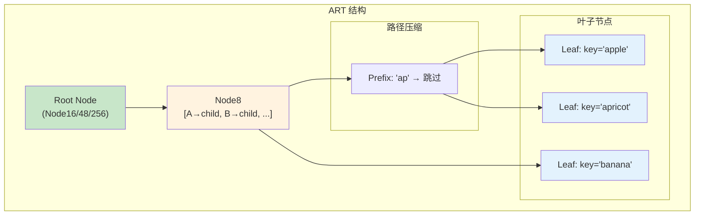
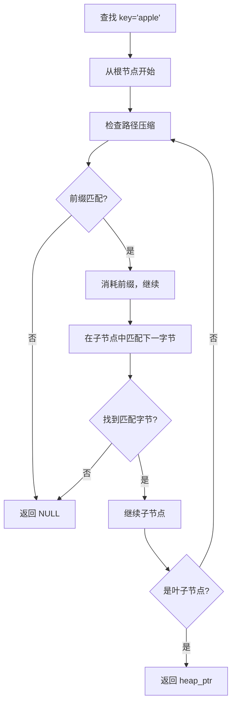
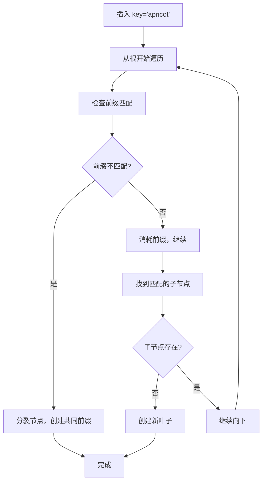

# ART 索引架构

> 本文档详细说明 Adaptive Radix Tree (ART) 的原理、存储结构和增删改查逻辑。ART 是 PostgreSQL 16+ 支持的高效树索引，专为字符串键优化。

---

## 1. 原理

### 1.1 什么是 ART

ART 是一种自适应的基数树，使用变长节点压缩技术，支持高效的范围查询和点查询。

**核心特性：**
- **节点压缩**：相同前缀只存储一次
- **自适应节点大小**：根据子节点数量选择最优节点类型
- **无锁并发**：支持乐观并发控制
- **内存高效**：紧凑的存储格式

### 1.2 ART vs B+Tree

| 特性 | B+Tree | ART |
|------|--------|-----|
| 键类型 | 任意可比较类型 | 字符串为主 |
| 前缀压缩 | 无 | 有 |
| 范围查询 | 高效 | 高效 |
| 点查询 | O(log n) | O(k)，k 为键长 |
| 内存占用 | 较高 | 较低（字符串场景） |

### 1.3 ART 结构



---

## 2. 存储结构

### 2.1 节点类型

```c
/**
 * ART 节点类型
 */
typedef enum ArtNodeType {
    ART_NODE_EMPTY = 0,      // 空节点
    ART_NODE_4 = 1,          // 最多 4 个子节点
    ART_NODE_16 = 2,         // 最多 16 个子节点
    ART_NODE_48 = 3,         // 最多 48 个子节点
    ART_NODE_256 = 4,        // 最多 256 个子节点
    ART_NODE_LEAF = 5        // 叶子节点
} ArtNodeType;

/**
 * ART 节点基类
 */
typedef struct ArtNode {
    ArtNodeType type;            // 节点类型
    uint32_t    size;            // 子节点数量
    uint16_t    prefix_len;      // 前缀长度
    uint8_t     prefix[16];      // 前缀（最大 16 字节）
} ArtNode;

/**
 * Node4：子节点 1-4 个（使用数组）
 */
typedef struct ArtNode4 {
    ArtNode      base;
    uint8_t      keys[4];        // 键字节
    ArtNode     *children[4];    // 子节点指针
} ArtNode4;

/**
 * Node16：子节点 5-16 个（使用数组 + 位图）
 */
typedef struct ArtNode16 {
    ArtNode      base;
    uint8_t      keys[16];       // 键字节
    ArtNode     *children[16];   // 子节点指针
    uint16_t     bitmap;         // 子节点存在位图
} ArtNode16;

/**
 * Node48：子节点 17-48 个（使用索引数组）
 */
typedef struct ArtNode48 {
    ArtNode      base;
    int8_t       index[256];     // 字节值 → 子节点索引（-1 表示不存在）
    ArtNode     *children[48];   // 子节点数组
} ArtNode48;

/**
 * Node256：子节点 49-256 个
 */
typedef struct ArtNode256 {
    ArtNode      base;
    ArtNode     *children[256];  // 直接索引
} ArtNode256;

/**
 * 叶子节点
 */
typedef struct ArtLeaf {
    uint32_t    key_len;         // 键长度
    uint8_t     key_data[1];     // 键值（变长）
    // 紧随其后的是 heap_ptr
} ArtLeaf;
```

### 2.2 路径压缩（Path Compression）

```c
/**
 * 路径压缩：将共同前缀压缩存储
 *
 * 例如：key1 = "apple", key2 = "apricot"
 * 共同前缀 "ap" 只存储一次
 *
 * 结构：
 * - Node4 (key='l', child1, child2) with prefix "ap"
 *   - child1 → leaf "le"
 *   - child2 → leaf "ricot"
 */
typedef struct ArtNodeCompact {
    ArtNode      base;
    uint8_t      prefix[16];     // 共同前缀
    uint8_t      prefix_len;     // 前缀长度
} ArtNodeCompact;
```

---

## 3. 增删改查逻辑

### 3.1 查找



**查找算法：**
```c
/**
 * ART 查找
 */
ItemPointer art_search(ArtIndex *index, const uint8_t *key, size_t key_len) {
    ArtNode *node = index->root;
    size_t pos = 0;

    // 遍历内部节点
    while (node != NULL && !is_leaf(node)) {
        // 检查并消耗前缀
        if (node->prefix_len > 0) {
            if (memcmp(key + pos, node->prefix, node->prefix_len) != 0) {
                return NULL;  // 前缀不匹配
            }
            pos += node->prefix_len;
        }

        // 获取下一字节
        if (pos >= key_len) {
            return NULL;  // 键已耗尽
        }
        uint8_t byte = key[pos++];

        // 在子节点中查找
        node = art_find_child(node, byte);
    }

    if (node == NULL) {
        return NULL;
    }

    // 检查叶子节点
    ArtLeaf *leaf = (ArtLeaf *)node;
    if (leaf->key_len == key_len &&
        memcmp(leaf->key_data, key, key_len) == 0) {
        return get_heap_ptr(leaf);
    }

    return NULL;
}

/**
 * 在子节点中查找特定字节
 */
ArtNode *art_find_child(ArtNode *node, uint8_t byte) {
    switch (node->type) {
        case ART_NODE_4: {
            ArtNode4 *n = (ArtNode4 *)node;
            for (int i = 0; i < n->base.size; i++) {
                if (n->keys[i] == byte) {
                    return n->children[i];
                }
            }
            return NULL;
        }

        case ART_NODE_16: {
            ArtNode16 *n = (ArtNode16 *)node;
            // 使用 SIMD 或二分查找优化
            for (int i = 0; i < n->base.size; i++) {
                if (n->keys[i] == byte) {
                    return n->children[i];
                }
            }
            return NULL;
        }

        case ART_NODE_48: {
            ArtNode48 *n = (ArtNode48 *)node;
            int idx = n->index[byte];
            if (idx >= 0) {
                return n->children[idx];
            }
            return NULL;
        }

        case ART_NODE_256: {
            ArtNode256 *n = (ArtNode256 *)node;
            return n->children[byte];
        }

        default:
            return NULL;
    }
}
```

### 3.2 插入



**插入算法：**
```c
/**
 * ART 插入
 */
int art_insert(ArtIndex *index, const uint8_t *key, size_t key_len,
               ItemPointer heap_ptr) {
    ArtNode **node_ref = &index->root;
    size_t pos = 0;

    while (true) {
        ArtNode *node = *node_ref;

        // 空树：创建叶子节点
        if (node == NULL) {
            *node_ref = art_make_leaf(key, key_len, heap_ptr);
            return 0;
        }

        // 检查并消耗前缀
        if (node->prefix_len > 0) {
            size_t match_len = art_longest_common_prefix(key + pos, key_len - pos,
                                                         node->prefix, node->prefix_len);
            if (match_len < node->prefix_len) {
                // 前缀不匹配，需要分裂
                art_split_node(node_ref, key + pos, key_len - pos,
                               match_len, heap_ptr);
                return 0;
            }
            pos += node->prefix_len;
        }

        if (is_leaf(node)) {
            // 叶子节点：替换或追加
            ArtLeaf *leaf = (ArtLeaf *)node;
            if (leaf->key_len == key_len && memcmp(leaf->key_data, key, key_len) == 0) {
                // 相同键，替换
                set_heap_ptr(leaf, heap_ptr);
            } else {
                // 不同键，分裂
                art_split_leaf(node_ref, key, key_len, heap_ptr);
            }
            return 0;
        }

        // 获取下一字节
        if (pos >= key_len) {
            // 键已耗尽，需要在当前节点添加空字节键
            art_insert_child(node_ref, 0, art_make_leaf(key, key_len, heap_ptr));
            return 0;
        }

        uint8_t byte = key[pos++];

        // 查找或创建子节点
        ArtNode *child = art_find_child(node, byte);
        if (child == NULL) {
            // 子节点不存在，创建新叶子
            art_insert_child(node_ref, byte, art_make_leaf(key, key_len, heap_ptr));
            return 0;
        }

        // 继续向下
        node_ref = art_get_child_ref(node, byte);
    }
}

/**
 * 分裂节点（处理前缀不匹配）
 */
void art_split_node(ArtNode **node_ref, const uint8_t *key, size_t key_len,
                    size_t common_prefix_len, ItemPointer heap_ptr) {
    ArtNode *old_node = *node_ref;
    ArtNode *new_leaf = art_make_leaf(key, key_len, heap_ptr);

    // 1. 创建新节点存储共同前缀后的差异
    ArtNode4 *prefix_node = art_make_node4();

    // 2. 设置前缀
    memcpy(prefix_node->base.prefix, old_node->prefix, common_prefix_len);
    prefix_node->base.prefix_len = common_prefix_len;

    // 3. 更新旧节点的前缀
    memmove(old_node->prefix, old_node->prefix + common_prefix_len,
            old_node->prefix_len - common_prefix_len);
    old_node->prefix_len -= common_prefix_len;

    // 4. 添加两个子节点
    uint8_t old_byte = old_node->prefix[0];
    memmove(old_node->prefix, old_node->prefix + 1,
            old_node->prefix_len - 1);
    old_node->prefix_len--;

    art_add_child(prefix_node, old_byte, old_node);
    art_add_child(prefix_node, key[common_prefix_len], new_leaf);

    *node_ref = (ArtNode *)prefix_node;
}

/**
 * 节点类型转换
 */
void art_grow_node(ArtNode **node_ref) {
    ArtNode *node = *node_ref;

    switch (node->type) {
        case ART_NODE_4: {
            // Node4 → Node16
            ArtNode16 *new = art_make_node16();
            new->base.prefix_len = node->prefix_len;
            memcpy(new->base.prefix, node->prefix, node->prefix_len);

            ArtNode4 *old = (ArtNode4 *)node;
            for (int i = 0; i < old->base.size; i++) {
                art_add_child(new, old->keys[i], old->children[i]);
            }
            *node_ref = (ArtNode *)new;
            break;
        }

        case ART_NODE_16: {
            // Node16 → Node48
            ArtNode48 *new = art_make_node48();
            // ... 类似转换
            break;
        }

        case ART_NODE_48: {
            // Node48 → Node256
            ArtNode256 *new = art_make_node256();
            // ... 类似转换
            break;
        }
    }
}
```

---

## 4. 面试知识点

| 问题 | 答案要点 |
|------|----------|
| ART 的优势？ | 前缀压缩、内存高效、自适应节点大小 |
| 节点类型如何选择？ | 根据子节点数量选择（4/16/48/256） |
| 路径压缩的作用？ | 减少存储空间，加速最长前缀匹配 |
| ART vs B+Tree？ | ART 对字符串键更高效（前缀压缩） |
| 并发控制？ | 使用 CAS 操作，支持无锁并发 |

---

*文档版本: v1.0*
*最后更新: 2026-07-12*
