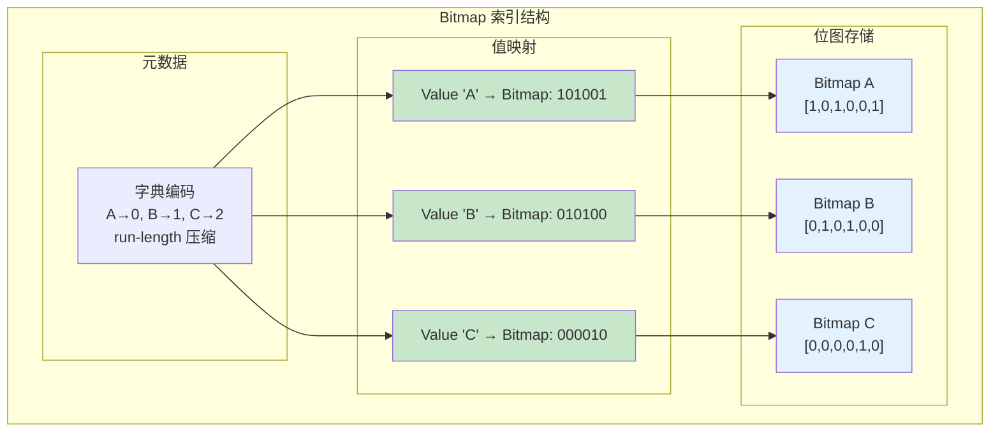
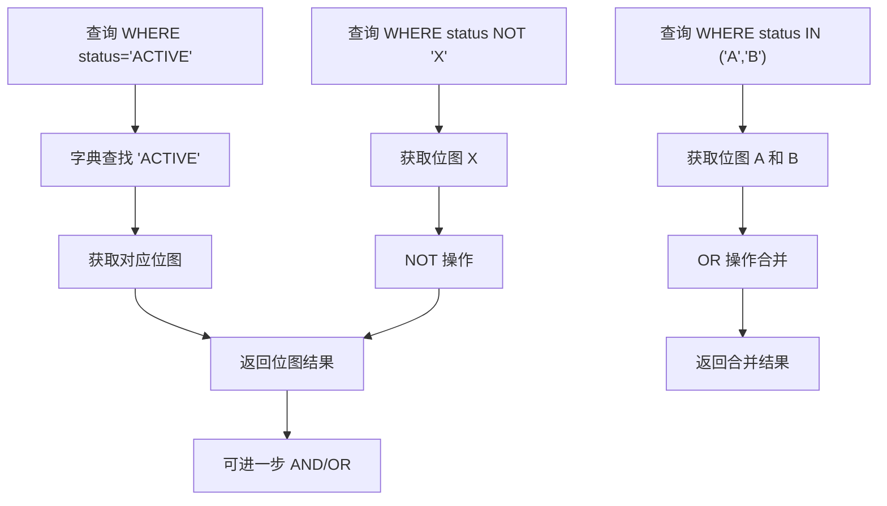

# Bitmap 索引架构

> 本文档详细说明 Bitmap 索引的原理、存储结构和增删改查逻辑。Bitmap 索引适用于低基数（ cardinality）列的高效查询。

---

## 1. 原理

### 1.1 什么是 Bitmap 索引

Bitmap 索引使用位图（Bit Array）表示每个键值对应的记录集合。

**核心思想：**
- 每个可能的值对应一个位图
- 位图的长度等于记录数
- 第 i 位为 1 表示第 i 条记录包含该值
- 使用位操作（AND/OR/NOT）进行查询

### 1.2 Bitmap 索引的优势

| 特性 | 说明 |
|------|------|
| 空间紧凑 | 每条记录 1 bit，低基数列极省空间 |
| 快速位运算 | AND/OR/NOT 操作极快 |
| 聚合友好 | COUNT/BITCOUNT 直接计算 |
| 向量化 | SIMD 指令加速 |

### 1.3 适用场景

| 场景 | 适用性 |
|------|--------|
| 低基数列（性别、状态、类型） | ✅ 极佳 |
| 中基数列（国家、城市） | ⚠️ 可用（需要压缩） |
| 高基数列（时间戳、UUID） | ❌ 不适用 |

---

## 2. 存储结构

### 2.1 整体结构



### 2.2 核心结构

```c
/**
 * Bitmap 位图
 */
typedef struct Bitmap {
    uint32_t    size;               // 位数（记录数）
    uint32_t    words;              // 字数（size / 64 + 1）
    uint64_t   *bits;               // 位数组
} Bitmap;

/**
 * Bitmap 索引
 */
typedef struct BitmapIndex {
    char       *column_name;        // 列名

    // 字典编码
    uint32_t    num_values;         // 不同值数量
    char      **value_map;          // 值 → 字典索引
    void      **bitmap_array;       // 字典索引 → Bitmap

    // 统计信息
    uint32_t    num_rows;           // 总记录数
    uint32_t    num_bits_set;       // 总位数（用于优化）
} BitmapIndex;

/**
 * Bitmap 操作结果
 */
typedef struct BitmapResult {
    Bitmap  *bitmap;                // 结果位图
    uint32_t count;                 // 匹配数
} BitmapResult;
```

### 2.3 压缩格式

```c
/**
 * BBC (Byte-aligned Bitmap Compression) 压缩
 *
 * 对于连续的 0 或 1，使用行程编码
 */
typedef struct BBCWord {
    uint64_t    literal;            // 字面量
    int         count;              // 重复次数（-1 表示非重复）
} BBCWord;

/**
 * WAH (Word-Aligned Hybrid) 压缩
 *
 * 格式：
 * - 填充字：0 + 31位计数 + 填充值（0或1）
 * - 字面字：1 + 63位数据
 */
typedef struct WAHWord {
    uint64_t    data;               // 数据
    bool        is_fill;            // 是否是填充字
    uint32_t    count;              // 重复次数（填充字）
    uint64_t    fill_value;         // 填充值（填充字）
} WAHWord;

/**
 * Roaring Bitmap
 *
 * 将位图分成 2^16 个块，每块独立压缩
 */
typedef struct RoaringBitmap {
    uint32_t    num_containers;     // 容器数
    RoaringContainer **containers;  // 容器数组
    uint16_t    *keys;              // 每块的 key
} RoaringBitmap;

typedef struct RoaringContainer {
    uint16_t    cardinality;        // 基数
    uint8_t     type;               // 容器类型

    // 容器类型：
    // 0: 空容器 (all zeros)
    // 1: 数组容器 (array of uint16_t)
    // 2: 位图容器 (bitmap of 1024 bits)
    // 3: 运行容器 (run-length encoding)

    union {
        uint16_t *array;            // 数组容器
        uint64_t *bitmap;           // 位图容器
        RLEContainer *rle;          // 运行容器
    } data;
} RoaringContainer;
```

---

## 3. 增删改查逻辑

### 3.1 基本位操作

```c
/**
 * 创建空位图
 */
Bitmap *bitmap_create(uint32_t size) {
    Bitmap *bm = malloc(sizeof(Bitmap));
    bm->size = size;
    bm->words = (size + 63) / 64;
    bm->bits = calloc(bm->words, sizeof(uint64_t));
    return bm;
}

/**
 * 设置第 i 位
 */
void bitmap_set(Bitmap *bm, uint32_t i) {
    bm->bits[i / 64] |= (1ULL << (i % 64));
}

/**
 * 获取第 i 位
 */
bool bitmap_get(Bitmap *bm, uint32_t i) {
    return (bm->bits[i / 64] >> (i % 64)) & 1ULL;
}

/**
 * 位图 AND 操作
 */
Bitmap *bitmap_and(const Bitmap *a, const Bitmap *b) {
    assert(a->size == b->size);

    Bitmap *result = bitmap_create(a->size);
    for (uint32_t i = 0; i < a->words; i++) {
        result->bits[i] = a->bits[i] & b->bits[i];
    }
    return result;
}

/**
 * 位图 OR 操作
 */
Bitmap *bitmap_or(const Bitmap *a, const Bitmap *b) {
    assert(a->size == b->size);

    Bitmap *result = bitmap_create(a->size);
    for (uint32_t i = 0; i < a->words; i++) {
        result->bits[i] = a->bits[i] | b->bits[i];
    }
    return result;
}

/**
 * 位图 NOT 操作
 */
Bitmap *bitmap_not(const Bitmap *a) {
    Bitmap *result = bitmap_create(a->size);
    for (uint32_t i = 0; i < a->words; i++) {
        result->bits[i] = ~a->bits[i];
    }
    // 清除超出范围的位
    if (a->size % 64 != 0) {
        uint32_t extra_bits = 64 - (a->size % 64);
        uint64_t mask = ~((1ULL << extra_bits) - 1);
        result->bits[a->words - 1] &= mask;
    }
    return result;
}

/**
 * 统计位数（POPCOUNT）
 */
uint32_t bitmap_count(const Bitmap *bm) {
    uint32_t count = 0;
    for (uint32_t i = 0; i < bm->words; i++) {
        count += __builtin_popcountll(bm->bits[i]);
    }
    return count;
}
```

### 3.2 查询操作



**查询算法：**
```c
/**
 * 等值查询
 *
 * @param index Bitmap 索引
 * @param value 查询的值
 * @return 匹配的位图
 */
Bitmap *bitmap_index_lookup(BitmapIndex *index, const void *value) {
    // 1. 字典查找
    uint32_t dict_id = bitmap_dict_lookup(index, value);
    if (dict_id < 0) {
        // 值不存在
        return bitmap_create(index->num_rows);  // 返回空位图
    }

    // 2. 获取位图
    return bitmap_copy(index->bitmap_array[dict_id]);
}

/**
 * IN 查询
 *
 * @param index Bitmap 索引
 * @param values 值数组
 * @param num_values 值数量
 * @return 匹配的位图（任意匹配）
 */
Bitmap *bitmap_index_in(BitmapIndex *index, const void **values,
                       int num_values) {
    Bitmap *result = bitmap_create(index->num_rows);
    result->bits[0] = 0;  // 初始化为 0

    for (int i = 0; i < num_values; i++) {
        uint32_t dict_id = bitmap_dict_lookup(index, values[i]);
        if (dict_id >= 0) {
            Bitmap *bm = index->bitmap_array[dict_id];
            for (uint32_t w = 0; w < result->words; w++) {
                result->bits[w] |= bm->bits[w];
            }
        }
    }

    return result;
}

/**
 * NOT 查询
 *
 * @param index Bitmap 索引
 * @param value 要排除的值
 * @return 不包含该值的位图
 */
Bitmap *bitmap_index_not(BitmapIndex *index, const void *value) {
    Bitmap *match = bitmap_index_lookup(index, value);
    Bitmap *result = bitmap_not(match);
    bitmap_destroy(match);
    return result;
}

/**
 * AND 查询
 *
 * @param index1 第一个索引
 * @param value1 第一个值
 * @param index2 第二个索引
 * @param value2 第二个值
 * @return 同时匹配两个条件的位图
 */
Bitmap *bitmap_index_and(BitmapIndex *index1, const void *value1,
                         BitmapIndex *index2, const void *value2) {
    Bitmap *bm1 = bitmap_index_lookup(index1, value1);
    Bitmap *bm2 = bitmap_index_lookup(index2, value2);

    Bitmap *result = bitmap_and(bm1, bm2);

    bitmap_destroy(bm1);
    bitmap_destroy(bm2);

    return result;
}
```

### 3.3 插入/更新

```c
/**
 * Bitmap 索引插入
 *
 * @param index Bitmap 索引
 * @param row_id 行 ID
 * @param value 列值
 */
int bitmap_index_insert(BitmapIndex *index, uint32_t row_id, const void *value) {
    // 1. 字典查找或创建
    uint32_t dict_id = bitmap_dict_get_or_create(index, value);

    // 2. 扩展位图（如需要）
    Bitmap *bm = index->bitmap_array[dict_id];
    if (row_id >= bm->size) {
        bitmap_expand(bm, index->num_rows);
    }

    // 3. 设置位
    bitmap_set(bm, row_id);

    // 4. 更新元数据
    index->num_rows = max(index->num_rows, row_id + 1);

    return 0;
}

/**
 * 扩展位图
 */
void bitmap_expand(Bitmap *bm, uint32_t new_size) {
    if (new_size <= bm->size) return;

    uint32_t new_words = (new_size + 63) / 64;
    if (new_words > bm->words) {
        bm->bits = realloc(bm->bits, new_words * sizeof(uint64_t));
        memset(&bm->bits[bm->words], 0, (new_words - bm->words) * sizeof(uint64_t));
        bm->words = new_words;
    }
    bm->size = new_size;
}

/**
 * Bitmap 索引删除
 */
int bitmap_index_delete(BitmapIndex *index, uint32_t row_id, const void *value) {
    uint32_t dict_id = bitmap_dict_lookup(index, value);
    if (dict_id < 0) {
        return -1;  // 值不存在
    }

    Bitmap *bm = index->bitmap_array[dict_id];
    // 清除位（保留删除标记，用于 MVCC）
    // 实际实现可能使用额外的删除位图
    bm->bits[row_id / 64] &= ~(1ULL << (row_id % 64));

    return 0;
}
```

### 3.4 SIMD 加速

```c
/**
 * SIMD 加速的 POPCOUNT
 */
uint32_t bitmap_count_simd(const Bitmap *bm) {
    uint32_t count = 0;
    uint32_t i = 0;

#if defined(__AVX2__)
    // AVX2: 256 位 = 4 个 uint64_t
    __m256i zero = _mm256_setzero_si256();

    for (; i + 3 < bm->words; i += 4) {
        __m256i v = _mm256_loadu_si256((__m256i *)&bm->bits[i]);
        // POPCOUNT
        v = _mm256_add_epi32(
            _mm256_popcnt_epi32(v),
            _mm256_srli_epi32(v, 1)
        );
        v = _mm256_add_epi32(v, _mm256_srli_epi32(v, 2));
        v = _mm256_and_si256(v, _mm256_set1_epi32(0x55555555));
        v = _mm256_add_epi32(v, _mm256_srli_epi32(v, 4));
        v = _mm256_and_si256(v, _mm256_set1_epi32(0x33333333));
        v = _mm256_add_epi32(v, _mm256_srli_epi32(v, 8));
        v = _mm256_and_si256(v, _mm256_set1_epi32(0x0f0f0f0f));

        // 提取并累加
        uint32_t tmp[8];
        _mm256_storeu_si256((__m256i *)tmp, v);
        count += tmp[0] + tmp[1] + tmp[2] + tmp[3];
    }
#elif defined(__SSE2__)
    // SSE2: 128 位 = 2 个 uint64_t
    for (; i + 1 < bm->words; i += 2) {
        __m128i v = _mm_loadu_si128((__m128i *)&bm->bits[i]);
        v = _mm_add_epi32(_mm_popcnt_epi32(v),
                         _mm_srli_epi32(v, 1));
        // ... 简化实现
    }
#endif

    // 处理剩余的字
    for (; i < bm->words; i++) {
        count += __builtin_popcountll(bm->bits[i]);
    }

    return count;
}
```

---

## 4. 面试知识点

### 4.1 常见问题

| 问题 | 答案要点 |
|------|----------|
| Bitmap 索引适合什么场景？ | 低基数列（性别、状态、类型），OLAP 分析 |
| 为什么高基数列不适合？ | 位图太长，空间爆炸 |
| Bitmap 如何压缩？ | BBC、WAH、Roaring Bitmap |
| Roaring Bitmap 的优势？ | 混合压缩策略，自动选择最优容器类型 |
| Bitmap 索引的更新问题？ | 写入需要重建位图，不适合频繁更新 |

### 4.2 进阶问题

**Q: Bitmap 索引和 B+Tree 索引如何选择？**
> A: 低基数列选 Bitmap，高基数列选 B+Tree。Bitmap 适合分析查询（COUNT/AND/OR），B+Tree 适合点查询和范围查询。

**Q: Roaring Bitmap 如何工作？**
> A: 将 2^32 个位置分成 2^16 个容器，每个容器最多 65536 个位置。根据基数选择压缩方式：
> - 空（0 个）：不存储
> - 稀疏（< 4096 个）：数组容器
> - 密集（> 4096 个）：位图容器
> - 有大量连续值：运行容器

**Q: Bitmap 索引如何支持 MVCC？**
> A: 每个可见性事务版本维护独立的位图，或使用增量位图记录可见/不可见变化。

---

*文档版本: v1.0*
*最后更新: 2026-07-12*
