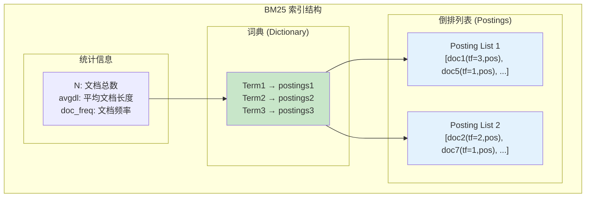
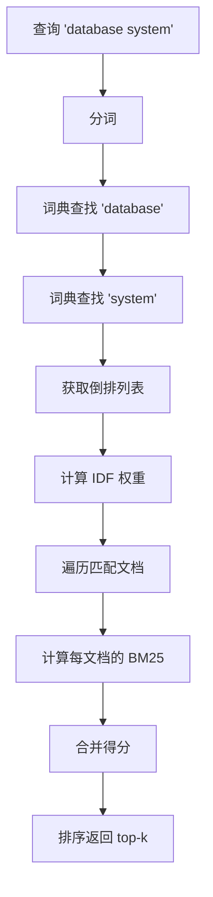

# BM25 索引架构

> 本文档详细说明 BM25（Best Matching 25）全文搜索索引的原理、存储结构和查询逻辑。BM25 是 Elasticsearch 等搜索引擎的默认相关性算法。

---

## 1. 原理

### 1.1 什么是 BM25

BM25 是一种基于词频-逆文档频率（TF-IDF）的相关性排序算法，用于评估文档与查询的相关性。

**核心公式：**
```
BM25Score = Σ IDF(qi) × (tf × (k1 + 1)) / (tf + k1 × (1 - b + b × |d|/avgdl))
```

其中：
- `tf`: 词频
- `k1`: 词频饱和参数（通常 1.2-2.0）
- `b`: 文档长度归一化参数（通常 0.75）
- `|d|`: 文档长度
- `avgdl`: 平均文档长度
- `IDF`: 逆文档频率

### 1.2 BM25 特点

| 特性 | 说明 |
|------|------|
| 词频饱和 | 词频达到一定程度后不再增加 |
| 文档长度归一化 | 长文档不会因为词多而得分过高 |
| IDF 衰减 | 常见词（如 "the"）的权重降低 |

### 1.3 BM25 vs TF-IDF

| 特性 | TF-IDF | BM25 |
|------|--------|------|
| 词频饱和 | 无（线性增长） | 有（对数饱和） |
| 文档长度归一化 | 无 | 有 |
| IDF 计算 | log(N/n) | log((N-n+0.5)/(n+0.5)) |

---

## 2. 存储结构

### 2.1 倒排索引结构



### 2.2 核心结构

```c
/**
 * 词典条目
 */
typedef struct BM25Term {
    uint32_t    term_id;            // 词项 ID
    uint32_t    term_hash;          // 词项哈希
    char        term_text[1];       // 词项文本（变长）

    // 指向倒排列表的指针
    uint64_t    postings_offset;    // 倒排列表文件偏移
    uint32_t    doc_freq;           // 文档频率
    uint32_t    total_tf;           // 总词频
} BM25Term;

/**
 * 倒排列表条目
 */
typedef struct BM25Posting {
    uint32_t    doc_id;             // 文档 ID
    uint32_t    doc_len;            // 文档长度
    uint32_t    tf;                 // 词频
    uint32_t    positions[1];       // 位置列表（变长）
} BM25Posting;

/**
 * BM25 索引
 */
typedef struct BM25Index {
    uint32_t    num_docs;           // 文档总数
    uint32_t    avg_doc_len;        // 平均文档长度
    uint32_t    num_terms;          // 词项数
    uint64_t    total_terms;        // 总词条数

    // 词典（内存中）
    BM25Term   *dictionary;         // 哈希表或跳表
    uint32_t    dict_capacity;

    // 倒排列表文件
    FILE       *postings_file;
    char       *postings_path;

    // BM25 参数
    float       k1;                 // 词频饱和参数 (default 1.2)
    float       b;                  // 长度归一化参数 (default 0.75)
} BM25Index;

/**
 * 查询结果
 */
typedef struct BM25Result {
    uint32_t    doc_id;             // 文档 ID
    float       score;              // BM25 得分
    uint32_t    doc_len;            // 文档长度（用于显示）
} BM25Result;
```

---

## 3. 查询逻辑

### 3.1 查询流程



### 3.2 查询算法

```c
/**
 * BM25 查询
 */
BM25Result *bm25_search(BM25Index *index, const char *query, int top_k) {
    // 1. 分词
    char **terms;
    int num_terms;
    tokenize(query, &terms, &num_terms);

    // 2. 获取每个词项的倒排列表
    InvertedList *lists = malloc(sizeof(InvertedList) * num_terms);
    int valid_terms = 0;

    for (int i = 0; i < num_terms; i++) {
        BM25Term *term = bm25_dict_lookup(index, terms[i]);
        if (term != NULL) {
            lists[valid_terms].term = term;
            lists[valid_terms].postings = bm25_load_postings(index, term);
            lists[valid_terms].idf = bm25_idf(index, term->doc_freq);
            valid_terms++;
        }
    }

    if (valid_terms == 0) {
        free(terms);
        free(lists);
        return NULL;
    }

    // 3. 使用跳表合并倒排列表
    SkipList *sk = skiplist_create();

    // 初始化跳表指针
    for (int i = 0; i < valid_terms; i++) {
        if (lists[i].postings->count > 0) {
            BM25Posting *p = &lists[i].postings->data[0];
            skiplist_insert(sk, p->doc_id, i, 0);
        }
    }

    // 4. 遍历所有文档
    PriorityQueue *results = pq_create(top_k);

    while (!skiplist_empty(sk)) {
        uint32_t doc_id = skiplist_min_docid(sk);

        // 计算该文档的 BM25 得分
        float score = 0.0f;
        uint32_t doc_len = 0;

        for (int i = 0; i < valid_terms; i++) {
            // 获取当前词项在该文档的信息
            int idx = skiplist_get_index(sk, i);
            BM25Posting *posting = &lists[i].postings->data[idx];

            if (posting->doc_id == doc_id) {
                doc_len = posting->doc_len;
                float tf = (float)posting->tf;
                float idf = lists[i].idf;
                float k1 = index->k1;
                float b = index->b;

                // BM25 公式
                float term_score = idf *
                    (tf * (k1 + 1)) /
                    (tf + k1 * (1 - b + b * doc_len / index->avg_doc_len));

                score += term_score;

                // 推进该词项的指针
                if (idx + 1 < lists[i].postings->count) {
                    BM25Posting *next = &lists[i].postings->data[idx + 1];
                    skiplist_update(sk, i, idx + 1, next->doc_id);
                } else {
                    skiplist_remove(sk, i);
                }
            }
        }

        // 添加到结果
        pq_push(results, doc_id, score);

        // 更新跳表指针
        skiplist_remove_min(sk);
    }

    // 5. 提取 top-k 结果
    BM25Result *final_results = malloc(sizeof(BM25Result) * top_k);
    for (int i = 0; i < top_k && !pq_empty(results); i++) {
        pq_pop(results, &final_results[i].doc_id, &final_results[i].score);
        final_results[i].doc_len = bm25_get_doc_len(index, final_results[i].doc_id);
    }

    // 清理
    skiplist_destroy(sk);
    for (int i = 0; i < valid_terms; i++) {
        free(lists[i].postings);
    }
    free(lists);
    free(terms);
    pq_destroy(results);

    return final_results;
}

/**
 * 计算 IDF（逆文档频率）
 *
 * BM25 的 IDF 公式：
 * IDF = log((N - n + 0.5) / (n + 0.5) + 1)
 */
float bm25_idf(BM25Index *index, uint32_t doc_freq) {
    float N = (float)index->num_docs;
    float n = (float)doc_freq;

    // 防止除零
    if (n == 0) {
        return 0.0f;
    }

    // BM25 IDF 公式（带平滑）
    float idf = log((N - n + 0.5f) / (n + 0.5f) + 1.0f);

    return idf;
}
```

### 3.3 索引构建

```c
/**
 * BM25 索引构建
 */
int bm25_build(BM25Index *index, Document *documents, uint32_t num_docs) {
    // 1. 统计信息
    index->num_docs = num_docs;
    uint64_t total_len = 0;

    // 2. 第一遍：收集词项
    for (uint32_t d = 0; d < num_docs; d++) {
        total_len += documents[d].len;

        char **tokens;
        int num_tokens;
        tokenize(documents[d].text, &tokens, &num_tokens);

        for (int i = 0; i < num_tokens; i++) {
            BM25Term *term = bm25_dict_get_or_create(index, tokens[i]);
            term->doc_freq++;  // 该文档包含该词
            term->total_tf++;
        }

        free(tokens);
    }

    index->avg_doc_len = (float)total_len / num_docs;

    // 3. 第二遍：构建倒排列表
    for (uint32_t d = 0; d < num_docs; d++) {
        // 收集该文档的词项及其位置
        char **tokens;
        int num_tokens;
        tokenize(documents[d].text, &tokens, &num_tokens);

        for (int i = 0; i < num_tokens; i++) {
            BM25Term *term = bm25_dict_lookup(index, tokens[i]);
            if (term == NULL) continue;

            // 添加到倒排列表
            bm25_add_to_postings(index, term, d, documents[d].len,
                                1, &i);  // tf=1, position=i
        }

        free(tokens);
    }

    // 4. 保存索引
    bm25_save_index(index);

    return 0;
}
```

---

## 4. 参数调优

### 4.1 参数说明

| 参数 | 默认值 | 说明 |
|------|--------|------|
| k1 | 1.2-2.0 | 控制词频饱和速度，越大词频贡献越高 |
| b | 0.75 | 控制文档长度归一化程度，越大长文档权重越低 |

### 4.2 调优建议

```c
/**
 * 参数调优指南
 *
 * k1 参数：
 * - k1 = 0: 只考虑 IDF，不考虑词频
 * - k1 较小 (0.5-1.0): 词频影响较小，适合短查询
 * - k1 较大 (1.5-2.0): 词频影响较大，适合长文档
 *
 * b 参数：
 * - b = 0: 不考虑文档长度
 * - b = 0.75: 标准值
 * - b = 1.0: 完全按长度归一化
 */

// 场景化参数
typedef struct BM25Params {
    float k1;
    float b;
} BM25Params;

BM25Params bm25_params_for_search_engine = {1.2, 0.75};
BM25Params bm25_params_for_short_text = {1.0, 0.5};
BM25Params bm25_params_for_long_documents = {2.0, 0.9};
```

---

## 5. 面试知识点

| 问题 | 答案要点 |
|------|----------|
| BM25 的公式？ | IDF × (tf × (k1+1)) / (tf + k1 × (1-b + b×|d|/avgdl)) |
| 为什么需要词频饱和？ | 避免词频过高时得分过度增长 |
| IDF 的作用？ | 降低常见词的权重，提高罕见词的权重 |
| BM25 vs TF-IDF？ | BM25 有词频饱和和长度归一化 |

---

*文档版本: v1.0*
*最后更新: 2026-07-12*
