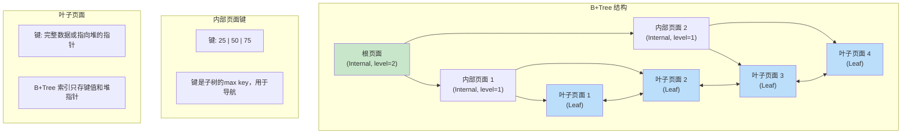
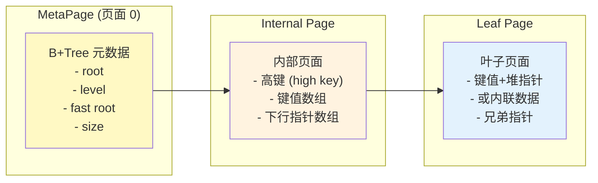
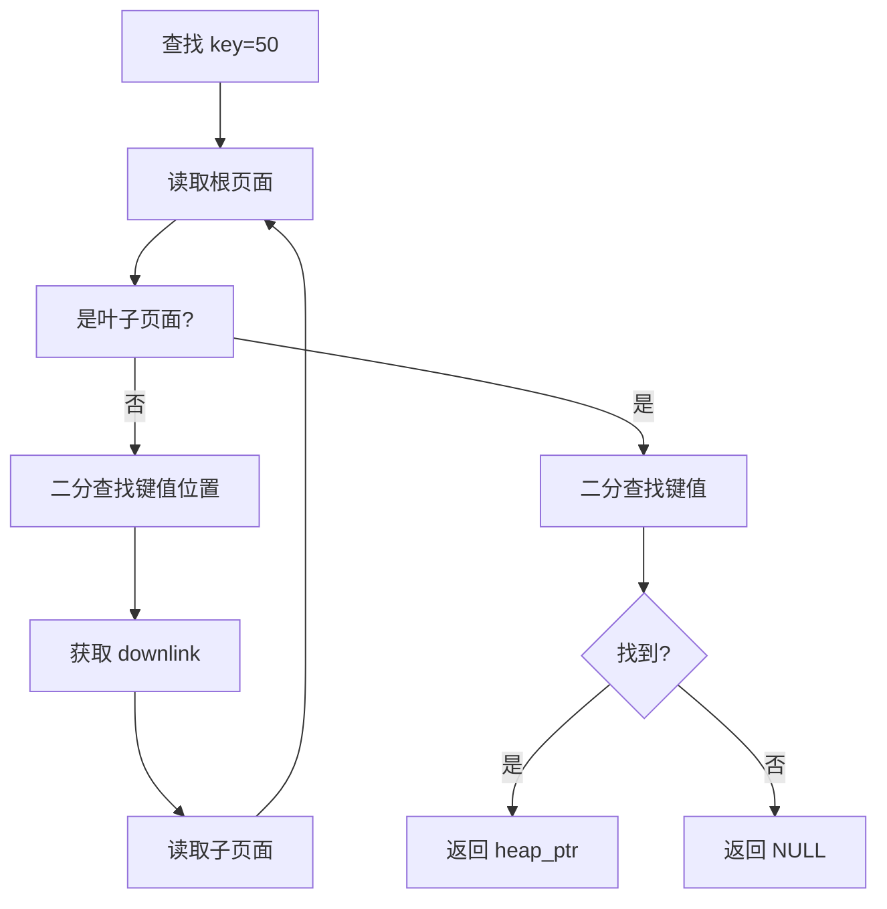
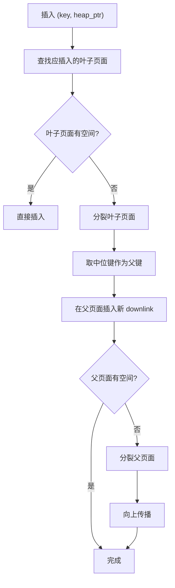
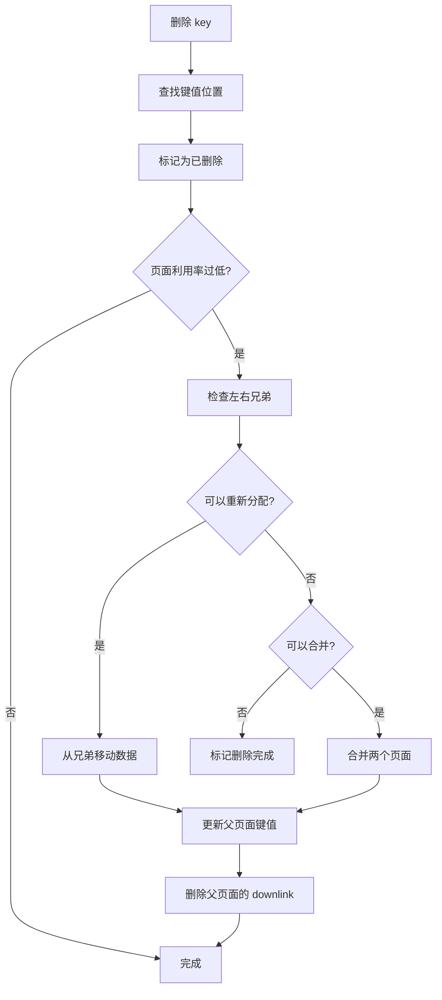

# B+Tree 索引架构

> 本文档详细说明 B+Tree 索引的原理、存储结构和增删改查逻辑。B+Tree 是 PostgreSQL 和大多数关系型数据库实际使用的索引结构。

---

## 1. 原理

### 1.1 B+Tree vs BTree

| 特性 | BTree | B+Tree |
|------|-------|--------|
| 数据存储位置 | 所有节点 | 仅叶子节点 |
| 内部节点大小 | 较大（存数据） | 较小（只存键+指针） |
| 查询稳定性 | O(log n) ~ O(n) | O(log n) 稳定 |
| 范围查询 | 需要回溯 | 叶子链表遍历 |
| 树高 | 可能较高 | 更低（内部节点更小） |

### 1.2 B+Tree 结构



### 1.3 为什么 PostgreSQL 选择 B+Tree

1. **范围查询友好**：叶子链表直接遍历
2. **查询稳定**：所有查找都到叶子节点
3. **内部节点紧凑**：只存键和指针，容纳更多条目
4. **高扇出**：减少树高，降低 I/O

---

## 2. 存储结构

### 2.1 页面类型



### 2.2 内部页面结构

```
┌────────────────────────────────────────────────────────────┐
│                 内部页面 (8192 bytes)                        │
├────────────────────────────────────────────────────────────┤
│ PageHeaderData (24 bytes)                                  │
│  - pd_lsn, pd_flags, pd_lower, pd_upper                    │
├────────────────────────────────────────────────────────────┤
│ BTreePageOpaqueData (16 bytes)                             │
│  - btppo_level: 页面层级 (非叶子 > 0)                      │
│  - btppo_parent: 父页面                                    │
│  - btppo_prev: 前一个同层页面                              │
│  - btppo_next: 后一个同层页面                              │
├────────────────────────────────────────────────────────────┤
│ ItemPointerData[0] ← pd_lower                             │
│ ItemPointerData[1]                                         │
│ ...                                                        │
├────────────────────────────────────────────────────────────┤
│ 空闲空间                                                   │
├────────────────────────────────────────────────────────────┤
│ BTreeInternalTupleData[2] ← pd_upper                       │
│ BTreeInternalTupleData[1]                                  │
│ BTreeInternalTupleData[0] ← pd_special                     │
└────────────────────────────────────────────────────────────┘
```

### 2.3 叶子页面结构

```
┌────────────────────────────────────────────────────────────┐
│                 叶子页面 (8192 bytes)                        │
├────────────────────────────────────────────────────────────┤
│ PageHeaderData (24 bytes)                                  │
├────────────────────────────────────────────────────────────┤
│ BTreePageOpaqueData (16 bytes)                             │
│  - btppo_level: 0 (叶子层级固定为 0)                       │
├────────────────────────────────────────────────────────────┤
│ ItemPointerData[0] ← pd_lower                             │
│ ItemPointerData[1]                                         │
│ ...                                                        │
├────────────────────────────────────────────────────────────┤
│ 空闲空间                                                   │
├────────────────────────────────────────────────────────────┤
│ BTreeIndexTupleData[2] ← pd_upper                         │
│ BTreeIndexTupleData[1]                                     │
│ BTreeIndexTupleData[0] ← pd_special                        │
└────────────────────────────────────────────────────────────┘
```

### 2.4 元组结构

```c
/**
 * 索引元组（叶子页面）
 */
typedef struct BTreeIndexTupleData {
    uint16_t    t_info;             // 标志和长度
    // 键值数据紧随其后
    // 格式: [null bitmap] [key1] [key2] ... [heap TID]
} BTreeIndexTupleData;

/**
 * 内部页面元组
 */
typedef struct BTreeInternalTupleData {
    uint16_t    t_info;             // 标志和长度
    IndexKeyData key;               // 键值

    // 高键（high key）：该子树的最大键值
    // 下行指针：子页面块号
    BlockNumber downlink;
} BTreeInternalTupleData;

/**
 * 指向堆元组的指针（ItemPointer）
 */
typedef struct ItemPointerData {
    BlockNumber blockNumber;        // 块号 (4 bytes)
    OffsetNumber offsetNumber;      // 页面内偏移 (2 bytes)
} ItemPointerData;

/**
 * 页面操作码
 */
typedef struct BTreePageOpaqueData {
    uint32_t    btppo_parent;       // 父页面块号
    uint32_t    btppo_prev;         // 前一个同层页面
    uint32_t    btppo_next;         // 后一个同层页面
    uint16_t    btppo_level;        // 页面层级 (0=叶子)
    uint16_t    btppo_flags;        // 页面标志
} BTreePageOpaqueData;
```

---

## 3. 增删改查逻辑

### 3.1 查找（Search）



**查找算法伪代码：**
```c
/**
 * B+Tree 精确查找
 *
 * @param rel 索引 Relation
 * @param keys 搜索键值数组
 * @param nkeys 键值数量
 * @param snapshot 快照
 * @return 匹配的 heap_ptr
 */
ItemPointerData *bplus_tree_search(Relation rel, Datum *keys,
                                   int nkeys, Snapshot snapshot) {
    BlockNumber root = BTreeGetRoot(rel);

    // 从根页面开始
    BlockNumber current = root;
    Buffer buf;

    while (true) {
        buf = buffer_read(rel, current, ReadLock);
        Page page = buffer_get_page(buf);

        BTreePageOpaque opaque = (BTreePageOpaque)
            ((char *)page + BLCKSZ - sizeof(BTreePageOpaqueData));

        // 判断是否是叶子页面
        if (opaque->btppo_level == 0) {
            // 叶子页面：二分查找
            int pos = btree_binsearch(page, keys, nkeys);

            if (pos >= 0) {
                // 找到匹配的键值
                ItemId itemid = PageGetItemId(page, pos + FirstOffsetNumber);
                BTreeIndexTupleData *tup = (BTreeIndexTupleData *)
                    PageGetItem(page, itemid);

                // 获取 heap_ptr
                ItemPointerData *heap_ptr = (ItemPointerData *)
                    ((char *)tup + MAXALIGN(BTreeIndexTupleDataSize(tup)));

                buffer_release(buf);
                return heap_ptr;
            }

            buffer_release(buf);
            return NULL;  // 未找到
        }

        // 内部页面：二分查找确定下行链
        int pos = btree_binsearch_internal(page, keys, nkeys);

        // 获取下行链
        BTreeInternalTupleData *itup = (BTreeInternalTupleData *)
            PageGetItem(page, PageGetItemId(page, pos + FirstOffsetNumber));

        current = itup->downlink;

        buffer_release(buf);
    }
}

/**
 * 叶子页面二分查找
 */
int btree_binsearch(Page page, Datum *keys, int nkeys) {
    OffsetNumber maxoff = PageGetMaxOffsetNumber(page);
    int lo = FirstOffsetNumber - 1;
    int hi = maxoff - FirstOffsetNumber + 1;

    while (lo < hi) {
        int mid = (lo + hi) / 2;
        ItemId itemid = PageGetItemId(page, mid + FirstOffsetNumber);
        BTreeIndexTupleData *tup = (BTreeIndexTupleData *)
            PageGetItem(page, itemid);

        // 比较键值
        int cmp = btree_compare_tuple(tup, keys, nkeys);

        if (cmp == 0) {
            return mid;  // 找到
        } else if (cmp < 0) {
            lo = mid + 1;  // 目标在右半部分
        } else {
            hi = mid;  // 目标在左半部分
        }
    }

    return -(lo + 1);  // 未找到，返回插入位置
}

/**
 * 范围查找
 */
void bplus_tree_range_scan(Relation rel, Datum *lower_keys,
                           Datum *upper_keys, Snapshot snapshot,
                           void (*callback)(ItemPointer, void *),
                           void *ctx) {
    BlockNumber root = BTreeGetRoot(rel);

    // 1. 找到起始位置
    BlockNumber leaf = bplus_tree_search_page(rel, root, lower_keys, true);

    // 2. 遍历叶子页面链表
    while (leaf != InvalidBlockNumber) {
        Buffer buf = buffer_read(rel, leaf, ReadLock);
        Page page = buffer_get_page(buf);

        OffsetNumber maxoff = PageGetMaxOffsetNumber(page);

        for (OffsetNumber i = FirstOffsetNumber; i <= maxoff; i++) {
            ItemId itemid = PageGetItemId(page, i);
            BTreeIndexTupleData *tup = (BTreeIndexTupleData *)
                PageGetItem(page, itemid);

            // 比较是否超出范围
            int cmp_upper = btree_compare_tuple_to_upper(tup, upper_keys, nkeys);
            if (cmp_upper > 0) {
                // 超出上界，停止
                buffer_release(buf);
                return;
            }

            // 检查 MVCC 可见性
            if (mvcc_visible(snapshot, tup)) {
                ItemPointer heap_ptr = get_heap_ptr(tup);
                callback(heap_ptr, ctx);
            }
        }

        // 移动到下一个叶子页面
        BTreePageOpaque opaque = get_page_opaque(page);
        leaf = opaque->btppo_next;

        buffer_release(buf);
    }
}
```

### 3.2 插入（Insert）



**插入算法伪代码：**
```c
/**
 * B+Tree 插入
 */
int bplus_tree_insert(Relation rel, Datum *keys, int nkeys,
                      ItemPointer heap_ptr, uint32_t txn_id) {
    BTStack stack = btree_find_insertion_path(rel, keys);

    BlockNumber leaf = stack->leaf;
    Buffer leaf_buf = buffer_read(rel, leaf, WriteLock);
    Page leaf_page = buffer_get_page(leaf_buf);

    // 检查是否唯一冲突
    if (rel->rd_index->indisunique) {
        int pos = btree_binsearch(leaf_page, keys, nkeys);
        if (pos >= 0) {
            // 唯一约束冲突
            buffer_release(leaf_buf);
            return -1;
        }
    }

    // 检查空间
    Size needed = btree_index_tuple_size(keys, nkeys) + sizeof(ItemPointerData);

    if (PageGetFreeSpace(leaf_page) >= needed) {
        // 有空间，直接插入
        btree_insert_on_page(leaf_buf, keys, nkeys, heap_ptr, txn_id);
        buffer_release(leaf_buf);
    } else {
        // 需要分裂
        btree_split_and_insert(rel, stack, keys, nkeys, heap_ptr, txn_id);
    }

    btree_free_stack(stack);
    return 0;
}

/**
 * 页面分裂
 */
void btree_split_and_insert(Relation rel, BTStack *stack,
                           Datum *keys, int nkeys,
                           ItemPointer heap_ptr, uint32_t txn_id) {
    BlockNumber old_blk = stack->leaf;
    Buffer old_buf = buffer_read(rel, old_blk, WriteLock);
    Page old_page = buffer_get_page(old_buf);

    // 1. 分配新页面
    BlockNumber new_blk = buffer_alloc(rel);
    Buffer new_buf = buffer_read(rel, new_blk, WriteLock);
    Page new_page = buffer_get_page(new_buf);

    // 2. 初始化新页面
    PageInit(new_page, BLCKSZ, 0);
    BTreePageOpaque new_opaque = get_page_opaque(new_page);
    new_opaque->btppo_level = 0;  // 叶子层级
    new_opaque->btppo_parent = get_page_opaque(old_page)->btppo_parent;

    // 3. 计算分裂点
    int total_items = PageGetMaxOffsetNumber(old_page) + 1;
    int split_point = total_items / 2;

    // 4. 移动后半部分到新页面
    for (int i = split_point; i < total_items; i++) {
        ItemId itemid = PageGetItemId(old_page, i + FirstOffsetNumber);
        Item item = PageGetItem(old_page, itemid);
        int item_len = ItemIdGetLength(itemid);

        PageAddItem(new_page, item, item_len, InvalidOffsetNumber, false, false);
        PageIndexTupleDelete(old_page, i + FirstOffsetNumber);
    }

    // 5. 更新兄弟链表
    BTreePageOpaque old_opaque = get_page_opaque(old_page);
    new_opaque->btppo_next = old_opaque->btppo_next;
    new_opaque->btppo_prev = old_blk;

    if (old_opaque->btppo_next != InvalidBlockNumber) {
        Buffer next_buf = buffer_read(rel, old_opaque->btppo_next, WriteLock);
        BTreePageOpaque next_opaque = get_page_opaque(buffer_get_page(next_buf));
        next_opaque->btppo_prev = new_blk;
        buffer_mark_dirty(next_buf);
        buffer_release(next_buf);
    }

    old_opaque->btppo_next = new_blk;

    // 6. 确定插入到哪一侧
    int cmp = btree_compare_keys_to_midpoint(keys, nkeys, old_page, split_point);
    if (cmp < 0) {
        // 插入到左页面（old）
        btree_insert_on_page(old_buf, keys, nkeys, heap_ptr, txn_id);
    } else {
        // 插入到右页面（new）
        btree_insert_on_page(new_buf, keys, nkeys, heap_ptr, txn_id);
    }

    // 7. 获取中位键（用于父页面）
    ItemId mid_itemid = PageGetItemId(old_page, split_point + FirstOffsetNumber - 1);
    Datum *mid_key = extract_key_from_tuple(old_page, mid_itemid);

    // 8. 在父页面插入新 downlink
    if (stack->parent != NULL) {
        btree_insert_parent(rel, stack->parent, old_blk, new_blk, mid_key, txn_id);
    } else {
        // 根页面分裂，需要创建新根
        btree_new_root(rel, old_blk, new_blk, mid_key, txn_id);
    }

    buffer_mark_dirty(old_buf);
    buffer_mark_dirty(new_buf);
    buffer_release(old_buf);
    buffer_release(new_buf);
}

/**
 * 在父页面插入 downlink
 */
void btree_insert_parent(Relation rel, BTStackEntry *parent_entry,
                         BlockNumber left, BlockNumber right,
                         Datum *mid_key, uint32_t txn_id) {
    BlockNumber parent_blk = parent_entry->blkno;
    Buffer parent_buf = buffer_read(rel, parent_blk, WriteLock);
    Page parent_page = buffer_get_page(parent_buf);

    // 构建新的内部元组
    BTreeInternalTupleData itup;
    itup->downlink = right;  // 新页面的 downlink
    // ... 设置键值

    // 插入到父页面
    if (PageGetFreeSpace(parent_page) >= btree_internal_tuple_size(mid_key)) {
        btree_insert_on_page(parent_buf, mid_key, nkeys, NULL, txn_id);
    } else {
        // 父页面也需要分裂，递归处理
        btree_split_and_insert(rel, parent_entry, mid_key, nkeys, NULL, txn_id);
    }

    buffer_release(parent_buf);
}
```

### 3.3 删除（Delete）



**删除算法伪代码：**
```c
/**
 * B+Tree 删除
 */
int bplus_tree_delete(Relation rel, Datum *keys, int nkeys, uint32_t txn_id) {
    BTStack stack = btree_find_insertion_path(rel, keys);
    BlockNumber leaf = stack->leaf;

    Buffer leaf_buf = buffer_read(rel, leaf, ReadLock);
    Page leaf_page = buffer_get_page(leaf_buf);

    // 查找要删除的键值
    int pos = btree_binsearch(leaf_page, keys, nkeys);
    if (pos < 0) {
        buffer_release(leaf_buf);
        return -1;  // 未找到
    }

    // 标记删除（PostgreSQL 不立即物理删除）
    PageIndexTupleDelete(leaf_page, pos + FirstOffsetNumber);

    buffer_mark_dirty(leaf_buf);
    buffer_release(leaf_buf);

    // 检查是否需要平衡
    BTreePageOpaque opaque = get_page_opaque(leaf);
    int min_items = btree_min_items(rel);

    if (PageGetNumTapes(leaf_page) < min_items) {
        // 页面利用率过低，需要平衡或合并
        btree_balance_pages(rel, stack);
    }

    btree_free_stack(stack);
    return 0;
}

/**
 * 页面平衡
 */
void btree_balance_pages(Relation rel, BTStack *stack) {
    BlockNumber current = stack->leaf;
    BTreePageOpaque opaque = get_page_opaque(current);

    BlockNumber left = opaque->btppo_prev;
    BlockNumber right = opaque->btppo_next;

    // 获取兄弟页面
    Buffer curr_buf = buffer_read(rel, current, WriteLock);
    Page curr_page = buffer_get_page(curr_buf);
    int curr_count = PageGetMaxOffsetNumber(curr_page);

    int min_items = btree_min_items(rel);

    // 尝试从左兄弟获取数据
    if (left != InvalidBlockNumber) {
        Buffer left_buf = buffer_read(rel, left, WriteLock);
        Page left_page = buffer_get_page(left_buf);
        int left_count = PageGetMaxOffsetNumber(left_page);

        if (left_count > min_items) {
            // 从左兄弟重新分配
            btree_redistribute_pages(curr_buf, left_buf, true);
            buffer_release(left_buf);
            buffer_release(curr_buf);
            return;
        }

        buffer_release(left_buf);
    }

    // 尝试从右兄弟获取数据
    if (right != InvalidBlockNumber) {
        Buffer right_buf = buffer_read(rel, right, WriteLock);
        Page right_page = buffer_get_page(right_buf);
        int right_count = PageGetMaxOffsetNumber(right_page);

        if (right_count > min_items) {
            // 从右兄弟重新分配
            btree_redistribute_pages(curr_buf, right_buf, false);
            buffer_release(right_buf);
            buffer_release(curr_buf);
            return;
        }

        buffer_release(right_buf);
    }

    // 需要合并
    if (left != InvalidBlockNumber) {
        btree_merge_pages(rel, left, current);
    } else if (right != InvalidBlockNumber) {
        btree_merge_pages(rel, current, right);
    }

    buffer_release(curr_buf);
}
```

---

## 4. 唯一索引的特殊处理

### 4.1 唯一索引插入

```c
/**
 * 唯一索引插入检查
 *
 * 需要检查：
 * 1. 是否存在相同的键值
 * 2. 如果存在，是否被已提交的事务删除
 */
bool btree_check_unique(Relation rel, Datum *keys, int nkeys,
                        ItemPointer heap_ptr, uint32_t txn_id,
                        Snapshot snapshot, bool *is_existing) {
    BlockNumber leaf = btree_find_leaf(rel, keys);
    Buffer leaf_buf = buffer_read(rel, leaf, ReadLock);
    Page leaf_page = buffer_get_page(leaf_buf);

    int pos = btree_binsearch(leaf_page, keys, nkeys);

    if (pos < 0) {
        // 没有相同的键值，可以插入
        buffer_release(leaf_buf);
        return true;
    }

    // 找到相同的键值，检查是否可见
    ItemId itemid = PageGetItemId(leaf_page, pos + FirstOffsetNumber);
    BTreeIndexTupleData *tup = (BTreeIndexTupleData *)
        PageGetItem(leaf_page, itemid);
    ItemPointer existing_ptr = get_heap_ptr(tup);

    // 如果是同一条记录，跳过
    if (ItemPointerEquals(existing_ptr, heap_ptr)) {
        buffer_release(leaf_buf);
        return true;
    }

    // 检查现有记录是否可见
    if (mvcc_version_visible(snapshot, tup->xmin, tup->xmax)) {
        // 唯一约束冲突
        buffer_release(leaf_buf);
        return false;
    }

    // 现有记录不可见，可以插入
    buffer_release(leaf_buf);
    return true;
}
```

---

## 5. 面试知识点

### 5.1 常见问题

| 问题 | 答案要点 |
|------|----------|
| B+Tree 的时间复杂度？ | O(log_m, N)，其中 m 是阶数，N 是数据量 |
| B+Tree vs BTree 的区别？ | B+Tree 仅在叶子存储数据，内部节点更紧凑 |
| 为什么数据库用 B+Tree？ | 范围查询友好、查询稳定、树高低 |
| 页面分裂的时机？ | 页面满时分裂，保证至少半满 |
| 删除为什么不立即回收空间？ | 避免页面空洞，影响范围查询性能 |
| 唯一索引如何检查冲突？ | 查找相同键值，检查是否可见 |

### 5.2 进阶问题

**Q: B+Tree 如何支持高效的范围查询？**
> A: 通过叶子页面的双向链表。范围查询时，先定位起始叶子页面，然后沿链表遍历，直到超出范围。时间复杂度 O(log n + k)，k 是结果数量。

**Q: B+Tree 的并发控制如何实现？**
> A: 1) 页面级锁（LMID）控制页面访问；2) 锁升级：从共享锁升级到排他锁；3) 兄弟页面链接用于范围扫描时的锁释放。

**Q: 如何优化 B+Tree 的空间利用率？**
> A: 1) 延迟删除：标记删除后由 VACUUM 批量清理；2) 批量插入：减少页面分裂；3) FILLFACTOR：预留空间给后续插入；4) 定期 REINDEX 重建索引。

---

*文档版本: v1.0*
*最后更新: 2026-07-12*
